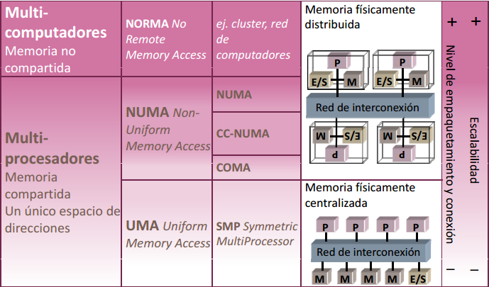

# Tema 1

## Lección 1. Clasificación del paralelismo implícito en una aplicación.

### Clasificación del paralelismo

Según su naturaleza, podemos clasificar el paralelismo implícito en tres categorías.

#### Nivel de paralelismo implícito

El paralelismo puede darse a diferentes niveles: a nivel de programa, a nivel de funciones, a nivel de bloques, a nivel de operaciones, etc.

#### Granularidad

Es el volumen de trabajo, y será más fina o más gruesa si el volumen de trabajo es menor o mayor. Podemos decir que es el tamaño del conjunto de operaciones que pueden realizarse en paralelo.

#### Paralelismo de tareas vs paralelismo de datos

No es lo mismo trabajar en paralelo únicamente con datos, únicamente con tareas, o mezclando ambos.

El paralelismo de tareas se encuentra extrayendo la estructura lógica de funciones. Es por esto que está relacionado con el paralelismo *a nivel de función*. El paralelismo de datos se encuentra implícito en las operaciones con estructuras de datos, y relacionado con el paralelismo a nivel del *bucle*.

### Condiciones de paralelismo

Para poder realizar ejecuciones en paralelo entre dos bloques de código, deben presentar una independencia de datos.

#### Dependencia de datos

Decimos que un bloque de código $B_2$ presenta dependencia de datos con respecto a otro bloque $B_1$ si:

- Hacen referencia a una misma posición de memoria `M` (variable).
- $B_1$ aparece en la secuencia de código antes que $B_2$.

Podemos clasificar la dependencia de datos en tres tipos, según la secuencia de operaciones de lectura/escritura que ocurran en los dos bloques con respecto a `M`.

**RAW (Read After Write)**: dependencia verdadera. No se puede evitar.

**WAW (Write After Write)**: dependencia de salida. Podría evitarse guardando la variable inicial en una variable temporal.

**WAR (Write After Read)**: antidependencia. Podría evitarse realizando la lectura en una variable temporal que contuviese la variable inicial.

El caso *RAR (Read After Read)* no presenta dependencia, ya que simplemente se consulta el dato, sin modificarlo en ningún caso.

### Paralelismo explícito

Un computador puede aprovechar el paralelismo entre diferentes entidades de forma explícita, a saber:

- Instrucciones.
- Hebras (*threads*).
- Procesos.

#### Hebras vs procesos

Un **proceso** comprende el código del programa, y todo lo necesario para su ejecución (datos en pila, segmentos, registros, tabla de páginas, ...). Para comunicar procesos hay que usar llamadas al SO.

Un proceso puede constar de múltibles **hebras** que controlan el flujo de control. Cada hebra tiene su propia pila, y también el contenido de los registros. Para comunicarse entre ellos, utilizan la memoria que comparten.

En general, las operaciones de creación, destrucción, conmutación y comunicación en las hebras consumen menos tiempo.


## Lección 2. Clasificación de estructuras paralelas

### Computación paralela y computación distribuida

La **computación paralela** estudia el desarollo y ejecución de
aplicaciones en un sistema compuesto por múltiples cores/procesadores
que es visto externamente como una unidad autónoma.

Mientras que la **computación distribuida** estudia los aspectos del
desarrollo y ejecución de aplicaciones en un sistema distribuido, es
decir, en una colección de recursos autónomos situados en distintas
localizaciones físicas.

Esta última puede ser a **baja escala**, si se encuentran situados en
diversas localizaciones unidas por una misma infraestructura de red
local. O bien **computación grid**, un conjunto de dominios
administrativos distribuidos en distintas localidades geográficas y
que están unidas con una infraestructura de telecomunicaciones.

Ejemplos de esto son la *computación cloud*, que se desarrollan en un
*sistema cloud*, un conjunto de recursos virtuales (pay-per-use y con
interfaz de auto-servicio) que abstraen los recursos físicos
utilizados, con recursos que son captados/liberados de manera
inmediata, con acceso múltiple de clientes y con métodos de conexión
estándar independientes de la plataforma de acceso.

### Criterios de clasificación de computadores

Por lo general la clasificación de computadores se basa en el número
de núcleos que posean y operaciones que sean capaces de hacer, lo cual
influye directamente en el precio.

#### Clasificación de Flynn

Se basa en el flujo de instrucciones, si son capaces de trabajar con
una única instrucción o con varias y si son capaces de trabajar con un
único flujo de datos o con varios.

##### SISD

Single Instruction, Single Data.
Existe un único flujo de datos y una única instrucción a ejecutar en
cada instante. Corresponde a los computadores uni-procesador.
**<!- (algo de único flujo de datos y una única instrucción, completar) -->**


##### SIMD

Single Instruction, Multiple Data.
La instrucción que se codifica va a cada uno de los procesadores (es
la misma para todos), donde se le indica de dónde tiene que captar los
datos, hace tantas operaciones como unidades de procesamiento se
tengan. Por tanto, aprovecha el paralelismo de datos.


##### MISD

Multiple Instruction, Single Data.
No es un sistema que se implemente en la realidad, cada unidad de
control estaría conectada con una única unidad de procesamiento con
cada flujo de datos.


##### MIMD

Multiple Instruction, Multiple Data.
Múltiples flujos de datos que permiten realizar múltiples instrucciones. Aprovecha, además del paralelismo de datos, el paralelismo funcional.
**<!- (algo de múltiples flujos de datos y múltiples instrucciones, completar) -->**


#### Sistema de memoria

Existen dos tipos de máquinas según esta clasificación: multiprocesadores y multicomputadores.

En los **multiprocesadores** todos los procesadores comparten el mismo espacio de direcciones, el programador no necesita conocer dónde están almacenados los datos. Tienen mayor latencia y son poco escalables. Tienen comunicación implícita mediante variables compartidas y los datos no duplicados están en memoria principal. Es necesario implementar primitivas de sincronización, no es necesaria la distribución de código y datos entre procesadores y su programación es mas sencilla.

En los **multicomputadores** cada procesador tiene su propio espacio de direcciones. Están compuestos por computadores completos conectados entre sí por una interfaz de red. El programador necesita conocer donde están almacenados los datos. Tienen menor latencia y son escalables. Tienen comunicación explícita mediante software para paso de mensajes y los datos duplicados están en memoria principal. Su sincronización es mediante un software específico de comunicación, es necesaria la distribución de código y datos entre procesadores y su programación es más difícil.

##### Comunicación uno-a-uno en un multiprocesador

El nodo fuente manda a memoria el dato, se procesa y se genera una respuesta que es devuelta al nodo fuente. Después, el nodo destino realiza la petición del dato a memoria, se procesa y la memoria devuelve el dato al flujo destino.
Se debe garantizar que el flujo de control *consumidor* del dato lea la variable compartida cuando el *productor* haya escrito en la variable el dato.

##### Comunicación uno-a-uno en un multicomputador

El nodo fuente copia los datos que desea enviar a un buffer y mediante la red de interconexión los hace llegar al nodo destino que está en ejecución a la espera de que le lleguen los datos. Cuando llegan, los datos se cargan en memoria de usuario y continua con la ejecución.

##### Incremento de escalabilidad en multiprocesadores

Se debe aumentar la caché del procesador, usar redes de menor latencia y mayor ancho de banda que un bus y distribuir físicamente los módulos de memoria entre los procesadores compartiendo el  espacio de direcciones.

##### Clasificación completa de computadores según el sistema de memoria



##### Arquitecturas con DLP, ILP y TLP
*(Thread=Flujo de control)*


## Lección 3. Evaluación de prestaciones de una arquitectura
### Tiempos de CPU

#### Tiempo de CPU

Tcpu = Ciclos*Tciclo = Ciclos/Frecuencia de reloj

#### Ciclos por Instrucción

CPI = Ciclos/NI

Donde NI es el nº de instrucciones y donde los ciclos son la suma de los CPI de cada instruccion.
Así vemos que hay varias formas de calcular el tiempo de CPU:

**Tcpu = NI * (CPE / IPE) * T1ciclo**

**Tcpu = NI * CPI * Tºciclo**

**Tcpu = (Nºoperaciones/OPI) * CPI * Tºciclo**


*OPI:* Número de operaciones que puede codificar una instruccion

*CPE:* Número mínimo de ciclos transcurridos entre los
instantes instantes en que el procesador procesador puede emitir instrucciones instrucciones

*IPE:* Instrucciones que pueden emitirse (para empezar su
ejecución) cada vez que se produce dicha emisión

#### MIPS

MIPS: Millones de intrucciones por segundo


MIPS=NI/(Tcpu * 10^6)=Frecuencia/(CPI * 10^6)

Depende del repertorio de instrucciones. Puede variar con el programa. Puede variar inversamente con las prestaciones (mayor valor de MIPS corresponde a peores prestaciones)

#### MFLOPS

MFLOPS: Millones  de operaciones en coma flotante por segundo

MFLOPS= Operaciones en coma flotante/(Tcpu * 10^6)

No es una medida adecuada para todos los programas. El conjunto de operaciones en coma flotante no es constante en máquinas diferentes y la potencia de las operaciones en coma flotante no es igual para todas las operaciones

### Conjunto de programas de prueba (Benchmark)
#### Tipos
+ De bajo nivel o microbenchmark
+ Kernels
+ Sintéticos
+ Programas reales
+ Aplicaciones diseñadas

### Ganancia en prestaciones
#### Speed-Up

El incremento de velocidad que se consigue en la nueva situación con
respecto a la previa (máquina base) se expresa mediante la ganancia de
velocidad o speed-up:

**Sp = Vp / V1 = T1 / Tp**

V1 Velocidad de la máquina base
Vp Velocidad de la máquina mejorada (un factor p en uno de sus componentes)
T1 Tiempo de ejecución en la máquina base
Tp Tiempo de ejecución en la máquina mejorada

#### Ley de Amdahl
La mejora de velocidad, *S*, que se puede obtener cuando se mejora
un recurso de una máquina en un factor *p* está limitada por:

$S \leq  p/(1+f(p-1))$

donde f es la fracción del tiempo de ejecución en la máquina sin la mejora durante el que no se puede aplicar esa mejora.

Lo vemos con un ejemplo:

Si un programa programa pasa un 25% de su tiempo de ejecución  en una máquina
realizando instrucciones de coma flotante, y se mejora la máquina haciendo que
estas instrucciones se ejecuten en la mitad de tiempo, entonces p=2, f=0.75  y
$S \leq 2/(1+0 75)=1.14$

***¡Hay que mejorar el caso más frecuente (lo que más se usa)!***

*Ley enunciada por Amdahl en relación con la eficacia de los computadores paralelos: dado que en un programa hay
código secuencial que no puede paralelizarse, los procesadores no se podrían utilizar eficazmente*

# Tema 3

## Arquitecturas TLP

Las arquitecturas con TLP(Thread Level Parallelism) son:

### Multiprocesador:
Varios threads en paralelo en varios procesadores.

Hay dos tipos:

1. Memoria centralizada (*UMA*: Uniform Memory Access), en el que todos los procesadores tienen acceso a toda la memoria mediante una red de interconexión.

2. Memoria distrubuida (*NUMA*: Non Uniform Memory Access), en el que cada procesador tiene su zona de memoria y se conectan mediante una red de interconexión.


### Multiprocesador en un chip:
Varios threads en un chip multicore.

En estos, puede ocurrir que todos los cores tengan cachés independientes y /todos/ tengan alguna en común, o que estén agrupados para que /ciertos/ de los cores tengan cachés comunes o que no tengan ninguna caché común y conecten directamente al conmutador.

### Core multithread:
Modifican su estructura ILP(Instruction level parallelism) para ejecutar threads en paralelo.

1. Los procesadores segmentados ejecutan instrucciones concurrentemente segmentando el uso de sus componentes.

2. Los procesadores VLIW(very large Instruction Word) y superescalares ejecutan instrucciones concurrentemente(segmentación) y en paralelo(emitiendo múltiples instrucciones a sus múltiples unidades funcionales).

Clasificación de cores multithread:

a. Temporal multithreading(TMT): Un core ejecuta varios threads, y la comuncación entre estas la controla el hardware, emitiendo instrucciones de un único thread por ciclo. A su vez, estos pueden ser:

    1. Fine-grain multithreading, la conmutación entre threads la hace el hardware sin coste, se hacen por turno rotatorio y por eventos de cierta latencia.

    2. Coarse-grain multithreading, la conmutación la decide el hardware con algún coste, tras intervalos de tiempo prefijados o por eventos de cierta latencia. Pueden ser estáticos, que tienen instrucciones explícitas para conmutar y cambio de coste bajo o dinámicos, que conmutan cuando hay fallos de caché o interrupciones.

b. Multihilo simultáneo(SMT): Se ejecutan en un core superescalar varios threads en paralelo, emitiendo instrucciones de varios threads en un ciclo.

## Coherencia del sistema de memoria

### Sistema de memoria en multiprocesadores

El sistema de memoria incluye cachés, memoria principal, controladores, buffers y comunicaciones entre estas componentes. Este sistema se encarga de comunicar los datos entre los procesadores.

### Coherencia en el S.M.

Los datos modificables pueden causar problemas con la E/S, los datos modificables compartidos pueden dar fallos de caché o lecturas de caché no actualizadas, y los privados si emigra el proceso dan también fallos de caché.

La memoria se puede actualizar de forma *inmediata*(write-through), cada vez que un procesador escribe en su caché lo hace también en memoria principal, lo cual no es muy rentable; o mediante *posescritura*(write-back), si se escribe todo el bloque cuando se desaloja de la caché.

Para intentar hacer la caché más coherente, se puede intentar hacer una *escritura con actualización*(write-update), en la que si un procesador escribe en una dirección de su caché, se escribe en las copias de esa dirección en las otras cachés, o una *escritura con invalidación*, en la que antes de modificar una dirección en su caché se invalidan las copias del bloque de la dirección en otras cachés.

#### Requisitos del sistema para evitar problemas por incoherencia

1. Propagar las escrituras en una dirección, haciendo esta escritura visible a otros procesadores teniendo los componentes conectados por un bus. Ahora, si la red no fuera un bus, las actualizaciones se envían a todas las cachés y para mejorar la escalabilidad se envían las actualizaciones sólo a las cachés que tengan copia de ese bloque.

2. Serializar las escrituras en una dirección, viéndose en el mismo orden por todos los procesadores con los componentes conectados por un bus. Si la red no es un bus, el orden en el que las peticiones de escritura llegan al nodo que tiene en MP la dirección sirve para serializar en sistemas de comunicación que garantizan el orden de las transferencias.

El *directorio de memoria principal* está dentro de un nodo de cómputo y tiene un vector de bits con información sobre cachés con copia y un bit para el estado del bloque de memoria. Este se puede implementar de forma:

* Centralizada: Compartido por los nodos, contiene información de los bloques de todos los módulos de memoria.

* Distribuida: Las filas se distribuyen entre los nodos, y el directorio de cada nodo tiene información de los bloques de /sus/ módulos de memoria.

### Protocolos de mantenimiento de coherencia

Los protocolos utilizados para mantener la coherencia de memoria son de tres tipos:
- Protocolos de espionaje (snoopy). Para sistemas con una difusión eficiente (buses, número pequeño de nodos o red con difusión).
-  Protocolos basados en directorios. Para redes sin difusión o escalables.
- Esquemas jerárquicos. Para redes jerárquicas: jerarquía de buses, jerarquía de redes escalables, redes escalables-buses.

Existen diferentes facetas a tener en cuenta a la hora de diseñar un protocolo para mantener la coherencia de memoria. Estas son:

- Política de actualización de memoria principal: escritura inmediata, posescritura, mixta.
- Política de coherencire caches: escritura con invalidación, escritura con actualización, mixta.
- Describir compotamiento: Definir posibles estados de los bloques en cache y memoria, definir transferencias a genenrar entre eventos y definir transiciones de estados para un bloque en cache y en memoria.

#### Protocolo de espionaje de tres estados MSI
- Estados de un bloque en cache:
  - Modificado (M): es la única copia del bloque válida en el sistema.
  - Compartido (C, S): está válido, también válido en memoria y puede que haya copia válida en otras caches.
  - Inválido (I): se ha invalidado o no está físicamente.
- Estado de un bloque en memoria:
  - Válido: puede haber copia válida en una o varias caches.
  - Inválido. habrá copia válida en una caché.
- Transferencias generadas por un nodo de cache:
  - Peticion de lectura de un bloque (PtLec): por lectura con fallo de cache del procesador del nodo (PrLec).
  - Petición de acceso exclusivo (PtLecEx): por escitura del procesador (PrEsc) en bloque compartido o inválido.
  - Petición de posescritura (PtPEsc): por el reemplazo del bloque modificado.
  - Respuesta con bloque (RpBloque): al tener en estado modificado el bloque solicita una PtLec o PtLecEx recibida.

#### Protocolo de espionaje de cuatro estados MESI
- Estado de un bloque en cache:
  - Modificado (M): es la única copia del bloque válida en todo el sistema.
  - Exclusivo (E): es la única copia válida del bloque en caches, la memoria también está actualizada.
  - Compartido (C, S): es válido, también es válido en memoria y al menos otra cache.
  - Inválido(I): se ha invalidado o no está físicamente.
- Estado de un bloque en memoria:
  - Válido: puedes haber una copia válida en una o varias caches.
  - Inválido: habrá una copia válida en una cache.

#### Protocolo MSI con directorios sin difusión
- Estado de un bloque de cache:
  - Modificado (M)
  - Compartido (C)
  - Inválido (I)
- Estados de un bloque en MP:
  - Válido
  - Inválido
- Transferencias:
  Tipos de nodos: solicitante (S), origen(O), modificado (M), propietario (P) y compartidor (C.
  - Petición de nodo S a O: lecura de un bloque (PtLec), lectura con acceso exclusivo (PtLecEx), petición de acceso exclusivo sin lectura (PtEx), posescritura (PtPEsc).
  - Reenvío de petición de nodo O a nodo copia (P, M, C): invalidación (RvInv), lectura (RvLec, RvLecEx).
  - Respuesta de:
    - Nodo P a O: respuesta con bloque (RpBloque), respuesta con o os in bloque confirmando fin de invalidez (RpInv, RpBloqueInv).
    - Nodo O a S: respuesta con bloque (PrBloque), respuesta con o sin bloque confirmando fin de invalidez (RpInv, RpBloqueInv).

### Consistencia de memoria

Especifica las restricciones en el orden en el cual las operaciones de memoria (lectura y escritura) deben parecer haberse realizado. La coherencia sólo abarca operaciones realizadas por múltiples componentes en una misma dirección.

#### Consistencia secuencial
Todas las operaciones de un único procesador parecen ejecutarse en el orden descrito por el programa de entrada al procesador. Todas las operaciones de memoria parecen ser ejecutadas una a la vez. Presenta el sistema de e a los programadores como una memoria global conectada a todos los procesadores a través de un conmutador central.

#### Modelos de consistencia relajados
Relajan requisitos (orden, atomicidad) de consistencia de memoria para aumentar prestaciones.

##### Modelo que relaja W->R
Permiten que una lectura pueda adelantar a una escritura precia en el orden del programa, pero evita dependencia RAW. Lo implementan los sistemas con buffer de escritura para los procesadores. Generalmente permiten que el procesador pueda leer una dirección directamente del buffer. Hay sistemas en los que se permite que un procesador pueda leer la escritura de otro antes que el resto.

##### Modelo que relaja W->R y W->W
Tiene buffer de escritura que permite que lecturas adelanten a escrituras en buffer. Permiten que el hardware solape escrituras a memoria en distintas direcciones, de forma que pueden llegar a la memoria principal o a caches de todos los procesadores fuera del orden del programa.
##### Modelo de ordenación débil
Relaja W->R, W->W y R->W.

### Sincronización

#### Cerrojos
Permiten sincronizar mediante dos operaciones:
- Cierre del cerrojo (lock(k)): intenta adquirir el derecho a acceder a una sección crítica. Si varios procesos intentan adquisición a la vez, solo uno de ellos lo debe conseguir, el resto debe pasar a una etapa de espera. Todos los procesos que ejecuten lock() con el cerrojo cerrado deben quedar en espera.
- Apertura del cerrojo (unlock(k)): libera a uno de los threads que esperan el acceso a una sección crítica. SI no hay threads en espera, permitirá que el siguiente thread que ejecute lock() adquiera el cerrojo k sin espera.

##### Componentes en un código para sincronización
- Método de adquisición. Método por el que un thread trata de adquirir el derecho a pasar a utilizar unas direcciones compartidas.
- Método de espera. Método por el que un thread espera a adquirir el derecho a pasar a utilizar unas direcciones compartidas.
- Método de liberación. Método utilizado por un thread para liberar uno o varios threads en espera.

# Tema 4

## Lección 11. Microarquitecturas ILP. Cauces superescalares

Como ya sabemos, los procesadores superescalares y VLIW nos permiten
obtener una mayor eficiencia a la hora de procesar cualquier
tarea. Ambos tienen varias unidades de ejecución, pueden ejecutar
varias instrucciones simultáneamente en dichas unidades y además
pueden emitir múltiples instrucciones en paralelo a estas.

Su principal diferencia radica en que en los procesadores
superescalares es el hardware el que debe descubrir el paralelismo en
tanto a las instrucciones que se van captando mientras que los VLIW
requieren un paralelismo explícito (se captan las instrucciones que se
van a emitir juntas a unidades de ejecución).

La micro-arquitectura de los procesadores VLIW es más sencilla, pues
es el compilador el que debe detectar el paralelismo al seleccionar
las instrucciones que se captarán juntas en la misma palabra de
instrucción.

### Paralelismo entre instrucciones. Orden en Emisión y Finalización

**ILP(Instruction Level Paralelism):**
Depende de la frecuencia de las dependencias de datos y control, y del
retardo de la operación (tiempo hasta que el resultado de una
operación esté disponible para otra operación que espere dicho
resultado).

**Paralelismo de máquina:**
Viene determinado por el número de instrucciones que pueden captarse y
ejecutarse al mismo tiempo y por la velocidad y mecanismos que usa el
procesador para encontrar las dependencias entre instrucciones.

Existen tres tipos de ordenaciones en una secuencia de instrucciones:

-Orden en el que se captan las instrucciones

-Orden en el que se ejecutan

-Orden en el que se cambian los registros y la memoria

El procesador superescalar es el responsable de gestionar el
paralelismo entre instrucciones, además de organizar todas estas
ordenaciones con el fin de mejorar la eficiencia de la máquina. Su
única restricción es que el resultado del programa sea correcto.

### Cauces Superescalares

De manera análoga a las etapas en el cauce de los procesadores
normales, los superescalares tienen que dar cabida a la finalización
de más de una instrucción por ciclo, esto implica que implementan
otras etapas que se lo permiten.

Decodificación, emisión y ejecución paralela, finalización del
procesamiento, detección y predicción de saltos y mantenimiento de la
consistencia secuencial son los principales aspectos de estos cauces.

**Predecodificación:** Es la decodificación paralela que acabamos de
mencionar. Añade bits para catalogar las instrucciones en función de
si son de salto, si referencia a memoria o según el tipo de unidad
funcional; con el fin de organizar para su posterior tratamiento
específico.

**Emisión paralela:** A continuación las instrucciones deben ser
enviadas a procesar. La **ventana de instrucciones** nos permite almacenar
las instrucciones pendientes de tratar (puede ser centralizada o
distribuida según si mezcla diversos tipos de instrucciones o no), se
almacenan en ella una vez decodificadas y almacena en bits la
disponibilidad de sus operandos y la unidad funcional donde se
procesará para ser emitida cuando todo esté listo.

Podemos hacer una distinción ademas entre **emisión ordenada** si las
instrucciones se empiezan a ejecutar en el mismo orden que en el
programa, y **emisión desordenada** cuando pueden no respetar este
orden.

En los procesadores superescalares se tiende a usar **estaciones de
reserva** para distribuir la ventana de instrucciones. Estas son menos
complejas a nivel de hardware, con un acceso más rápido ocupan menos
líneas de memoria. En ellas las instrucciones esperan a que se
resuelvan las dependencias.

**Renombramiento de Registros:** Para evitar el efecto de las
dependencias WAR y WAW se pretende asignar cada escritura a un
registro físico distinto. Esto puede ser realizado durante el proceso
de compilación, pero en los procesadores superescalares se suele
implementar en el hardware, mediante el uso de **buffers de
renombramiento**, que son consultados al captar los operandos para
conocer si se han escrito en otros registros y que no ha habido
renombramiento. 


## Lección 12. Consistencia del procesador y Procesamiento de saltos

### Consistencia. Reordenamiento

En el procesamiento de una instrucción podemos distinguir entre el *fin
de la ejecución de la operación* y el *final del procesamiento de la
instrucción*. La diferencia entre ambas es que la segunda no incluye la
modificación de los registros, sólo la generación de resultados por
las unidades funcionales.

La **consistencia** se define como el orden en el que las
instrucciones se completan y el orden en el que se accede a memoria
para leer o escribir. Así pues, para que un programa se ejecute
correctamente debe haber consistencia entre el código del programa y
el orden en el que se complletan las instrucciones.

La consistencia del *procesador* puede ser fuerte o débil. Débil permite
la alteración del orden de las instrucciones siempre y cuando las
dependencias no se vean afectadas. Fuerte por su parte exige un
cumplimiento estricto del orden de ejecución con respecto al código
del programa.

La consistencia de *memoria* también realiza esta distinción,
permitiendo desordenar cuando se respeten las dependencias o exigiendo
el acceso en un orden estricto.

Esta consistencia se puede implementar con Buffers de Reordenación
(ROB), reordenando las instrucciones de lectura y escritura.

### Procesamiento especulativo de saltos

Las instrucciones de salto condicional tienen unos efectos muy
perjudiciales para los segmentados procesadores superescalares. Esto
implica que se pueden producir ejecuciones innecesarias y que eso
lleve a otras instrucciones que arreglen los efectos indeseados.

Las **instrucciones de salto incondicional** suponen un menor problema
para el procesador, pues en la predecodificación se podrían marcar
esas instrucciones para calcular la dirección del salto con
antelación. Pero en el caso de las **instrucciones de salto
condicional** no se puede calcular la dirección de salto hasta que no
se evalue el objeto de la condición. Los procesadores intentan
realizar una **predicción del salto** en el caso de que se cumpla alguna
condición, generalmente la más probable, luego se comprueba si la
predicción fue correcta, y con esto se pretende minimizar el coste de
la evaluación o de la subsanación del error.

Existen diversos tipos de predicción. Estática (basada en código de
operación, desplazamiento del salto o dirigida por el compilador), o
dinámica (explícita, con usos de bits de historia, o implícita, sin
estos, sólo almacena la dirección de la instrucción que se ejecutó
después de la dirección de salto).

## Lección 13. Procesamiento VLIW

\part{Seminarios}

# Seminario 0. Atcgrid y TORQUE

Para estas prácticas hacemos uso de un servidor *front-end*:**Atcgrid**.
Este tiene un conjunto de nodos de cómputo, a los cuales les envía las
tareas de cálculo para obtener respuesta a las peticiones de los
usuarios.

Esto es posible mediante **TORQUE**, un gestor de colas y recursos.

## Comandos para TORQUE
Usamos comandos en atc mediante **ssh** para poder realizar los trabajos
que queramos en él. Además, para subir nuestros archivos al front-end
necesitamos comunicarnos con el servidor mediante **sftp**. Siempre
debemos de estar conectados a la VPN de la ugr (usar eduroam o bien
conectarse a la VPN con openconnect).

* psbnodes: Información sobre los nodos.
* qsub: Enviar un trabajo a ejecutar, devuelve la salida en un
fichero output(\*.o) y otro error (\*.e).

**Ejemplos de uso:**

* "echo 'hello' | qsub -q ac" $\rightarrow$ Envía el trabajo(programa)
hello por la cola ac
* "qstat" $\rightarrow$ Muestra los trabajos ejecutándose y los que
están en las colas

* "echo 'hello/trabajoMiTrabajo' | qsub -q ac -N “NombreMiNombre” "

\newpage

# Seminario 1. Directivas OPENMP

**Openmp** es una API, capa de abstracción que permite al programador
trabajar a través de una interfaz para aplicar el paralelismo en sus
programas. Comprende un conjunto de directivas del compilador,
funciones de biblioteca y variables de entorno.

Una **directiva** es "una marca" en nuestro archivo fuente que es sustituida por
el preprocesador del compilador por otro código que permite realizar
una tarea determinada sin tener que definirla nosotros explícitamente.


## Sintaxsis de las directivas C/C++

```c
#pragma omp <nombre_directiva> [<cláusula(s)>] <\n(newline)>
```
Donde:

* \#pragma omp es necesario para indicar que estamos usando una directiva de openmp.

* <nombre_directiva> es el nombre de la acción que realiza la directiva.

* <cláusula> es opcional, modifica o aporta información para la
ejecución de la directiva, pueden combinarse.

* <\\n(newline)> es el salto de línea necesario.

**Compilación:** Compilamos usando gcc -fopenmp para poder usar estas
directivas.


## Directivas

### Parallel
Especifica qué cálculos se realizarán en paralelo. Un thread master
crea un conjunto de threads cuando llega a esta directiva. El código
contenido en esta región es ejecutado por cada thread. No reparte las
tareas entre threads, tiene una barrera implícita y se pueden usar de
forma anidada.

```c
#pragma omp parallel
{
	//Code
}
```

### Trabajo compartido. Worksharing

**Paralelismo de datos(for):** Para distribuir las iteraciones de un bucle
entre los diversos hilos usamos:
```c
#pragma omp for
{
	//Code
}
```

**Paralelismo de tareas(sections):** Para distribuir trozos de código que son
independientes entre sí.
```c
#pragma omp sections
{
	#pragma omp section
	{
		//Codeblock 1
	}

	#pragma omp section
	{
		//Codeblock 2
	}
}
```

**Ejecución única(single):** Para que sólo un hilo ejecute un trozo de código
(lo cual interesa por ejemplo para pedir/mostrar datos al usuario del programa
una única vez en una situación de paralelismo).
```c
#pragma omp single
{
	//Code
}
```
### Combinando parallel con worksharing

Es posible, además del uso de las directivas de worksharing tras el
uso de la directiva parallel, realizar una versión combinada
única. Esto difiere del original tanto en legibilidad como en
prestaciones.

```c
#pragma omp parallel for
{
	//For loop
}
```

```c
#pragma omp parallel sections
{
	#pragma omp section
	{
		//Codeblock 1
	}

	#pragma omp section
	{
		//Codeblock 2
	}
}
```
### Directivas básicas de comunicación y sincronización
En diversas ocasiones nos interesa que la *lectura/escritura* de una
variable se hiciese en exclusión mutua (secuencial) para evitar que se
modifique o use un valor de manera incorrecta. Para esto veremos las
directivas **critical y atomic** y la directiva de “control”
**barrier**.


**Barrier:** Es una barrera que se situa en el punto en el que
esperamos que todos los threads lleguen ahí. Lo usamos cuando
necesitamos todos los cálculos de los threads hasta ese punto para que
no se produzcan errores.

**Critical:** Evita que varios threads accedan a variables compartidas
a la vez (situaciones de carrera). Un thread protege una variable frente a
los accesos de otros threads a la misma variable.

**Atomic:** Da una respuesta más eficiente que “*Critical*”.

### Directiva master
Es similar a la directiva single, pero en este caso la hebra que
ejecutará el bloque de código será la *thread master* o "*hebra 0*".

\newpage

# Seminario 2. Cláusulas OpenMP

Las **cláusulas** son las encargadas de ajustar el comportamiento de
las directivas. No pueden ser usadas en directivas tales como: master,
critical, barrier, atomic, flush, ordered o threadprivate.

## Ámbito de los datos por defecto. Compartición de datos.

Es conveniente saber qué valores tomarán las variables dentro de una
zona donde queramos hacer uso del paralelismo. Dejando claro si
queremos que la memoria se comparta o en cada thread se mantengan unos
datos privados.

Por lo general las variables declaradas fuera de una región y las
dinámicas son compartidas por los threads de la región. Mientras que
las variables declaradas dentro son privadas.

A excepción de esto nos encontramos los índices de los bucles for y
las variables declaradas *static*, que son privados y “públicas”
respectivamente.

### Shared
```c
#pragma omp parallel for shared(a,b,...,N)
```

Las variables indicadas por la lista son compartidas por los
threads. Hay que tener cuidado cuando un thread lea lo que otro
escribe en una variable de la lista.

### Private
```c
#pragma omp parallel for private(a,b,...,N)
```

De modo análogo a shared, indica una lista de variables cuya memoria
no es compartida. Es importante saber que el valor de entrada y de
salida están indefinidos aunque la variable haya sido definida antes
de la región (por lo cual es necesario definirlas dentro de esta).

Los índices de los bucles tienen un ámbito predeterminado privado si
se usa la directiva for.

### Lastprivate
```c
#pragma omp parallel for lastprivate(a,b,...,N)
```

Combina la protección que otorga private pero al salir de la región
paralela le asigna a las variables de la lista el último valor en una
ejecución secuencial. (En un bucle la ultima iteración y en una
construcción sections el valor que tuviese tras la última sección).

### Firstprivate
```c
#pragma omp parallel for firstprivate(a,b,...,N)
```

Combina la protección que otorga private pero al entrar en la región,
en lugar de tener valores indefinidos, asigna los valores que tenía
antes de entrar a cada variable de la lista para cada thread.

Útil para no olvidar la inicialización dentro de la región paralela cuando usamos variables private.

### Default
Con `default(<none/shared>)` podemos alterar el comportamiento por
defecto de las variables (sólo se puede usar una única vez. En caso de
`none` habrá que especififcar el alcance de todas las variables usadas
en la construcción por parte del programador.

Podemos excluir del ámbito por defecto usando todas las cláusulas de
compartición que hemos visto hasta ahora.

### Reduction
```c
#pragma omp parallel for reduction(operator:list)
```

Esta cláusula indica que las variables de la lista serán tratadas
según el operador indicado. Así de este modo se sumarán, restarán,
multiplicarán... todas las variables del mismo nombre en distintos
threads al final de la región tomando unos valores iniciales por
defecto (el neutro para el correspondiente operador).

**Operadores reduction (v3.0)**

C/C++


+------+-------+
| tipo |Valor  |
|      |inicial|
+------+-------+
|  \+  |   0   |
+------+-------+
|  \-  |   0   |
+------+-------+
|  \*  |   1   |
+------+-------+
|  &   |  ~0   |
+------+-------+
|  |   |   0   |
+------+-------+
|  ^   |   0   |
+------+-------+
|  &&  |   1   |
+------+-------+
|  ||  |   0   |
+------+-------+


### Copyprivate
```c
#pragma omp parallel
{
// init list vars

	#pragma omp single copyprivate(list)
	{
		//Codeblock
	}
}
```

Esta cláusula sólo se puede usar con la directiva single, y dentro de
una región paralela copia el valor de la variable en el thread que
ejecuta el single a la misma variable privada en los otros
threads. Esto es usado comúnmente en lecturas o peticiones al usuario
únicas.

# Seminario 3. Variables de OpenMP

##Variables de control


1. *dyn-var* controla el ajuste dinámico del nº de threads.
2. *nthreads-var* controla el nº de threads en la siguiente ejecución paralela.
3. *thred-limit-var* controla el máximo numero de threads.
4. *nest-var* controla el paralelismo anidado.
5. *run-sched-var* controla la planificacion de bucles para *runtime*

##Variables de entorno

Se evitan con #ifdef_OPENMP ...(funciones)... #endif para asegurarnos
de que sólo se usarán cuando estemos usando -fopenmp

1. *dyn-var* OMP_DYNAMIC export OMP_DYNAMIC=FALSE/TRUE
2. *nthreads-var* OMP_NUM_THREADS export OMP_NUM_THREADS=8
3. *thread-limit-var* OMP_THREAD_LIMIT export OMP_THREAD_LIMIT=8
4. *nest-var* OMP_NESTED export OMP_NESTED=TRUE/FALSE
5. *run-sched-var* OMP_SCHEDULE export OMP_SCHEDULE="static,4“/"dynamic"

##Funciones del entorno de ejecución

1. *dyn-var* omp_get_dynamic() omp_set_dynamic()
2. *nthreads-var* omp_get_max_threads() omp_set_num_threads()
3. *thread-limit-var* omp_get_thread_limit()
4. *nest-var* omp_get_nested() omp_set_nested()
5. *run-sched-var* omp_get_schedule(&kind, &modifier) omp_set_schedule(kind, modifier)

- omp_get_thread_num() - Devuelve al thread su identificador dentro del grupo de thread.
- omp_get_num_threads() - Obtiene el nº de threads que se están usando en una región paralela.
- omp_get_num_procs() - Devuelve el nº de procesadores disponibles para el programa en el momento de la ejecución.
- omp_in_parallel() -  Devuelve true si se llama a la rutina dentro de una región
parallel activa.

##Clausulas para interactuar con el entorno

_Prioridad:_

1º Cláusula id
2º Cláusula num_threads
3º Función omp_set_num_threads()
4º OMP_NUM_THREADS
5º Prefijado en la implementación

###Cláusula if

*Sintaxsis:* if(condición)

No hay ejecución paralela si no se cumple la condición

###Cláusula schedule

*Sintaxsis:*  schedule (kind[,chunk])

kind: static dynamic guided auto runtime

chunk: granularidad de la distribución

Solo se usa en bucles. Define el modo en el que se granula el trabajo

