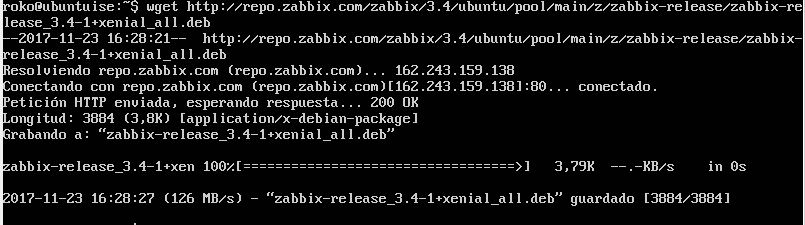
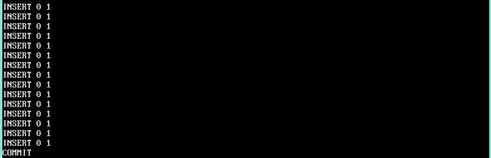
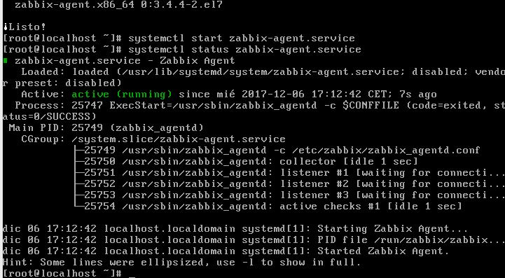
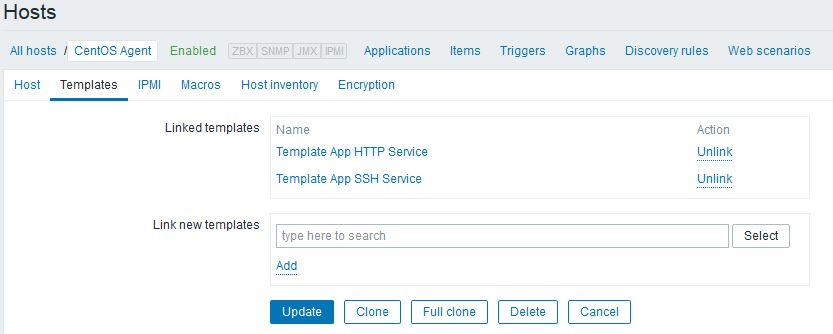
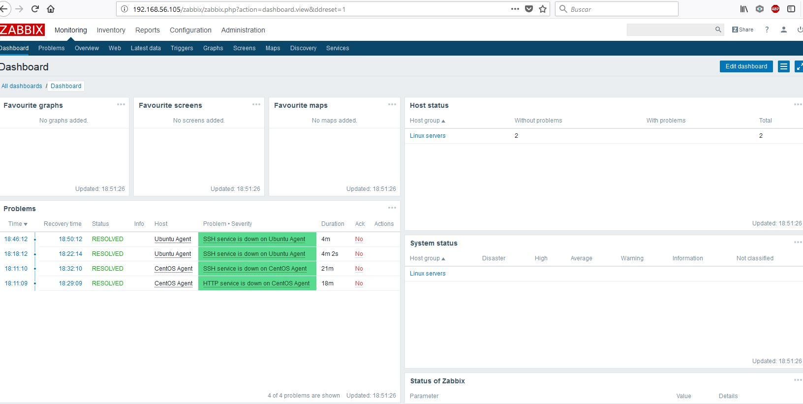

\newpage
# Práctica 1

## Conceptos previos
**RAID:** permite que diversos discos duros se comporten como uno solo.

Hay distintos tipos de RAID:
**Por software:** Divide los datos y escribe en cada disco duro. Esto supone una carga en el CPU.

* **RAID0:** Necesita al menos dos discos duros. Se divide los datos
  en dos partes y se escribe en cada disco duro, si se pierde la
  información en uno se pierde toda la información.

* **RAID1:** Se duplica la información en el segundo disco, cual copia
  de seguridad, para evitar la pérdida de la información si uno de los
  discos falla

* **RAID5:** Necesitamos al menos tres discos duros, dividimos los
  datos en dos partes, guardamos cada mitad en cada uno de los dos
  primeros discos duros y con el tercero usamos bits de paridad para
  mantener la seguridad que nos proporciona RAID1.


**Por hardware:** Retira la carga de la CPU y se encarga directamente
de esto el hardware, suponiendo un coste económico mayor. Se presenta
al sistema como un único disco por conjunto de RAID.

**LVM:** Es un administrador de volúmenes lógicos que permite crear
particiones lógicas en Linux (Logical Volume Manager).

**Tipos de virtualización:**
Por **software:** Un sistema operativo anfitrión (Host) da lugar al
uso de diversos sistemas operativos mediante el uso de una máquina
virtual.

Por **hardware:** Es la virtualización de ordenadores como plataformas
hardware, abstrae el funcionamimento de una máquina para emularla.

Dockers, contenedores, es una tecnología reciente que permite la
compartición de recursos entre máquinas virtuales y anfitrión.

**MD:** Es una utilidad (dispositivo) de Linux para gestionar y
monitorizar los RAID.

**FDE:** Full Disk Encryption, hace ilegibles los datos del disco duro
para aquellos que no tengan permisos. Full Disk Encryption, en
concreto indica que todo en el disco salvo el gestor de arranque está
cifrado.

## Instalación de Ubuntu Server

Para instalar Ubuntu Server queremos un RAID1, con LVM y cifrado.

Tendremos tres particiones para home, boot y swap.

**LVM:** Permite crear abstracciones y redimensionar fácilmente las
particiones del disco duro. Permite unir distintos volúmenes físicos
en grupos de volúmenes que permite un alto nivel de abstracción para
gestionar el espacio en disco.

Consta de 4 capas, Almacenamiento real, volúmenes físicos, grupos de
volúmenes y volúmenes lógicos.

MBR/GPT son sistemas de particiones, MBR sólo podía trabajar con 4
particiones físicas y con un límite de 2'2TB.

### Preparando la máquina virtual

1. Creamos la máquina con todo por defecto, Linux de 64 bits. Se puede
   bajar la memoria RAM hasta 512/1024MB.

2. Creamos un nuevo disco duro virtual. Usando VDI para el tipo de
   disco duro.

3. A la hora de elegir el tamaño podemos elegir el reservado dinámico
   o estático, en este caso usaremos el dinámico para evitar consumir
   los recursos de nuestro ordenador.

4. Le otrogaremos 10 GB, que es un tamaño máximo que se podrá reservar
   dinámicamente (En caso haber seleccionado dinámico en el paso
   anterior).

5. Procedemos a montar la iso en la configuración de la máquina
   virtual con sus dos discos duros correspondientes, preparando en
   almacenamiento el contador SATA. El disco lo montaremos
   seleccionando la imagen correspondiente en la unidad óptica en el
   apartado "Almacenamiento". En el controlador SATA añadiremos un
   nuevo disco duro de exactamente las mismas propiedades para dar
   soporte a nuestro RAID1.

Ahora iniciaremos nuestra máquina virtual y realizaremos las
configuraciones previas de idioma, ubicación y disposición de
teclado.

6. Pondremos el nombre de nuestra máquina y nuestro usuario. Como
   contraseña usaremos "**practicas,ISE**". Y posteriormente no
   permitiremos cifrar los discos, de este paso nos encargaremos
   después nosotros mismos.

7. Usaremos un método de particionado manual.

8. Aquí tendremos los dos discos duros (sda y sdb), sda --> Nueva
   tabla de particionado, ídem para sdb.

9. Seleccionaremos configuración por software, aceptaremos los cambios
en las tablas de particiones y crearemos un dispositivo "MD" y
usaremos RAID1.

<!-- Posible pregunta de examen, qué es un MD-->
10. Indicaremos que usaremos dos discos duros activos(2 y 0 usaremos),
    y seleccionamos (con espacio) los dos discos duros. Finalmente
    confirmamos los cambios.

Aquí se deberían de apreciar los diversos discos creados, un solo RAID con el tamaño total.

<!--Insertar foto img/P1_raid_md.JPG-->

Diferenciamos aquí lo que es FDE, pues no queremos cifrar la carpeta personal. <!-- Posible pregunta de examen-->

11. Procedemos a configurar los volúmenes lógicos (en la configuración
    de LVM). Nombre del grupo de volúmenes: "Servidor", y ahí metemos
    nuestro RAID (/dev/md0).

12. Creamos cuatro volúmenes lógicos: Dentro del grupo de volúmenes
    "Servidor" indicamos el nombre del volumen "Arranque", que
    recibirá 200MB. Posteriormente crearemos el volumen "Hogar", de
    800MB. Tercer volumen "raiz", que se otorga lo que le quede en el
    grupo de volúmenes menos 2048MB, al swap se le da el doble de la
    RAM disponible (2GB).

Entonces aparecerán los cuatro grupos de volúmenes lógicos.

<!--Insertar img/P1_logic_volumes.JPG-->

A continuación deberemos proceder al cifrado de volúmenes

### Cifrado

Cremos una nueva encriptación, pero sólo cifraremos los dispositivos
hogar, swap y raíz. (La swap se encripta por seguridad, pues se podría
hacer un volcado de datos en la swap y se obtendrían los datos sin
cifrar).


Utilizaremos la configuración de la partición por defecto. Le daremos
a terminar y ponemos nuestra contraseña de cifrado, la misma anterior
de "practicas,ISE" (La contraseña de cada disco cifrado tendrá que ser
introducida dos veces).

En nuestra tabla en este momento aparecerán los volúmenes cifrados.

<!-- Insertar img/P1_encrypted.JPG-->

En este momento ya tenemos las particiones cifradas que nos interesan
y procederemos a configurar los puntos de montaje.

### Puntos de montaje

Seleccionamos cada partición para usarla con la extensión
correspondiente, ext4 para todas salvo para swap, /boot se montará en
esta primera partición de arranque.

Posteriormente configuraremos el cifrado para /home, con ext4.

Después el RAID cifrado, utilizarmos con ext4 y punto de montaje raíz "/"

Por último el área de intercambio, swap, lo usaremos como área de intercambio, sin indicar punto de montaje.

<!--Insertar img/P1_mount.JPG-->

Aquí finalizamos el proceso de particionado y escribimos los cambios
en el disco duro. En un momento nos solicitará información sobre el
proxy que dejaremos vacío. E ignoraremos las actualizaciones
automáticas.

Los programas a instalar los dejaremos por defecto. Aceptaremos la
instalación del boot en el disco duro.

sudo grub-install /dev/sdb para instalar el grub en el sdb (nuestro
segundo disco duro)

Con esto se debería de concluir la instalación de Ubuntu Server, tras
reiniciar deberíamos de meter tres veces la contraseña

Con lsblk podemos observar que tendría que ser coherente la
información de las particiones en los dos discos duros.

## Instalación de CentOS

<!-- El enlace de la descarga lo podemos encontrar en SWAD-->

En CentOS tendremos un único disco duro, con una partición física y
otra mapeada.

La preparación de la máquina es el mismo que para ubuntu, por defecto
todas las opciones iniciales.

Del mismo modo añadimos en el controlador de la unidad óptica la
imagen e iniciamos la **instalación por defecto**.

1. Le damos a instalar CentOS. Tras unos instantes de preparación
   pasará a la selección de idioma. (En nuestro caso, inglés,
   indicando el *layout* español)

2. En la siguiente pantalla en sistema lo dejaremos por defecto, solo
   tendremos un único disco y pasaríamos al siguiente paso.

3. Crearemos el *Root*, estableciendo la contraseña **practicas,ISE**,
   la misma que usábamos anteriormente. Y tras esto esperaremos a la
   finalización de la instalación.

   <!-- Usuario: root ; Password: "practicas,ISE"-->
4. Podemos observar, al finalizar la instalación, los discos que hay
   con `lsblk`, y obtener más información con `mount | grep
   sda`. Otros comandos de interés, com `df`, con la opción “-h”
   (fácilmente comprensible para los humanos, con medidas entendibles)
   muestran todos los volúmenes lógicos, su punto de montaje y el
   espacio que ocupan. `lvmdiskscan` muestra más información sobre los
   volúmenes lógicos, así como `lvdisplay ` muestra más información
   al respecto.


   <!-- Posibles preguntas de examen pueden ser comprender estos -->
   <!-- comandos y sus opciones y saber para qué los usamos. -->

5. Una vez hecho esto apagamos la máquina y en las opciones de
   configuración-almacenamiento añadimos un nuevo disco duro por
   defecto.

6. Creamos entonces nuestro volúmen físico con `pvcreate /dev/sdb`

7. Procederemos pues a crear nuestro grupo de volúmenes. El comando
   `vgdisplay` nos proporciona información sobre estos
   grupos. Crearemos el grupo “cl” con el comando `vgcreate /dev/sdb`

8. `vgextend cl /dev/sdb` Extendemos el grupo que hemos creado
   previamente para añadir el último volumen físico creado.

9. `lvcreate -L 4G -n newvar cl` nos permite crear un nuevo volumen
   lógico de 4 GB. Podemos usar `lvdisplay` para obtener más
   información sobre estos volúmenes.

10. `mkfs -t ext4 /dev/cl/newvar` nos permite crear un sistema de
    archivos sobre el volumen lógico que habíamos creado en el paso
    anterior.

11. Para probar si esto ha funcionado procederemos a montar el volumen
    que hemos creado con `mkdir /mnt/vartmp` y luego con `mount
    /dev/cl/newvar /mnt/vartmp` y posteriormente comprobar que podemos
    camiar a ese directorio y la información que se nos proporciona es
    correcta. Con `df -h` observaremos el punto de montaje y más
    información al respecto.

12. `systemctl isolate runlevel1` cambia el modo, así si usamos
	`systemctl status` veremos que estamos en modo mantenimiento. Así
	ya podremos hacer la copia del contenido de /var `cp
	--preserve=context(<o all en su defecto>) -r /var/* /mnt/vartemp`
	(o en lugar de la opción `--preserve=<opcion>` podemos usar `-a`.

	<!-- systemctl isolate runlevel1.target -> modo monousuario
	 en la documentación de redhat consultar esto

	 access.redhat.com/documentation/en-US/Red_Hat_Enterprise_Linux/7/html/...

	 Como pregunta de examen se puede preguntar para qué sirve esto
	 -->


13. Una vez hecha la copia en el nuevo volumen lógico es
    correspondiente que el punto de montaje temporal sea desmontado
    con `umount /mnt/vartmp/`

14. Con `mount /dev/cl/newvar /var` observamos que montamos nuestro
    volumen lógico en var, pero esto desaparecerá tras un reinicio así
    que desmontamos con umount y buscamos la manera de hacerlo
    permanente.

15. En /etc modificamos el archivo `/etc/fstab` conforme a la sintaxis
    del fichero. Con `blkid` observamos el id de cada disco. Aquí habría
    que **hacer una copia de seguridad de fstab** por si se corrompiera
    el fichero. Una vez nos hemos quedado con el id podemos añadirlo a
    fstab con `blkid | grep newvar >> /etc/fstab`. La línea tiene que
    quedar tal que `<UUID> /var (punto de montaje) ext4  defaults 0
    0`. Este archivo podemos editarlo con vi. <!--Suerte si no se ha
    usado nunca vi y entras con el layout equivocado-->


16. Montamos todo con `mount -a` y comprobamos con `df -h` que todo
    esté correcto.


<!-- 05/10/2017 -->

### RAID en CentOS

Primero debemos instalar una versión limpia de CentOS.

Desde el exterior creamos dos discos duros, y una vez iniciada la máquina comprobamos que estos dos discos extra estén en con `lsblk`

<!-- img/P1_S3_initialdisks.PNG  -->

Utilizamos `dhclient` para poder tener internet, lo cual nos interesará para instalar mdadm.

`mdadm --create /dev/md0 --level=1 --raid-devices=2 /dev/sdb /dev/sdb`

Esto último comprobamos con `lsblk` que se haya creado correctamente.

<!-- img/P1_S3_mdadm.PNG -->

`pvdisplay` muestra los volúmenes físicos (physical volume).

Creamos otro grupo de volúmenes, llamado "pmraid1". Con `vgs` podemos ver los grupos de volúmenes.

`vgcreate pmraid1 /dev/md0` para crear el grupo de volúmenes.

`lvcreate -L 1G -n newvar pmraid1` para crear el volumen lógico (-L para el tamaño, -n para el nombre).

Para pasar los archivos de un volumen lógico a otro tenemos que seguir los pasos del otro día, crear sistema de archivos...

`mkfs -t xfs /dev/pmraid1/newvar`.

Cambiamos el runlevel para poder realizar nuestras tareas de mantenimiento con `systemctl`.

`systemctl isolate runlevel1.target` (comprobable con `systemctl status`)

Y realizamos la copia

```
mkdir /mnt/vartemp

mount /dev/pmraid1/newvar /mnt/vartemp

cp -a /var/* /mnt/vartemp
ls /mnt/vartemp
ls /var
lsblk
```

Restauramos el contexto con  `restorecon /var`.

`umount /mnt/vartemp`

Debemos modificar el fstab

(En vi pulsamos i para insertar)

En la última línea escribimos:

/dev/mapper/pmraid1-newvar(tabulador)var(tabulador)xfs(tab)defaults(tab)0(tab)0

Y guardamos. Esto permitirá que cada vez que reiniciemos la máquina se guarde todo en el RAID

Con `systemctl isolate default.target` podemos "reiniciar" la máquina para ver que esos datos están guardados. También si lo hacemos manualmente lo podemos comprobar.

A continuación borramos un disco de los dos del RAID e intentamos iniciar normalmente.


**Cifrado con LUKS**
<!-- LUKS: Pregunta de examen, saber qué es-->

Cada vez que queramos conectarnos a internet para descargar algo tendremos que usar `dhclient`.

<!-- Qué paso de estos dos iba antes?-->
`systemctl isolate rescue.target`

Instalamos el cryptsetup con `yum install -y cryptsetup`

Hacemos el backup preservando el contexto

`mkdir /varRAID`

`cp -a /var/* /varRAID`

<!--Aquí tal vez había que desmontar con umount el disco-->
`vi /etc/fstab`

Aquí ponemos en la última línea una almohadilla para comentarlo.

Reiniciamos.

Si hacemmos lsblk podemos ver que se está montando tras el reinicio y podemos proceder al cifrado.

`cryptsetup luksFormat /dev/mapper/pmraid1-newvar`

Metemos como contraseña "practicas,ISE"

cryptsetup luksOpen /dev/pmraid1/newvar pmraid1-newvar_crypt

Creamos un sistema de archivos con mkfs -t xfs /dev/mapper/pmraid1-newvar_crypt

mkdir /mnt/varCifr

mount /dev/mapper/pmraid1-newvar_crypt /mnt/varCifr

(comprobable con lsblk)

Pasamos los datos del punto de montaje temporal

cp -a /varRAID/* /mnt/varCifr

Ahora debemos modificar los ficheros de Linux

`cat /etc/crypttab` muestra un fichero de tres columnas. Usamos `blkid | grep crypto >> /etc/crypttab` para obtener el UUID.

Editamos con vi este archivo para dejar únicamente:

"pmraid1-newvar_crypt UUID-<correspondienteUUID>" none

Y en fstab también lo editamos para que la última línea tenga añadido el ``_crypt`` al final del nombre del dispositivo a montar en la última línea (correspondiente al disco cifrado)

Desmontamos varCifr

mount -a  y mostramos con lsblk para ver que esos cambios son permanentes

Al reiniciar nos pedirá la clave de cifrado de dicho disco ("practicas,ISE").

rm -r -f /varRAID para borrar todo lo que se quede colgando del directorio, así como se debería borrar cualquier "archivo residual".

## Configuración de la Red y las máquinas virtuales

### General
Debemos crear una red nat en la configuración general de
virtualbox. Una vez creada editaremos sus propiedades y añadiremos una
red en las redes solo-anfitrion (llamada vbox0), accedemos a
propiedades y modificamos la IPv4, 192.168.58.1 al servidor DHCP  le
ponemos dirección la misma (acabada en .100), la máscara 255.255.255.0
y para el rango en el límite inferior y superior le damos valores
entre .101 y .254

### Ubuntu Server
Una vez creada la red iremos máquina por máquina añadiendo interfaces
nuevas y añadiendo la interfaz de red. Esto se observa en
`/etc/network/interfaces`, aquí se mostrarán las interfaces. Luego
iremos a la configuración de la máquina virtual. En red nos conectamos
en el segundo adaptador a la red solo-anfitrión y lo conectamos a la
red que hemos creado en el paso anterior. Y al volver a iniciar la
máquina virtual con `ifconfig` observaremos que se ha aparecido una
nueva interfaz, y con lspci | grep ether se verá el nuevo
"ethercontroller".

Entonces tendríamos que añadir en `/etc/network/interfaces` la entrada
con la información relativa a la nueva interfaz:

```
#Añadimos esto tras la última línea
auto enp0s8
iface enp0s8 inet dhcp
```

Y ahora con `ifconfig` deberíamos de apreciar la dirección IP donde
ponga inet <dir_ip>

### CentOs

`ip addr` nos muestra la información de manera similar a `ifconfig`
`cd /etc/sysconfig/network-scripts/`, `ls` y apreciamos las interfaces que
hay. Luego mostramos `cat ifcfg-enp0s3`, la última línea de este
archivo habrá que cambiarla, de `ONBOOT=no` a `ONBOOT=yes`.

Salimos del SO, accedemos a la configuración de la máquina virtual,
nos conectamos en el segundo adaptador de red a la red que habíamos
hecho antes.("Conectado a Solo-Anfitrión" y debajo la red que creamos)

Volvemos a arrancar CentOS, con `ip addr` observamos  las interfaces,
habrá aparecido una nueva interfaz (enp0s8).

Tendremos ahora que añadir un script para configurar la nueva
interfaz. Por lo general, cada vez que añadamos un adaptador de red
tendremos que añadir un script que configure esa interfaz, pues no
será creado por defecto.

copiaremos el archivo de la interfaz enp0s3 al uno nuevo llamado
enp0s8, con `cp` en el directorio `cd /etc/sysconfig/network-scripts/`
Habrá que cambiar el `NAME`, `DEVICE`, eliminar la línea de `UUID`

### Configurar IPs estáticas

**CentOS:**
En el archivo de configuración (script) de la interfaz enp0s8 lo
dejamos únicamente con lo siguiente:

```
TYPE=Ethernet
BOTPROTO=none
NAME=enp0s8
DEVICE=enp0s8
ONBOOT=YES
IPADDR=192.168.56.110
NETMASK=255.255.255.0
```
Ahora si hacemos `ip addr` vemos que aún no se ha actualizado la
información. La actualizaremos con `ifup enp0s8` `ifdown enp0s8` o
reiniciando la máquina.

**UbuntuServer:**
Para Ubuntu tenemos que ir al archivo `/etc/network/interfaces` y lo
editamos de manera que el final del fichero, relativo a la última
interfaz que hemos añadido, quede así:

```
auto enp0s8
iface enp0s8 inet static
address 192.168.58.105
netmask 255.255.255.0
#gateway 192.168.58.1 // Si da problemas esta línea se puede
comentar/eliminar
```

\newpage
# Práctica 2

## Sesión 1. Instalación y configuración de un servidor SSH

Recordaremos que la ip de la máquina de CentOS era: `192.168.56.110`
y la de UbuntuServer era: `192.168.56.105`


### UbuntuServer

Partiremos de la última sesión de la práctica anterior, donde teníamos
una red “host-only”.

El servidor SSH es un servicio que puede tener varias
implementaciones. Usaremos `openssh-server`, y es nombrado proceso
"sshd" (d de daemon).

El cliente SSH es el que usaremos para conectarnos a dicho servidor.

Podemos instalarlo con `apt` o con `tasksel`. En tasksel seleccionamos
el paquete que deseamos (OpenSSH-server)con la barra espaciadora.

Una vez descargado podemos comprobar que funcione haciendo ssh al
localhost.

#### **Cambiando el puerto:**

La configuración de ssh se puede cambiar en `/etc/ssh/ssh_config`.
Mientras que la configuración de sshd se puede cambiar en `/etc/ssh/sshd_config`.

Si queremos que ssh se conecte a un puerto determinado editamos el primer
archivo, mientras que si queremos que el servidor sshd escuche en otro
puerto determinado editaremos el archivo de configuración de sshd.

Antes de modificarlo se recomienda hacer una copia de seguridad.

Con permisos de superusuario editamos el puerto y cambiamos del 22 al
22022.

`systemctl status sshd.service` nos muestra el estado del servicio y nos
indica que aún escucha en el puerto 22, por lo que habrá que reiniciar
el servicio con `systemctl restart sshd.service` para que escuche en
el puerto que le hemos indicado.


El firewall de UbuntuServer, por defecto, viene desactivado. Unos
cuantos comandos para controlarlo son:

```
sudo ufw status
sudo ufw enable
sudo ufw disable
```

Si lo activasemos, no aceptaría conexiones a ssh por el
puerto 22022. Para permitirlo tendríamos que utilizar:

```
sudo ufw allow 22022
```

Añadimos aquí una nueva condición.

```
sudo ufw allow 22
o
sudo ufw allow ssh
```

#### Bloquear el root

Editamos archivo `/etc/ssh/sshd_config`.
Aquí se presentan distintas posibilidaes

`PermitRootLogin no`

`AllowUsers nombreusuario  // Esto es opcional`

Luego reiniciamos el servicio y debería de aplicarse esta configuración.


#### Acceso sin contraseña

El usuario genera un par de claves pública y privada:

```
En CentOS creamos un usuario con adduser user, y una contraseña con passwd

ssh-keygen
```

Copiamos la llave pública  al servidor con el script:

```
ssh-copy-id -p 22022 user@192.168.56.110
```

Aquí ahora en CentOS deberíamos de poder acceder

Hay que quitar los comentarios de `RSAAuthentication yes` en el que solicita  la conexión y de `PubkeyAuthentication yes` en el receptor.

Si reiniciamos el servicio, al intentar conectarnos desde UbuntuServer
a nuestro usuario en CentOS
```
ssh user@192.168.56.110 -p 22022
```


Podemos aumentar la seguridad con herramientas como fail2ban, que lee logs y actualiza iptables para prohibir ciertas IPs.
O rootkit hunter.


### CentOS

El servidor SSH es el mismo, tendremos que instalarlo con `yum` si no
está instalado por defecto. Podemos comprobarlo con `systemctl
sshd.service`


**Cambiando el puerto:**

De nuevo se recomienda una copia de seguridad previa.

Entonces procederemos a editar el dichero de configuración, tendremos
que descomentar (quitar la almohadilla) e indicar el nuevo puerto.

Reiniciamos el servicio `systemctl restart sshd.service` y vemos que
no tenemos permiso para acceder al puerto 22022, por lo que tendremos
que añadir una excepción para que nos deje hacerlo.

Tendremos que instalar `yum install policycoreutils-python` para ello.

Vemos el puerto en el que está escuchando `semanage port -l | grep
ssh`. Cambiaremos esto para permitir la escucha en el puerto 22022 con
`semanage port -a -t ssh_port_t -p tcp 22022`.

En este momento debería de estar ya bien configurado. Entonces
añadiremos un nuevo usuario con `useradd user1` y le asignamos una
nueva contraseña con `passwd user1`, y entonces introducimos la
contraseña “practicas,ISE”.

Desde otra máquina virtual probaremos la implementación. Usaremos `ssh
user1@192.168.58.110 -p 22022`.

Nos rechazará la conexión, pues el firewall de CentOS por defecto
denegará la conexión.

```
firewall-cmd --state								// Comprueba el estado del cortafuegos
firewall-cmd --add-port=22022/tcp					// Crea una regla temporal
firewall-cmd --permanent --add-port=22022/tcp		// Crea una regla permanente
```

<!-- Sesión 2  2/11/2017 -->

#### Bloquear el root

Editamos archivo /etc/ssh/sshd_config.
Aquí se presentan distintas posibilidaes

`PermitRootLogin no` o `DenyUsers root`

`AllowUsers nombreusuario`

Luego reiniciamos el servicio y debería de aplicarse esta configuración.

El resto es idéntico a lo hecho en UbuntuServer


Podemos aumentar la seguridad con herramientas como `fail2ban`, que lee logs y
actualiza iptables para prohibir ciertas IPs. O rootkit server.

En CentOS instalamos el paquete `epel-release` con `yum install epel-release`.

Ahora instalamos fail2ban `yum install fail2ban`

Podemos comprobar con `systemctl status fail2ban` que inicialmente el servicio
está desactivado, así que lo activamos con `systemctl start fail2ban`.

Configuraremos las opciones de fail2ban para ajustar tiempos de castigo/intentos para evitar ataques de fuerza bruta editando el archivo `/etc/fail2ban/jail.conf`

Eliminamos comentarios de `bantime`, `[sshd] enabled = true`. Localizamos el puerto
en el que monitoriza ssh y lo cambiamos por el 22022, `port = ssh --> port = 22022`
Si editamos el `maxretry` cambiamos el número de intentos antes de que se bloquee
la ip.


Reiniciamos el servicio, comprobamos su estado con `fail2ban-client status` y
observaremos una celda con sshd.


Si intentamos alcanzar el límite de intentos podemos ver cómo se bloquea el acceso.
Con `fail2ban-client status sshd` podemos apreciar que se ha bloqueado una máquina.

Si aquí observamos algún error debemos observar las celdas que ya hay creadas y
configurarlo correctamente (puede que alguna celda de ejemplo esté dando error).


Podemos perdonar una ip con `sudo fail2ban-client set sshd unbanip <ip_baneada>`.

**rkhunter:**
Rkhunter vigila el sistema para ver si tienes algún código malicioso.

Instalamos rkhunter con `yum -y install rkhunter` (`apt-get install rkhunter para ubuntu`).

`rkhunter -c --sk` ejecuta un chequeo del sistema y proporciona un informe.

Se puede configurar crontab para realizar esto con cierta frecuencia.

Formato:
```
Minuto  Hora  Dia_Mes Mes Dia_Semana    Comando
0       2     *       1-10  *           rkhunter -c --sk  
```

**Screen y Linux:**
Permite mantener tu sesión de ssh encendida sin tener que estar conectado con la máquina.

Podemos también usar la opción -X de ssh para ejecutar programas con interfaz gráfica.

## Sesión 3. Servidor web

## Ubuntu
Con tasksel instalamos los tres servicios de manera transparente. LAMP nos instala estos servicios.

```
sudo tasksel
```

Seleccionamos `LAMP server` (dejamos las contraseñas que nos pedirán durante la instalación en blanco).

Abrimos el puerto 80 en el firewall, `sudo ufw allow 80` y probamos a acceder
desde nuestro navegador a la dirección IP de la máquina.

Podemos probar el intérprete de php con `php -a`.

## CentOS
Instalamos primero apache.

`yum install httpd`

Activamos el servicio, `systemctl start httpd.service`.

Igualmente abrimos el puerto 80 para permitir el acceso.

`firewall-cmd --add-port=80/tcp`
`firewall-cmd --permanent --add-port=80/tcp `

Instalamos MariaDB (cliente y servidor) que es una versión libre de MySQL.
`yum search mariadb-server`
`yum install mariadb-server`

Comprobamos el estado con `systemctl status mariadb`. Lo activamos con
`systemctl start mariadb`

Ejecutamos el script para añadir contraseña a root
`mysql_secure_installation`
Indicamos que el root no tiene ninguna contraseña actualmente, pero ponemos la contraseña
*practicas,ISE* para la base de datos.

Ya sólo quedaría instalar php con `yum install php` y lo probamos con `php -a`.

Ahora tenemos que indicarle el index a php:
`cd /var/www/html`
`vi index.php`

(php.net/manual/en/)
```php
<?php
    $link=mysql_connect('127.0.0.1:3306','root','practicas,ISE');
    if(!$link){
          die('Could not connect: '.mysql_error());
        }
        echo 'Connected successfully'
    }
```

<!-- 09/11/2017 -->

¿Funciona todo junto?

Editamos `/etc/httpd/conf/httpd.conf`
añadiremos  `index.php` a la entrada `DirectoryIndex` de este archivo.

Y acto seguido reiniciaremos `systemctl restart httpd`.

Y comprobamos que funcione. Si nos conectamos a su interfaz en la red
host-only, deberíamos de ver si funciona lo que hemos hecho al
introducir su ip en el navegador del host.

Instalamos las bibliotecas necesarias para manejar las bases de datos.
`yum search php | grep mysql`
`yum install php-mysql`

Sigue sin funcionar en este momento, entonces deberíamos añadir una
regla de seguridad para que el servidor de apache pueda acceder al
puerto 3306 (puerto de MariaDB).

Si mirasemos `/var/log/audit/audit.log` podemos ver que tendríamos un
acceso denegado, por lo que añadimos la siguiente regla para arreglarlo.

`setsebool -P httpd_can_network_connect_db on` para permitir que httpd
se pueda conectar a la base de datos.

Y reiniciamos el servicio.

Después de esto, si intentamos conectarnos desde el host a dicho
puerto debería de aparecernos la información que tuvieramos en el
script de php.

## Lección 2. Copias de seguridad y control de versiones.

**Copia binaria:** Copias bit a bit de un archivo a otro.
Permite crear imágenes de un disco usando formato
`dd if=/dev/sda of=~/sda.img

**Copiar archivos y empaquetar:** cp, cpio, tar.

*cpio* Copia archivos a y desde:
`ls | cpio -ov > /tmp/object.cpio` (o de empaquetar ficheros y v de
verbose

`cpio -idv < /tmp/object.cpio` (i desempaquetando, d que cree
directorios segun sea necesario)

*tar* por su parte permite especificar en las opciones que nos comprima
el resultado. Ejemplos:

`tar cvzf MyImages.tar.gz /home/MyImages (c empaquetado, v verbose, z
comprimir`

`tar -xvf public.tar`

**Sincronizar:** rsync, rsnapshot

*rsync* sincronizar archivos entre varias máquinas remotamente.
Opciones comunes: r,l,s,p,o,g,D. Todas agrupables con -a, -a =
-rlptgoD. v, z, i.

Para borrar hay que recordar que hay que usar --delete.

*rsnapshot* permite hacer backups haciendo primero rsync y luego va
creando copias que van incrementando gradualmente. Permite al usuario
acceder a los backups como si fueran individuales en el tiempo.

**Instantáneas:** LVM snapshots.

### Control de cambios

Tradicionalmente para realizar controles de cambios a pequeña escala
simplemente copiabamos el archivo a modificar en otro lugar a modo de
copia de seguridad y luego si algo fallaba se podía volver atrás.

Esto no tiene ninguna escalabilidad. Por esto se usan controladores de
versiones como git.

Git funciona con una estructura Directorio de Trabajo-Stage-Commit.

```
git init
git log
git status
git branch
```

El fichero .gitignore nos permite “ignorar” un archivo determinado
para que no sean controlados por git. El formato de git ignore es
escribir en cada línea el archivo (o conjunto de archivos, con
expresión regular) a ignorar, así aunque modifiquemos esos archivos no
aparecerán en nuestro git status, pues no tienen seguimiento.

La primera vez que usemos git en un pc habrá que configurar el email y
el nombre de usuario con:

```
git config --global user.email "you@example.com"
git config --global user.name "Your Name"
```
\newpage

# Practica 3. Monitorización

## Sesión 1. Monitorización del RAID1 y Monitores básicos

Partiremos de la máquina de la práctica 1 donde teníamos un RAID1.


`dmesg` nos permitirá ver muchos logs con información acerca del estado
y configuración del kernel.

Monitores para software:

En linux existe el directorio /proc y /var, que nos pueden dar
información acerca del hardware y del software.

(Es relevante conocer `mdadm` y /proc/mdstat para conocer información
sobre los RAID)

En esta sesión monitorizaremos un servicio o programa con `strace`
para estudiar las llamadas al sistema que realizan y que puede que no
se vean reflejadas en archivos de logs.


Simularemos un fallo en un disco del RAID1.

### En la máquina virtual...

Instalaremos GRUB en todos los discos que puedan arrancar

`grub-install /dev/sdb`

Entonces apagamos.

Información sobre monitorización del sistema: (Para investigar por
nuestra cuenta)
[raid.wiki.kernel.org/index.php/Monitoring_your_system](http://raid.wiki.kernel.org/index.php/Monitoring_your_system)


Para simular el fallo del disco eliminamos un disco “en frío” e
intentamos arrancar. Veremos que el kernel dará problemas, y no
arrancará. Entonces tendremos que esperar hasta que entre en algún
modo que maneje esta situación.

Pasado un rato (largo) nos notifica un error, y si vemos el contenido
de mdstat

`cat /proc/mdstat`

La primera línea, personalities son los distintos tipos de RAID que
nuestro kernel soporta.

La segunda línea, "md 0 : <...>" indica que ha habido un error

`mdam -R /dev/md0`

Esto hace que el dispositivo arranque aunque sólo tenga uno de los
discos disponibles.

Así si volviésemos a mirar el archivo mdstat veríamos que ahora ha
vuelto a cambiar el contenido de la segunda línea, avisando de que
está activo.


(importante conocer el significado de los corchetes del final en la
configuración del md. [x,y], significa x cuantos discos tendría que
tener frente a y, cuántos tiene).

mdadm --detail /dev/md0 también muestra información al respecto del
RAID.


Tras esto el RAID debería de poder seguir funcionando. Después
ejecutaríamos `exit` y continuaría con el arranque.

Si hicieramos ahora `lsblk` veríamos que seguimos teniendo el raid pero
sólo con un disco.

Apagamos (`sudo poweroff`) y en la configuración de VirtualBox
volvemos a añadir un disco en el puerto SATA correspondiente (puerto
SATA 2) pues para el 0 el grub no está instalado en este disco.

Si encendemos y vemos que con `lsblk` ha aparecido un sdb, pero no
pertenece al raid. Para añadirlo usamos:

`sudo mdadm --add /dev/md0 /dev/sdb`

Si queremos ver lo que se modifica cada 2 segundos en mdstat usamos:

`watch -n 2 cat /proc/mdstat`

Así vemos cómo se está recuperando el disco.

Para más información sobre esto podemos mirar, en la misma wiki de
antes:

[Detecting,_querying_and_testing](http://raid.wiki.kernel.org/index.php/Detecting,_querying_and_testing)

[Scrubbing_the_drives](http://raid.wiki.kernel.org/index.php/Scrubbing_the_drives)

Aquí nos interesa cómo simular los fallos por software. Pues con
`mdadm` se puede simular por software lo que hemos simulado eliminando
el disco *físicamente*.

**Ejercicios propuestos:**

* Simular por software un fallo en el disco
* Mirar mdstat, mdadm -> Información de estado de md0
* Con la opción correspondiente de mdadm regenerar el RAID
* Monitorización

<!-- 23/11/2017 -->

<!--Falta hasta automatización: Ansible -->

**Ansible:** Herramientas para automatizar, desplegar y orquestar
(Infraestructura como Servicio o como Código)

**De cara al examen comprender agent-less**

## Sesión 2. Otros monitores.

Nagios (Naemon), Shinken, Zabbix...

Cada monitor debe escogerse en función a las necesidades (y puede
servir la popularidad y aceptación por la comunidad de administradores
para ayudar en la decisión). También puede influir la experiencia con
un monitor previamente usado, las interfaces de las que disponga...

Shinken es uno de los monitores libres más extendidos, se caracteriza
por ser muy modulado. Necesita plugins para la recolección de datos
(es de hecho compatible con algunos plugins de Nagios).

OMD intenta recabar todas las funcionalidades en una sola <!--Buscar -->
<!--información-->

Naemon es una continuación del abandonado Nagios. Se puede consultar
la documentación para comprenderlo mejor. El proceso de Nagios/Naemon
ejecuta pequeños scripts/programas que recopilan la información a
monitorizar. xinetd se encarga de ejecutarlo.


### Ejercicio práctico. Trabajar con Zabbix.

#### Ubuntu. Instalación de Zabbix
En primer lugar debemos instalar Zabbix, descargar el repositorio y
desempaquetarlo, luego actualizamos la lista de repositorios con
`apt-get update`.




Ahora podremos instalar las herramientas de zabbix. Para instalar el
server y front-end debemos instalarlos respectivamente con `sudo
apt-get install zabbix-server-mysql`, y `sudo apt-get install
zabbix-frontend-php`. (El proxy no será necesario instalarlo)

En caso de usar otra base de datos distinta de mysql, como es nuestro
caso, que usaremos postgresql, sustituiremos mysql por pgsql (`sudo
apt-get install zabbix-server-pgsql`).

Una vez instalados, pasamos a la creación de la base de datos.
Como estamos usando postgresql necesitaremos una base de datos con
permisos para crear objetos de la base de datos. Usaremos el siguiente
comando para crear el usuario zabbix, al cual tendremos que ponerle
una contraseña, en nuestro caso practicas,ISE.

`sudo -u postgres createuser --pwprompt zabbix`


Y ahora tendremos que configurar la base de datos que hemos creado con:
` sudo -u postgres createdb -O zabbix zabbix`

Y pasamos a configurar el esquema inicial y los datos para el servidor.

`zcat /usr/share/doc/zabbix-server-pgsql/create.sql.gz | sudo -u
<username> psql zabbix`

(El campo username tomará el valor "zabbix")

La salida de la creación del esquema será algo así:



El siguiente paso será configurar la base de datos para Zabbix
server. Para ello editaremos `zabbix_server.conf` para usar su base de
datos.

Con vi editaremos el archivo `/etc/zabbix/zabbix_server.conf` (con
permisos de superusuario). Tendremos que editar el fichero para
modificar las líneas que aparecen en el siguiente párrafo:

```
DBHost=
DBName=zabbix
DBUser=zabbix
DBPassword=practicas,ISE
```
DBHost se deja vacío, pues al estar usando postgresql queremos que use
un socket adecuado (si dejásemos "localhost" usaría un socket de
red de mysql).

Ahora iniciamos el servicio:

`service zabbix-server start`
`update-rc.d zabbix-server enable`


Una vez iniciado el servicio tenemos que cambiar la configuración de
php para  el frontend de zabbix. Editaremos con `vi
/etc/apache2/conf-enabled/zabbix.conf`. En un primer momento, todo lo
que tendremos que hacer es descomentar las líneas de zona horario y
sustituir la ciudad que esté puesta por la propia.

Reiniciamos el servidor de apache2 para aplicar los cambios y lanzamos
en nuestro host la interfaz web de zabbix.

**http://192.168.56.105/zabbix**

Desde aquí seguiremos con la instalación desde la interfaz web.

En la segunda página que se nos muestra veremos los requisitos de php,
y veremos que sólo se ofrece soporte para mySQL, por lo que tendremos
que instalar `php-pgsql`. Una vez instalado, reiniciamos apache2 y
veremos que ahora sí da soporte a Postgresql.

En la siguiente página debemos de configurar la conexión a la base de
datos. Tendremos que establecer la configuración (host localhost, port
0, name zabbix, user zabbix y password practicas,ISE).


Después nos aparecerán unos detalles sobre el servidor, en los cuales
dejaremos el nombre y puerto por defecto pero "Host" será "localhost"

En la última página nos aparecerá un resumen de lo seleccionado,
después habremos terminado con la instalación y pulsaremos en "Finish"

Tras esto estaremos en la página de inicio. El usuario por defecto
será "Admin", y su contraseña "zabbix".

Siguiendo con la instalación tenemos que instalar el agente de zabbix,
con `sudo apt install zabbix-agent`.

En este momento, en el frontend deberíamos de ver que el servidor está
activo (running).

Ahora tendremos que instalar en CentOS nuestro agente de zabbix.

#### CentOS
Descargaremos los paquetes correspondientes con `rpm -ivh
http://repo.zabbix.com/zabbix/3.4/rhel/7/x86_64/zabbix-release-3.4-2.el7.noarch.rpm`
e instalamos el agente con `yum install zabbix-agent`.

Ahora tenemos que proceder a configurar el agente de CentOS en el
archivo `/etc/zabbix/zabbix_agentd.conf`.

En el campo `Server=127.0.0.1` tendremos que sustituir la dirección
por la de nuestro servidor zabbix (192.168.56.105)

Ahora activamos el servicio y lo habilitamos en el inicio.
`systemctl start zabbix-agent`
`systemctl enable zabbix-agent`



Una vez corriendo tenemos que volver a la página web para gestionar el
nuevo host. Para ello iremos a hosts, en la pestaña
configuración. Crearemos un nuevo host, "CentOS Agent", para el cual
elegiremos el grupo "Linux servers" y en las "Agent interfaces"
introduciremos la ip de CentOS.

En la siguiente pestaña, templates, buscamos "Template App SSH
Service" y "Template App HTTP Service" y le damos a "Add", quedará
como en la imagen:



Y haremos lo mismo con un nuevo host para ubuntu, con la ip 127.0.0.1
(pues está en la misma ip que el servidor). Y en templates usaremos
los mismos templates.

### Problemas

#### Instalación
* No estaban operativos los servicios ssh ni http en CentOS, tampoco
  estaba ssh activo en Ubuntu

**Solución**: Para lo primero la solución está en el segundo punto de
los problemas[ (Puerto)](#puerto). Para lo segundo, simplemente había
que asegurarse de que el servicio estaba activo, arreglado con
`systemctl start httpd.service`. Lo último, openssh-server no estaba
instalado. Se instaló desde tasksel.


#### Puerto
* Estábamos usando el puerto 22 para ssh en ubuntu y el 22022
para CentOS, entonces el item del template escuchaba en el puerto 22
inicialmente, por lo cual nunca escucharía el de CentOS.

**Solución**: Cambiar en el item del template de SSH, y cambiar el key por
este: `net.tcp.service[ssh,,22022] `



#### Typo
* A la hora de descargar el repositorio de CentOS el enlace devolvía
  un código de error 404 (not found)

**Solución**: El enlace copiado tenía un 1 confundido con una l, lo
cual puede parecer una tontería y un detalle muy sutil, pero nos hace
ver la importancia de, a la hora de crear un documento de cara al
público, es importante proporcionar una solución clara y sin lugar a
confusiones.


### **Fuentes:**

[Instalación zabbix: https://www.zabbix.com/documentation/3.4/manual/installation/install_from_packages/debian_ubuntu](https://www.zabbix.com/documentation/3.4/manual/installation/install_from_packages/debian_ubuntu)

[Database creation: https://www.zabbix.com/documentation/3.4/manual/appendix/install/db_scripts](https://www.zabbix.com/documentation/3.4/manual/appendix/install/db_scripts)

[Configuración php del frontend: https://www.zabbix.com/documentation/3.4/manual/installation/install#installing_frontend](https://www.zabbix.com/documentation/3.4/manual/installation/install#installing_frontend)

[Creación de Hosts para su monitorización: https://www.digitalocean.com/community/tutorials/how-to-install-and-configure-zabbix-to-securely-monitor-remote-servers-on-centos-7#step-5-%E2%80%94-installing-and-configuring-the-zabbix-agent](https://www.digitalocean.com/community/tutorials/how-to-install-and-configure-zabbix-to-securely-monitor-remote-servers-on-centos-7#step-5-%E2%80%94-installing-and-configuring-the-zabbix-agent)

# Práctica 4. Benchmarking.

El objetivo de esta práctica es saber utilizar programas de benchmark para evaluar las prestaciones de nuestro servidor.

En esta práctica usaremos AB (Apache Benchmark) y JMeter, así como phoronix

## Phoronix

Es una herramienta para hacer bencharks, cualquier usuario puede subir ahí sus benchmarks y descargarlo/probarlo.

Además phoronix tiene capacidad de monitorización.

A hacer:
- habilitar X11 en /etc/ssh/sshd_config (en ubuntu server)
- ssh con -X (interfaz gráfica) (desde el host)

Instalar y ejecutar phoronix en ubuntu server

- instalar phoronix-test-suite
- apt install firefox
- phoronix-test-suite gui

Para conectarnos al servidor por ssh podemos usar otra máquina virtual con entorno de escritorio para conectarnos (desde el host también, pero en nuestro caso, al tener por host a windows puede ocasionar problemas (por eso es recomendable no usar windows en estas prácticas, así como en general)).

AB y Jmeter lo usaremos en el "host" (o en la máquina en la que nos estamos conectando por ssh).

**AB:**
En el man de ab podemos consultar las diversas opciones, las de más relevancia son -n (número de peticiones) y -c, concurrencia.

ab -n 100 -c 100 <ip>/index.html

**Jmeter:**
Es necesario instalar java 8 y descargar el archivo comprimido de jmeter y ejecutar el script.

En el enlace del guión se indica cómo crear un benchmark con Jmeter (básicamente, seguirlo paso por paso).


Una vez se haya creado un benchmark se le pasa al servidor. Posteriormente habrá que modificar un parámetro (de la pila LAMP(??)) y volver a pasar el benchmark.

Para phoronix hay que instalar php-zip (en UbuntuServer.)

**Instalando Phoronix:** Para instalar phoronix descargamos de apt el paquete correspondiente.

Ahora para conectarnos a él, desde la máquina con interfaz gráfica, la primera vez que lo usemos nos preguntará si estamos de acuerdo con los términos del servicio, si deseamos permitir el uso anónimo con fines varios.

## Ejercicio Práctica 4

### Introducción

Nuestro objetivo con este ejercicio es ser capaces de probar distintos tests de benchmarking así como la monitorización de este. Para ello haremos uso de nuestro servidor de Ubuntu. Y como cliente para hacer distintas pruebas haremos uso de una máquina auxiliar con Ubuntu Desktop.

Las distintas herramientas que usaremos a continuación serán Phoronix, Apache Benchmark (ab), y Jmeter.

**IMPORTANTE:** Recordemos que partimos de la práctica anterior, y por tanto la configuración del servidor es la correspondiente a las prácticas anteriores. Esto influye en varios factores, tales como el puerto de escucha de ssh (22022 en lugar el 22) entre otros.

#### Phoronix

La instalación y uso de Phoronix viene determinada por lo siguiente:

En primer lugar es necesario instalar Phoronix en nuestro servidor de Ubuntu desde el paquete correspondiente, con `sudo apt-get install phoronix-test-suite`.

Ahora queremos poder acceder a este mediante la interfaz web, así que tendremos que instalar, también en el servidor, el navegador firefox. `sudo apt-get install firefox`.

Como la conexión la haremos desde la máquina auxiliar con Ubuntu Desktop, tendremos que comprobar que en el archivo de configuración de sshd (`/etc/ssh/sshd_config`) se permita usar -X11 para que cuando nos conectemos por ssh desde la máquina virtual podamos hacer uso de la gui.

<!-- Insertar foto X11 -->

Y una última configuración, para poder ejecutar los tests habrá que instalar un módulo de php llamado php-zip. Podemos instalarlo fácilmente con `sudo apt-get install php-zip`.

Una vez todo esto esté configurado, continuaremos con las acciones sobre el cliente.

Para poder probar Phoronix tendremos que conectarnos por ssh a la máquina virtual. Esto lo hacemos indicando el puerto 22022 y la opción -X para poder hacer uso de la interfaz gráfica.

`ssh -X -p 22022 roko@192.168.56.105`

Introducimos la contraseña y una vez conectados probamos a ejecutar `phoronix-test-suite gui`. Esto nos proporcionará una interfaz web en nuestro navegador con el que podremos controlar phoronix.

<!-- Insertar Principal_phoronix_gui.JPG -->

Desde esta intefaz podremos gestionar los test, instalarlos y ejecutarlos a la vez que monitorizarlos.

Debido a un problema con la ejecución de los primeros programas de benchmark instalados mediante la interfaz fue necesario instalar por línea de comandos un test distinto. Para ellos, desde la terminal del servidor se ejecutó `phoronix-test-suite install pts/memory` para instalar memory, un conjunto de paquetes que miden ámbitos relacionados con la memoria de la máquina entre los que se incluyen algunos que ponen a prueba directamente el procesador.

Concretamente utilizamos CacheBench como prueba. Este nos otorgó los siguientes resultados:

<!-- Insertar Resultado_test_phoronix_gui.JPG -->

*Estos resultados son consultables en el apartado "Results" dentro de la interfaz web*

Adicionalmente se puede apreciar la ejecución del test desde el punto de vista de nuestro monitor Zabbix en este gráfico que estudia la carga de la CPU en función del tiempo.

<!-- Insertar Monitorizacion_test_zabbix.JPG -->

Como indica la leyenda, las líneas verde, azul y roja, corresponden a la carga media de los procesadores en los últimos 1/5/15 minutos. Los dos primeros "picos verdes" corresponden a instalaciones y pruebas cortas. Estas apenas influyen en las otras gráficas, pues toman muy poco tiempo.

Sin embargo, a las 11:45 se inicia el test, y se ve cómo la carga "inmediata", verde, asciende rápidamente, pero su larga ejecución respecto al tiempo (pues el test ronda los 13~15 minutos) hace que las otras gráficas acaben por subir con suavidad. Del mismo modo, cuando el benchmark termina, entorno a las 11:59, vemos como vuelven a la normalidad las gráficas, y las que miden la carga media en un tiempo mayor se reducen paulatinamente hasta estabilizarse de nuevo.

#### Apache Server Benchmarking

Apache Server Benchmarking, **ab**, es una herramienta que nos permite medir la capacidad de un servidor web para dar respuesta a peticiones de páginas.

La usaremos en nuestro cliente. Sus dos opciones más relevantes son **-n**, que indica el número de peticiones que se van a realizar, y **-c**, que indica el nivel de concurrencia, es decir, cuantas peticiones se van a enviar de manera simultánea.

Es conveniente explicar el nivel de concurrencia. Sólo tenemos una tarjeta de red, y por tanto sólo podemos enviar peticiones de uno en uno. Para un servidor lejano, donde cada petición tarde en torno a 30 ms en llegar a su destino, tiene más sentido hablar de concurrencia, pues somos capaces de enviar muchas peticiones en comparación con el tiempo que tardan en ser recibidas. Para nuestro caso, donde tenemos el servidor en la misma máquina que el cliente este retraso es mínimo, y el nivel de concurrencia es más bien "simbólico".

Veamos por ejemplo un test de 10000 peticiones enviadas de cinco en cinco:

<!-- Insertar Test_ab_parte1.JPG -->

<!-- Insertar Test_ab_parte2.JPG -->

#### Jmeter

Jmeter es una herramienta que usamos para crear benchmarks.

Es necesario descargarlo de la página oficial. En nuestro caso descargaremos el binario que hay en [jmeter.apache.org/download_jmeter.cgi](http://jmeter.apache.org/download_jmeter.cgi) en nuestra máquina cliente.

Lo descomprimimos. Para comenzar a usar jmeter nos situamos en el directorio resultante y ejecutamos el binario `./bin/jmeter`.

<!-- Insertar Jmeter_inicio.JPG -->

Nuestro interés será crear un plan de pruebas (Jmeter test plan). Para esto, en primer lugar tendremos que añadir un elemento Grupo de hilos/Thread  group, que indicará el número de usuarios que se desea simular. Hacemos click derecho en `Plan de pruebas` y `seleccionamos Añadir->Hilos(Usuario)->Grupo de hilos`. Aquí habrá aparecido en la vista de árbol de la izquierda el grupo de hilos como un subelemento de Plan de prueba.

Ahora en el panel resultante nos interesa configurar el grupo de hilos para que se ajuste al comportamiento que queremos otorgarle. De este modo, si quisieramos, por ejemplo, dar lugar a un total de 5 hilos, que tardarán un total de 1 segundo en ser lanzados (período de subida) y que se repetirán dos veces, requerirá de una configuración como la siguiente imagen. Además, le daremos un nombre algo más descriptivo a este elemento,*Usuarios Hilos*.

<!-- Jmeter_thread_setup.JPG -->
A continuación tenemos que establecer las tareas que se realizarán, por lo que tendremos que especificar la configuración por defecto de las peticiones HTTP. Click derecho en `Usuarios Hilos ->Añadir->Elemento de configuración->Valores por Defecto para petición HTTP`.


<!-- Jmeter_default_http.JPG -->


En un primer momento no cambiaremos nada más que la dirección IP/Nombre del servidor por defecto, en cuyo campo introduciremos `192.168.56.105`, la dirección de nuestro servidor.

Adicionalmente podemos añadir, desde el mismo menú en el que añadimos los valores por defecto, un `Gestor de Cookies HTTP`, que hoy en día es usado por la mayor parte de las webs. Este lo dejaríamos con la configuración estándar.

Ahora tendremos que añadir las peticiones HTTP que deseemos hacer.
`Añadir->Muestreador->Petición HTTP`. Y configuramos para que sea capaz de hacer peticiones a la página que estamos probando.

Como en la configuración por defecto ya habíamos añadido la IP, sólo tenemos que modificar el nombre, a nuestro gusto, y añadir en la ruta la página a solicitar, `/index.html`.

<!-- Jmeter_request_http.JPG -->

Para finalizar la prueba tendremos que añadir un elemento responsable de almacenar todos los resultados y presentarlos visualmente. Con este fin añadiremos un gráfico en: `Añadir->Receptor->Gráfico Resultados`.

En este, sólo tendremos que especificar el nombre del archivo de salida.
Tras esto podemos ejecutar y observar los resultados.

Sin embargo, para obtener unos resultados comparables con el test que hicimos en ab, debemos de generar un número semejante de peticiones. Para ello tendremos que mantener la concurrencia, 5 usuarios, pero tendremos que aumentar el número de iteraciones de los bucles. Si antes hacíamos 10000 peticiones, ahora indicaremos que cada hilo ha de hacer 2000.

Como resultado obtenemos lo siguiente:

<!-- Jmeter_results.JPG -->


Comparando las 10000 peticiones realizadas con 5 usuarios/nivel de concurrencia 5 medidos tanto en ab como en Jmeter observamos que obtenemos un rendimiento de 1.570,915 peticiones por minuto. Mientras que con ab encontramos 3069'67 peticiones por segundo de media. Lo que se traduce en 184180,2 peticiones por minuto. Parece claro que, con la configuración estándar de ab se consiguen mejores resultados que con la configuración de jmeter basada en el tutorial.

#### Optimizando el servidor web

Otro de los factores más importantes a la hora de implementar un servidor es ser capaz de sacarle el máximo partido a los recursos de los que disponemos. Por tanto es importante la optimización en cualquier nivel de la pila LAMP (En nuestro caso la pila es LAPP, pues usamos postgre)

Como consejos generales hay una serie de pautas u objetivos que hay que tener en mente para poder progresar con esta optimización:

* Tener un benchmark que se ajuste a nuestras necesidades y objetivos. Pues de poco sirve tener unos buenos resultados en un benchmark que no mida lo que más tenga que trabajar nuestro servidor.

* Hay que dar respuesta al problema de la escalabilidad. De manera que si se aumenta el número de clientes se pueda seguir proporcionando los servicios de manera sostenible. (Aquí pueden entrar estrategias como el clústering y otros métodos de computación distribuida).

* Hardware: El mejor hardware que responda a nuestras necesidades obviamente dará mejores resultados.

* Software: Del mismo modo, las versiones más estables y recientes darán un mucho mejor soporte para nuestros servicios.

* Mejoras de la pila LAMP: Mejorar Apache y PHP de cara al desarrollo web, así como mejorar el gestor de la base de datos para un mejor rendimiento.


Para mejorar la **configuración de Apache** se analiza el archivo `/etc/apache2/apache2.conf`. En este archivo prácticamente todas las variables pueden influenciar en el rendimiento del servidor, desde el número máximo de peticiones simultáneas, donde valores altos permitirán una mayor productividad, hasta el almacenamiento en un log de las IPs de los usuarios del servidor, que requiere, al menos, una búsqueda en dicho registro.

Para el servidor, lo más importante para su eficiencia es que no se desborde la memoria RAM, porque el uso del swapping añadiría una latencia enorme. Por esto se debe de ajustar el número de peticiones a aproximadamente un 80% de la memoria total disponible. Si no queremos arriesgarnos a que haya conexiones persistentes (que requieran descarga de imágenes o enlaces) que puedan decelerar el servidor. En su defecto se puede reducir drásticamente el tiempo máximo de conexión.

Para mejorar el **rendimiento de PHP**, por su parte existen numerosos aceleradores tales como APC, PHPA, Xcache, Zend Opcache... cuyo objetivo es reducir la carga de CPU. Es recomendable elegir el que mejor se adapte a la versión de PHP que tengamos.

Hoy en día la mayor parte de los aceleradores están desactualizados. De hecho para las versiones 7.X sólo se mantiene Zend Opcache y para Windows Windows Cache.

En nuestro caso sólo podríamos hacer uso de Zend Opcache, pero desde la versión 5.5 viene preinstalado por defecto.


Para la **base de datos, postgresql**, debemos acceder al fichero `/etc/postgresql/9.5/main/postgresql.conf`. En este podemos editar diversos factores que puedan influenciar, tales como la memoria de trabajo disponible o modificando las opciones de memoria como el uso de buffers compartidos.

Como no haremos uso de logs, las mejoras en el gestor de base de datos para este servidor en concreto no serán relevantes.


#### Optimización realizada

En un servidor tan simple es complicado mejorar efectivamente el resultado. Sin embargo hay una manera de mejorar bastante los resultados, y es aprovechando las conexiones persistentes (*keepalive*).

Cuando realizamos un test con ab usaremos la opción **-k** para dar lugar a las conexiones persistentes. Además, en la configuración de apache, si aumentamos (levemente, en menos de 100 unidades) el número máximo de conexiones persistentes y reducimos el tiempo máximo de conexión podemos obtener una mejora como la siguiente:

<!-- Optimizacion_1.JPG -->

<!-- Optimizacion_2.JPG -->

#### Fuentes

* [**Descarga jmeter:** jmeter.apache.org/download_jmeter.cgi](http://jmeter.apache.org/download_jmeter.cgi)

* [**Tutorial Jmeter**: http://jmeter.apache.org/usermanual/build-web-test-plan.html](http://jmeter.apache.org/usermanual/build-web-test-plan.html)

* [**Orientación para mejorar un servidor web:** https://docs.moodle.org/33/en/Performance_recommendations#PHP_performance](https://docs.moodle.org/33/en/Performance_recommendations#PHP_performance)

* [**Documentación Phoronix:** https://www.phoronix-test-suite.com/documentation/phoronix-test-suite.html](https://www.phoronix-test-suite.com/documentation/phoronix-test-suite.html)
