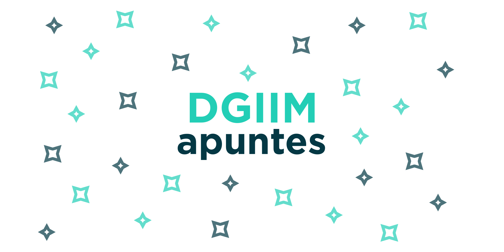

# 

Un proyecto colaborativo llevado a cabo por alumnos del Doble Grado de Ingeniería Informática y Matemáticas de la Universidad de Granada. Tenemos el objetivo de elaborar una serie de apuntes propios de las asignaturas a partir de los que se toman en las clases.

Los apuntes se compilan automáticamente cuando se hace *push* al repositorio y los puedes encontrar en la [web del repositorio](https://libreim.github.io/apuntesDGIIM/).

En la [wiki](https://github.com/libreim/apuntesDGIIM/wiki) encontrarás más información.
