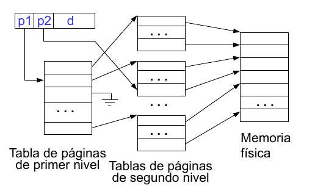

\part{Teoría}

# TEMA 1. ESTRUCTURA DE LOS SO

## Sistema monolítico

Los **sistemas monolíticos** son aquellos en los que su centro es un grupo de estructuras fijas, las cuales funcionan entre sí, para poder tener esta estructura, las diferentes partes del kernel son compiladas por capas.

Los sistemas monolíticos se describen en **3 procesos principales**:

- Un Programa principal que invoca el procedimiento de servicio solicitado.

- Un Conjunto de procedimientos de servicio que llevan a cabo las llamadas del sistema.

- Un Conjunto de procedimientos de utilería que ayudan a los procedimientos del servicio.

Los núcleos monolíticos proporcionan la mayor parte de las funcionalidades propias del sistema operativo, incluyendo la planificación, los sistemas de ficheros, las redes, los controladores de dispositivos, la gestión de memoria y otras funciones. El SO está formado por un conjunto de procedimientos de forma que cada uno puede llamar a los demás cuando lo necesite. Estos procedimientos se ejecutan en modo supervisor. Normalmente, un núcleo monolítico se implementa como un único proceso con todos los elementos compartiendo el mismo espacio de direcciones.

El **problema** de los núcleos monolíticos es que son difíciles de comprender, modificar y mantener. No son fiables: un error en alguna parte puede provocar la caída del sistema.

Se podría implementar como un **sistema por capas**, donde cada capa es una máquina más abstracta para la capa superior. Por modularidad, las capas se seleccionan para que cada una utilice funciones sólo de las capas inferiores.

Ejemplo de sistema por capas: **El Sistema THE**

El sistema estaba compuesto de una serie de procesos secuenciales.

|         |                                   |
|---------|-----------------------------------|
| Nivel 5 | Programas de usuario              |
| Nivel 4 | Búfering para dispositivos de E/S |
| Nivel 3 | Manejador de consola del operador |
| Nivel 2 | Gestión de memoria                |
| Nivel 1 | Planificación de la CPU           |
| Nivel 0 | Hardware                          |

Problemas de THE:

* Los sistemas de capas deben ser jerárquicos pero
los sistemas reales son más complejos. Por ejemplo: el sistema de archivos podría ser un proceso en la
capa de memoria virtual y la capa de memoria virtual podría usar archivos como almacén de apoyo de E/S.
* Sobrecarga de comunicaciones entre procesos de
distintas capas
* A menudo, los sistemas están modelados con
esta estructura pero no están así construidos

## Microkernel

Una **arquitectura micronúcleo** asigna sólo unas pocas funciones esenciales al núcleo, incluyendo los espacios de almacenamiento, comunicación entre procesos (IPC), y la planificación básica. Ciertos procesos proporcionan otros servicios del sistema operativo, algunas veces denominados servidores, que ejecutan en modo usuario y son tratados como cualquier otra aplicación por el micronúcleo

El sistema operativo se reduce a un núcleo mínimo, se implementan la mayoría de las funciones del SO como procesos de usuario, lo que proporciona mayor flexibilidad. Para solicitar un servicio, el proceso de usuario (cliente) envía un mensaje al proceso servidor, que realiza el servicio y devuelve al cliente una respuesta, provocando una mayor sobrecarga por en envío/recepción de mensajes.

**Beneficios:**

* Su arquitectura facilita la extensibilidad, permitiendo agregar nuevos servicios en la misma área funcional.

* No solo se pueden añadir nuevas características al SO, además las características existentes se pueden eliminar para realizar una implementación más pequeña y eficiente.

* Todo o gran parte del código específico del procesador está en el microkernel.

Una de las **desventajas** más conocida del microkernel es la del rendimiento. Esto depende del tamaño y la funcionalidad del microkernel.

## Multithreading

**Multithreading** es una técnica en la cual un proceso, ejecutando una aplicación, se divide en una serie de hilos o threads que pueden ejecutar concurrentemente.

* **Thread o hilo**. Se trata de una unidad de trabajo. Incluye el contexto del procesador (que contiene el contador del programa y el puntero de pila) y su propia área de datos para una pila (para posibilitar el salto a subrutinas). Un hilo se ejecuta secuencialmente y se puede interrumpir de forma que el procesador pueda dar paso a otro hilo.

* **Proceso**. Es una colección de uno o más hilos y sus recursos de sistema asociados (memoria, conteniendo tanto código, como datos, ficheros abiertos y dispositivos). Esto corresponde al concepto de programa en ejecución.
La técnica multithreading es útil para las aplicaciones que llevan a cabo un número de tareas independientes.

## Máquinas virtuales

Una **máquina virtual** es un software que implementa una máquina virtual (igual o distina a la máquina real). Se trata de abstraer el hardware de la computadora formando entornos de ejecución diferentes, creando la ilusión de que cada entorno de ejecución está en una computadora diferente. La máquina virtual no proporciona funcionalidades adicionales sino que proporciona una interfaz "idéntica" al hardware básico. Una petición de servicio es atendida por la copia de SO sobre la que se ejecuta. La capacidad de procesamiento actual mitiga la ineficiencia de las Máquinas Virtuales. Los procesadores más actuales incluyen soporte para la misma.

**Beneficios:**

* Más seguras, no es posible la compartición directa de recursos.
* Investigación y desarrollo de sistemas operativos.

***

## Sistemas Operativos de propósito específico

### Sistemas Operativos de tiempo real

La computación de tiempo real puede definirse como aquella en la que la corrección del sistema depende no sólo del resultado lógico de la computación sino también del momento en el que se producen los resultados.


En un **sistema de tiempo real** se producen unas tareas que dan soluciones a problemas que vienen del mundo exterior y que se producen en un espacio de tiempo determinado, pudiéndose establecer así un margen de tiempo límite para realizar las tareas. De este modo se pueden dividir las tareas en tareas de **tiempo real duro** si tienen que realizarse en un tiempo determinado y un exceso de tiempo en dicha actividad puede suponer un error grave para el sistema, o tareas de **tiempo real blando** cuyo plazo de tiempo no es estricto y la tarea se puede seguir ejecutando después de haber cumplido el plazo sin desencadenar errores graves.

Estas tareas se distinguen a su vez dada la periodicidad de su ejecución, de este modo hay **tareas aperiódicas** si su ejecución es única y está restringida a un plazo de tiempo, o **tareas periódicas** si se repiten n veces en un espacio de tiempo o una vez cada período t.


Los sistemas operativos de tiempo real pueden ser caracterizados por tener requisitos únicos en ***cinco áreas generales:***

* Determinismo
* Reactividad
* Control del usuario
* Fiabilidad
* Operación de fallo suave


El **determinismo** (tiempo de SO en reconocer la interrupción) nos dice que unas tareas concretas van a tardar un tiempo concreto en ser finalizadas, un sistema no puede ser completamente determinista, pues se ve limitado por sus recursos y por la prioridad de las tareas a ejecutar, se centra en el tiempo previo al reconocimiento previo de una instrucción.

La **reactividad**, relacionada con el determinismo, se enfoca en el tiempo después del reconocimiento que tarda el SO en servir a esa interrupción, además incluye algunos aspectos como:

1. La cantidad de tiempo necesario para ejecutar la rutina de servicio de la interrupción actual, RSI (si es necesario cambiar de contexto requerirá un tiempo adicional).

2. El tiempo que requiere para procesarla, que se define a nivel hardware.

3. El efecto anidamiento. Si una interrupción puede ser interrumpida por otra.

El **control del usuario** es generalmente mucho mayor en un sistema operativo de tiempo real que en sistemas operativos ordinarios. El usuario tiene un control sobre la prioridad de la tarea. El usuario distingue las tareas y se encarga de gestionar algunas características de gestión de memoria.

La **fiabilidad** en sistemas de tiempo real es mucho más trascendental que en los sistemas que no son de tiempo real, pues en estos se puede solucionar el problema re-arrancando el sistema, en los de tiempo real la degradación de los servicios ofrecidos a un sistema que responde a tareas en tiempo real puede ser mucho más catastrófica.

La **operación de fallo suave**  es una característica de los sistemas para responder ante un fallo y ser capaz de minimizar las pérdidas sufridas, manteniendo la consistencia de ficheros y datos cuando sea posible. Además un sistema se considera estable cuando a pesar de no ser capaz de responder a todas las peticiones, es capaz de responder a las tareas más críticas.

Para cumplir los requisitos precedentes, los sistemas operativos de tiempo real incluyen de forma representativa las siguientes características:

* Cambio de proceso o hilo rápido.
* Pequeño tamaño (que está asociado con funcionalidades mínimas).
* Respuesta rápida a interrupciones externas.
* Multitarea con herramientas para la comunicación entre procesos como semáforos, señales y eventos.
* Utilización de ficheros secuenciales especiales que pueden acumular datos a alta velocidad.
* Planificación expulsiva basada en prioridades.
* Minimización de los intervalos durante los cuales se deshabilitan las interrupciones.
* Primitivas para retardar tareas durante una cantidad dada de tiempo y para parar/retomar tareas.
* Alarmas y temporizaciones especiales.


En la mayoría de los casos los sistemas no son capaces de lidiar con todas las tareas asignadas, por lo que una de las principales áreas de trabajo hoy en día son los planificadores de tiempo real. Lo importante es que las tareas de tiempo real duro se completen y finalizar el máximo número de tareas de tiempo real blando.

### Estructuras distribuidas

Hay una tendencia al proceso de datos distribuidos. Los procesadores, datos y procesamiento de datos pueden estar diseminados por toda la organización. Implica dividir funciones y organizar las bases de datos control de dispositivos,... Los computadores dependen de su asociación con los servidores. Existen distintas estructuras distribuidas: arquitectura multicomputador, sistemas operativos de red y sistemas operativos distribuidos.

#### Arquitectura Multicomputador

La **arquitectura de comunicaciones** es un software que da soporte a un grupo de computadores independientes, en red. Proporciona soporte para aplicaciones distribuidas, tales como correo electrónico, transferencia de ficheros y acceso a terminales remotos. Cada cual puede tener su propio SO y sólo se pueden comunicar directamente por deseo expreso.

#### Sistemas Operativos de Red

Un **sistema operativo de red** normalmente lo componen un único usuario con una o varias máquinas de servidores, que proporcionan acceso a servicios y aplicaciones, el usuario conoce la existencia de múltiples computadores y debe trabajar con ellos de forma explícita. Habitualmente se utiliza una arquitectura de comunicaciones común para dar soporte a estas aplicaciones de red. Lo que les diferencia de los SO de un solo procesador es la necesidad de software especial como: controlador de interfaz de la red; programas de conexión y acceso a archivos remotos.

#### Sistemas operativos Distribuidos

Un **sistema operativo distribuido** es un sistema operativo común compartido por una red de computadores. A los usuarios les proporciona acceso transparente a los recursos de diversas máquinas. Un sistema operativo distribuido puede depender de una arquitectura de comunicaciones para las funciones básicas de comunicación, pero normalmente se incorporan un conjunto de funciones de comunicación más sencillas para proporcionar mayor eficiencia.


Para hacer un intercambio de información entre dos computadores, ya sea algo tan sencillo como un fichero, es necesario establecer un enlace, tanto directo como en red de comunicaciones, pero además se necesitan tareas como:

1. Que el emisor active el enlace directo o informar a la propia red de comunicaciones
2. Debe comprobar que el receptor puede recibir estos datos
3. Que existe un programa que sea capaz de recepcionar el fichero
4. Que se encargue de realizar una traducción si las representaciones de datos son incompatibles entre ambos sistemas


En relación a la comunicación de computadores y redes de computadores, hay dos conceptos de suma importancia:

* Protocolos.
* Arquitectura de comunicaciones o arquitectura de protocolos.

Un **protocolo** se utiliza para comunicar entidades de diferentes sistemas. Lo que se comunica, cómo se comunica y cuándo se comunica, debe hacerse de acuerdo a unas convenciones entre las entidades involucradas. Se pueden definir como un conjunto de reglas que gobiernan el intercambio de datos entre dos entidades. Los elementos principales de un protocolo son los siguientes:

* **Sintaxis**: Incluye cosas tales como formatos de datos y niveles de señales.
* **Semántica**: Incluye información de control para realizar coordinación y gestión de errores.
* **Temporización**: Incluye ajuste de velocidades y secuenciamiento.


**Arquitectura de protocolos**:

Dada la complejidad de los sistemas, en la red hay que establecer una arquitectura de protocolos, que será la encargada de realizar las comunicaciones entre máquinas dividiendo las tareas en subtareas, en módulos, que contienen claves, mandatos, registros,... otros que ese encarguen de comprobar que las comunicaciones están bien establecidas,... En general, una estructura que sea capaz de responder de manera eficiente ante las diferencias de los sistemas que se están comunicando.

### Arquitectura Multiprocesador: Sistemas Operativos Paralelos

Históricamente el computador se ha considerado como una unidad de procesamiento secuencial, donde toda instrucción se sucedía una tras otra, pero este concepto ha ido cambiando, pues hoy en día, por motivos de optimización, se utilizan nuevas técnicas de paralelismo (procesamiento de funciones en varios dispositivos a la vez). En particular el *Multiprocesamiento Simétrico (SMP) y los clusters.*

#### ARQUITECTURA SMP
Es útil ver donde encaja la arquitectura SMP dentro de las categorías de procesamiento paralelo. La forma más común de categorizar estos sistemas es la clasificación de sistemas de procesamiento paralelo introducida por Flynn. El cual propone las siguientes categorías de sistemas de computadores:

* **Única instrucción, único flujo de datos**: *(Single instruction single data (SISD) stream)*. Un solo procesador ejecuta una única instrucción que opera sobre datos almacenados en una sola memoria.
* **Única instrucción, múltiples flujos de datos** : *(Single instruction multiple data (SIMD) stream)*. Una única instrucción de máquina controla la ejecución simultánea de un número de elementos de proceso. Cada elemento de proceso tiene una memoria de datos asociada, de forma que cada instrucción se ejecuta en un conjunto de datos diferente a través de los diferentes procesadores. Los procesadores vectoriales y matriciales entran dentro de esta categoría.
* **Múltiples instrucciones, único flujo de datos** : *(Multiple instruction single data (MISD) stream)*. Se transmite una secuencia de datos a un conjunto de procesadores, cada uno de los cuales ejecuta una secuencia de instrucciones diferente. Esta estructura nunca se ha implementado.
* **Múltiples instrucciones, múltiples flujos de datos**: *(Multiple instruction multiple data (MIMD) stream)*. Un conjunto de procesadores ejecuta simultáneamente diferentes secuencias de instrucciones en diferentes conjuntos de datos.

Un sistema con esta última organización MIMD recibe el nombre de ***cluster***, donde si cada procesador accede a una misma memoria se le conoce como **multiprocesador de memoria compartida**. Y en estos se usa una estructura de maestro/esclavo para controlar y organizar, pero esto tiene algunas desventajas, por ejemplo un fallo en el maestro puede derrumbar todo el sistema, o las limitaciones en este pueden afectar a los que se encuentran subyugados.

#### ORGANIZACIÓN SMP

La organización de procesamiento multisimétrico permite que se planifiquen todas las tareas y se dividan en hilos previos a su procesamiento, cada procesador contiene sus propias unidades, pero se encuentran unidas a una memoria compartida

#### DISEÑOS DE SISTEMAS OPERATIVOS MULTIPROCESADOR

El diseño de un SO permite encargarse de todas las peticiones sin que el usuario tenga que responder a estas, por lo tanto este diseño debe de tener unas características especiales como:

* **Procesos o hilos simultáneos concurrentes**. Las rutinas del núcleo necesitan ser reentrantes para permitir que varios procesadores ejecuten el mismo código del núcleo simultáneamente. Debido a que múltiples procesadores pueden ejecutar la misma o diferentes partes del código del núcleo, las tablas y la gestión de las estructuras del núcleo deben ser gestionas apropiadamente para impedir interbloqueos u operaciones inválidas.

* **Planificación**. La planificación se puede realizar por cualquier procesador, por lo que se deben evitar los conflictos. Si se utiliza multihilo a nivel de núcleo, existe la posibilidad de planificar múltiples hilos del mismo proceso simultáneamente en múltiples procesadores.

* **Sincronización**. Con múltiples procesos activos, que pueden acceder a espacios de direcciones compartidas o recursos compartidos de E/S, se debe tener cuidado en proporcionar una sincronización eficaz. La sincronización es un servicio que fuerza la exclusión mutua y el orden de los eventos.

* **Gestión de memoria**. La gestión de memoria en un multiprocesador debe tratar con todos los aspectos encontrados en las máquinas uniprocesador. Además, el sistema operativo necesita explotar el paralelismo hardware existente, como las memorias multipuerto, para lograr el mejor rendimiento. Los mecanismos de paginación de los diferentes procesadores deben estar coordinados para asegurar la consistencia cuando varios procesadores comparten una página o segmento y para decidir sobre el reemplazo de una página.

* **Fiabilidad y tolerancia a fallos**. El sistema operativo no se debe degradar en caso de fallo de
un procesador. El planificador y otras partes del sistema operativo deben darse cuenta de la
pérdida de un procesador y reestructurar las tablas de gestión apropiadamente.


# Tema 2

## Introducción
### Ejecución del SO

El sistema operativo se puede ejecutar de dos formas:

* Núcleo sin procesos. Es el modelo tradicional, las llamadas al sistema requieren guardar el contexto y pasar el control al kernel. En este caso, los procesos son solo los programas de usuario y el código del sistema operativo se ejecuta de forma independiente en modo *privilegiado*

* Como un proceso de usuario. El sistema operativo se ejecuta de forma virtual como si fuera un proceso. Si ocurre una interrupción, el procesador pasa a modo kernel(cambio de modo) pero no es necesario hacer un cambio de contexto, basta con guardar la información

#### Cambio de contexto

El cambio de contexto es la acción de cambiar la CPU de estar ejecutando un proceso a otro. Para esto, previamente se debe haber salvado la información del primer proceso(PC,SP, registros...) en su PCB para no perder esa información.


### Procesos

Un proceso es un programa en ejecución.

1. Creación de un procesos.
Al crear un proceso, se le asigna el espacio de direcciones que va a usar y se crean las estructuras de datos para administrarlo. Para crearlo verdaderamente, se realiza el siguiente proceso:

a) Se asigna un PID único.

b) Se reserva espacio para el proceso. (Para el espacio de direcciones privado y compartido, para la pila de usuario, PCB)

c) Se inicializa el PCB. Suele ser a 0 menos el PC y los punteros de pila del sistema. El proceso no debe poseer ningún recurso a menos que haya una indicación explícita o sea heredado del padre.

d) Se inserta en la tabla de procesos y se introduce en una cola de planificación.

e) Se crean otras estructuras de datos necesarias y se determina su prioridad.


Algunos casos comunes en los que se crea un proceso son: en respuesta a admisión y recepción de un trabajo(sistema batch), al conectar un usuario se crea un proceso que ejecuta el intérprete de órdenes(sistemas interactivos), para realizar un servicio solicitado por un proceso de usuario, o cuando un padre crea un proceso hijo.

Cuando un proceso crea a otro se deben tratar varios puntos. En cuanto a **recursos**, puede ocurrir que compartan todos los recursos, ninguno o un subconjunto. En cuanto a **ejecución**, ocurre que o bien se ejecutan a la vez o bien el padre espera a que el hijo termine. En cuanto al **espacio de direcciones** puede ser que el hijo sea un duplicado del padre o que el hijo tiene un programa que lo carga.

2. Terminación de procesos.

Puede ocurrir cuando:

a) El proceso solicita al SO su finalización. Entonces envía sus datos al padre y libera los recursos.

b) El padre aborta la ejecución de sus hijos si el hijo sobrepasa los recursos, su tarea ya no es necesaria o el padre va a finalizar

c) Lo aborta el SO pues se ha dado un fallo.


### Hebras

Una **hebra** es una unidad básica de uso de la CPU. Contiene su PC, registros, espacio de pila y estado. Además, comparte con sus hebras pares una tarea que tiene su código, datos y recursos del SO.

Si un proceso es monohebra, le basta con su PCB, su espacio de direcciones y las pilas necesarias. Si es multihebra, necesita un PCB para cada hebra y las pilas para cada hebra.

Las hebras tienen como **ventajas** un mayor rendimiento y mejor servicio pues el tiempo de cambio de contexto, creación y terminación es menor, las hebras pueden ejecutarse de forma independiente y la comunicación entre hebras de la misma tarea se hace en memoria compartida.

Existen varios tipos de hebras:

* Hebras de usuario: La gestión la hace la aplicación, el núcleo no conoce que existen estas hebras. Son implementadas mediante una biblioteca en el nivel de usuario.

* Hebras kernel: Son gestionadas por el núcleo(que mantiene la información del contexto de todo el proceso y de cada hebra) y el SO proporciona llamadas a sistemas para trabajar con ellas. La unidad de planificación es la hebra y las funciones del núcleo pueden ser multihebras.

Las **ventajas** de las de tipo usuario frente a las de tipo núcleo son que no hay muchos cambios de modo, que existe una planificación para hebras distinta a la del SO y que se pueden ejecutar en cualquier SO sin hacer cambio en el nucleo.

Como **desventajas** tenemos que al bloquearse una hebra se bloquean todas las del proceso y que no se aprovechan las ventajas de un sistema multiprocesador, pues un proceso está asociado a un único procesador.


* Hebras híbridas(Hebras a nivel de kernel y de usuario): La creación y mayor parte de planificación y sincronización se hace en espacio de usuario. Las hebras de una aplicación se relacionan con varias del núcleo y se pueden paralelizar para que si una hebra se bloquea no se bloquee todo el proceso.

## Planificación

El SO tiene una colección de colas con el estado de todos los procesos. Suele haber una cola por estado. Al cambiar el estado de un proceso, su PCB se retira de una cola y se mete en otra.

El diagrama de estados por lotes es:


### Colas de Estados

* Cola de trabajos: Pendientes de ser admitidos
* Cola de preparados: Residen en memoria principal esperando a ejecutarse.
* Cola(s) de bloqueados: Que esperan un suceso o una E/S


### Planificador

El planificador controla el uso de un recurso. Se encarga de asignar qué procesos van a ser ejecutados para cumplir los objetivos del sistema. Puede ser:

* **a largo plazo**, que selecciona los procesos que van a la cola de preparados (a memoria o a disco). Permite controlar el grado de multiprogramación y se invoca poco frecuentemente.

* **a corto plazo** que selecciona el siguiente proceso que se ejecuta y le asigna CPU. También bloquea los procesos en ejecución. Es el más frecuente. Trabaja con la cola de preparados.

* **a medio plazo** realiza una función de intercambio entre los de memoria y los de disco. Esto puede mejorar la mezcla de procesos o ayuda a cambiar los requisitos de memoria(realiza un intercambio o swapping).


### Clasificación de procesos

* Limitados por E/S (o cortos): Dedican más tiempo a E/S que a cómputo, muchas ráfagas de CPU cortas y largos períodos de espera.

* Limitados por CPU(largos): Más tiempo en computación que en E/S. Al revés que los cortos.

El planificador a largo plazo debe hacer una buena mezcla de trabajos pues si no puede ocurrir que si todos los trabajos están limitados por E/S la cola de preparados estará casi siempre vacía y si todos los procesos están limitados por CPU la cola de E/S estará casi siempre vacía.


### Dispatcher

El despachador es un módulo del SO que da el control de la CPU al proceso seleccionado por el planificador a corto plazo. Involucra cambio de contexto, cambio de modo a usuario y salto a la posición de memoria adecuada para la reanudación.

La latencia de despacho es el tiempo que tarda un despachador en cambiar de proceso ejecutándose.

El Despachador se activa cuando:

1. Un proceso no quiere seguir ejecutándose(acaba o se bloquea).

2. Un elemento del SO determina que el proceso no puede seguir ejecutándose(E/S)

3. El proceso agota el quantum de tiempo asignado

4. Un suceso cambia el estado de un proceso de bloqueado a ejecutable.


## Políticas de planificación:

### Monoprocesadores

Se pretende obtener buen rendimiento y servicio. Para saber si un proceso tiene un buen servicio definimos para un proceso P con tiempo de ráfaga(tildequantum) t:

a) Tiempo de respuesta(T): tiempo desde que se remite una solicitud hasta que se produce la respuesta

b) Tiempo de espera(M): tiempo que ha estado un proceso en cola de preparados (T-t)

c) Penalización(P = T/t)

d) Índice de respuesta(R = t/T): tiempo que P está recibiendo servicio.

Otras medidas son tiempo del núcleo(tiempo perdido por el SO tomando decisiones de planificación), tiempo de inactividad (tiempo en el que la cola de ejecutables está vacía) y tiempo de retorno(tiempo necesario para ejecutar un proceso completo).

### Clasificación de Políticas de planificación

1. No apropiativas(no expulsivas): Una vez que se asigna la CPU a un proceso no se le puede retirar hasta que éste se finalice o se bloquee

2. Apropiativas(expulsivas): El SO puede apropiarse del procesador cuando lo decida.

Los más importantes conocidos son:

* **FCFS**(First Come First Served). Los procesos se ejecutan según llegan a la cola de ejecutables. Es **no apropiativo**, cada proceso se ejecuta hasta que finalice o se bloquee. Es fácil de implementar pero pobre de prestaciones y todos los procesos pierden el mismo tiempo esperando en la cola de ejecutables. De esta forma, los procesos cortos se penalizan muchos y los largos poco.

* **SJF**(Shortest Job First). Se selecciona el proceso que requiere menos tiempo de CPU. Si hay dos procesos que tengan las mismas condiciones se sigue FCFS. Es **no apropiativo**. Se necesita saber el tiempo de ejecución estimado y disminiye el tiempo de espera para procesos cortos, los largos se ven afectados. El tiempo medio de espera es bajo.

* **SRTF**(El más corto primero apropiativo). Si un proceso entra a la cola de ejecutables se comprueba si su tiempo de servicio es menor que el tiempo de servicio restante al proceso ejecutándose. Si es menor, se cambia de contexto y se ejecuta y si no sigue el que estaba ejecutándose. El tiempo de respuesta es menor excepto para procesos largos y hay menos penalización en promedio.

* **Planificación por prioridades**. Se asocia a cada proceso un entero de prioridad. A la CPU se le asigna el proceso con mayor prioridad(enteros menores es más prioridad). Puede ser apropiativa o no apropiativa. El **problema** es que los procesos de baja prioridad pueden no ejecutarse nunca, pero como **solución** con el paso del tiempo se incrementa la prioridad de los procesos.

* **Round-Robin** (Por turnos). La CPU se asigna a los procesos en intervalos de tiempo(QUANTUMS). Si el proceso finaliza o se bloquea antes de agotar el quantum, se libera la CPU y se toma el siguiente proceso de la cola FIFO de ejecutables y se le asigna un quantum completo. Si el proceso no termina en su quantum, se interrumpe y se coloca al final de la cola de ejecutables (Es por tanto apropiativo).
Este sistema penaliza a todos los procesos de la misma forma. Y las ráfagas muy cortas están más penalizadas. Si el valor del quantum es muy grande se convertirá en FCFS y si es muy pequeño el sistema monopoliza la CPU por los cambios de contexto.

* **Colas múltiples**. La cola de preparados se divide en varias colas y cada proceso se asigna permanentemente a una cola. Cada cola puede tener su algoritmo de planificación, pero debe existir una planificación entre colas (planificación con prioridades fijas o tiempo compartido).

* **Colas múltiples con realimentación**. Los procesos se pueden mover entre colas, pero requiere que definamos el número de colas, qué algoritmo de planificación hay en cada cola,un método para saber cuándo hay que cambiar un proceso de cola, otro para determinar en qué cola se introducirá un proceso y un algorimo de planificación entre colas. Sin embargo, mide el tiempo de ejecución del comportamiento real de los procesos. Es la más general, se usa en Unix, Linux, Windows...

Tabla comparativa de los primeros:

|               | Apropiativo/ No  apropiativo | Tiempo respuesta                                            | Efecto en procesos                   | Inanición | Otros                           |
|---------------|-----------------------------|-------------------------------------------------------------|--------------------------------------|-----------|---------------------------------|
| FCFS          | No apropiativo              | Alto si hay mucha diferencia entre los tiempos de ejecución | Penaliza procesos cortos y con E/S   | No        | Estado listo pasa a preparados  |
| SJF           | No apropiativo              | Buen tiempo para procesos cortos. Discrimina los largos     | Penaliza procesos largos             | Posible   | En caso de igualdad se usa FCFS |
| SRTF          | Apropiativo                 | Buen tiempo excepto procesos muy largos                     | Penaliza procesos largos             | Posible   |                                 |
| Por prioridad | Puede ser ambas             |                                                             | No se ejecutan los de prioridad baja | Sí        |                                 |
| Round Robin   | Apropiativo                 | Penaliza a los procesos cortos si su quantum es muy grande  | Equitativo                           | No        | Expulsión basada en quantum     |


### Planificación en multiprocesadores

Se estudian tres aspectos relacionados: Asignación de procesos a procesadores(Cola para cada procesador y cola para todos los procesadores), uso de multiprogramación en cada procesador y activación del proceso.

* Planificación de procesos: Igual que en monoprocesadores pero se tiene en cuenta el número de CPUs y la asignación y liberación de proceso y procesador.

* Planificación de Hilos: para explotar el paralelismo dentro de una aplicación. En multiprocesadores existen varias formas.

   a) Compartición de carga: Hay una cola global de hilos preparados y si un procesador está muy ocioso, se selecciona un hilo de la cola.

   b) Planificación en pandilla: Se planifican varios hilos de un mismo proceso para ejecutarse dentro de un conjunto de procesadores al mismo tiempo. Es útil cuando los hilos necesitan sincronizarse.

   c) Asignación de procesador dedicado: Se asigna un procesador a cada hilo hasta que termine la aplicación, pero puede que ocurra que haya procesadores vacíos(no hay multiprogramación).

   d) Planificación dinámica: La aplicación permite que varíe dinámicamente el número de hilos de un proceso y el SO ajusta la carga para usar mejor los procesadores.

* Planificación de sistemas de tiempo real.
Se enfoca según los resultados obtenidos cuando el sistema realice un análisis de viabilidad de la planificación (si puede atender a todos los eventos en su tiempo), si se realiza estática o dinámicamente o si el resultado del análisis produce un plan de planificación o no.
Se utilizan enfoques estáticos dirigidos por una tabla(planificación que determina cuándo empezará cada tarea), estáticos expulsivos dirigidos por prioridad (sólo da prioridad a las tareas, no genera una planificación), enfoques dinámicos basados en plan(determina la viabilidad en tiempo de ejecución y se acepta si se pueden satisfacer sus restricciones de tiempo) y enfoques dinámicos de menor esfuerzo(sin análisis de viabilidad, se intenta cumplir los plazos y si no se cumple se aborta el proceso).

### Problema de inversión de prioridad

Este problema ocurre en los planificadores con prioridad cuando una tarea de mayor prioridad espera por una tarea de menor prioridad porque hay un recurso bloqueado de uso exclusivo.

Para evitar el problema, se puede:

1. Establecer una herencia de prioridad (la tarea menos prioritaria hereda la prioridad de la más prioritaria)

2. Establecer un techo de prioridad (al proceso que se le asigna el recurso de uso exclusivo se le da una prioridad más alta)

En ambos, la menos prioritaria vuelve a tener el valor de prioridad que tenía cuando libere el recurso.

* Diseño e implementación de procesos e hilos en Linux

Nos basamos en el kernel 2.6 de Linux.

1. El núcleo identifica a los procesos por su PID
2. En Linux, proceso es la entidad que se crea con la llamada al sistema *fork* (excepto el proceso 0) y *clone*.
3. Procesos especiales que existen durante la vida del sistema; Proceso 0 (creado "a mano" cuando arranca el sistema, crea al proceso 1), Proceso 1 (Init, antecesor de cualquier proceso del sistema).

### Linux: estructura task

El kernel almacena la lista de procesos como una lista circular doblemente enlazada (task list).
Cada elemento es un descriptor de un proceso (PCB) definido en </include/linux/sched.h>

```c
struct task_struct { /// del kernel 2.6.24
 volatile long state; /* -1 unrunnable, 0 runnable, >0 stopped */
 /*...*/
/* Información para planificación */
 int prio, static_prio, normal_prio;
 struct list_head run_list;
 const struct sched_class *sched_class;
 struct sched_entity se;
/*...*/
 unsigned int policy;
 cpumask_t cpus_allowed;
 unsigned int time_slice;
/*...*/
//* Memoria asociada a la tarea */
 struct mm_struct *mm, *active_mm;
/*...*/
 pid_t pid;
/* Relaciones entre task_struct */
 struct task_struct *parent; /* parent process */
 struct list_head children; /* list of my children */
 struct list_head sibling; /* linkage in my parent's children list */
/* Información para planificación y señales */
 unsigned int rt_priority;
 sigset_t blocked, real_blocked;
 sigset_t saved_sigmask; /* To be restored with TIF_RESTORE_SIGMASK */
 struct sigpending pending;
/*...*/
```

## Estados de un proceso en Linux

La variable state de task_estruct especifica el estado actual de un proceso.

1. **Ejecución** (TASK_RUNNING): Se corresponde con dos: ejecutándose o preparado para ejecutarse (en la cola de procesos preparados).
2. **Interrumpible** (TASK_INTERRUPTIBLE): El proceso está bloqueado, sale de este estado cuando ocurre el suceso por el cual está bloqueado o porque le llegue una señal.
3. **No interrumpible** (TASK_UNINTERRUPTIBLE): El proceso está bloqueado y sólo cambiará de estado cuando ocurra el suceso que esta esperando (no acepta señales).
4. **Parado** (TASK_STOPPED): El proceso ha sido detenido y sólo puede reanudarse por la acción de otro proceso (por ejemplo, proceso parado mientras está siendo depurado).
5. (TASK TRACED): El proceso está siendo traceado por otro proceso.
6. **Zombie** (EXIT_ZOMBIE): El proceso ya no existe pero mantiene la entrada de la tabla de procesos hasta que el padre haga un wait (EXIT_DEAD).

### Modelo de procesos/hilos en Linux


## El árbol de procesos

Cada *task_struct* tiene un puntero:

1. A la *task_struct* de su padre: struct task_struct \*parent
2. A una lista de hijos (llamada children): struct list_head children
3. A una lista de hermanos (llamada sibling): struct list_head sibling


### Implementación de hilos en Linux

Desde el punto de vista del kernel no hay distinción entre hebra y proceso. Linux implementa el concepto de hebra como un proceso sin ms, que simplemente comparte recursos con otros procesos.
Cada hebra tiene su propia *task_struct*.
La llamada al sistema *clone* crea un nuevo proceso o hebra.

```c
#include <sched.h>
 int clone (int (*fn) (void *), void *child_stack, int flags, void *arg);
```

### Hebras Kernel

A veces es útil que el kernel realice operaciones en segundo plano, para lo cual se crean hebras kernel.
Las hebras kernel no tienen un espacio de direcciones (su puntero mm es NULL).
Se ejecutan únicamente en el espacio del kernel.
Son planificadas y pueden ser expropiadas.
Los crea el kernel al levantar el sistema, mediante una llamada a *clone()*.
Terminan cuando realizan una operacion do_exit o cuando otra parte del kernel provoca su finalización.

## Creación de procesos

```c
fork() -> clone() -> do_fork() -> copy_process()
```

* Actuación de *copy_process*:

1. Crea la estructura *thread_info* (pila Kernel) y la *task_struct* para el nuevo proceso con los valores de la tarea actual.
2. Para los elementos de *task_struct* del hijo que deban tener valores distintos a los del padre, se les dan los valores iniciales correctos.
3. Se establece el estado del hijo a *TASK_UNINTERRUPTINLE* mientras se realizan las restantes acciones.
4. Se establecen valores adecuados para los *flags* de la `task_struct` del hijo:
   - *flag* ```PF_SUPERPRIV = 0``` (la tarea no usa privilegio de superusuario).
   - *flag* ```PF_FORKNOEXEC = 1``` (el proceso ha hecho *fork* pero no *exec*).
5. Se llama a ```alloc_pid()``` para asignar un PID a la nueva tarea.
6. Según cuáles sean los *flags* pasados a ```clone()```, duplica o comparte recursos como archivos abiertos, información de sistemas de archivos, manejadores de señales, espacio de direccionamiento del proceso...
7. Se establece el estado del hijo a ```TASK_RUNNING```.
8. Finalmente ```copy_process()```termina devolviendo un puntero a la ```task_struct``` del hijo.

### Terminación de un proceso

- Cuando un proceso termina, el *kernel* libera todos sus recursos y notifica al padre su terminación.
- Normalmente un proceso termina cuando:
   1. Se realiza la llamada al sistema ```exit()```:
      - De forma explícita: el programador incluyó esa llamada en el código del programa.
      - O de forma implícita: el compilador incluye automáticamente una llamada a ```exit()``` cuando ```main()``` termina.
   2. Recibe una señal ante la que tiene la acción establecida de terminar.
- El trabajo de liberación lo hace la función ```do_exit()``` definida en ```<linux/kernel/exit.c>```.

#### Actuación de ```do_exit()```:

1. Activa el *flag* ```PF_EXITING``` del ```task_struct``` del proceso.
2. Para cada recurso que esté utilizando el proceso, se decrementa el contador correspondiente que indica el número de procesos que lo está utilizando.
   * Si vale 0, entonces se realiza la operación de destrucción oportuna sobre el recurso, por ejemplo, si fuera una zona de memoria, se liberaría.
3. El valor que se pasa como argumento a ```exit()``` se almacena en el campo ```exit__code``` de ```task_struct```  (información de terminación para el padre).
4. Se manda una señal al padre indicando la finalización de su hijo.
5. Si aún tiene hijos, se pone como padre de éstos al proceso init (PID=1).
   - (dependiendo de las características del grupo de procesos al que pertenezca el proceso, podría ponerse como padre a otro miembro de ese grupo de procesos).
6. Se establece el campo ```exit_state``` de ```task_struct``` a ```EXIT_ZOMBIE```.
7. Se llama a ```schedule()``` para que el planificador elija un nuevo proceso a ejecutar.

Puesto que este es el último código que ejecuta un proceso, ```do_exit()``` nunca retorna.

### Planificación de la *CPU* en Linux

- Planificación modular: clases de planificación,
   1. Planificación de tiempo real.
   2. Planificación neutra o limpia (*CFS: Completely fair scheduling*).
   3. Planificación de la tarea *idle* (no hay trabajo que realizar).
- Cada clase de planificación tiene una prioridad.
- Se usa un algoritmo de planificación entre las clases de planificación por prioridades apropiativo.
- Cada clase de planificación usa una o varias políticas de planificación para gestionar sus procesos.
- La planificación no opera únicamente sobre el concepto de proceso, sino que maneja conceptos más amplios en el sentido de manejar grupos de procesos: entidad de planificación.
- Una entidad de planificación se representa mediante una instancia de la estructura ```sched_entity```.

### Política de planificación

`unsigned int policy;`     //política que se aplica al proceso

El planificador `CFS-fair_sched_class` maneja varias políticas:
* `SCHED_NORMAL`: se aplica a los procesos normales de tiempo compartido.
* `SCHED_BATCH`: tareas menos importantes, menor prioridad. Son procesos batch con gran proporción de uso de CPU para cálculos.
* `SCHED_IDLE`: tareas de tipo idle tienen una prioridad mínima para ser elegidas para asignación de CPU.

Políticas manejadas por el planificador de tiempo real - `rt_sched_class`:
* SCHED_RR: uso de una política Round-Robin.
* `SCHED_FIFO`: uso de una política FCFS.

#### Prioridades

Siempre se cumple que el proceso que está en ejecución es el más prioritario. El rango de valores para `static_prio` es [0,139], donde [0,99] suelen ser prioridades para procesos de tiempo real y [100,139] prioridades para los procesos normales o regulares.

### El planificador periódico

Se implementa en `scheduler_tick`, función llamada automáticamente por el kernel con frecuencia constante. Sus tareas principales son actualizar las estadísticas del kernel y activar el método de planificación periódico de la clase de planificación a que corresponde el proceso actual. Si hay que replanificar, el planificador de la clase concreta acttivará el flag `TIF_NEED_RESCHED` asociado al proceso en su `thread_info`, y provocará que se llame al planificador principal.

### El planificador principal

Este planificador se implementa en la función `schedule`, invocada de forma explícita, cuando un proceso se bloquea o termina, en diversos puntos del kernel para tomar decisiones sobre asignación de la CPU.

El kernel chequea el flag `TIF_NEED_RESCHED` del proceso actual al volver al espacio de usuario desde modo kernel y si está activo se invoca al schedule.

### Actuación del `schedule`

1. El `schedule`, determina la actual `runqueue` y establece el puntero `prev` a la `task_struct` del proceso actual.
2. Actualiza estadísticas y limpia el flag `TIF_NEED_RESCHED`.
3. Si el proceso actual estaba en un estado `TASK_INTERRUPTIBLE` y ha recibido la señal que esperaba, se establece su estado a `TASK_RUNNING`.
4. Llama a `pick_next_task` de la clase de planificación del proceso actual para que se seleccione el siguiente proceso a ejecutar, se establece `next` con el puntero a la `task_struct` de dicho proceso.
5. Si hay cambio en la asignación de CPU, se realiza el cambio de contexto llamando a `contex_switch`.


### Clase de planificación CFS

Con esto se pretende repartir el tiempo de CPU para garantizar que todos los procesos se ejecutarán y asignarles un tiempo de CPU que dependa del número de procesos. Para cada proceso, el kernel calcula un peso: cuanto mayor sea la prioridad estática de un proceso, menor peso tendrá.
* *vruntime* de una entidad es el tiempo virtual que un proceso ha consumido (se calcula con el tiempo de uso de CPU, prioridad y peso). Su valor se actualiza periódicamente, cuando llega un nuevo proceso o si se bloquea el proceso actual. Al elegir un proceso a ejecutar, se usa el que tenga menor vruntime y para ello CFS utiliza un red black tree (TDA que almacena nodos identificados por una clave para eficiente búsqueda).

* Si un proceso va a bloquearse se añade a una cola asociada con la fuente del bloqueo y se establece su estado a TASK_INTERRUPTIBLE o TASK_NONINTERRUPTIBLE según convenga. Se elimina del rbtree de procesos ejecutables y se llama a schedule para que elija un proceso a ejecutar.
* Si un proceso vuelve del estado bloqueado, se cambia su estado a ejecutable (TASK_RUNNING), se elimina de la cola de bloqueo y se añade al rbtree de procesos ejecutables.

### Clase de planificación de tiempo real

Es una clase definida como *rt_sched_class*. Los procesos de tiempo real son más prioritarios que los normales. Los de tiempo real quedan determinados por la prioridad que tienen al crearse, nos e modifica. Gracias a la planificación de tiempo real *SCHED_RR* y *SCHED_FIFO* Linux puede ser un sistema de tiempo real no estricto (*soft real-time*). Al crear un proceso tamibén se especifica la política de planificación, existe una llamada al sistema para cambiar la política asignada.

### Particularidades en SMP

En un entorno multiprocesador, el kernel debe repartir la carga bien entre las CPUs, tener en cuenta la afinidad tarea-cpu y ser capaz de migrar procesos entre CPUs. Periódicamente, el kernel debe comprobar si la carga está en equilibrio.


# Gestión de Memoria

## Gestión de memoria principal

### Jerarquía de memoria

Dos principios sobre memoria:

- Menor capacidad, acceso más rápido
- Mayor capacidad, menor coste por byte

Así, los elementos frecuentemente accedidos se ponen en
memoria rápida, cara y pequeña; el resto, en memoria
lenta, grande y barata.

### Conceptos sobre Cachés

La **caché** es la memoria de acceso rápido de un ordenador, que guarda temporalmente los datos recientemente procesados. Es una copia que puede ser accedida más rápidamente que el original.
La idea de este tipo de memoria es hacer los casos frecuentes eficientes, los caminos infrecuentes no importan tanto.
Decimos que hay un **acierto de caché** si el item buscado está en la caché. Denominamos **fallo de caché** a que el item no esté en cachéy haya que realizar la operación completa (recuperar el bloque en el que se encuentra en la memoria principal y traerlo a la caché).
$$ Tiempo de Acceso Efectivo (TAE) = Probabilidad_{acierto} \cdot coste_{acierto} + Probabilidad_{fallo} \cdot coste_{fallo} $$

Funciona porque los programas no son aleatorios,
explotan la localidad (principio de localidad, sólo unas pocas porciones del proceso se necesitarán a lo largo de un periodo de tiempo corto).

### Espacio de direcciones lógico y espacio de direcciones físico

**Espacio de direcciones lógico:** conjunto de conjunto de
direcciones lógicas o virtuales generadas por un programa. Direcciones lógicas son aquellas a las que hacen referencia las instrucciones de un programa.

**Espacio de direcciones físico:**  conjunto de direcciones físicas
correspondientes a las direcciones lógicas en un instante dado.

El **mapa de memoria** de un proceso es una estructura de datos que contiene, entre otras cosas, información sobre las relaciones entre direcciones lógicas y físicas.

La imagen de un proceso está formada por el mapa de memoria y el PCB.

## 3.2. Memoria virtual: Organización

### Tipos de organización de memoria
Podemos clasificar las organizaciones de memoria en dos tipos:

- __Contiguas__: la asignación de almacenamiento para un programa se hace en un único bloque de posiciones coniguas de memoria (particiones fijas y particiones variables).

- __No contiguas__: permiten dividir el programa (espacio de direcciones del proceso) en bloques o segmentos que se pueden colocar en zonas no necesariamente continuas de memoria principal (paginación, segmentación y segmentación paginada). Este tipo de organización es el usado en la actualidad.

### Intercambio (Swapping)

El __intercambio__ o __swapping__ consiste en mover un proceso o parte de él entre memoria y un almacenamiento auxiliar. Este almacenamiento auxiliar debe ser un disco rápido con espacio para albergar las imágenes de memoria de los procesos de usuario. 
El factor principal en el tiempo de intercambio es el tiempo de transferencia.
El **intercambiador** tiene las siguientes responsabilidades:

- Seleccionar procesos para retirarlos de memoria principal
- Seleccionar procesos para incorporarlos a memoria principal
- Gestionar y asignar el espacio de intercambio

### Concepto de memoria virtual

El tamaño del programa, los datos y la pila pueden exceder la cantidad de memoria física disponible para él. Por ello se usa un almacenamiento a dos niveles:

- Memoria principal: partes del proceso necesarias en un momento dado (**memoria real**)

- Memoria secundaria: espacio de direcciones completo del proceso (**memoria virtual**)

La memoria virtual resuelve el problema del crecimiento dinámico de los procesos y permite aumentar el grado de multiprogramación. Para utilizarla, es necesario: saber qué se encuentra en memoria principal y una política de movimiento entre memoria principal y secundaria.

La memoria virtual soluciona el poco espacio de memoria principal frente a la gran cantidad de procesos a ejecutar, pero no optimiza la velocidad de ejecución.

### Unidad de Gestión de Memoria

La **MMU (Memory Management Unit)** es un dispositivo hardware que traduce direcciones virtuales a direcciones físicas. Este dispositivo está gestionado por el SO.

En el esquema MMU más simple, el valor del registro base se añade a cada dirección generada por el proceso de usuario al mismo tiempo que es enviado a memoria.

El programa de usuario trata solo con direcciones lógicas, nunca con direcciones reales.

Además de la traducción, el MMU deberá detectar si la dirección aludida se encuentra o no en memoria principal y generar una excepción si no se encuentra. La MMU cuenta con sus propios registros. 
Ejemplo de MMU: El MIPS R2000/3000.

### Paginación

El espacio de direcciones físicas de un proceso puede ser no contiguo. 

La memoria física se divide en bloques de tamaño fijo, denominados **marcos de página**. El tamaño es potencia de dos, de 0.5 a 8 Kb.

El espacio lógico de un proceso se divide en bloques del mismo tamaño, denominados **páginas**.

Los marcos de páginas contendrán páginas de los procesos.

Las **direcciones lógicas**, que son las que genera la CPU se dividen en *número de página* y *desplazamiento* dentro de la página.

Las **direcciones físicas** se dividen en *número de marco* (dirección base del marco donde está almacenada la página) y desplazamiento.


La paginación se basa en tener en memoria principal las páginas que
serán necesarias para el proceso. Para esto es importante tener un
control sobre las páginas que están ya cargadas, y para llevarlo a
cabo se usa una tabla de páginas, que recogerá información
sobre cada página del proceso, si se encuentra cargada o no o si ha
sido modificada.

A veces los procesos son muy grandes y tienen tablas de páginas muy grandes
y tenerlas cargadas en memoria sería un gasto considerable de espacio,
por lo que las mismas tablas de páginas se ven sujetas a la memoria
virtual. Para esto se usan esquemas de paginación de varios niveles,
donde el número de páginas totales se divide entre el tamaño de una
página para crear una tabla de primer nivel, en cada entrada de esta se
apunta a una tabla de segundo nivel que guardará la información sobre
las páginas del proceso.


#### Tabla de páginas

Cuando la CPU genere una dirección lógica será necesario traducirla a la dirección física correspondiente, la **tabla de páginas** mantiene información necesaria para realizar dicha traducción. Existe una tabla de páginas por proceso.

La **tabla de ubicación en disco** (única para cada proceso) contiene la ubicación de cada página en el almacenamiento secundario.

La **tabla de marcos de página** (usada por el SO) contiene información sobre cada marco de página.

##### Contenido de la tabla de páginas
 
Esta tabla posee una entrada por cada página del proceso:

- **Número de marco**: dirección base del marco en el que está almacenada la página si está en memoria principal
- **Bit de presencia**: 1 si la página está cargada en memoria principal, 0 si no está cargada o no es válida
- **Bit de modificación**: 1 si se ha modificado la página desde que está en memoria principal, en cuyo caso habrá que escribir la página cuando sea sustituida
- **Bits de protección**: indican que permisos tiene el proceso sobre la página

La tabla de páginas se mantiene en memoria principal. El **registro base de la tabla de páginas** (RBTP) apunta a la tabla de páginas (suele almacenarse en el PCB del proceso). Tiene dos problemas principales: cada acceso a una instrucción requiere dos accesos a memoria (resuelto con TLB) y el tamaño de la tabla de páginas (resuelto con multipaginación). Ambas soluciones se detallan a continuación.

##### Buffer de traducción adelantada

Cada referencia a memoria virtual puede generar dos accesos a memoria (uno para obtener la entrada de la tabla de páginas y otro para obtener el dato deseado). Para evitar que se doble el tiempo de acceso a memoria se usa el **buffer de traducción adelantada, TLB** (Translation Lookaside Buffer), una caché especial que contiene aquellas entradas de la tabla de páginas usadas hace menos tiempo. 

Dada una dirección lógica, el procesador examina en primer lugar la TLB. Si la entrada de la tabla de páginas buscada está presente (acierto en la TLB), se obtiene el número de marco y se forma la dirección real. Si no se encuentra la entrada de la tabla de páginas (fallo en la TLB), el procesador emplea el número de página como índice para buscar en la tabla de páginas del proceso su entrada correspondiente. Si se encuentra activo el bit de presencia, la página está en memoria principal y el procesador puede obtener el número de marco en que se encuentra para formar la dirección física. El procesador, además, actualiza la TLB para incluir esta nueva entrada de la tabla de páginas. Si el bit de presencia no está activo, la página buscada no está en memoria principal, se produce un fallo en el acceso a la memoria que denominamos **falta de página**.

###### Falta de página

Cuando se tiene una falta de página ocurre lo siguiente:

1. Bloquear proceso
2. Encontrar la ubicación en disco de la página solicitada (tabla de ubicación en disco)
3. Encontrar un marco libre. Si hay se elige y se pasa al 4. Si no hay, tenemos dos opciones: mantener bloqueado el proceso hasta que se quede uno libre o desplazar una página de memoria principal
4. Cargar la página desde disco al marco de memoria principal
5. Actualizar tablas (bit de presencia = 1, número de marco,...)
6. Desbloquear proceso
7. Reiniciar la instrucción que provocó la falta de página


\newpage

##### Tamaño de página

Si tenemos, por ejemplo, unas direcciones virtuales de 32 bits y un tamaño de página de 4KB (2¹²B). El tamaño del campo de desplazamiento serán 12 bits y el tamaño del número de página virtual 20 bits. Entonces tendremos $2^{20}$ páginas virtuales. No podemos dedicar tanta memoria a la tabla de páginas así que las tablas de página se someten también a paginación en un proceso conocido como **paginación multinivel**.

###### Paginación multinivel

Cuando las tablas de página están sujetas a paginación tenemos multipaginación. La partición de la tabla de páginas permite al SO dejar particiones no usadas sin cargar hasta que el proceso las necesite. Aquellas porciones del espacio de direcciones que no se usan no necesitan tener su parte de la tabla de páginas cargada en memoria.

Dividimos la tabla de páginas en partes del tamaño de una página. La dirección lógica se divide en:

| Número de página (k bits) p1 | Desplazamiento de página (n-k bits) p2 | Desplazamiento de página (m bits) d |
|------------------------------|----------------------------------------|-------------------------------------|



##### Páginas compartidas

Si varios procesos comparten las mismas páginas y no las modifican, podemos tener una única copia del código en memoria.


### Segmentación 

Esquema de organización de memoria que permite al usuario contemplar la memoria como si constara de varios espacios de direcciones o segmentos, un programa se verá como una colección de unidades lógicas, llamadas **segmentos** (funciones, pila, tabla de símbolos, matrices, ...).

#### Tabla de segmentos

Una dirección lógica es una tupla *(número de segmento, desplazamiento)*

La tabla de segmentos aplica direcciones bidimensionales definidas por el usuario en direcciones físicas de una dimensión. Cada entrada de la tabla tiene los siguientes elementos:

- **Base**: dirección física donde reside el inicio del segmento en memoria
- **Tamaño**: longitud del segmento
- **Bit de presencia**
- **Bit de modificación**
- **Bits de protección**

La tabla de segmentos se mantiene en memoria principal. Cuando un proceso se está ejecutando, el **Registro Base de la Tabla de Segmentos** (RBTS) apunta a la tabla de segmentos (suele almacenarse en el PCB del proceso). El **Registro Longitud de la Tabla de Segmentos** (STLR) indica el número de segmentos del proceso; el número de segmento *s* generado en una dirección lógica es legal si *s < STLR*. El número de segmento de la dirección virtual se emplea como índice de la tabla para buscar la dirección de la memoria principal correspondiente al comienzo del segmento. Esta se añade a la parte de desplazamiento de la dirección virtual para generar la dirección física deseada.

#### Ventajas

* Simplifica el tratamiento de estructuras que pueden crecer
* Permiten que los programas se modifiquen de forma independiente sin requerir del programa entero
* Da soporte a la compartición entre procesos
* Mecanismos de protección

### Segmentación paginada

Tanto paginación como segmentación tienen sus propias ventajas y desventajas. La variabilidad del tamaño de los segmentos y el requisito de memoria contigua dentro de un segmento complican la gestión de memoria principal y secundaria. Por otro lado, la paginación simplifica la gestión pero complica los temas de compartición y protección. La **segmentación paginada** combina ambos enfoques, obteniendo la mayoría de las ventajas de la segmentación y eliminando los problemas de una gestión de memoria compleja.

Cuando un proceso está en ejecución, un registro mantiene la dirección de comienzo de la tabla de segmentos de dicho proceso. A partir de la dirección virtual, el procesador utiliza la parte correspondiente al número de segmento para indexar dentro de la tabla de segmentos del proceso para encontrar la tabla de páginas de dicho segmento. Después, la parte correspondiente al número de página de la dirección virtual original se utiliza para indexar la tabla de páginas y buscar el correspondiente número de marco. Este se combina con el desplazamiento correspondiente de la dirección virtual para generar la dirección física requerida.

## 3.3. Memoria vitual: Gestión

Nos centraremos en la gestión de memoria virtual con paginación. Puede no ser posible traer todas las páginas de un programa a memoria principal para preparar su ejecución. 
Criterios de clasificación:

- **Políticas de asignación**:

	- *Fija*: número fijo de páginas que ejecutar
	- *Variable*: número de marcos variable en tiempo de ejecución

- **Políticas de búsqueda (recuperación)**: determina cuándo una página se trae a memoria principal

	- *Paginación por demanda*: una página se trae a memoria principal cuando el proceso incurre en una falta de página
	- *Paginación anticipada*: el SO trae a memoria páginas que no se han demandado o cuando comienza la ejecuión o bien cuando se produce una falta de página**(!=prepaginación)**
  
  - **Políticas de sustitución (reemplazo)**: se aplican cuando no hay marcos libres y es necesario traer una página a memoria principal para solucionar una falta de página
	
	- *Sustitución local*: elige páginas en memoria principal del proceso que ha producido la falta de página
	- *Sustitución global*: considera todas las páginas de la memoria como candidatas para reemplazar 
	
Independientemente de la política de sustitución utilizada, existen ciertos criterios que siempre deben cumplirse:
- Páginas "limpias" (no han sido modificadas) frente a "sucias" (modificadas, es necesario copiarlas en memoria secundaria al eliminarlas de la principal): se pretende miniminzar el coste de transferencia. De esta forma, el tiempo en realizar la asignación es menor, ya que no hay que hacer copia.
- Páginas compartidas: una página usada por muchos procesos se mantendrá en memoria principal, para reducir el número de faltas de página
- Páginas especiales: algunos marcos pueden estar bloqueados, no deben ser eliminados de memoria hasta que ocurra algo (ej: bufferes de E/S mientras se realiza una transferencia)

### Influencia del tamaño de página

- Cuanto más pequeñas

$\shortuparrow$ tamaño de las tablas de página

$\shortuparrow$ número de transferencias memoria principal $\rightarrow$ disco

$\shortdownarrow$ fragmentación interna

- Cuanto más grandes

$\shortuparrow$ información que no será usada ocupando memoria principal

$\shortuparrow$ fragmentación interna

- Búsqueda de equilibrio

### Algoritmos de sustitución

Podemos tener las siguientes combinaciones:

- **Asignación fija y sustitución local**: se tiene un proceso que se ejecuta en la memoria principal con un número fijo de páginas previamente decidido. Cuando se produce una falta de página el SO elige la página a reemplazar entre las de dicho proceso.
- **Asignación variable y sustitución local**: se tienen varios procesos con un número de marcos fijos que se va evaluando de vez en cuando. Cuando se produce una falta de página, se selecciona la página a reemplazar de entre las del conjunto residente[^1] del proceso que sufre la falta de página.
- **Asignación variable y sustitución global**: se tienen varios procesos en memoria principal, cada uno de ellos con cierto número de marcos asignados. Cuando se produce una falta de página, se añade un marco libre al conjunto residente del proceso y se carga la página. Cuando no hay marco libres, la selección de la página a eliminar se realiza entre todos los marcos de la memoria.

[^1]: El conjunto residente es el número de marcos asignado a un proceso

Veremos distintos algoritmos generados cuando no hay suficiente espacio en memoria: 

#### Óptimo

Sustituye la página que no se va a referenciar en un futuro o la que se referencia más tarde. Es imposible de implementar, porque requiere que el SO tenga un perfecto conocimiento de los eventos futuros. Sin embargo, se utiliza como un estándar a partir del cual contrastar algoritmos reales.

#### FIFO

Trata los marcos de página ocupados como si se tratase de un buffer circular, sustituye de forma cíclica la página más antigua cargada en memoria principal. Es la política de reemplazo más sencilla de implementar. El razonamiento tras este modelo es que una página traída a memoria hace mucho tiempo puede haber dejado de utilizarse (razonamiento a menudo erróneo).

#### LRU

Política de reemplazo de la página usada menos recientemente (Least Recently Used). Sustituye la página que fue objeto de la referencia más antigua, debido al principio de proximidad, esta página es la que tiene menor probabilidad de ser referenciada en un futuro próximo. El problema de esta alternativa es la dificultad en su implementación, hay diferentes opciones muy costosas: marcar cada página con el instante de su última referencia, manejarlo mediante hardware, ...

#### Algoritmo del reloj

Es una variante de LRU menos costosa. Cada página tiene asociado un bit de referencia R (activado por el hardware). Los marcos de página se representan por una lista circular y un puntero a la página visitada hace más tiempo.

Selección de una página:

1. Consultar marco actual
2. ¿R == 0?
   - No. R = 0, ir al siguiente paso y volver al paso 1
   - Sí. Seleccionar para sustituir e incrementar posición 


Influye más la cantidad de memoria principal disponible que el algoritmo de sustitución usado.

EL comportamiento de los programas viene definido por la secuencia de referencias a página que realiza el proceso. Es importante para maximizar el rendimiento del sistema de memoria virtual (TLB, algoritmos de sustitución, ...).

### Propiedad de localidad

Hay distintos tipos:

- **Temporal**: una posición de memoria referenciada recientemente tiene una probabilidad alta de ser referenciada en un futuro próximo (ciclos, rutinas, variables globales, ...)

- **Espacial**: si cierta posición de memoria ha sido referenciada es altamente probable que las adyacentes también lo sean (array, ejecución secuencial, ...)

### Conjunto de trabajo

Mientras el conjunto de páginas necesarias puedan residir en memoria principal, el número de faltas de página no crece mucho. Si eliminamos de memoria principal páginas de ese conjunto, la activación de paginación crece mucho.

El **conjunto de trabajo** (Working Set) de un proceso es el conjunto de páginas que son referenciadas frecuentemente en un determinado intervalo de tiempo.

$$WS(t,z) = págs\ referenciadas\ en\ el\ intervalo\ de\ tiempo\ t-z\ y\ t$$ 

#### Propiedades de los conjuntos de trabajo:

- Los conjuntos de trabajo son **transitorios**, se alternan periodos con un número de páginas relativamente estable (por la propiedad de localidad) con periodos de cambios rápidos en dicho número (cuando el programa se desplaza a una nueva ubicación).

- El pasado no siempre predice el futuro. Tanto el tamaño como el contenido del conjunto de trabajo cambiarán con el tiempo y no podemos predecirlo.

- Difieren unos de otros sustancialmente.

#### Teoría del Conjunto de Trabajo

Un proceso solo puede ejecutarse si su conjunto de trabajo está en memoria principal.

Una página no puede retirarse de memoria principal si está dentro del conjunto de trabajo del proceso en ejecución.

### Hiperpaginación

Si un proceso no tiene suficientes páginas se produce:

- $\shortdownarrow$ uso de la CPU
- $\shortuparrow$ grado de multiprogramación
- $\shortuparrow$ faltas de página

La **hiperpaginación** es la situación en que el SO pasa más tiempo resolviendo faltas de página que ejecutando el programa.

El **grado de multiprogramación** es un factor importante cuando hablamos de hiperpaginación. Si, en un instante dado, hay pocos procesos residentes en memoria, habrá muchas ocasiones en las que todos los procesos estén bloqueados y se gastará mucho tiempo en el intercambio. Por otro lado, si hay demasiados procesos residentes, el tamaño medio del conjunto residente de cada proceso no será adecuado y se producirán frecuentes faltas de página. El resultado es la hiperpaginación.

#### Formas de evitar la hiperpaginación

- **Algoritmos de regulación de carga**: actúan directamente sobre el grado de multiprogramación
- **Algoritmos de asignación variables**: aseguran que cada proceso existente tiene asignado un espacio en relación a su comportamiento (los algoritmos expuestos a continuación son de este tipo)

##### Algortimo basado en el modelo del WS

En cada referencia, determina el conjunto de trabajo: páginas referenciadas en el intervalor (t-x,t] y solo esas páginas son mantenidas en memoria principal.


##### Algoritmo FFP (Frecuencia de Falta de Página)

Para ajustar el conjunto de páginas de un proceso, usa los intervalos de tiempo entre dos faltas de página consecutivas. 

Si el intervalo de tiempo es grande, mayor que Y, todas las páginas no referenciadas en dicho intervalo son retiradas de memoria principal. En otro caso, la nueva página es simplemente incluida en el conjunto de páginas residentes.

Se garantiza que el conjunto de páginas crece cuando las faltas de página son frecuentes y decrece cuando no lo son.


## 3.4. Gestión de memoria en Linux

### Gestión de memoria a bajo nivel

La página física es la unidad básica de gestión de memoria struct_page

```c
struct page {
	unsigned long flags; //PG_dirty, PG_locked
	atomic_t_count;  //Contador de referencias a esa página
	struct address_space *mapping; //Espacio de direcciones con el contenido
	void *virtual; //Dirección virtual si no está libre
	...
}
```

Una página puede ser utilizada por:

- La caché de páginas. El campo mapping apunta al objeto representado por `address_space` 
- Datos privados
- Una proyección de la tabla de páginas de un proceso
- El espacio de direcciones de un proceso
- Los datos del kernel alojados dinámicamente
- El código del kernel

El SO crea unas interfaces para trabajar con la memoria

#### Interfaces de asignación

```c
struct page * alloc_pages(gfp_t gfp_mask, unsigned int order)
```
La función asigna $2^{order}$ páginas físicas contiguas. Devuelve un puntero a la struct page de la primera página. En caso de error devuelve NULL.

```c
unsigned long__get_free_pages(gfp_t_mask, unsigned int order)
```
Esta función asignación $2^{order}$ páginas físicas contiguas. Devuelve la dirección lógica de la primera página.


```c
void * kmalloc(size_t size, gfp_t flags)
```
Asigna size bytes de memoria continua (llama a get\_free\_pages)

#### Interfaces de liberación

```c
void __free_pages(struct page *page, unsigned int order)
```

```c
void free_pages(unsigned long addr, unsigned int order)
```
Las funciones liberan $2^{order}$ páginas a partir de la estructura página o de la página que coincide con la dirección lógica.

```c
void kfree(const void *ptr)
```
Libera memoria de forma similar a `free()` en el espacio de usuario.

#### Zonas de memoria

El tipo `gfp_t` permite especificar el tipo de memoria que se solicita mediante tres categorías de flags:

- Modificadores de acción (`GFP_WAIT, GFP_IO`)
- Modificadores de zona (`GFP_DMA`)
- Tipos (`GFP_KERNEL, GFP_USER`)

#### Ejemplos de código kernel

Asignación/liberación de memoria en páginas

```c
unsigned long page;
page = __get_free_pages(GFP_KERNEL, 3); 
/* 'page' is now the address of the first of eight (2^3) contiguous
pages */
free_pages(page, 3);
/* our pages are now free and we should no longer access the
address stored in 'page'
*/
```

Asignación/liberación de memoria en bytes

```c
struct example *p;
p = kmalloc(sizeof(struct example), GFP_KERNEL);
if(!p)
/*Handle error*/
kfree(p);
```

#### Caché de bloques

La asignación y liberación de estructuras de datos es una de las operaciones más comunes en un kernel de SO. Para agilizar esta solucitud/liberación de memoria Linux usa el **nivel de bloques** (slab layer).

El nivel de bloques actua como un nivel de caché de estructuras genérico que nos permite minimizar el tiempo de creación y liberación.
Existe una caché para cada tipo de estructura distinta (ej: task_struct caché o inode caché). 
Cada caché contiene múltiples bloques constituidos por una o más páginas físicas contiguas.
Cada bloque aloja estructuras del tipo correspondiente a la caché. Puede estar en tres estados: lleno, parcial o vacío.

Cuando el kernel solicita una nueva estructura la solicitud se satisface desde un bloque parcial si existe alguno. Si no, se satisface a partir de un bloque vacío. Si no existe un bloque vacío para ese tipo de estructura, se crea uno nuevo y la solicitud se satisface en este nuevo bloque.

### El espacio de direcciones de proceso

El **espacio de direcciones de un proceso** (que se encuentre en modo usuario) constituye un espacio de memoria de 32 o 64 bits único. Aunque se puede compartir (`CLONE_VM` para hebras). Linux utiliza memoria virtual (VM). 
El proceso solo tiene permiso para acceder a determinados intervalos de direcciones de memoria, denominados **áreas de memoria**. 

Un área de memoria puede contener:

- Un mapa de memoria de la sección de código (text section)
- Un mapa de memoria de la sección de variables globales inicializadas (data section)
- Un mapa de memoria con una proyección de la página cero para variables globales no inicializadas (bss section)
- Un mapa de memoria con una proyección de la página cero para la pila de espacio de usuario


El espacio de direcciones de proceso se representa en Linux mediante el **descriptor de memoria**

```c
struct mm_struct {
	struct vm_area_struct *mmap; //Lista de áreas de memoria (VMAs)
	struct rb_root mm_rb //Árbol red-black de VMAs, para buscar un elemento concreto
	struct list_head mmlist; //Lista con todas las mm_struct: espacio de direcciones
	atomic_t mm_users //Número de procesos utilizando este espacio de direcciones
	atomic_t mm_count /*Contador que se activa con la primera referencia al espacio 
	de direcciones y se desactiva cuando mm_users vale 0*/
	
	//Límites de las secciones principales
	unsigned long start_code; //Primera dirección de código
	unsigned long end_code; //Última dirección de código
	unsigned long start_data; //Primera dirección de datos
	unsigned long end_data; //Última dirección de datos
	unsigned long start_brk; //Primera dirección de heap
	unsigned long brk; //Última dirección de heap
	unsigned long start_stack; //Primera dirección de la pila
	unsigned long arg_start; //Principio de los argumentos
	unsigned long arg_end; //Final de los argumentos
	unsigned long env_start; //Principio del ámbito del proceso
	unsigned long env_end; //Final del ámbito de proceso
	
	//Información relacionada con las páginas
	pgd_t *pgd //Directorio global de páginas
	unsigned long rss; //Páginas contenidas
	unsigned long total_vm; //Número de páginas totales
}
```

Para **asignar un descriptor de memoria** hay que copiar del descriptor de memoria al ejecutar `fork()`. Compartir el descriptor de memoria mediante el flag `CLONE_VM` de la llamada `clone()`.

Para **liberar un descriptor de memoria** el núcleo decrementa el contador `mm_users` incluido en el `mm_struct`. Si este contador llega a 0 se decrementa el contador de uso `mm_count`. Si este contador llega a valer 0 se libera la `mm_struct` en la caché.


Un área de memoria (`struct vm_area_struct`) describe un intervalo contiguo del espacio de direcciones.

```c
struct vm_area_struct {
	struct mm_struct *vm_mm; /*struct mm_struct asociada que representa el espacio
	de direcciones*/
	unsigned long vm_start; //Principio del VMA (inclusivo)
	unsigned long vm_end; //Final del VMA (exclusivo)
	unsigned long vm_flagsM //Flags
	struct vm_operations_struct *vm_ops; //Operaciones asociadas
	struct vm_area_struct *vm_next; //Lista de VMAs
	struct rb_node vm_rb; //Nodos VMAs en el árbol 	
};
```

Utilizando `/proc/<pid>/maps` podemos ver las VMAs de un determinado proceso. El formato de archivo es:

	start-end permission offset major:minor inode file
	
`start-end`: dirección de comienzo y final de la VMA en el espacio de direcciones del proceso.

`permission`: describe los permisos de acceso al conjunto de páginas del VMA (r,w,x,-)(p|s).

`offset`: si la VMA proyecta un archivo indica el offset en el archivo, si no vale 0.

`major:minor`: se corresponden con los números major, minor del dispositivo en donde reside el archivo.

`inode`: almacena el número de inodo del archivo.

`file`: nombre del archivo.\


Para **crear un intervalo de direcciones** utilizaremos `do_mmap()` que nos permite *expandir* un VMA ya existente (porque el intervalo que se añade es adyacente a uno ya existente y tiene los mismos permisos) o *crear* una nueva VMA que represente el nuevo intervalo de direcciones.

```c
unsigned long do_mmap(struct file *file, unsigned long addr, unsigned long len, 
                   unsigned long prot, unsigned long flag, unsigned long offset)
```
Para **eliminar un intervalo de direcciones** empleamos `do_munmap()`. El parámetro `mm` especifica el espacio de direcciones del que se va a eliminar el intervalo de memoria que comienza en `start` y tiene una longitud de `len` bytes.

```c
int do_munmap(struct mm_struct *mm, unsigned long start, size_t len)
```


Las **direcciones virtuales** deben convertirse a direcciones físicas mediante tablas de páginas. Linux hace uso de una estructura de tabla de páginas con tres niveles, formada por los siguientes tipos de tablas: 

- La tabla de más alto nivel es el **directorio global de páginas** (del inglés Page Global Directory, PGD), que consta de un array de tipo `pgd_t`. Cada entrada en el directorio de páginas señala a una página del directorio intermedio de páginas. Para un proceso activo, el PGD tiene que estar en la memoria principal.
- La tabla intermedia será el **directorio intermedio de páginas** (Page Middle Directory, PMD), que es un array de tipo `pmd_t`. Cada array de este directorio señala a una página de la tabla de páginas.
- El último nivel es la **tabla de páginas** (Page Table Entry, PTE) y contiene entradas de la tabla de páginas del tipo `pte_t` que apuntan a páginas físicas: `struct_page`

Para utilizar esta estructura de la tabla de páginas a tres niveles, una dirección virtual en Linux se ve como un conjunto de cuatro campos. El campo más a la izquierda se utiliza como índice en el directorio de páginas. El siguiente campo sirve como índice en el directorio intermedio de páginas. El tercer campo sirve como índice en la tabla de páginas. El cuarto campo indica el desplazamiento dentro de la página seleccionada en memoria.

### La caché de páginas y la escritura de páginas a disco

La caché de páginas está constituida por páginas físicas de RAM cuyos contenidos se corresponden con bloques físicos de disco. El tamaño de la caché de páginas es dinámico.
El dispositivo sobre el que se realiza la técnica de caché se denomina almacén de respaldo (backing store).
Esta caché realiza la lectura/escritura de datos de/a disco.
Hay varias fuentes de datos para la caché: archivos regulares, de dispositivos y archivos proyectados en memoria.

### Desalojo de la caché de páginas

Es el proceso por el cual se eliminan datos de la caché junto con la estrategia para decidir qué datos eliminar. 
Linux selecciona páginas limpias (no marcadas PG_dirty) y las reemplaza con otro contenido. Si no existen suficientes páginas limpias en la caché, el kernel fuerza un proceso de escritura a disco para tener disponibles más páginas limpias. Ahora queda por decidir qué páginas limpias seleccionar para eliminar (selección de víctima).

#### Selección de víctima

Least Recently Used (LRU). Requiere mantener información de cuando se accede a cada página y seleccionar las páginas con el tiempo más antiguo. El problema es el acceso a archivos una sola vez.

Linux soluciona el problema usando dos listas pseudo-LRU: *active list* e *inactive list*. Las páginas de la active list no pueden ser seleccionadas como víctimas, las páginas de la inactive list sí.

### Operaciones 

Una página puede contener varios bloques de disco posiblemente no contiguos (depende del método de asignación de bloques a archivos). La caché de páginas de Linux usa una estructura para gestionar entradas de la caché y operaciones de E/S de páginas: address_space. Se realiza la lectura/escritura de páginas de/en caché. Hebras de escritura retardada.

# Tema

## 4.1. Interfaz de los  sitemas de archivos

### Archivos

#### Concepto de Archivo

Un **archivo** es la unidad de almacenamiento más pequeña, es una colección de información relacionada y almacenada en un dispositivo de memoria secundaria, en un espacio de direcciones lógicas contiguas.

Un archivo es una secuencia de bit, bytes, líneas o registros.

Los estructura del archivo depende del tipo:

- **Archivo de texto**: Caracteres organizada en líneas o páginas
- **Archivo fuente**: Subrutinas y funciones con instrucciones ejecutables
- **Archivo objeto**: Bytes organizados en bloques de forma que el programa pueda comprender
- **Archivo ejecutable**: Código que se puede cargar en memoria y ejecutar

#### Atributos de archivo (Metadatos)

- **Nombre**: única información en formato legible. Está compuesto por el nombre del archivo y la extensión que indica el tipo de archivo
- **Tipo**: Necesaria si el sistema soporta diferentes tipos de archivos
- **Identificador**: Normalmente un número que identifica al archivo dentro del sistema de archivos
- **Localización**: Puntero a un dispositivo y ubicación dentro del mismo
- **Protección**: Quién puede leer, escribir y ejecutar
- **Tamaño**: Tamaño actual y tamaño máximo

- **Fecha, hora e indentificación del usuario**: Necesarios para la protección, seguridad y monitorización del uso del archivo

#### Operaciones con archivos

**Gestión:**

- Crear
- Renombrar
- Copiar
- Borrar
- Establecer y obtener atributos

**Procesamientos:**

- Abrir y cerrar
- Leer
- Escribir (modificar, insertar, borrar información)
- Truncar (reinicializar la longitud a 0, sin modificar los atributos)

El sistema operativo mantiene la tabla de archivos abiertos, cuando realizamos una operación con un archivo se especifica mediante el índice de la tabla (descriptor de archivo) evitando recorrer así todo el directorio.

El *contador de aperturas* controla el número de aperturas y cierres del archivo. Así, si es cero la tabla de archivos abiertos se elimina.

El *puntero del archivo* es un puntero a la posición actual dentro del archivo, es distinto para cada proceso que opere dentro de un mismo archivo.


#### Tipos de archivos

  - Regulares
  - Directorios
  - De dispositivos

#### Modo de acceso

- **Acceso Secuencial**: Método más simple. Se procesa en orden un registro tras otro. Escribe al final del archivo, dependiendo del sistema puede saltar *n* registros hacia delante o hacia atrás, generalmente se hace de uno en uno.

- **Acceso Directo**: un archivo compuesto de resgitros lógicos de longitud fija permiten acceder a dichos bloques sin ningún tipo de orden. Es muy útil para grandes cantidades de información.

- **Otros métodos de acceso**: Con índices que contienen los punteros a los distintos bloques. Si el archivo es grande solo se almacenan los índices en memoria principal.


### Directorios

#### Estructura de almacenamiento

Una tabla contenidos de volumen o **directorio** de dispositivos tiene la información acerca de los archivos almacenados en el sistema, como, por ejemplo, el nombre, la ubicación, el tamaño y el tipo.

Tanto los directorios como los archivos residen en almacenamiento secundario.

#### Operaciones con Directorios

- Buscar un archivo
- Crear un archivo
- Borrar archivos
- Listar un directorio
- Renombrar archivos
- Recorrer el sistema de archivos

#### Organización de los directorios

La organización de los directorios debe proporcionar:

- **Eficiencia**: Localización rápida del archivo
- **Denominación**: Un mismo archivo puede tener diferentes nombres o varios usuarios pueden darle el mismo nombre a diferentes archivos
- **Agrupación**: Agrupar los archivos según sus propiedades
	
	- **Árbol**:
    Este tipo de estructura permite crear subdirectorios y organizar los archivos. Tiene un directorio raíz y todos los archivos tienen un nombre de ruta distintivo (absoluto o relativo).

    Búsquedas más eficientes.

    Cada proceso tiene un directorio actual debe de contener los archivos que actualmente interesen al proceso. Si estos archivos no se encuentran en este directorio habrá que indicarlo.

	- **Grafo**:
    Compartición de subdirectorios y de archivos. Esto hace que la estructura sea más flexible y compleja.

### Compartición de archivos

* **Múltiples usuarios**: El propietario del archivo es el que puede cambiar los atributos del mismo para dar permiso de acceso a los demás usuarios o grupos.

* **Sistemas de archivos remotos**: Sistema de archivos distribuido (directorios remotos visibles desde una máquina local), montar más de un sistema de archivos.

    - **Cliente-Servidor**: El servidor especifica los archivos disponibles en el directorio. El cliente puede ser identificado por el nombre de una red o una dirección IP, pero esto puede ser suplantado haciendo que clientes no autorizados accedan a datos de otro servidor.

    - **Sistemas de información distribuidos**: Más fácil de gestionar que los Cliente-Servidor puesto que proporcionan un acceso unificado a la información.

    - **Fallo**: Los sistemas de archivos locales incluyen fallos de disco. Los errores de los administradores del sistema pueden hacer que se pierdan archivos. Podrán recuperarse los fallos si mantenemos información del estado del cliente y del servidor.


### Semánticas de consistencia

Criterio para evaluar todo Sistema de Archivos que soporte la compartición de archivos. Especifica cómo se pueden acceder simultáneamente a un archivo y cuándo las modificaciones de un usuario se observan por los demás.

* **Semántica de UNIX**

    - La escritura en un archivo es visible a todos los usuarios.

    - Los usuarios pueden compartir el puntero de la ubicación actual dentro del archivo. Así, si se modifica ese puntero afectará a todos.

* **Semántica de sesión (Sistema de archivos Andrew)**

    - La escritura en un archivo no es  visible a todos los usuarios.

    - Una vez cerrado el archivo, solo tendrán los cambios realizados los usuarios que tuviesen la sesión iniciada.

    - No hay restricción a la planificación de los accesos.

* **Semántica de archivos inmutables**

    - El nombre y el contenido del archivo no podrán modificarse una vez compartidos. Sólo lectura.

### Protección

*Fiabilidad*: se proporcionan copias duplicadas de los archivos, por si resultase ser destruido accidentalmente.

Los mecanismos de protección proporcionan un acceso controlado, esto es, limitación de los accesos a los distintos archivos.

**Tipos de acceso**

* Lectura.
* Escritura
* Ejecución
* Adición
* Borrado
* Listado

*Lista de control de acceso*: se asocia a cada archivo o directorio, en ella se especifica el nombre de usuario y el tipo de acceso.

Desventajas: problemas de espacio en usuarios individuales, la construcción de la lista es tediosa y la entrada del directorio es de tamaño variable lo que complica la gestión de espacio.

Para solucionar estos problemas los usuarios se clasifican en propietario, grupo y público (otros).

Otra técnica de protección consiste en asociar una contraseña a cada archivo. La desesventaja es que el usuario tendría que recodar muchas contraseñas, por tanto, este método resultaría poco práctico. Una vez descubierta la contraseña se tendrá acceso total a todos los archivos ("todo o nada").

## Funciones básicas del Sistema de Archivos

* Tener conocimiento de todos los archivos del sistema
* Controlar la compartición y forzar la protección de archivos
* Gestionar el espacio del sistema de archivos: Asignación y liberación del espacio en disco
* Traducir las direcciones lógicas del archivo en direcciones físicas del disco: Los usuarios especifican las partes que quieren leer o escribir en términos de direcciones lógicas relativas al archivo

## 4.2. Diseño Software del Sistema de Archivos

Problemas a la hora de diseñar un sistema de archivos:

* Definir el aspecto del SA para el usuario, esto implica definir un archivo y sus atributos, operaciones permitidas sobre el archivo y la estructura de directorios.
* Definir algoritmos y estructuras de datos que permitan mapear el sistema lógico sobre los dispositivos físicos donde se almacenan.

**Organización por niveles**

- **Controladores de dispositivos**: Entrada comandos de alto nivel y salida instrucciones a bajo nivel

- **Control de E/S** (rutinas de tratamiento de interrupciones): Transferir información entre disco y memoria principal

- **Sistema básico de archivos**: operaciones de lectura y escritura en bloques físicos del disco

- **Módulo de organización de archivos**: Conoce los archivos, bloques lógicos y físicos, así que puede traducir las direciones lógicas y en físicas

- **Sistema lógico de archivos**: Gestiona información de la estructura de directorios y protección

- **Programas de aplicación**:

  Un bloque de control de archivos: Contiene información acerca del archivo; como el propietario, permisos y ubicación

### Métodos de Asignación

#### Asignación Contigua

Cada archivo ocupa un conjunto de bloques contiguos en disco.

* **Ventajas**:
  
  *Sencillo*: solo está definida por la dirección de comienzo del primer bloque y la longitud del archivo.
  
  Acceso tanto *secuencial* (se lee el siguiente bloque al último que se haya hecho referencia) como *directo*.

* **Desventajas**:
  
  No se conoce inicialmente el tamaño y además el archivo *no puede crecer* si se encuentra entre dos archivos. Para solucionarlo tenemos dos posibilidades: enviar un mensaje de error al usuario o localizar un hueco de mayor tamaño, copiar el archivo en la nueva posición y liberar el espacio anterior, pero esto sule consumir bastante tiempo.
  
  Problema de asignación dinámica del espacio, satisfacer la solicitud de aumento del tamaño a partir de huecos libres. Esto produce *fragmentación externa*, a medida que se van eliminando archivos de memoria el espacio libre de memoria queda fragmentado, derrochando así la memoria ya que en ningún fragmento es lo suficientemente grande como para almacenar un archivo.
  
  Una solución al problema de la fragmentación externa es la *compactación*, consiste en copiar los archivos en un disco, así, el disco original se liberaría por completo dejando todo el espacio libre contiguo y, a continuación, volver a introducir los archivos. Este método es muy ineficiente debido al tiempo que se necesita para realizar el procedimiento.
  
  Para minimizar los problemas se usan *extensiones*, los bloques se registran mediante una dirección, un número de bloque y la dirección al primer bloque de la extensión (otro área de espacio contiguo). La fragmentación externa puede continuar.


##### Asignación lógica a física

$$Dirección\ lógica\ /\ Tamaño\ bloque\ de\ disco\ \rightarrow\ C\ (cociente),\ R\ (resto)$$
$$Número\ de\ bloque\ =\ C\ +\ Dirección\ de\ Comienzo$$
$$Desplazamiento\ =\ R$$

#### Asignación No Contigua - Enlazada

Cada archivo tiene un lista enlazada de bloques de disco, estos bloques pueden estar dispersos por el disco.

* **Ventajas**:

    El directorio tiene un puntero al primer y el último bloque del archivo, además, cada bloque tiene un puntero al siguiente bloque. Por tanto, solo *basta con almacenar el puntero al primer bloque*.
  
    *No hay fragmentación externa*: se puede utilizar cualquier bloque de la lista de bloques libres.
  
    No necesitamos saber el tamaño del archivo cuando lo creamos, el *archivo puede crecer* mientras haya bloques libres.

* **Desventajas**:

  Solo *acceso secuencial*. El acceso directo es muy poco efectivo debido a que el acceso a un puntero requiere una lectura en disco.

  Si el *tamaño de los punteros* es grande estamos desperdiciando memoria en lugar de almacenar infomación.

  La solución a este problema es agrupar bloques (clusters), así, asignaremos clusters en lugar de bloques disminuyendo el porcentaje en memoria usado por los punteros.

  *Pérdida de fiabilidad*: los archivos están enlazados por punteros y alguno de estos puede ser dañado haciendo que apunte a bloques libre o a otros archivos.
  Una solución a este problema es una lista doblemente enlazada (overhead), otra solución consiste en almacenar el nombre del archivo y el número de bloque relativo en cada bloque.

##### Asignación lógica a física:

  $$Dirección\ lógica\ /\ (Tamaño\ bloque\ de\ disco\ -\ Tamaño\ dirección)\ \rightarrow\ C\ (cociente),\ R\ (resto)$$
  $$Número\ de\ bloque\ =\ C$$
  $$Desplazamiento\ =\ R\ +\ 1$$

##### Tabla de Asignación de Archivos (FAT)

Es una variación del método enlazado que almacena en una tabla cada bloque y el bloque siguiente.
  
  La asignación de la tabla puede provocar un número significativo de accesos a disco, salvo que la tabla se encuentre en caché (más simple y eficiente).

  Reserva una sección de disco al comienzo de la partición para la FAT.

  Tiene una entrada por cada bloque del disco y está indexada por número de bloque de disco.

  Para localizar el bloque solo se necesita leer en la FAT, optimizando así el acceso directo.

  El problema que presenta es la pérdida de punteros, que se soluciona mediante una doble copia de la FAT.

#### Asignación No Contigua-Indexada

Todos los punteros a los bloquesestán agrupados en una dirección cncreta, el **bloque de índice**.

Cada directorio tiene la localización a este bloque índice y cada archivo tiene asociado su propio bloque índice. La entrada i-ésima del bloque índice apunta al bloque i-ésimo del archivo.

* **Ventajas**:

  *Buen acceso directo*.
  
  *No hay fragmentación externa*, puede utilizarse cualquier bloque de disco para aumentar el espacio del archivo.

* **Desventajas**:

 *Desperdicio de espacio*: se requiere espacio adicional para almacenar los punteros del bloque índice, generalmente mayor que el que se requiere para la asignación enlazada.

  Soluciones:

* Esquema enlazado: Cada bloque índice ocupa un bloque en disco, podemos leer y escribir de disco directamente. Para archivos más grandes podemos enlazar varios bloques índices.

* Índices multinivel: El bloque índice apunta al primer nivel, estos apuntarán a los del segundo nivel y a su vez a los bloque del archivo. El problema es que hay que acceder a disco para recuperar la dirección del bloque para cada nivel de indexación. La solución es mantener algunos bloques en memoria principal.

* Esquema combinado (Unix): Los primeros punteros del bloque índice en el nodo del archivo. De estos, unos hacen referencia a bloques directos, es decir, contienen las direcciones de una serie de bloques que almacenan los datos del archivo, de esta forma si el archivo es pequeño solo se necesitarán estos punteros. El resto se referenciarán a bloques indirectos, distinguiendo entre uno, dos o tres niveles. Esto permite que podamos tener archivos de gran tamaño.

#### Prestaciones

**Asignación contigua**: Sólo un acceso para poder extraer un bloque de disco, podemos mantener fácilmente la dirección de acceso en memoria y calcular la dirección en disco.

**Asignación enlazada**: Mantenemos en memoria la dirección del siguiente bloque y lo leemos directamente. Acceso secuencial.

**Asignación indexada**: Más compleja. Si el bloque índice está en memoria, puede realizarse el acceso directo. Las prestaciones de este tipo de asignación dependerá de la estructura índice, tamaño del archivo y la posición del bloque deseado.

Combinación de contigua (acceso directo o secuencial) y enlazada (acceso secuencial).

Combinación de contigua (archivos menos tamaño) e indexada (archivos de gran tamaño).


### Gestión de espacio libre

El sistema controla el espacio libre en disco mediante la **lista de espacio libre**. Cuando creamos un archivo, se explora la lista hasta encontrar el sitio adecuado para el nuevo archivo, a continuación, el espacio ocupado se elimina de la lista, se volverá a añadir cuando lo eliminemos.

La FAT incorpora un control de bloques libres, por tanto, no hace falta ningún método separado.

La lista de espacio libre tiene varias implementaciones:

1. **Mapa o Vector de bits**:

Cada bloque se representa con un bit (0 libre, 1 ocupado).

Este método es simple y eficiente, permite localizar los bloque libres consecutivos. Algunas máquinas tienen instruciones específicas.

Es ineficiente si no se mantiene en memoria principal y esto es posible si los archivos son de tamaño pequeño.


2. **Lista enlazada**:

Enlaza todos los bloques libres de disco, guarda un puntero al primer bloque en lugar concreto en disco y en memoria caché.

No derrocha espacio.

Relativamente ineficiente, para recorrer la lista debemos leer cada bloque. Pérdida de tiempo de E/S. Pocas veces tenemos que recorrer la lista.

3. **Lista enlazada con agrupación**:

Cada bloque de la lista almacena *n-1* direcciones de bloques libres.
Se pueden encontrar fácilmente gran número de direcciones libres.

4. **Cuenta**:
	
Generalmente se asignan y liberan simultáneamente varios bloque contiguos. Así, sólo tenemos que mantener la dirección del bloque libre y el número de bloques de disco libres, que será lo que se encuentra en cada entrada de la lista.

### Implementación de directorios

#### Algoritmos de asignación de directorios

* **Lista lineal**
\
      Lista lineal de nombres de archivos con punteros a bloques de datos. Para crear un archivo tenemos que observar que no haya ningún archivo con el mismo nombre. Al borrar un archivo tenemos varias opciones, la primera marcar la entrada como no utilizada, la segunda insertar la entrada en una lista con las otras entradas libres y la tercera copiar la última entrada del directorio en la ubicación que esté libre y reducir así la longitud del directorio.

* **Tabla Hash**
\
      Inserción y borrado bastante sencillas. Es posible la aparición de colisiones cuando a dos archivos le aplicamos la función hash y les corresponde la misma ubicación dentro de la lista.

#### Contenido de una entrada de directorio

* Nombre de archivo + Atributos + Dirección de los bloques de datos

	\* Nombre de archivo: Nombre con la extensión del archivo

    \* Atributo: Espacio reservado, tiempos (acceso, modificación), tamaño

    \* Dirección de los bloques: Número del primer bloque

* Nombre de Archivo + Puntero a una estructura de datos (Información relativa al archivo)\


Cuando abrimos un archivo:

* El SO busca en su directorio la entrada correspondiente

* Extrae sus atributos y la localización de sus bloques de datos y los coloca en un tabla en memoria principal

* Cualquier referencia posterior usa la información de dicha tabla

#### Implementación de archivos compartidos (Enlaces):

* Enlaces simbólicos:

	\* Se crea una nueva entrada en el directorio, se indica que es de tipo enlace y se almacena el camino de acceso absoluto o relativo del archivo al cual se va a enlazar.

	\* Se puede usar en entornos distribuidos.

	\* Gran número de accesos a disco.

* Enlaces absolutos:

    \* Se crea una nueva entrada en el directorio y se copia la dirección de la estructura de datos con la información del archivo.

    \* Problema al borrar los enlaces, se puede solucionar con el contador de enlaces.

### Distribución de los sistemas de archivos

Los sistemas de archivos se almacenan en discos que pueden dividirse en una o más particiones.

Existe un bloque de arranque para inicializar el sistema localizado por bootstrap, que busca las particiones activas y las carga en memoria.

Formateo del disco:

* Físico: Pone los sectores (cabecera y código de corrección de errores) por pista.

* Lógico: Escribe la información que el SO necesita para conocer y mantener los contenidos del disco.

Son necesarios algunos métodos para detectar y manejar bloques dañados.

## 4.3. Implementación de la Gestión de Archivos en Linux

**i-nodo**: Representación interna de un archivo, es único para cada archivo aunque puede tener distintos nombres. Este i-nodo se asigna cuando se crea el archivo y se lleva a memoria hasta que se cierre.

* *Identificador del propietario*: UID, GID
* *Tipo de archivo*: regular, directorio, dispositivo, cauce, link, 0 si está libre
* *Permisos de acceso*
* *Tiempos de acceso*: última modificación, último acceso y última vez que se modificó el i-nodo
* *Contador de enlaces*
* *Tabla de contenidos* para las direcciones de los datos en disco del archivo.
* *Tamaño*

### Implementación de Sistemas de Archivos

Información acerca de cómo iniciar un sistema operativo:

- **Bloque de control de arranque**: información que necesita el sistema para iniciar al sistema operativo a partir del directorio

- **Bloque de control de directorio**: detalles acerca de la partición (número de bloques, tamaño de los bloques, bloques libres...)

- **Estructura de directorios** en la que se incluye el nombre del archivo y el inodo asociado

Los datos se cargan en el momento de montaje del directorio y se descartan cuando el dispositivo se desmonta. Las estructuras existentes pueden ser:

- Tabla de montaje en memoria que contiene información del directorio montado

- En caché se guarda información sobre los directorios que se han accedido recientemente

- Tabla global de archivos abiertos, contiene una copia del archivo de control de bloque de cada archivo abierto

- Tabla de archivos abiertos de cada proceso, contiene un puntero a la entrada apropiada de la entrada global de archivos abiertos

- Bloque de control de archivos (FCB), contiene los permisos del archivo, fechas del archivo, propietario del archivo, tamaño del archivo, bloques de datos del archivo o punteros a los bloques de datos

### Montaje y Desmontaje de SA

Las particiones sin formato no contienen ningún sistema de archivos. Se almacena información como los mapas de bits.

La información de arranque se almacena en una partición independiente, no puede interpretar ningún formato puesto que el sistema todavía no ha arrancado.

Realizaremos un arranque dual si tenemos una partición con distintos sistemas operativos.

La partición raíz contiene el kernel y los archivos que se montan en el momento de arranque.

Tabla de montaje: Cada entrada por cada sistema de archivo montado:

* Número de dispositivo que identifica el SA montado
* Puntero a un buffer que contiene una copia del superbloque
* Puntero al i-nodo raíz del SA montado
* Puntero al i-nodo del directorio punto de montaje

### Tipos de Sistemas de Archivos

* **SA Basados en Disco**: almacenan archivos en medios no volátiles
* **SA Virtuales**: generados por el kernel, constituyen una forma simple para permitir la comunicación entre los programas y los usuarios. No requieren espacio de almacenamiento en ningún dispositivo hardware, la información está en memoria principal

* **SA de Red**: acceden a los datos a través de la red

### Modelo de archivo común

Para un programa de usuario, un archivo se identifica con un descriptor de archivo, número que se usa como índice en la tabla de descriptores que identifica al archivo en las operaciones. Este descriptor lo asigna el kernel cuando se abre dicho archivo y solo es válido dentro del proceso.

Dos procesos pueden usar el mismo descriptor, pero no apuntará al mismo archivo.

### Descripción de un Grupo de Bloques

* **Superbloque**: estructura central para almacenar meta-información del SA
* **Descriptores de grupo**: contienen información que refleja el estado de los grupos de bloques individuales del SA (bloques e i-nodos libres)
* **Mapa de bits de bloques de datos e inodos**: contienen un bit por bloque de datos y por i-nodo respectivamente para indicar si están libres o no
* **Tabla de i-nodos**: contienen todos los i-nodos del grupo de bloques. Cada i-nodo mantiene los metadatos asociados con un archivos o directorio del SA

### Información sobres los bloques de un archivo

Linux utiliza un método de asignación de bloques no contiguo y cada bloque de un SA se identifica por un número.

El i-nodo almacena direcciones directas al bloque de datos, además de uno, dos o tres niveles de indexación.


\part{Módulos de Prácticas}

*Nota: primero se exponen explicaciones teóricas de las funciones y después se exponen tutoriales para aprender a utilizar las órdenes de las sesiones.*

# Módulo 1


### Archivos _/etc/passwd_ y _/etc/shadow_.

En el archivo __passwd__ encontramos informacion relevante a los usuarios creados en el sistema y cierta información sobre estos de la forma:

_Usuario(Login) : Contraseña : UID : GID : Nombre de usuario : Directorio de trabajo : Intérprete de shell_

En el archivo __shadow__ se encuentran codificadas cada una de las contraseñas de los usuarios que aparecen en __passwd__, de forma que en el archivo passwd aparecerá una x en el campo de contraseña, indicando que esta se encuentra codificada en __shadow__.

### Administración de usuarios.

Es posible añadir, modificar y eliminar usuarios mediante las órdenes:

* __useradd__: Añadir usuarios (Podemos añadir las opciones -p para modificar la contraseña o -d para elegir su /home)
* __userdel__: Eliminar usuarios
* __usermod__: Modificar la configuración de un usuario existente (comparte opciones con _useradd_ y añade otras como elegir el nuevo nombre de login con -l)
* __newusers__: Lee un archivo y procede a la creación de usuarios en tanto a la información suministrada.

Si no se especifican las opciones se tomarán los valores por defecto que se encuentan en los archivos _/etc/default/useradd_ y _/etc/login.defs._

Cualquier usuario puede modificar su propia contraseña con la orden __passwd__ ya que no podrá usar las opciones anteriores si no es root

### Administración de grupos.

Se pueden administrar los grupos, y obtener información sobre estos mediante las órdenes:

* __groupadd, groupdel, groupmod__: Para añadir,borrar y modificar grupos
* __gpasswd  group __: Cambia la contraseña de un grupo
* __gpasswd -a  user  group __: Añade un usuario a un grupo
* __groups user, id user__: Proporciona los grupos a los que pertenece "user", además id proporciona su identificación

### Diferencia entre _fstab_, _mtab_, _filesystems_ y _mounts_.

Los cuatro archivos citazos son archivos FHS que guardan diferente información relevante al mismo tema, la primera diferencia es donde se encuentran los archivos.
1. _fstsab_ y _mtab_ se encuentran en la carpeta _etc_.
2. _filesystem_ y _mounts_ se encuentran en la carpeta _proc_.

La informacion que encontramos en cada uno de estos archivos es:

- __Fstab__: Es una lista de los sistemas de archivos que se inician con el arranque del equipo, con una serie de información sobre cada uno de ellos. Aqui es donde el usuario puede editar información.
- __Mtab__: Es una lista de los sistemas de archivos que se encuentran montados. Este archivo no se edita.
- __Filesystems__: Es una lista de todos los sistemas de archivos que se encuentran disponibles.
- __Mounts__: Es una lista de todos los sistemas de archivos que se encuentran montados ya sea manualmente o con el arraque del sistema.


### Trabajo con sistemas de archivos

Muchas veces, nos interesará crear una partición, un dispositivo virtual. Para ello, hacemos la orden:

```
mknod /dev/nombre
```
El nombre asignado suele ser /loop?/ con ? un número natural.

Luego, para crear un archivo de X megas, hacemos la orden:

```
dd if=/dev/zero of=/root/nombrearchivo bs=Xk count=10000
```

Ojo con la posición de la X, podemos luego asignar un S.A. a ese archivo, pero antes debemos asociar el dispositivo que habiamos creado con el archivo que hemos creado, para ello realizamos:

```
losetup /dev/loop? /root/nombrearchivo
```

Más tarde podemos comprobar la configuración del disco virtual mediante:

```
fdisk -l /dev/loop?
```
#### Asignar un sistema de archivos a una partición


Para crear un sistema de archivos en una partición (ext3,ext4) tenemos que usar la orden __mke2fs__. Tiene varias opciones interesantes como:


* **-l** para hacerlo sobre un archivo
* __-L__ para establecer una etiqueta a la partición
* __-t *nombre particion*__ para establecer si queremos ext2,ext3,ext4.
* __-T *tipo de uso*__ Para establecer qué tipo de uso queremos darle al Sistema de archivos.


#### Configurar parámetros del Sistema de Archivos

Para ajustar algunos parámetros de nuestro S.A. usamos la opción **tune2fs**.

* __-l *dispositivo*__ nos da un listado con la información relevante de un S.A.

* **-c max-mount-counts *dispositivo*** Establece el número máximo de montajes que se pueden realizar sin que se realice una comprobación de consistencia del S.A.

* __-L *etiqueta* *dispositivo*__ Pone una etiqueta al S.A.

* __-r *numero*__ indica el numero de bloques del sistema de archivos que queremos reservar para uso exclusivo de un usuario

* __-u *username*__ indica el usuario que tendrá acceso a ese número de bloques asignado con __-r__


### Orden Mount

Nos permite montar un sistema de archivos, con una amplia gama de opciones, de las que hemos utilizado:

* _-o ro_: Monta en sistema de archivos en solo lectura.
* _-o rw_: Monta el sistema de archivos en lectura y escritura.

Un ejemplo del formato utilizado para estas ordenes sería:

```
mount /dev/loop0 -o ro mnt/SA_ext3

```

Debemos tener en cuenta que para que esos sistemas de archivos se ejecuten en el arranque debemos añadirlos a /etc/fstab.
añadiendo una linea de la siguiente manera:
```
/dev/loop0 /mnt/SA_ext3 ext3 ro 0 0
```

Ahora, podemos también usar esto para obtener paquetes o archivos de nuestro ordenador(recordemos que estamos en una máquina virtual.
Para ello, utilizamos la opción:

```
mount none /mnt -t hostfs -o [carpeta de nuestro PC.]
```
Ahora, para instalar un paquete debemos hacer:
```
rpm -i /mnt/[nombrepaquete]
```
### Orden Yum

Los archivos de configuracion de Yum se encuentran en /etc/yum/yum.conf.
Yum dispone de una amplica cantidad de acciones distintas, entre ellas estan:
```
#   yum erase [paquete]      Permite eliminar un paquete.
#   yum install [paquete]    Permite instalar un paquete.
#   yum update [paquete]     Permite actualizar un paquete.
```
Con la orden "*yum list installed*" podemos ver aquellos paquetes que se encuentran instalados.
Utilizando "*yum erase [paquete]*" podemos eliminar el paquete que queramos y luego utilizando "*yum install [paquete]*" podemos volver a instalarlo.

### Orden Rpm

Instalador de paquetes que se encuentran descargados en el equipo. Ordenes útiles:

* _-qa_ Lo usamos para listar los paquetes
* **-qli paquete** muestra la información de un paquete

* _rpm **-i** [direccion paquete]_ o _rpm –install [direccion paquete]_, podemos instalar el paquete que deseemos.

* Para postrar la maxima información posible utilizaremos *-v* (muestra informacion relevante)
* *-h* (muestra hash marks). De forma que para instalar el paquete:

```
# rpm -ivh [direccion del paquete]
```
Para desinstalarlo utilizaremos:
```
# rpm -e -v [paquete]
```


### Uso de quota

Para activar el uso de quota tenemos que usar:

```
quotaon -a
```

Ahora, si queremos ponerle una cuota a un usuario usamos:

```
edquota nombreusario
```

```
edquota -t
```

Estableciendo así el periodo de gracia para el límite soft (están los límites soft y hard).

* Usando **repquota <SA>** podemos ver la estadística de las cuotas para todos los usuarios

### Orden uptime, orden w
Las opciones muestran salidas similares. Dan información sobre quién está conectado al sistema y qué están haciendo.

* Con **uptime** sólo da la cabecera, es decir, la hora actual, el tiempo que lleva en marcha la máquina, el nº de usuarios conectados y la caga media del sistema en los últimos 1,5 y 10 mins.

* Con **w** se muestra lo que muestra *uptime* mas qué usuarios están conectados y qué está haciendo cada uno, da más detalles sobre el sistema

* Usando **-h** deja de mostrar lo que mostraba *uptime*

#### Orden time
Mide el tiempo de ejecución de un programa y muestra un recurso del uso de los recursos del sistema. Mide el tiempo de ejecución real, de usuario y de supervisor, asi que haciendo

*T_espera = real - usuario - supervisor*

Hallamos el tiempo de espera

### Órdenes nice y renice

1. Con **nice** establecemos el valor de prioridad de un proceso a un valor distinto del que tiene por defecto. El rango es [-20-19]. Solo puede hacerlo el usuario root.

2. Con **renice** alteramos el valor de la prioridad de uno o más procesos en ejecución.

### Orden pstree

Muestra los procesos en ejecución dibujados en forma de árbol. Opciones:

* **-a** muestra los argumentos de la línea de órdenes

* **-A** dibuja el árbol con caracteres ASCII

* **-h** resalta el proceso actual y sus antepasados. Con **-H** especifica el proceso

* **-l** usa un formato largo

* **-n** ordena los procesos por PID. Con **-p** no muestra prioridad

* **-u** muestra el uid de un proceso hijo si es distinto al de su padre.

* **-Z** muestra información de seguridad


### Orden ps

Nos da la siguiente información de los procesos: *User, PID, PPID (identificador del proceso padre), %CPU, %MEM, VSZ (tamaño virtual del proceso en KB), RSS (memoria real usada en KB), TTY(terminal asociado con el proceso), STAT (estado del proceso).*

Se suele ejecutar con las operaciones **-ef**. Con la e especificamos todos procesos en el sistema y f permite mostrar la información completa.

### Orden top
Muestra la actividad del procesador en tiempo real, y sobre los procesos que aparecen podemos realizar varias opciones:

* **r** Cambiar la prioridad del proceso
* **k** matar o enviar señal
* **N** ordena por PID
* **P** ordena por CPU
* **A** ordena por tiempo
* **n** cambia el numero de procesos mostrados
* **q** salir

### Orden mpstat
Muestra estadísticas del procesador junto con la media de datos mostrados. *sysstat* debe estar instalado en el sistema para poder ejecutarlo. Su sintaxis es(aunque se puede usar solo mpstat y funciona):

*mpstat [intervalo] [numero]*

## Control y gestión de memoria
### Orden free
Orden muy ligera que visualiza el uso actual de memoria. Informa de la memoria RAM de la computadora y de la memoria SWAP disponible

* **-b** en bytes, **-k** en kilobytes, **-m** en megabytes, **-g** en gigabytes.
* **-w** Produce un resultado más ancho
* **-c**
* **-l** muestra más detalles de alta y baja memoria

### Orden watch
Esta orden ejecuta un comando repetidamente y muestra la salida y los errores. Por defecto, se ejecuta cada dos segundos

* **-n [intervalo]** cambia el intervalo de ejecución. No puede ser menor que 0.1 segundos.

* **-g** Sale cuando la salida del comando cambia

* **-e** se congela cuando hay un error en el comando y para salir se pulsa una tecla

### Orden *vmstat*

Supervisa el sistema mostrando información de memoria, de procesos, de E/S y de CPU. El porcentaje de tiempo de CPU del usuario viene en la columna *us*, el de tareas del sistema viene en la columna *sy* y el de no hacer nada en absoluto en la columna *id*

* La columna *r* muestra cuantos procesos hay en cola de ejecución


### Ampliación de ls

Con ls, buscaremos ahora mostrar ciertos metadatos de los archivos. Para ello, usaremos las opciones.

1. Opciones de formato de listado largo

* **-l** Larga lista de metadatos de archivo para cada archivo
* **-n** larga anterior pero sin los usuarios ni los grupos.
* **-la** igual que *-l* pero no ignora los archivos ocultos
* **-li** Larga lista incluyendo el campo: número de inodo()
* **-lh** lista larga de los metadatos del archivo con los tamaños listados en Kbytes,Mbytes o Gbytes

2. Opciones extras para el listado de formato largo.

* **-X** ordena alfabeticamente por extensión
* **-t** ordena por fecha de modificación
* **-u** ordena por fecha de acceso
* **-c** ordena por fecha de modificación de los metadatos

También se pueden combinar algunas letras para ofrecer distintas salidas según lo que queramos.

Delante de los permisos, aparece una letra. Esta letra indica:

* **-** es un archivo regular
* **d** es un Directorio
* **l** es un enlace simbólico
* **b** es un archivo especial de dispositivo de bloques
* **c** archivo especial de dispositivo de caracteres
* **p** archivo FIFO para comunicaciones entre procesos

### Orden df
Esta orden permite visualizar para cada Sistema de Archivos montado, información sobre su capacidad de almacenamiento total, el usado para almacenar y el espacio libre restante y el punto de montaje en la jerarquía de directorios.

* **-i** sirve para visualizar la información sobre los inodos de cada SA montado.

### Orden du
Sirve para poder ver el espacio en disco que gasta un directorio de la jerarquía de directorios y todo el subárbol de la jerarquía que comienza en él.

 - La última línea de la salida muestra la cantidad total de bloques de disco que utiliza el subárbol.
  - du contabiliza el número de bloques de disco asignados estén o no ocupados.


### Creación de enlaces simbólicos o duros

Para crear estos enlaces, previamente usamos la orden:

```
ln [nombre archivo] [nombre enlace]
```

Se crean por defecto enlaces duros. Otras opciones son:

* **--symbolic** crea un enlace simbólico
* **-F** intenta crear un enlace duro a un directorio, aunque seguro que falla incluso con root.
* **--P** hace enlaces duros directamente simbólicos.

* **-v** imprime el nombre de los archivos que tienen un enlace.

Los números que aparecen en la columna anterior al *username* son los valores del contador de enlaces, el número de enlaces duros a archivos para liberar el inodo cuando los nombres de archivo que usan ese inodo se eliminen.

### Demonios atd y cron

* El demonio **atd** provoca la ejecución de una orden en un momento de tiempo especificado
* El demonio **cron** sirve para hacer estas ejecuciones pero de forma periódica

Para conocer los PIDs de estos demonios, recordamos que tenemos que hacer respectivamente:

```
ps aux | grep [proceso]
```
Y luego, para conocer información específica (como el padre del proceso, qué terminal tienen asociado, etc) utilizamos

```
ps -p [PID] -f
```
sabiendo su PID con la orden anterior o con *pidof nombreproceso*.

### Orden at
La sintaxis completa de esta orden es

```
at [-q queue] [-f <script>] [-mldbv] TIME
```

Al iniciarlo se entra en el menú y es necesario poner una orden y redirigirlo, pues no tiene una terminal de salida asociada.
Ejemplo de ejecución

```
at 17:10
at> ls tilde > listahome

```

Para ejecutarlo dentro de X tiempo, podemos poner at now, tomorrow, 3 days... y sumar otro tiempo. Por ejemplo:

```
at tomorrow + 3 days
at now + 1 minutes
```
Si lo ponemos en una hora ya pasada, se ejecuta automáticamente.

* Con la opción **-v** se mostrará la hora en la que será ejecutado el trabajo.
* Para ejecutar un script usamos:
```
at -f <script> TIME
```

Tenemos una serie de utilidades para ver los procesos que tenemos hechos con at:

1. **aqt** lista los procesos que tenemos para hacer en cola
2. **atrm** elimina órdenes que se vayan a ejecutar más tarde.


Las salidas estándard(1) y de error (2) pueden ser redirigidas a donde quieras al usar at. Lo hacemos de la siguiente forma dentro del prompt de at:

```
[orden que queramos] . 1>>[directorio salida] 2>[directorio errores]
```

Además, at trabaja con colas de prioridad de la a a la z, podemos mandar un proceso a cualquier cola con *[-q queue]* como ya hemos visto.

Los archivos de configuración /etc/at.deny y /etc/at.allow determinan qué usuarios pueden usar at. El de allow tiene una lista de los usuarios habilitados

### Orden batch

Esta orden equivale a *at* pero no especificamos la hora de ejecución, sino que se hará cuando la carga de trabajos del sistema esté bajo cierto umbral que se especifica al lanzara el demonio atd.

### El demonio cron

Sirve para ejecutar de forma periódica órdenes en el sistema.

La especificación de las tareas a realizar se hacen con la orden **crontab** y archivos en formato crontab.

#### Formato de archivos crontab:
Cada línea puede tener el formato:

```
minuto hora dia(mes) mes dia(semana) orden
```

Cada uno de los campos puede tener:

* Asterisco, indicando cualquier valor posible
* Número entero
* Dos enteros separados por un guión(un rango de valores)
* Serie de enteros o rangos separados por coma, activando cualquier valor que aparece en la lista

#### Orden crontab

Instala, desinstala o lista trabajos que procesará el demonio cron. La sintaxis es:
```
crontab <archivo>
```

Opciones útiles:

* **crontab -r** elimina los procesos que crontab fuera a ejecutar periódicamente

* **crontab -l** da el contenido del archivo cron que se está ejecutando

* **crontab -e** nos lleva a un editor para poder editar el archivo cron.

Palabras reservadas para ficheros *crontab*:

* **@reboot**  ejecuta una vez, al iniciar el sistema

* **@yearly**   ejecuta una vez al año, el primer día *(equivalente a @annually)*

* **@mounthly** ejecuta una vez al mes, el primer día

* **@weekly**   ejecuta una vez a la semana

* **@daily** ejecuta una vez al día *(equivalente a @midnight)*

* **@hourly** ejecuta una vez a la hora


##### Variables de entorno

Cron tiene asignadas algunas variables de entorno que podemos usar como se usa una variable en los script normales. Algunas son:

* *SHELL* establecida a /bin/bash
* *LOGNAME*
* *HOME*
* *PATH*

En estas variables no se pueden hacer sustituciones de otras variables, así que no podríamos realizar algo del estilo:
```
PATH=$HOME/SO:$PATH
```

# Apuntes Llamadas al sistema

Primero, recordamos que en man hay varias opciones. Si queremos consultar las opciones de llamadas al sistema, tenemos que incluir la opción *2* en la orden que ejecutemos. Ejemplo: man 2 stat
## Trabajo con archivos

### Datos de un archivo

Tenemos 5 llamadas principales para trabajar con archivos:
* **Open**, que devuelve **fd** (file descriptor), un entero que indica cuál es el estado que tenemos respecto del archivo, es decir los permisos y dónde se encuentra si existe.
`open(*char nombre, int creation_flags, int permisos)`
Algunos flags:
   * O_CREAT: si el archivo no está creado, lo crea
   * O_TRUNC: abre el fichero y trunca su longitud a 0
   * O_WRONLY: abre el fichero en modo escritura
   * O_RDWR: abre el fichero en modo lectura-escritura

  Algunos permisos:
   * S_IRUSR: el usuario tiene permiso de lectura
   * S_IWUSR: el usuario tiene permisos de escritura

 Podemos indicar varios flags o permisos separándolos mediante |
 `open("archivo",O_CREAT|O_TRUNC|O_WRONLY,S_IRUSR|S_IWUSR)`

* **Read**, que lee una cantidad de bytes del archivo. Además, devuelve el número de bytes que ha leído, por lo que si le indicamos que lea *n* bytes y quedan sólo *m<n*, devolverá *m* y sólo podrá leer m. En caso de error, devuelve -1.
`read(int fd, void* buffer, unsigned byte)`
* **Write**, para escribir dentro del archivo fd, n_bytes desde buffer. Devuelve el número de bytes transferidos, -1 si hubo un error.
Puede ocurrir que se genere un vacío en el archivo si sólo tiene X bytes e intentamos escribir en la posición x+n con n> 1.
`write(int fd, void* buffer, unsigned n_bytes)`
* **lseek** reposiciona el puntero de lectura de un archivo en una posición que se le puede indicar.
Cambiamos la posición de lectura n bytes desde origen.
`lseek(fd, long n, int origen)`
Para que origen sea la posición actual utilizamos SEEK_SET.
Devuelve la posición absoluta del puntero de lectura, -1 en caso de error.
* **Close**, para cerrar el archivo. Si se sale del programa, se cierran todos los que haya abiertos.
Recibe como parámetro un descriptor de fichero. Devuelve 0 si todo salió bien y 1 si hubo problemas.
`close(int fd)`

### Metadatos (stat)


Vamos a ver las funciones de la familia stat, que contiene atributos de un archivo. Veremos cómo modificarlos. Sabemos que tenemos varios tipos de archivos, como pueden ser regulares, de directorio, especial de dispositivo de caracteres, especial de dispositivo de bloques(que representa los dispositivos o discos), FIFO para comunicación entre procesos, enlaces simbólicos o Socket, que se usa para la comunicación red entre procesos.

**STAT** es el siguiente struct:

```c++
struct stat {
dev_t st_dev; /* no de dispositivo (filesystem) */
dev_t st_rdev; /* no de dispositivo para archivos especiales */
ino_t st_ino; /* no de inodo */
mode_t st_mode; /* tipo de archivo y mode (permisos) */
nlink_t st_nlink; /* número de enlaces duros (hard) */
uid_t st_uid; /* UID del usuario propietario (owner) */
gid_t st_gid; /* GID del usuario propietario (owner) */
off_t st_size; /* tamaño total en bytes para archivos regulares */
unsigned long st_blksize; /* tamaño bloque E/S para el sistema de archivos*/
unsigned long st_blocks; /* número de bloques asignados */
time_t st_atime; /* hora último acceso */
time_t st_mtime; /* hora última modificación */
time_t st_ctime; /* hora último cambio */
};

```

Tenemos que saber que **st_blocks** da el tamaño en bloques de 512 bytes.

Existen también las siguientes macros para comprobar el tipo de fichero:

S_ISLNK(st_mode) Verdadero si es un enlace simbólico (soft)
S_ISREG(st_mode) Verdadero si es un archivo regular
S_ISDIR(st_mode) Verdadero si es un directorio
S_ISCHR(st_mode) Verdadero si es un dispositivo de caracteres
S_ISBLK(st_mode) Verdadero si es un dispositivo de bloques
S_ISFIFO(st_mode) Verdadero si es una cauce con nombre (FIFO)
S_ISSOCK(st_mode) Verdadero si es un socket

#### Permisos de acceso a archivos.
El valor **st_mode** codifica el tipo de archivo y los permisos de acceso a este. Recordamos que hay 3 categorías : user, group y other para los permisos.

Los permisos de lectura, ejecución y lectura se usan de forma distinta según la llamada al sistema:

* Al abrir un archivo tenemos que tener permiso de ejecución en cada directorio mencionado en su ruta de acceso
* El permiso de lectura para un directorio y el de ejecución para el mismo son cosas distintas. Leer un directorio es leer una lista de nombres de archivo del directorio, y permiso de ejecución es pasar a través de él.
* El permiso de lectura de lectura para un archivo determina si podemos leer ese archivo, son los flags **O_RDONLY** y **O_RDWD** en la llamada open.
* Debemos tener permiso de escritura para poder especificar el flag **O_TRUNC** en la llamada open. (*O_TRUNC* , que si un archivo ya existe, es regular y permite escritura, pone su longitud a 0 y si no, se ignora.)
* Sólo se puede crear un archivo en un directorio si tenemos permisos de escritura y ejecución en él.Lo mismo para borrar un archivo.

* El permiso de ejecución para un archivo debe estar activado para ejecutarlo

#### El uso de **stat** y **lstat**

1. **stat** muestra el estado de un archivo o de un sistema de archivos. Tiene varias opciones interesantes como son:

* **-L**, que sigue los enlaces
* **-f**, si es un sistema de archivos lo que queremos mostrar
* **-c** usa un formato especificado para mostrarlo
* **-t** muestra la información de forma concisa

2. **lstat**. Sirve para mostrar el estado de un archivo. Su sintaxis en un programa de *C* es:

```c
#include <sys/stat.h>
int lstat(const char* restrict path, struct stat *restict buf);
```

# Llamadas al sistema relacionadas con el permiso de archivos

## Llamada umask

Esta fija la máscara de creación de permisos para el proceso y devuelve el valor que se ha establecido. Lo que hace es restar los permisos indicados en la llamada a umask.

Por tanto, si hacemos *umask(0)*, se restará un 0 al crear el archivo y se creará por tanto con todos los permisos que tenga la función open por defecto.

## Llamada chmod y fchmod

Estas permiten cambiar los permisos de acceso para un archivo que existe en un sistema de archivos.
La diferencia está en que **chmod** trabaja sobre un archivo especificado por su *pathname* y **fchmod** opera sobre un archivo abierto con open.

Sus cabeceras son:

``` c
#include <sys/types.h>
#include <sys/stat.h>
int chmod(const char *path, mode_t mode);
int fchmod(int fildes, mode_t mode);

```

Existen una serie de valores para modificar estos permisos, destacando:


S_ISUID 04000 activar la asignación del UID del propietario al UID efectivo del proceso que
ejecute el archivo.
S_ISGID 02000 activar la asignación del GID del propietario al GID efectivo del proceso que
ejecute el archivo.
S_ISVTX 01000 activar sticky bit. En directorios significa un borrado restringido, es decir, un
proceso no privilegiado no puede borrar o renombrar archivos del directorio
salvo que tenga permiso de escritura y sea propietario. Por ejemplo se utiliza
en el directorio /tmp.
S_IRWXU 00700 user (propietario del archivo) tiene permisos de lectura, escritura y ejecución
S_IRUSR 00400 lectura para el propietario (= S_IREAD no POSIX)
S_IWUSR 00200 escritura para el propietario (= S_IWRITE no POSIX)
S_IXUSR 00100 ejecución/búsqueda para el propietario (=S_IEXEC no POSIX)
S_IRWXG 00070 group tiene permisos de lectura, escritura y ejecución
S_IRGRP 00040 lectura para el grupo
S_IWGRP 00020 escritura para el grupo
S_IXGRP 00010 ejecución/búsqueda para el grupo
S_IRWXO 00007 other tienen permisos de lectura, escritura y ejecución
S_IROTH 00004 lectura para otros
S_IWOTH 00002 escritura para otros
S_IXOTH 00001 ejecución/búsqueda para otros


# Funciones de manejo de directorios

Tendremos que incluir la cabecera **<dirent.h>** y **<sys/types.h>**

Existe una estructura llamada ***dirent*** que es la siguiente:
```c
struct dirent {
long d_ino; /* número i-nodo */
char d_name[256]; /* nombre del archivo */
};
```
La usaremos más adelante.

Las funciones más importantes al manejar directorios son:

* **opendir(pathname)**, que devuelve un puntero a la estructura de tipo dir, llamado stream.Para llamarlo, tenemos que crear un arhivo de tipo DIR de la forma:

```c
DIR *opendir(char *dirname);
```

* **readdir(stream)**, que lee la entrada donde está situado el puntero de lectura de un directorio abierto. stream es el puntero a la estructura de tipo dir

```c
struc dirent *readdir(DIR *dirp)
```

* **closedir()** cierra el directorio

```c
int closedir(DIR *dirp)
```
* **seekdir()** sitúa el puntero de lectura de un directorio (usado en combinación con la siguiente)
```c
void seekdir(DIR *dirp, log loc)
```

* **telldir()** devuelve la posición del puntero de lectura de un directorio
```c
long telldir(DIR *dirp)
```

* **rewinddir()** posiciona el puntero de lectura al principio del directorio
```c
void rewinddir(DIR *dirp)
```

* **getcwd()** devuelve el directorio de trabajo actual para cada proceso

* **chdir(pathname)** para cambiar a un directorio. 

getcwd devuelve el directorio de trabajo actual para cada proceso.


\part{Anexo: Tutoriales de las sesiones}

<!--El objetivo de este anexo ha sido explicar, como buenamente he podido, el uso de algunas funciones de las sesiones de SO. No obstante, la información es válida para cualquier tarea de manejo de señales en C. Todos los códigos recogidos en el documento son de mi autoría, a excepción de los citados con la correspondiente referencia. Eres libre de añadir, editar y compartir el documento, perteneciente al repositorio de apuntes de github.com/libreim. ~~Víctor Castro Serrano, curso 2017-2018. DGIIM, UGR.-->

# Sesión 1: Manejo de archivos mediante llamadas al sistema.

>Antes de continuar con este tutorial, es recomendable leer la sesión 1 (módulo II) correspondiente a la guía de prácticas de Sistemas Operativos. El desarrollo del tutorial se enfocará en la explicación de conceptos y ejemplos prácticos, para ver la sintaxis de las órdenes con sus opciones puede consultarse el *man*.
>El objetivo es aprender a abrir, cerrar y crear ficheros mediante llamadas al sistema, así como leer y escribir en los mismos.

Veamos un primer ejemplo, en el que creamos un fichero y escribiremos una frase dentro de él..
```c
#include<unistd.h>
#include<stdio.h>
#include<stdlib.h>
#include<sys/types.h>
#include<sys/types.h>
#include<sys/stat.h>
#include<fcntl.h>
#include<errno.h>
#include<string.h> //Para poder usar strlen

int main(int argc, char *argv[]) {
	char cadena1[150]="¡Hola!Soy Víctor, he creado estos tutoriales para ayudar a comprender las prácticas de Sistemas Operativos. Espero que te sirva :).\n"
	char cadena2[150]="No dudes en compartir y modificar lo que creas conveniente, a través de github.com/libreim/apuntesDGIIM\n";
	int f1;

	if((f1=open("archivo_salida",O_CREAT|O_TRUNC|O_WRONLY,S_IRUSR|S_IWUSR)) < 0) {
		printf("\nError %d en open",errno);
		perror("\nError en open");
		exit(EXIT_FAILURE);
	}

	int longitud = strlen(cadena1);

	int escritos = write(f1,cadena1,longitud);

	if(escritos != longitud) {
		perror("\nError en write.");
		exit(EXIT_FAILURE);
	}
	


	longitud = strlen(cadena2);

	if(write(f1,cadena2,longitud) != longitud) {
		perror("\nError en segundo write.");
		exit(EXIT_FAILURE);
	}

	return EXIT_SUCCESS;
	}
```

El objetivo del programa es escribir los dos mensajes en un fichero, *archivo_salida*, que vienen dados por dos cadenas de caracteres. 
Primero tenemos que abrir el fichero de salida. Si no existe, lo creamos. El fichero de salida lo referenciamos mediante la variable *f1*.
```c
f1=open("archivo_salida",O_CREAT|O_TRUNC|O_WRONLY,S_IRUSR|S_IWUSR)
```

En primer lugar, la orden ``open`` devuelve el descriptor del fichero de salida, que le damos el nombre de *fichero_salida*. Se almacenará en el entero *f1* que declaramos antes. Si es negativo, es que se ha producido un error al abrirlo, de ahí la comprobación del *if* y el aborto del programa de cumplirse la comprobación.
1.El primer argumento de la orden ``read`` es la ruta del fichero de salida. Como no le estamos dando ninguna ruta, se asume el directorio de trabajo actual, desde donde ejecutamos el programa.
2.El segundo argumento son las opciones con las que que queremos abrirlo. En nuestro caso, *O_CREAT* es porque si no existe el fichero, queremos crearlo. Con *O_TRUNC* decidimos que si el fichero estaba creado y contenía información, la sobreescribimos. Si queríamos conservarla, podríamos haber usado la opción *O_APPEND*, que situará el offset al final del fichero antes de cada invocación de ``writte``. Como solo vamos a usarlo para escribir, lo abrimos con permisos de escritura únicamente, con *O_WRONLY*.
3. En el tercer argumento decidimos los permisos que tendrá el fichero, en nuestro caso, le damos permisos de lectura y escritura al usuario con *S_IRUSR* y *S_IWUSR* respectivamente.

Ahora pasamos a escribir en el fichero. Con la función ``strlen`` conocemos la longitud exacta de la primera cadena. La función ``write```devuelve el número bytes escritos, por eso si no es igual a la longitud de la cadena, es que se ha producido un error en la escritura y abortamos el proceso.
La función ``write```escribe en el fichero dado como primer argumento, mediante su descriptor de fichero, *f1*, los n primeros bytes indicados mediante el tercer argumento, los cuales los extrae del segundo argumento. Como queremos escribir la cadena1 entera, pues le decimos que coja tantos como indica longitud, que era la longitud de la cadena obtenida con strlen.

El número de escritos no es necesario almacenarlo en una variable, podemos escribir y hacer la comprobación directamente:
```c
longitud = strlen(cadena2);

if(write(f1,cadena2,longitud) != longitud) {
	perror("\nError en segundo write.");
	exit(EXIT_FAILURE);
	}
```
Con este segundo *write*, hemos escrito la segunda cadena al final de la primera, ya que cuando hicimos el primer *write* el offset se quedó apuntando al final del fichero, por lo que la siguiente escritura empezó en esa posición.

Veamos una variante. Supongamos que queremos escribir primero la segunda cadena en vez de la primera. Bastaría con hacer lo mismo que antes pero en el orden contrario. Otra forma es movernos por el fichero con la función ``lseek``. El código es el siguiente:
```c
#include<unistd.h>
#include<stdio.h>
#include<stdlib.h>
#include<sys/types.h>
#include<sys/types.h>
#include<sys/stat.h>
#include<fcntl.h>
#include<errno.h>
#include<string.h> //Para poder usar strlen

int main(int argc, char *argv[]) {
	char cadena1[150]="¡Hola!Soy Víctor, he creado estos tutoriales para ayudar a comprender las prácticas de Sistemas Operativos. Espero que te sirva :).\n";
	char cadena2[150]="No dudes en compartir y modificar lo que creas conveniente, a través de github.com/libreim/apuntesDGIIM\n";
	int f1;

	if((f1=open("archivo_salida",O_CREAT|O_TRUNC|O_WRONLY,S_IRUSR|S_IWUSR)) < 0) {
		printf("\nError %d en open",errno);
		perror("\nError en open");
		exit(EXIT_FAILURE);
	}

	int longitud = strlen(cadena2);

	if(lseek(f1,longitud,SEEK_SET) < 0) {
		perror("\nError en lseek");
		exit(EXIT_FAILURE);
	}

	longitud = strlen(cadena1);	

	int leidos = write(f1,cadena1,longitud);

	if(leidos != longitud) {
		perror("\nError en write.");
		exit(EXIT_FAILURE);
	}

	if(lseek(f1,0,SEEK_SET) < 0) {
		perror("\nError en lseek");
		exit(EXIT_FAILURE);
	}

	longitud = strlen(cadena2);

	if(write(f1,cadena2,longitud) != longitud) {
		perror("\nError en segundo write.");
		exit(EXIT_FAILURE);
	}

	return EXIT_SUCCESS;
	}
```
Como vemos, primero se escribe la cadena1 y después la cadena2, pero en el documento de salida se ha escrito al revés. ¿Qué ha cambiado en el código?
Con ``lseak`` podemos situarnos donde queramos en el fichero, pero tenemos como problema de que si en esa posición (o posteriores) había algo escrito, reemplazaremos lo que había por que escribamos, ya que *lseek* solo apunta, no desplaza el contenido. Por tanto, para no solapar la segunda cadena con la primera, antes de escribir la primera cadena, calculamos cuanto ocupa la segunda. Así, si la segunda ocupa por ejemplo 40 bytes, nos situamos con *lseek* en la posición 40 del fichero, para que cuando escribamos al segunda cadena, la primera no se vea alterada. Antes del primer *write*:
```c
int longitud = strlen(cadena2);

	if(lseek(f1,longitud,SEEK_SET) < 0) {
		perror("\nError en lseek");
		exit(EXIT_FAILURE);
	}
```
``lseak`` devuelve -1 si se ha producido un error. El primer parámetro, *f1*, es el fichero con el que queremos trabajar. El segundo, *longitud*, que contiene los bytes que ocupa cadena2, son los n bytes que queremos desplazarnos. Con el tercer argumento, *SEEK_SET*, indicamos que esos n bytes queremos contarlos a partir de la posición 0 del fichero.

Tras escribir la primera cadena, utilizamos de nuevo ``lseak`` para situarnos al principio del documento y escribir la segunda cadena:
```c
if(lseek(f1,0,SEEK_SET) < 0) {
		perror("\nError en lseek");
		exit(EXIT_FAILURE);
	}
```
Basta eliminar el primer *lseek* del código para comprobar que pueden mezclarse las cadenas en el documento de salida.


Con esta información, vamos a resolver el ejercicio 2, que pide escribir el contenido de un fichero de entrada en un fichero de salida, en bloques de 80 bytes, indicando el número de bloque que estamos escribiendo. Como modificación adicional, la primera línea indicará el número de bloques totales que contiene el fichero.

El código viene explicado con comentarios.

```c
#include<sys/types.h>
#include<sys/stat.h>
#include<fcntl.h>
#include<stdio.h>
#include<errno.h>
#include<string.h>
#include<stdlib.h>
#include<unistd.h>

const int tam_bloque = 80;

int main(int argc, char *argv[]) {
	//fd es el fichero de entrada y fout el de salida
	int fd, fout;

	if(argc != 2) {
		perror("\nNumero de argumentos inválido.");
		exit(-1);
	}

	//Abrimos el archivo que vamos a leer
	if((fd=open(argv[1], O_RDONLY, S_IRUSR)) < 0) {
		printf("\nError %d en open",errno);
		perror("\nError en open");
		exit(-1);
	}

	//Creamos el archivo donde vamos a escribir
	if((fout=open("salida", O_CREAT | O_TRUNC | O_WRONLY, S_IRUSR | S_IWUSR)) < 0) {
		printf("\nError %d en open fichero salida",errno);
		perror("\nError en open, fichero de salida");
		exit(-1);
	}

	//Calculamos el tamaño del fichero para saber cuántos bloques tendrá. No hace falta leerlo.
	//Con lseek nos situamos al final del fichero, como lseek devuelve los bytes que se ha desplazado y nos hemos movido desde el inicio del fichero, lseek nos devolverá justo lo que ocupa el fichero.

	int nbytes = lseek(fd,0,SEEK_END);
	int nbloques = nbytes / tam_bloque;
	if(nbytes % tam_bloque > 0)
		nbloques++;	

	//Tenemos el puntero al final del archivo, lo movemos de nuevo al principio(podríamos hacer la comprobación, no la hago por simplificar el código.
	lseek(fd,0,SEEK_SET);

	//Escribo el número total de bloques en el fichero, al principio
	char cadena_bloque[40];
	sprintf(cadena_bloque,"El numero total de bloques es %d\n",nbloques);
	write(fout,cadena_bloque,strlen(cadena_bloque));

	//El puntero del fichero se nos ha quedaod apuntando al final del mensaje escrito, por lo que no vamos a tener problemas de que se nos sobreescriba información como en el segundo ejemplo dado.

	//Auxiliar para sacar los datos del fichero y escribirlos posteriormente
	char buffer[1024];
	int leidos;
	int contador = 1;
 
	//Guardo en la variable buffer, desde el fichero de entrada, los primeros 80 bytes
	//leidos contendrá los bytes que hemos leído, 80
	leidos = read(fd,buffer,tam_bloque);

	while(leidos > 0) {
		sprintf(cadena_bloque, "\nBloque numero %d:",contador);
		write(fout,cadena_bloque,strlen(cadena_bloque));			
		//Escribo en el fichero de salida, desde buffer, los bytes leidos. 
		//Leemos en bloques de 80 bytes, pero puede ser que el último bloque ocupe menos de 80 bytes(el tamaño del fichero no sería múltiplo de 80)
		write(fout,buffer,leidos);	
		//Ahora leo lo que meteria la proxima vez, es decir, el siguiente bloque
		leidos = read(fd,buffer,tam_bloque);
		contador++;
	}

	close(fd);
	close(fout);
}
```

## La estructura stat
La estructura **stat** permite almacenar los metadatos de un archivo mediante una llamada al sistema. Para más información, consultar el man y el guión de prácticas. 
En el ejemplo propuesto, se realiza un programa que permite saber de qué tipo es un fichero, mediante la estructura *stat* y macros de C, a los que se les pasa como argumento el campo *st_mode*. Por ejemplo, ``S_ISDIR(atributos.st_mode)`` devuelve 1 si el archivo (hemos almacenado sus metadatos en el *stat* llamado *atributos*) es un directorio, sino, devuelve 0. Utilizando todos los marcos podemos detectar el tipo de archivo. Con esto, basta leer el código despacio para entenderlo, así que no se comentará para no alargar el tutorial.
*Al programa podemos pasarle más de un argumento, cada uno será un archivo*
```c
/*
tarea2.c
Trabajo con llamadas al sistema del Sistema de Archivos ''POSIX 2.10 compliant''
*/
#include<unistd.h> 
#include<stdio.h>
#include<stdlib.h>
#include<sys/stat.h>
#include<stdio.h>
#include<errno.h>
#include<string.h>

int main(int argc, char *argv[])
{
int i;
struct stat atributos;
char tipoArchivo[30];

if(argc<2) {
	printf("\nSintaxis de ejecucion: tarea2 [<nombre_archivo>]+\n\n");
	exit(EXIT_FAILURE);
}
for(i=1;i<argc;i++) {
	printf("%s: ", argv[i]);
	if(lstat(argv[i],&atributos) < 0) {
		printf("\nError al intentar acceder a los atributos de %s",argv[i]);
		perror("\nError en lstat");
	}
	else {
		if(S_ISREG(atributos.st_mode)) strcpy(tipoArchivo,"Regular");
		else if(S_ISDIR(atributos.st_mode)) strcpy(tipoArchivo,"Directorio");
		else if(S_ISCHR(atributos.st_mode)) strcpy(tipoArchivo,"Especial de caracteres");
		else if(S_ISBLK(atributos.st_mode)) strcpy(tipoArchivo,"Especial de bloques");
		else if(S_ISFIFO(atributos.st_mode)) strcpy(tipoArchivo,"Tuberia con nombre (FIFO)");
		else if(S_ISLNK(atributos.st_mode)) strcpy(tipoArchivo,"Enlace relativo (soft)");
		else if(S_ISSOCK(atributos.st_mode)) strcpy(tipoArchivo,"Socket");
		else strcpy(tipoArchivo,"Tipo de archivo desconocido");
		printf("%s\n",tipoArchivo);
	}
}

return EXIT_SUCCESS;
}
```


# Tutorial sesión 2: llamadas al sistema para el Sistema de Archivos (parte II)

## Gestión de permisos
La llamada al sistema **umask** fija la máscara de permisos para el proceso y devuelve el valor previamente establecido. La llamada **chmod** trabaja sobre un archivo especificado por su pathname, mientras que la función **fchmod** opera sobre un archivo que  ha sido previamente abierto con *open*.
Para entender un poco mejor las máscaras puede consultarse el siguiente enlace [https://wiki.archlinux.org/index.php/Umask_(Espa%C3%B1ol)](https://wiki.archlinux.org/index.php/Umask_(Espa%C3%B1ol))

Como primer ejercicio se proporciona un programa para decir qué hace. El programa basicamente cambia los permisos de dos archivos dados. Se han añadido comentarios al código para facilitar su entendimiento.
```c
#include<sys/types.h>
#include<unistd.h>		
#include<sys/stat.h>
#include<fcntl.h>	
#include<stdio.h>
#include<errno.h>
#include<stdlib.h>

int main(int argc, char *argv[]) {
	int fd1,fd2;
	//Estructura para manejar los atributos de un archivo
	struct stat atributos;

	//CREACION DE ARCHIVOS
	if( (fd1=open("archivo1",O_CREAT|O_TRUNC|O_WRONLY,S_IRGRP|S_IWGRP|S_IXGRP))<0) {
		printf("\nError %d en open(archivo1,...)",errno);
		perror("\nError en open");
		exit(EXIT_FAILURE);
	}

	umask(0);
	if( (fd2=open("archivo2",O_CREAT|O_TRUNC|O_WRONLY,S_IRGRP|S_IWGRP|S_IXGRP))<0) {
		printf("\nError %d en open(archivo2,...)",errno);
		perror("\nError en open");
		exit(EXIT_FAILURE);
	}

	//Guardamos los atributos dedl archivo 1 en atributos
	if(stat("archivo1",&atributos) < 0) {
		printf("\nError al intentar acceder a los atributos de archivo1");
		perror("\nError en lstat");
		exit(EXIT_FAILURE);
	}
	//Cambiamos los permisos del fichero uno para que pase a tener S_ISGID. También tendrá los permisos que tuviera antes(almacenados en atributos.st_mode) tras aplicarle una máscara. De máscara usamos S_IXGRP(es decir, 00010)
	if(chmod("archivo1", (atributos.st_mode & ~S_IXGRP) | S_ISGID) < 0) {
		perror("\nError en chmod para archivo1");
		exit(EXIT_FAILURE);
	}
	//El archivo2 tendrá los permisos S_IRWXU,S_IRGRP,S_IWGRP y S_IROTH
	if(chmod("archivo2",S_IRWXU | S_IRGRP | S_IWGRP | S_IROTH) < 0) {
		perror("\nError en chmod para archivo2");
		exit(EXIT_FAILURE);
	}

	return EXIT_SUCCESS;
}
```

## Trabajo con funciones estándar de manejo de directorios
Una vez leídas las funciones de manejo de direcotorios(opendir,readdir...), vamos a resolver el ejercicio número 3.Se pide construir un programa que reciba como argumentos un directorio y un número en octal de 4 dígitos. El programa deberá cambiar los permisos de todos los archivos que contiene el directorio a los permisos especificados en el segun argumento. 
Además, el programa debe imprimir los permisos que tenía el archivo antes del cambio y los nuevos tras haberlos modificado. Si no se han podido cambiar los permisos, mostrar un mensaje de error con los permisos antiguos.
El código es el siguiente, explicado con comentarios:
```c
#include <sys/types.h>
#include <unistd.h>
#include <stdlib.h>
#include <sys/stat.h>
#include <fcntl.h>
#include <stdio.h>
#include <errno.h>
#include <dirent.h>
#include <string.h>

int main(int argc, char *argv[]) {
	//Puntero que apuntará al directorio
	DIR *directorio;
	//Estructura que lleva un puntero a una entrada del directorio
	struct dirent *direntp;
	struct stat atributos;
	//Los nuevos permisos que contendrá el archivo
	int permisos;

	//Los usaremos para poder almacenar lo que vayamos a imprimir y guardar información
	char cadena[100];
	char cadena2[200];
  	extern int errno;

	if(argc != 3 || strlen(argv[2]) != 4) {
		printf("Argumentos inválidos, indicar pathname del directorio y permisos en octal de 4 dígitos");
		return -1;
  	}
	
	//Guardamos los permisos nuevos. Con 8 indicamos que lo guarde en base 8 el número (octal)
	permisos = strtol(argv[2],NULL,8);


	//Primero tenemos que abrir el directorio
	char *pathname = argv[1];
	directorio = opendir(pathname);

	if (directorio == NULL) {
	 printf("Error: No se puede abrir el directorio\n");
	 exit(-1);
 	}

	//Ahora tenemos que recorrer el directorio por dentro. Nos moveremos con un puntero, manejado con la estructura struct dirent. El puntero apunta a una entrada del directorio
 	//Conforme leemos el directorio, el puntero avanza hacia la siguiente entrada. Por tanto, tenemos que leer del directorio hasta llegar al final, quedando el puntero apuntando a NULL.

	direntp = readdir(directorio);
	while(direntp != NULL) {
		//Metemos en cadena la ruta del archivo que vamos a tratar, apuntado por la estructura direntp
		//d_name contiene el nombre del archivo, por lo que nos queda un mensaje tipo /ruta-del-directorio/nombre-archivo
		sprintf(cadena,"%s/%s",pathname,direntp->d_name);
		//Esta misma ruta del archivo la usamos para almacenar sus metadatos en atributos
		if(stat(cadena, &atributos) < 0) {
		 printf("\nError al intentar acceder a los atributos del fichero");
		 perror("\nError en lstat");
		 exit(-1);
	   	}

		//Ahora miramos si es un archivo regular(si es por ejemplo, una carpeta, no le hacemos nada)
		if(S_ISREG(atributos.st_mode)) {
		//A la hora de imprimir, imprimos el nombe del archivo, no su ruta
		sprintf(cadena2,"%s",direntp->d_name);
		//Imprimimos el nombre del archivo y sus permisos, que aún no los hemos cambiado
		printf("%s: %o ",cadena2,atributos.st_mode);

		//Cambiamos los permisos al fichero, especificado por su ruta, a los permisos que le dimos como argumento
		if(chmod(cadena,permisos) < 0) {
		   printf("Error: %s\n",strerror(errno));;
		} else {
			//Actualizo en el stat atributos los nuevos atributos del archivo(sus permisos han cambiado) e imprimo los nuevos permisos.
			stat(cadena,&atributos);
			printf("%o \n",atributos.st_mode);
			}
		}


	//Antes de salir del bucle, volvemos a leer del directorio, para poder avanzar
	direntp = readdir(directorio);
	}

	closedir(directorio);
	return 0;
}

```
Un ejemplo de ejecución para cambiar los permisos a 777 (en octal, 1411), sería ``/ejercicio2 /home/victor/Descargas 1411``.
*Importante: para rutas de directorio muy largas, puede dar un core. Para resolverlo, aumentar el tamaño de cadena*

	
Veamos otro ejemplo de uso de señales al sistema para manejar directorios. En el siguiente ejercicio, se pide que dado un directorio, se devuelve la cantidad de archivos regulares que contiene, tanto él mismo como sus subdirectorios.
Para resolver el ejercicio necesitamos una función recursiva, que se llame a sí misma en caso de encontrar un directorio mientras estamos leyendo el directorio. Es importante tener en cuenta que un directorio siempre tiene dos entradas, que indican el directorio propio y el directorio padre, representandos con ``.`` y ``..`` respectivamente.
Puede comprobarse con un ``ls -la```en la terminal. Por tanto, debemos verificar que un subdirectorio no es ninguno de esos dos para evitar caer en una recursividad infinita.

Los archivos que se cuentan tienen que cumplir que tengan permiso de ejecución para *grupos* y para *otros*, de lo contrairo, no los tendremos en cuenta. También tenemos que imprimir el nombre del archivo, número de inodo y tamaño total que ocupan todos los archivos que cumplen la condición citada. 
Para comprobar los permisos, tenemos que definir un macro.
```c
#include <sys/types.h>
#include <sys/stat.h>
#include <fcntl.h>
#include <unistd.h>
#include <dirent.h>
#include <stdio.h>
#include <stdlib.h>
#include <string.h>

//Macro para comprobar los permisos. Tener permisos de ejecución para grupos y otros equivale a tener los permisos 011
#define criterio(mode) (((mode) & 011) == 011)

//Para evitar tener variables globales, pasamos por referencia n y tam, para almacenar el contador y el tamaño
void recorrerDir(char *path, int *n, int *tam) {

	struct stat atributos;
	DIR *direct;
	struct dirent *dir;
	char nombre[256];

	direct = opendir(path);

	if(direct == NULL) {
		printf("\nError al abrir el directorio");
		exit(-1);
	}

	dir = readdir(direct);

	while(dir != NULL) {
		//Comprobamos que la entrada que vamos a leer del directorio, no es ni el propio directorio ni el directorio padre
		if(strcmp(dir->d_name, ".") != 0 && strcmp(dir->d_name, "..") != 0) {
			//Guardamos la ruta de la entrada
			sprintf(nombre,"%s/%s",path,dir->d_name);
			//Guardamos los atributos de la entrada
			if(stat(nombre, &atributos) < 0) {
				printf("\nError al acceder a los atributos de %s\n", nombre);
				exit(-1);
			}
			
			//Si es un archivo y tiene los permisos, incrementamos el contador y sumamos su tamaño a la variable que lleva el tamaño
			if(S_ISREG(atributos.st_mode) && criterio(atributos.st_mode)) {
				//Imprimos el nombre del archivo y su número de inodo
				printf("%s %ld \n\n", nombre, atributos.st_ino);
				(*n)++;
				//El tamaño del archivo se encuentra almacenadi en su estructura stat atributos, en el campo st_size
				(*tam) += (int) atributos.st_size;
			}
			//Si no es regular, miramos si es directorio para llamar de nuevo la función. Sino, no hacemos nada más
			else if(S_ISDIR(atributos.st_mode)) {
				//LLamamos de nuevo a la función recursivamente
				recorrerDir(nombre,n,tam);
			}
		}

		//Leemos la siguiente entrada para la próxima iteracción
		dir = readdir(direct);
		}

	closedir(direct);
}


//Realizamos un main para probar la función
int main(int argc, char *argv[]) {
	printf("Los inodos son: \n\n");

	int n = 0;
	int tam = 0;
	//Variables que llevan el contador y el tamaño ocupado por los ficheros, respectivamente

	if(argc == 2)
		recorrerDir(argv[1],&n,&tam);
	//Si no se le pasan argumentos, asumimos el directorio actual
	else
		recorrerDir(".",&n,&tam);

  printf("Existen %d archivos regulares con permiso de ejecución para grupos y otros\n\n", n);
  printf("El tamaño total ocupado por dichos archivos es %d bytes\n\n", tam);
}
```

## La llamada ntfw()
Esta llamada permite recorrer recursivamente un sub-árbol y realizar algunas operaciones sobre ellos, si necesidad de hacerlo a mano.
Realizamos el ejercicio anterior implementando la función ``ntfw()``. Se presenta el código y posteriormente se explica.
```c
#include <sys/types.h>
#include <sys/stat.h>
#include <fcntl.h>
#include <unistd.h>
#include <dirent.h>
#include <stdio.h>
#include <stdlib.h>
#include <string.h>
#include <ftw.h>
#include <errno.h>

#define criterio(mode) (((mode) & 011) == 011)

//Variables para llevar el conteo
static int n = 0;
static int tam = 0;

int count(const char *path, const struct stat* stat, int flags, struct FTW *ftw) {
	//Esto es igual que en el ejercicio anterior
	if(S_ISREG(stat->st_mode) && criterio(stat->st_mode)){
	    printf("%s %ld \n\n", path, stat->st_ino);
	    n++;
	    tam += (int) stat->st_size;
	  }

  return 0;
}

int main(int argc, char *argv[]) {
  printf("Los inodos son: \n\n");

	if(nftw(argc >= 2 ? argv[1] : ".",count,20,0) != 0)
		perror("\nError en ntfw");

  printf("Existen %d archivos regulares con permiso de ejecución para grupos y otros\n\n", n);
  printf("El tamaño total ocupado por dichos archivos es %d bytes\n\n", tam);

  exit(0);
}
```

El ejercicio sigue la misma estructura que el ejemplo propuesto previamente en el guión de prácticas. Definimos una función *count* que recibe la ruta de la entrada del directorio. Comprueba si es un archivo regular y tiene los permisos correspondientes, en cuyo caso, incrementa las variables correspondientes e imprime el inodo del archivo.

En el main, llamamos a la función *ntfw*:
```c
nftw(argc >= 2 ? argv[1] : ".", count, 20, 0) != 0
```
La función, recibe como primer argumento un path que contendrá el directorio a examinar. Si le pasamos al programa un directorio como argumento, a la función le pasamos dicho path, sino, asumimos el directorio actual. Obsérvese que esta disyuntiva se ha realizado implícitamente, podríamos haber hecho las comprobaciones fuera y pasarle a *ntfw* una cadena con el directorio a examinar.
El segundo argumento es la función que va a realizar *ntfw* sobre el directorio al recorrerlo recursivamente, la cual recibe automáticamente el path dado a *ntfw*.
El tercer argumento, *20*, es el número máximo de directorios abiertos sobre los que puede estar trabajando la función. Cuanto mayor sea este número, más rápida será la ejecución, pero a costa de consumir más memoria. Finalemente, el cuarto argumento, indica que si la función *count* ha ido bien devuelve un cero. En caso contrario, si se ha producido algún tipo de error, se aborta la ejecución.


# Tutorial sesión 3: LLamadas al sistema para el control de procesos

## Creación de procesos
Una vez leída la introducción del guión de prácticas, veamos el primer ejemplo propuesto, que tiene el siguiente código:
```c
#include <sys/types.h>
#include <stdio.h>
#include <unistd.h>

void main() {
	pid_t id_proceso;
	pid_t id_padre;

	id_proceso = getpid();
	id_padre = getppid();

	printf("Identificador de proceso: %d\n", id_proceso);
	printf("Identificador del proceso padre: %d\n", id_padre);
	sleep(60);
}
```
En primer lugar, se declaran dos variables de tipo *pid_t* para almacenar dos PIDs de dos procesos. Los PIDs son valores enteros, pero en vez de declararlos como *int*, lo declaramos como *pid_t*, que es un *typedef*. Está definido así ya que algunos sistemas, los PIDs se almacenan com enteros, mientras que en otros se almacenan como *unsigned short*.

La orden *getpid()* devuelve el PID del proceso actual, lo almacenamos en *id_proceso*. 
La orden *getppid()*, devuelve el PID del proceso padre. ¿Quién es el padre de nuestro proceso? Pues justo el proceso que nos permite ejecutar programas, el proceso *bash*. Para comprobarlo, se ha añadido la función ``sleep(60)`` poder comprobar que el proceso padre es *bash*. En los 60 segundos que *duerme* el programa antes de finalizar, podemos ejecutar en una terminal la orden ``top`` para verificar que el PID del padre corresponde al proceso *bash*.


## Llamada al sistema fork. Procesos padre e hijo
La llamada al sistema ``fork()`` se utiliza para crear un proceso hijo. Cuando en un programa invocamos a ``fork()``, se crea un hijo del proceso, que contendrá el mismo código y contenido que el padre. La orden ``fork()`` devuelve un PID, que será 0 si el proceso corresponde al hijo y un entero positivo si corresponde al padre. La mejor forma de verlo es con un ejemplo. Vamos a ejecutar un programa que cree un proceso hijo, imprimiendo el prceso que es con su PID correspondiente.
```c
#include <stdio.h>
 
int main() {
	pid_t pid;
 
	printf("PADRE: Soy el proceso padre y mi pid es: %d\n", getpid());
 
	pid = fork();
 
	// En cuanto llamamos a fork se crea un nuevo proceso. En el proceso
	// padre 'pid' contendrá el pid del proceso hijo. En el proceso hijo
	// 'pid' valdrá 0. Eso es lo que usamos para distinguir si el código
	// que se está ejecutando pertenece al padre o al hijo.
 
	if (pid) // Este es el proceso padre
	{
		printf("PADRE: Soy el proceso padre y mi pid sigue siendo: %d\n", getpid());
		printf("PADRE: Mi hijo tiene el pid: %d\n", pid);
	}
	else // Proceso hijo
	{
		printf("HIJO: Soy el proceso hijo y mi pid es: %d\n", getpid());
		printf("HIJO: mi padre tiene el pid: %d\n", getppid());
	}
}
```

Este programa crea un proceso hijo. Cuando invocamos a *fork()*, creamos el proceso hijo, con una copia del código del actual.
En el proceso padre, fork() almacena en la variable *pid* el PID actual del proceso. En el proceso hijo, devuelve un 0. 
Gracias a esto, podemos diferenciar cuándo estamos en el proceso padre y cuando en el hijo.
En el proceso hijo tenemos el mismo código que en el padre, se ejecuta todo lo que hay a partir del *fork()* que ha creado al hijo, pudiendo usar variables que se hayan declarado antes, ya que se han copiado en el hijo.
Por tanto, si estamos en el proceso padre, PID no vale 0, por lo que entra en el primer *if* para imprimir que estamos en el proceso padre, informando de su PID.
Si estamos en el hijo, la variable *pid* vale 0, por lo que entra en la parte del *else*, para informar de que es el hijo, el *pid* que tiene asignado en el sistema el proceso, y el PID de su padre, obtenido con *getppid()*.

Habiendo entendido esto, podemos resolver el ejercicio 1 de la sesión. Se pide implementar un programa que dado un número como argumento, cree un proceso hijo. El hijo debe informar si es un número par o impar. El padre comprobará si el número es divisible por 4. 
El mecanismo es exactamente el mismo que en el ejemplo anterior. Basta con sustituir los mensajes que imprimos para informar, por las operaciones correspondientes que pide el ejercicio. El código resultante sería algo así:
```c
#include<sys/types.h>						
#include<unistd.h>		 
#include<stdio.h>
#include<errno.h>
#include <stdlib.h>
#include <stdbool.h>

int main(int argc, char *argv[]) {
  if(argc != 2) {
    printf("\nNúmero de argumentos inválido.");
    exit(-1);
  }
  int n = strtol(argv[1], NULL, 10);
  int pid;
  pid = fork();

  // En cuanto llamamos a fork se crea un nuevo proceso. En el proceso
	// padre 'pid' contendrá el pid del proceso hijo. En el proceso hijo
	// 'pid' valdrá 0. Eso es lo que usamos para distinguir si el código
	// que se está ejecutando pertenece al padre o al hijo.
  if(pid) { //Proceso padre
    bool es_divisible = (n%4 == 0);
    printf("PADRE: Soy el proceso padre y mi pid sigue siendo: %d\n", getpid());
		printf("PADRE: Mi hijo tiene el pid: %d\n", pid);

    if(es_divisible) {
        printf("\nEl número es divisible por 4.");
    } else {
      printf("\nEl número no es divisible por 4.");
    }
  } else { //Proceso hijo
    bool es_par = (n%2 == 0);
    printf("\nHIJO: Soy el proceso hijo y mi pid es: %d\n", getpid());
		printf("\nHIJO: mi padre tiene el pid: %d\n", getppid());

    if(es_par) {
        printf("\nEl número es par.\n");
    } else {
      printf("\nEl número no es par.\n");
    }
  }
  return 0;
}
```

Para el ejercicio 2, basta leer detenidamente el código y las notas proporcionadas. Veamos el ejercicio 3. La explicación viene implícita en el código.
```c
/*
Jerarquía de procesos tipo 1
*/
for(i = 1; i < nprocs; i++) {
	//Creamos un hijo y guardamos en childpid lo devuelvo por fork(). Si es -1 es que se ha producido un error
	if((childpid = fork() == -1) {
		fprintf(stderr, "Could not create child %d: %s\n", strerror(errno));
		exit(-1);
		}

	//Si estamos en el proceso hijo, childpid=0, por lo que no entra en el if. Si estamos en el padre, entra
	//en la condición y se sale del bucle con break
	if(childpid)
		break;
}
```

Por tanto, vamos creando hijos con un bucle *for*. Recordemos que en los hijos se va copiando el código del padre. Como se sale el bucle cuando estamos en el padre, lo que hace este fragmento de código es crear un hijo y en el padre no hace nada. En el hijo, se crea otro hijo de nuevo. Ahora, el proceso hijo tiene un hijo que acaba de crear, y él mismo, una vez creado el hijo, no hace nada. 
Por tanto, lo que se hace es crear un proceso detrás de otro recursivamente. De manera que debajo del padre tenemos un hijo, debajo otro hijo, y así sucesivamente. Sería algo así.
padre->hijo->hijo->hijo.....

Es un poco lioso al principio, pero leyéndolo detenidamente se acaba comprendiendo.

```c
/*
Jerarquía de procesos tipo 2
*/
for(i=1; i < nprocs; i++) {
	if((childpid = fork()) == -1) {
		if((childpid = fork()) == -1) {
			fprintf(stderr,"Could not create child %d: %s\n",i,strerro(errno));
		exi(-1);
		}

	if(!childpid)
		break;
}
```

Este otro fragmento de código hace justo lo contrario. Cuando está en el hijo, no hace nada, mientras que en el padre itera para crear otor hijo. Por tanto, tenemos un proceso padre, del que cuelgan, al mismo nivel, todos sus hijos

## Trabajo con llamadas al sistema wait, waitpid y exit
Con estas llamadas podemos sincronizar los procesos hijos con los procesos padre. Por ejemplo, podemos decirle al padre que se espere a que acabe su hijo antes de continuar con su ejecución, con la orden ``waitpid``.
En el ejercicio 4, se pide implementar un programa que cree 5 procesos hijo, identificándose con un mensaje en la salida estándar(la terminal). El padre debe esperar a la finalización de los hijos. Cada vez que detecte la finalización de un hijo, informando de los hijos que les quedan vivos.
```c
#include<sys/types.h>
#include<unistd.h>
#include<stdio.h>
#include<errno.h>
#include<stdlib.h>
int main(){
	int i, estado;
	pid_t PID;
	//CREAMOS HIJOS
	for(i=0; i<5; i++){
		if((PID = fork())<0){
			perror("Error en fork\n");
			exit(-1);
		}

		if(PID==0) {//Hijo imprime y muere
			printf("Soy el hijo PID = %i\n", getpid());
			exit(0);
		}
	}
	//ESPERAMOS HIJOS. Sabemos que estamos en el padre ya que si en el hijo se hace exit(0)
	for(i=4; i>=0; i--){
		PID = wait(&estado);
		printf("Ha finalizado mi hijo con PID = %i\n", PID);
		printf("Solo me quedan %i hijos vivos\n", i);
		}
}
```
Primero se crean los hijos. Una vez creados, el padre los espera. Podríamos haber metido el segundo bucle *for* en un condicional con ``if(PID > 0)```pero dado que dentro del hijo, hacemos ``exit(0)``, esto no es necesario.

La orden ``wait`` espera a que finalice un hijo. Cuando un hijo termina, se almacena en la variable *estado* que ha terminado, devoldiendo ``wait`` el PID del proceso que ha terminado, para almacenarlo en PID. La orden *wait* espera a que termine un hijo, mientras no termina, actualizo su estado en la variable *estado*.
Si queremos esperar a un hijo concreto, debemos usar la orden ``waitpid``, que nos permite seleccionar el hijo al que queremos esperar. El uso de *wait* es equivalente a declarar *waitpid* de la siguiente manera:
```c
waitpid(-1, &estado, 0)
```

Por defecto, *waitpid* espera a que termine el proceso, especificado mediante su PID, dado en el primer argumento, aunque esto puede modificarse mediante opciones especificadas en el tercer argumento. Para más información, puede consultarse el man.

Por tanto, como hemos creado 5 hijos, iteramos 5 veces sobre *wait*, cada vez que se detecta que ha acabado uno, informa del PID del hijo que ha acabado e informa de los hijos que quedan vivos.


El ejercicio se podría haber interpretado de otra forma. El código presentado a continuación crea un hijo. El padre, espera a que muera el hijo, y una vez que el hijo ha acabado, procede a crear el siguiente hijo. De eesta forma, el padre nunca tiene más de un hijo a la vez:
```c
#include<sys/types.h>	
#include<unistd.h>		
#include<stdio.h>
#include<errno.h>
#include<stdlib.h>

int main() {
  int status;
  pid_t PID;
  for(int i = 5; i > 0; --i) {
    if((PID = fork()) <0) {
      perror("Error en fork\n");
      exit(-1);
    }
    if(PID==0) {
      printf("\nSoy el hijo, mi PID es: %d\n", getpid());
      printf("\nAcabo como proceso\n");
      exit(0);
    } else {
      // Esperamos al primer hijo i
      //Esta versión es para que el padre se espere a que acabe el hijo antes
      //de crear el siguiente proceso hijo
      waitpid(PID, &status, 0);
      printf("\nHa finalizado mi hijo con PID = %i\n", PID);
      int n;
      n = i - 1;
      printf("\nSolo me quedan %i hijos vivos\n", n);

    }
  }

  return 0;
}
```

En el siguiente ejercicio, se propone esperar primero a los hijos creados en orden impar(1º,3º,5º) y después a los de orden par (2º,4º). Por tanto, tenemos que utilizar la orden *waitpid* en vez de *wait*, ya que vamos a esperar a un hijo concreto. En concreto, vamos a esperar a los hijos así: 1-3-5-2-4, donde el 1 es el primer hijo creado, el 3 es el tercero creado...

La idea es tener un vector de PIDs y esperar a los procesos iterando primero sobre los índices pares y después sobre los impares. Recordemos que los vectores en C empiezan en 0, por lo que la posición 1 corresponderá al hijo 2, no al creado en primer lugar. El código viene comentado.
```c
#include<sys/types.h>	
#include<unistd.h>		
#include<stdio.h>
#include<errno.h>
#include<stdlib.h>

int main() {
  int status;
	//Vector para almacenar los PIDs de los hijos
  int PIDs[5];
  pid_t PID;
  int i;
  int hijos = 5;

  for(i = 0; i < hijos; i++) {
    if((PIDs[i] = fork()) <0) {
      perror("Error en fork\n");
      exit(-1);
    }
    if(PIDs[i]==0) {
      printf("\nSoy el hijo, mi PID es: %d\n", getpid());
      printf("\nAcabo como proceso\n");
      exit(0);
    }
  }

	//Esperamos a los hijos impares(1,3,5), iterando sobre los índices correspondientes(0,2,4 respectivamente)
  for(i=0; i < 5; i = i+2) {
    waitpid(PIDs[i],&status);
    printf("Acaba de finalizar mi hijo con PID = %d y estado %d\n", PIDs[i], status);
    printf("Solo me quedan %d hijos vivos, este es el %do hijo.\n", --  hijos, i+1);
  }

	//Esperamos a los hijos pares(2,4), iterando sobre los índices correspondientes(1,3 respectivamente)
  for(i=1; i < 4; i = i+2) {
    waitpid(PIDs[i],&status);
    printf("Acaba de finalizar mi hijo con PID = %d y estado %d\n", PIDs[i], status);
    printf("Solo me quedan %d hijos vivos, este es el %do hijo.\n", --  hijos, i+1);
  }

  return 0;
}
```

## Familia de llamadas al sistema **exec**
En C, existen un conjunto de llamadas al sistema que permiten ejecutar un programa distinto al que se está ejecutando en el programa padre, la familia de llamadas exec. Cada una de estas llamadas tienen unos argumentos y se comportan de una manera concreta. 
Por ejemplo, a ``execl`` le pasamos los argumentos del programa, uno a uno como argumentos, mientras que a execv le pasamos un vector, estando todos los argumentos del programa están en dicho vector. Em ambos casos, el último argumento en el primer caso, o la última componente en el segundo caso, deben ser un *NULL*.

Es importante destacar que cuando llamamos a una orden ``exec``, se destruye el espacio de direcciones de nuestro programa para crear un nuevo, por lo que invocar a ``exec`` es lo último que debemos hacer en nuestro programa, ya que lo que esté a continuación no se invocará. 

En el siguiente programa, se crea un hijo que ejecutará una orden. El padre, espera a que acabe el hijo antes de finalizar.
```c
//tarea5.c
//Trabajo con llamadas al sistema del Subsistema de Procesos conforme a POSIX 2.10

#include<sys/types.h>
#include<sys/wait.h>
#include<unistd.h>
#include<stdio.h>
#include<errno.h>
#include <stdlib.h>


int main(int argc, char *argv[])
{
pid_t pid;
int estado;

if( (pid=fork())<0) {
	perror("\nError en el fork");
	exit(EXIT_FAILURE);
}
else if(pid==0) {  //proceso hijo ejecutando el programa
	if( (execl("/usr/bin/ldd","ldd","./tarea5",NULL)<0)) {
		perror("\nError en el execl");
		exit(EXIT_FAILURE);
	}
}
//wait(&estado);
/*
<estado> mantiene información codificada a nivel de bit sobre el motivo de finalización del proceso hijo
que puede ser el número de señal o 0 si alcanzó su finalización normalmente.
Mediante la variable estado de wait(), el proceso padre recupera el valor especificado por el proceso hijo como argumento de la llamada exit(), pero desplazado 1 byte porque el sistema incluye en el byte menos significativo
el código de la señal que puede estar asociada a la terminación del hijo. Por eso se utiliza estado>>8
de forma que obtenemos el valor del argumento del exit() del hijo.
*/

printf("\nMi hijo %d ha finalizado con el estado %d\n",pid,estado>>8);

exit(EXIT_SUCCESS);

}
```

Para el ejercicio 7, se propone escribir un programa que acepte como argumentos el nombre de un programa, sus argumentos si los tiene, y opcionalmente la cadena *bg*. Nuestro programa deberá ejecutar el programa pasado como primer argumento en *foreground* si no se especifica la cadena *bg* y en *background* en caso contrario. Si el programa tiene argumentos hay que ejecutarlos con éstos.
```c
#include<sys/types.h>
#include<sys/wait.h>
#include<unistd.h>
#include<stdio.h>
#include<errno.h>
#include<stdbool.h>
#include<stdlib.h>
#include<string.h>


int main(int argc, char* argv[]) {
  if(argc <= 1) {
    printf("\nNúmero de argumentos inválido.\n");
    exit(-1);
  }

  int status;
  int pid;

  int id=fork();
  if(id==0) {
    //child does work her
  int nArgumentos = argc;
  //Si el último argumento es bg, tenemos en cuenta todos los argumentos menos el último, bg
  if(strcmp(argv[argc-1],"bg")==0)
    nArgumentos = argc - 1;
  char* argumentos[nArgumentos];
  int i;

  //Metemos los argumentos en un vector, que se los pasaremos algunos a exec.
  for (i = 0; i < nArgumentos - 1; ++i)
    argumentos[i] = argv[i+1];
  argumentos[nArgumentos - 1] = NULL;

  if((execv(argv[1], argumentos) < 0)) {
      perror("\nError al hacer exec()");
      return(-1);
    }
  } else {
    //Parent does work here
    printf("PADRE: Soy el proceso padre y mi pid sigue siendo: %d\n", getpid());
    //Si el último argumento no es *bg*, se ejecuta en primer plano, por lo que el padre se espera al hijo.
    if(!strcmp(argv[argc-1],"bg")==0)
      waitpid(id,&status,0);
  }

  return 0;
}
```
*El último if que se encarga de mantener o no el programa en background, ha sido sacado de stackoverflow, pero no he conseguido recuperar el enlace de donde fue sacado*


# Tutorial sesión 5: Señales #

*Una señal (del inglés signal) es una forma limitada de comunicación entre procesos empleada en Unix y otros sistemas operativos compatibles con POSIX. En esencia es una notificación asíncrona enviada a un proceso para informarle de un evento. ~Wikipedia*

En otras palabras, es un mecanismo que tenemos para comunicarnos con los procesos. Por ejemplo, cuando se está ejecutando una orden en la terminal y hacemos ``ctrl+c`` para detenerlo, le estamos mandando una señal al proceso, en concreto la señal *SIGINT*.

Por defecto, las señales existentes en POSIX tienen una acción asociada, aunque podemos modificar dicho comportamiento en la mayoría de ellas, el cual es uno de los objetivos de esta sesión. Mayoría de ellas, ya que algunas, no podemos ni ignorarlas ni modificar su comportamiento, como por ejemplo las señales SIGKILL y SIGSTOP. Antes de continuar, es importante tener claras las siguientes definiciones:
- Una señal es *depositada* cuando el proceso inicia una acción en base a ella.
- Una señal está *pendiente* si ha sido generada pero todavía no depositada.
- Una señal está *bloqueada* si se encuentra en la denominada *máscara de bloqueo de señales*
  del proceso, en cuyo caso permanece pendiente hasta que es desbloqueada, deja de pertenecer
  a la máscara. Si una señal es recibida varias veces cuando estaba bloqueada se trata como
  una única señal al desbloquearse.
- Una señal se dice *ignorada* si el proceso no le presta atención cuando es generada.

La *máscara de bloqueo de señales* de un proceso es el conjunto de señales bloqueadas que tiene un proceso. Si una señal está bloqueada, el proceso no la interpreta hasta que se desbloquee. Si mientras está bloqueada una señal, se envía varias veces, el proceso solo la tiene en cuenta una vez. Las señales pueden bloquearse y activarse manualmente como veremos a lo largo de eset documento.

Cada señal tiene un valor entero asociado. Así, la señal *SIGINT* que comentamos antes, podemos manejarla el valor *2*, en vez tener que escribir *SIGINT*. Para mandar una señal a un proceso que se está ejecutando, tenemos que abrir una nueva sesión de la terminal (o en la misma si se está ejecutando en segundo plano) y utilizar la orden *kill*, con la siguiente sintaxis:
```
kill -s VALUE PID
```
Donde la opción ``-s`` indica que le vamos a mandar una señal al proceso, VALUE es la señal a mandar. Comentamos que, sustituir VALUE por *SIGINT* es equivalente a sustituirlo por *2*. PID es el pid del proceso al que queremos mandarle la señal. Para conocer el pid de un proceso, podemos utilizar la orden ``top``.

Dado que el objetivo de este documento es entender y aprender a utilizar las señales en C, no se va a desarrollar mucho la sintaxis ni las opciones de las órdenes relacionadas con las señales. Para ello se puede consultar el documento *LLamadasSistema.md* que recoge lo anteriormente descrito.

## Activación, desactivación y alteramiento de señales
Las señales pueden activarse, desactivarse y alterar su comportamiento mediante las siguientes órdenes. Su funcionamiento se entenderá en los ejemplos puestos a continuación.
+ Activar una señal: ``signal(value,function)``. Donde value es la señal y function la función que queremos asociarle a la señal, en vez de su comportamiento habitual.
+ Desactivar una señal: ``signal(value,SIG_IGN)``. *SIG_IGN* le indica al proceso que la señal dada con *value* debe ignorarla.

Es importante destacar que si le mandamos a un proceso una señal que está desactivada, abortará su ejecución (basándome en pruebas experimentales).

## ¿Cómo se hace un programa en C que interprete señales?
Para la explicación, vamos a utilizar ejemplos, que incrementarán gradualmente su complejidad. En estos ejemplos se empleará la orden ``signal``, aunque según el *man*, es recomendable usar ``sigaction``, ya que *signal* cambia su funcionamiento en algunas distribuciones. La estructura *sigaction* también se explica en este manual. 

Como primer ejemplo, vamos a hacer un programa que trabaje solo con dos señales. La señal 1, incrementará en una unidad un contador inicializado en 0, la señal 2, terminará el proceso.

La señales 1 y 2, por defecto, no realizan lo que queremos, tenemos que asociarle una función. El código del programa es el siguiente:
```c
#include <stdlib.h>
#include <stdio.h>
#include <signal.h>

int contador = 0;

static void handler() {
  contador++;
  printf("\nSe ha recibido la señal, que se ha realizado %d veces.",contador);
}

static void SIGTERMHandler() {
   printf("\nSe termina la ejecucion de este programa.");
   exit(0);
}

int main() {
  setvbuf(stdout, NULL, _IONBF, 0);
  signal(1,handler);
  signal(2,SIGTERMHandler);
  
  while (1);
}
```

*Para ejecutarlo, como se comentó anteriormente, lo ejecutamos en una terminal, abrimos otra terminal distinta y escribimos kill -s N PID, donde N es la señal y PID el del proceso al que le queremos mandar la señal.*

La función *setvbuf* es simplemente para desactivar el búffer y que la salida se imprima correctamente.

La función *handler* se encarga de aumentar el contador, mientras que la función SIGTERMHandler es la que abortará el proceso. Por tanto, asociamos dichas funciones a las señales 1 y 2 respectivamente, tal y como se aprecia en el inicio del main. Finalmente, el uso de ``while(1)`` es para que nuestro programa no deje de ejecutarse hasta que le mandemos la señal 2. Cuando le mandamos la señal 2, se ejecuta la función SIGTERMHandler, que hace ``exit(0)`` y cierra el programa. Un equivalente sería tener una variable booleana inicializada en *true*, tener como bucle while(true) y en la función SIGTERMHandler poner en *false* dicha variable, así la ejecución terminaría al acabar el bucle, sin necesidad de hacer un *exit(0)* en la función.

Veamos otro ejemplo, el mecanismo del siguiente programa es muy similar. EL programa se ejecuta, y durante 15 segundos, tenemos que hacer *crtl+c*, o equivalentemente, usar *kill* para mandarle la señal 2 al proceso. Transcurridos los 15 segundos, el programa acaba, diciéndonos cuántas veces hemos mandado la señal 2.

El código está documentado por su autor, por lo que se comentará brevemente. Como mecanismos de seguridad, dentro de las funciones, activa y desactiva algunas señales, utilizando para ello ``signal (value, SIG_IGN)``, comentada anteriormente. El hecho de ignorar la señal, tiene relación con lo explicado de señales bloqueadas e ignoradas.

```c
#include <stdlib.h>
#include <stdio.h>
#include <signal.h>
 
int num_pulsaciones = 0;  /* Contador de pulsaciones de  CTRL-C */
int bucle = 1;            /* Controlador de salida del bucle de espera */
void terminar_bucle ();   /* Captura la señal de alarma SIGALRM */
void contar ();           /* Captura la señal de interrupción SIGINT */
 
int main () {
    /* Asociamos la señal SIGINT a la función cortar(). La señal SIGINT la recibe el programa cuando
       se pulsa CONTROL+C. */
    signal (SIGINT, contar);
 
    /* Asocia la señal SIGALRM a la función terminar_bucle(). Cuando el programa reciba la señal alarma
       se ejecutará la función terminar_bucle. */
    signal (SIGALRM, terminar_bucle);
 
    printf ("Pulsa varias veces CTRL-C durante 15 segundos.\n");
 
    /* Programamos una alarma para dentro de 15 segundos.
       Cuando pasen 15 segundos este programa
       recibirá una señal SIGALRM. */
    alarm (15);
 
    /* Entramos en un bucle infinito del que solo saldremos 
       cuando la variable bucle cambie su valor. Esto sucederá
       cuando se ejecute la función terminar_bucle(). */
    while (bucle==1);
 
    /* Desactivamos la señal SIGINT porque ya no vamos a contar
       más veces cuando el usuario pulse CTRL+C. */
    signal (SIGINT, SIG_IGN);
 
    printf ("Has pulsado CTRL+C %d veces.\n", num_pulsaciones);
 
    return 0;
    }
 
/* Esta función se ejecutará cuando el proceso reciba la señal SIGALRM al de 15 segundos. */
void terminar_bucle () {
      // Vamos a desactivar la alarma SIGALRM. SIG_IGN hace que se ignore la señal SIGALRM.
      signal (SIGALRM, SIG_IGN);
 
      // Queremos que el bucle infinito que había en la función main se termine. Como hacemos bucle=1
      // el bucle ya no cumple la condición bucle==1 y se termina.
      bucle=0;
      printf ("¡Alarma!\n");
}
 
/* Esta función se ejecuta cada vez que se pulsa CTRL+C (señal SIGINT).
   Cuando se termine esta función el programa seguirá en el punto que se había quedado. */
void contar ()
{
    /* Primero desactivamos la señal SIGINT por si se pulsa CTRL+C 
       mientras se está ejecutando esta función. */
    signal (SIGINT, SIG_IGN);
    printf ("Has pulsado CTRL-C\n");
    num_pulsaciones++;
    // Volvemos a asociar SIGINT con la función cortar() para la próxima vez que el usuario pulse CTRL+C.
    signal (SIGINT, contar);
}
```
*La autoría de este código corresponde al blog nideaderedes.urlansoft.com*


Ahora vamos a pasar a resolver el ejercicio 2 de la sesión. Se trata de escribir un programa en C que imprima las veces que se ha enviado la señal e imprima las que no puede manejar, *SIGKILL* y *SIGSTOP*, 9 y 19 respectivamente. El código es el siguiente.
```c
#include <sys/types.h>
#include <unistd.h>
#include <stdio.h>
#include <signal.h>
#include <stdlib.h>

//Contador de las veces que se ha usado cada señal
int contador[35];

//Funcion para llevar el contador
static void handler(int sig) {
  contador[sig]++;
  printf("\nSe ha recibido la señal %d, que se ha realizado %d veces.",sig, contador[sig]);
}


int main() {
   setvbuf(stdout, NULL, _IONBF, 0);

  //Pongo a 0 todo el contador de las señales
  int i;
  for(i=0; i < 35; i++)
    contador[i] = 0;

  //Informamos de las señales que no podemos manejar

  printf("No puedo manejar la señal %d\n", SIGKILL);
  printf("No puedo manejar la señal %d\n", SIGSTOP);

  //Ahora trabajamos con las señales recibidas
  //Primero vamos a dar de alta las señales que podemos utilizar, en mi caso, van a hacer todas lo mismo, incrementar en 1 su contador

 //Asociamos las 35 señales a la función handler, para que cuando las llamemos, se incremente su contador 
  for(i=1; i <= 35; i++) 
        signal(i,handler);

  //Bucle infinito para que el programa se ejecute mientras no le mandemos las señales para terminar(9,19)
  while (1);

}
```
La explicación del código viene comentada dentro del mismo, en vez de desglosarlo fuera de él para evitar que se alargue demasiado el documento. Notar que aunque en el bucle *for* hayamos intentado modificar las señales 9 y 19, su comportamiento no se ha modificado, ya que el sistema lo impide, pero no da errores ni de ejecución ni de compilación.

Ahora, para afianzar conceptos, vamos a hacerle algunas modificaciones. Contaremos las llamadas de la 1 a la 15, y la 16 la reservamos para abortar el proceso(a parte de la 9 y 19 que lo son por defecto). Cuando mandemos la señal 16, el proceso terminará, mostrando un mensaje por pantalla. El mensaje se muestra ya que lo hemos programado así, a diferencia de lo que ocurre al usar las llamadas 9 y 19.
Las llamadas de la 17 a la 31, las vamos a desactivar, ya que no las usaremos ni queremos tenerlas en cuenta. Si el usuario realiza una de estas llamadas, el sistema, por defecto, termina el proceso.

```c
#include <sys/types.h>
#include <unistd.h>
#include <stdio.h>
#include <signal.h>
#include <stdlib.h>

//Contador de las veces que se ha usado cada señal
int contador[15];

//Funcion para llevar el contador
static void handler(int sig) {
  contador[sig]++;
  printf("\nSe ha recibido la señal %d, que se ha realizado %d veces.",sig, contador[sig]);
}

//Función para terminar el proceso cuando realicemos la llamada correspondiente.
void fin_proceso(){
   printf("\nSe termina la ejecucion de este programa.");
   exit(0);
}


int main() {
   setvbuf(stdout, NULL, _IONBF, 0);

  //Pongo a 0 todo el contador de las señales
  int i;
  for(i=0; i < 15; i++)
    contador[i] = 0;

  //Ahora trabajamos con las señales recibidas
  //Primero vamos a dar de alta las señales que podemos utilizar, en mi caso, van a hacer todas lo mismo, incrementar en 1 su contador

 //Asociamos las 15 señales a la función handler, para que cuando las llamemos, se incremente su contador 
  for(i=1; i <= 15; i++) 
        signal(i,handler);

 //Asociamos la señal 16 a la función fin_proceso()
 signal(16,fin_proceso);

 //Ignoramos las llamadas 17-35
 for(i=17; i <=35; i++)
	signal(i,SIG_IGN);

  //Bucle infinito para que el programa se ejecute mientras no le mandemos las señales para terminar(9,19)
  while (1);

}
```

De nuevo, en el mismo código se explica lo que se va haciendo.


## Manejando señales. La estructura sigaction
Otra forma de realizar los ejemplos anteriores, es con el uso de la estructura **sigaction**. La idea es la misma, asociar una función creada por nosotros a las señales que queramos. Para ello, en vez de usar la función ``signal(value,function)``, utilizaremos ``sigaction(int value, const struct sigaction *act,NULL)``. Realmente el último parámetro no es NULL siempre, pero nosotros siempre la invocaremos así. Para más información, se puede consultar el *man*. El siguiente código corresponde al 3º ejemplo realizado, es decir, el ejercicio 2. 
```c

#include <sys/types.h>
#include <unistd.h>
#include <stdio.h>
#include <signal.h>
#include <stdlib.h>

static int contador[35];

static void handler(int sig){
  contador[sig]++;
  printf("Se ha recibido la señal %d que se ha llamado %d veces", sig, contador[sig]);
}

int main() {

  //Declaramos la estructura sigaction
  struct sigaction sigUsr;

  setvbuf(stdout, NULL, _IONBF, 0);

  //Incializamos la estructura sigUsr para especificar la nueva acción para la señal
  sigUsr.sa_handler = handler;
  
  //Iniciamos el conjunto de señales dado al conjunto vacío
  sigemptyset(&sigUsr.sa_mask);

  //Reiniciar las funciones que hayan sido interrumpidas por un manejador
  sigUsr.sa_flags = SA_RESTART;

 //Ponemos el contador a 0
  for(int i = 0; i < 35; i++)
    contador[i] = 0;

  printf("No puedo manejar la señal %d\n", SIGKILL);
  printf("No puedo manejar la señal %d\n", SIGSTOP);

  //Asociamos las señales a la función que actualiza nuestro contador. 
  for(int i = 0; i < 35; i++){
    sigaction(i, &sigUsr, NULL);
  }

  while(1);
}
```

Creamos la estrucutura *sigaction* y a su campo *sa_handler*, le asociamos nuestra función *handler*, que lleva nuestro contador. Así, cuando invoquemos a *sigaction* como función, se podrá asociar a la señal indicada nuestra función. Es una forma un poco más tediosa de resolver el ejercicio, aunque nos es de utilidad para entender mejor los conceptos que vamos a tratar a continuación.

## Trabajo con las llamadas al sistema sigsuspend y sigprocmask
El siguiente código suspende la ejecución del proceso actual hasta que recibe una señal distinta de SIGUSR1.

```c
#include <stdio.h>
#include <signal.h>

int main() {
sigset_t new_mask;

/* inicializar la nueva mascara de señales */
sigemptyset(&new_mask);

sigaddset(&new_mask, SIGUSR1);

//Mantenemos el proceso en suspensión mientras le pasemos las señales que contiene new_mask, en este caso, contiene SIGUSR1
sigsuspend(&new_mask);

}
```

En C, podemos suspender la ejecución de un proceso con ayuda de las órdenes sigsuspend y sigprocmask. El codigo anterior, si le mandamos la señal SIGUSR1, sigue suspendido, mientras que si le mandamos cualquier otra termina la suspensión. Para ello, lo que hacemos es crear una máscara de señales(ver definición al principio del documento). Esta máscara contendrá la señal SIGUSR1, que se la pasaremos a la orden sigsuspend, que mantiene en suspensión el proceso mientras le pasemos las señales que contiene la máscara, es decir, mientras le mandemos la señal SIGUSR1.

1. Creamos la máscara con la orden ``sigset_t new_mask``.
2. Vaciamos la máscara de lo que pudiera contener, para poder agregarle lo que queremos correctamente. Para eso utilizamos sigemptyset y le pasamos la máscara que acabamos de crear: ``sigemptyset(&new_mask)``.
3. Añadimos la señal SIGUSR1 (o su equivalente numérico) a la máscara: ``sigaddset(&new_mask, SIGUSR1)``
4. Finalmente, le decimos al proceso que se mantenga en suspensión mientras le pasemos la orden SIGUSR1, que está en nuestra máscara: ``sigsuspend(&new_mask)``.


Veamos otro ejemplo. Mediante los mismos mecanismos, ahora queremos justo lo contrario. Mientras le pasemos cualquier llamada, el proceso está en suspensión, y cuando le pasemos al proceso la llamada SIGSUR1, saldrá de su estado de suspensión.
¿Qué hacemos? Pues justo lo contrario, meter en la máscara todas las señales excepto SIGUSR1. Dado que meter las señales una a una sería muy tedioso, echamos mano de la función *sigfillset*. El código es el siguiente:
```c
#include <stdio.h>
#include <signal.h>

int main() {
  sigset_t new_mask;

  //inicializar la nueva máscara de señales
  sigemptyset(&new_mask);

  //Primero "rellenamos" la máscara con todas las señales
  sigfillset(&new_mask);

  //Ahora borramos de la máscara la señal SIGUSR1, que es la que una vez mandada, saca de la suspensión al proceso.
  //Con el resto de señales, el proceso sigue en suspensión

  sigdelset(&new_mask, SIGUSR1);

  //El proceso sigue en suspensión mientras le mandemos una señal de la máscara que no sea SIGUSR1
  sigsuspend(&new_mask);
}
```
La explicación es justo lo que viene comentado dentro del código. Creamos la máscara y la vaciamos como en el ejemplo anterior. Con la función *sigfillset*, le metemos a la máscara todas las llamadas al sistema. Como queremos que con SIGUSR1 acabe la suspensión del proceso, tenemos que borrarla de la máscara, ya que *sigfillset* nos la ha añadido. Finalemente, llamamos a *sigsuspend* pasándole la máscara, tal y como realizamos anteriormente.

### sigprocmask
En las versiones más recientes de Linux, es común utilizar la orden ``sigprocmask`` para manejar las máscaras de señales. Su sintaxis es:
```
int sigprocmask(int how, const sigset_t *set, sigset_t *oset);
```
Devuelve 0 si se ha ejecutado correctamente, -1 si se ha producido un error. 
Primero, si *oset* no es un puntero nulo, la máscara de señales actual para el proceso es devuelta a través de *oset*.
Segundo, si *set* no es un puntero nulo, entonces el argumento *how* indica como se modifica la máscara actual. Resumiéndolos, los valores de *how* pueden ser:
1. SIG_BLOCK: *set* contiene las señales adicionales que queremos bloquear.
2. SIG_UNBLOCK: *set* contiene las señales que queremos desbloquear.
3. SIG_SETMASK: la nueva máscara de señales para el proceso es a la que viene apuntada por *set*

Un breve ejemplo de uso es el siguiente:
```c
sigset_t set;
sigemptyset(&set);
sigaddset(&set, SIGINT);
sigprocmask(SIG_UNBLOCK, &set, NULL);
```~
Este fragmento de código crea una nueva máscara(también llamado conjunto de señales), *set*, al que le añade la señal *SIGINT*. Mediante el uso de *sigprocmask*, desbloquea todas las señales que contienen la máscara *set* dada como argumento. En este caso, se desbloquea la señal *SIGINT*, que es la que contenía la máscara.

Para finalizar este documento, vamos a ilustrar un ejemplo algo más elaborado que el código anterior. El ejemplo corresponde al código del ejercicio 4 de la sesión 5 de las pŕacticas de Sistemas Operativos. 
Su funcionamiento es sencillo, desactiva la señal SIGTERM y la vuelve a activar después de una pausa de 10 segundos. El ejemplo es de poca utilidad, pero tiene un buen valor ilustrativo de la función *sigprocmask*.
```c
// tarea12.c

#include <signal.h>
#include <stdio.h>
#include <string.h>
#include <unistd.h>
#include <stdlib.h>

static int signal_recibida = 0;

static void manejador (int sig)
{
          signal_recibida = 1;
}

int main (int argc, char *argv[])
{

    //Creamos dos conjuntos de máscaras y una estructura sigaction
    sigset_t conjunto_mascaras;
    sigset_t conj_mascaras_original;
    struct sigaction act;

    //Iniciamos a 0 todos los elementos de la estructura act. Inicia en 0 los n primeros bits de la estructura atc, donde n = sizeof(act). Es decir, la pone entera a 0. Para más información, consultar el man.
    memset (&act, 0, sizeof(act));

    //Asociamos la función manejador creada al sa_handler de act.
    act.sa_handler = manejador;

    //Se asocia la función manejador a la llamada SIGTERM, tal y como se explicó previamente.
    if (sigaction(SIGTERM, &act, 0)) {
        perror ("sigaction");
        exit(EXIT_FAILURE);
    }
    
    //Iniciamos un nuevo conjunto de mascaras
    sigemptyset (&conjunto_mascaras);
    //Añadimos SIGTERM al conjunto de mascaras
    sigaddset (&conjunto_mascaras, SIGTERM);
    
    //Bloqueamos SIGTERM usando la función sigprocmask. Al finalizar el código se explica más detenidamente.
    if (sigprocmask(SIG_BLOCK, &conjunto_mascaras, &conj_mascaras_original) < 0) {
       perror ("primer sigprocmask");
       exit(EXIT_FAILURE);
    }

    //10 segundos en los que podemos mandarle la señal SIGTERM que la tendrá en cuenta cuando la vuelva a activar
    sleep (10);

    //El proceso toma como suya la máscara conj_mascaras_original, así restauramos la señal SIGTERM
    if (sigprocmask(SIG_SETMASK, &conj_mascaras_original, NULL) < 0) {
       perror ("segundo sigprocmask");
       exit(EXIT_FAILURE);
       }

    sleep (1);

   if (signal_recibida)
       printf ("\nSenal recibida\n");
   exit(EXIT_SUCCESS);
}
```

La explicación del código viene implícita en el mismo mediante comentarios, solo resaltaremos un par de cosas. En primer lugar:
```c
sigprocmask(SIG_BLOCK, &conjunto_mascaras, &conj_mascaras_original)
```
Esta orden, en primer lugar, se guarda la máscara de señales actual del proceso en *conj_mascaras_original*. Después, se bloquea la señal contenida en *conjunto_mascaras* y se toma este mismo conjunto como la máscara de señales para el prroceso

En segundo lugar:
```c
sigprocmask(SIG_SETMASK, &conj_mascaras_original, NULL)
```
Como el tercer argumento es NULL, trabajamos sobre *conj_mascaras_original*. La orden *SIG_SETMASK* le dice al proceso que haga suya, como máscara de señales, *conj_mascaras_original*. Así, nos hacemos con la antigua, que no tenía la señal *SIGTERM* bloqueada


# Introducción #

Este manual contiene todas las llamadas al sistema del lenguaje *c* que se estudian
en la asignatura **Sistemas Operativos** de segundo de carrera en Ingeniería Informática
de la Universidad de Granada. El objetivo del mismo es proporcionar una de herramienta
de consulta rápida, concisa y en Español, evitando tener que buscar en el **man** de
**Linux** o en la multitud de páginas que conforman los guiones de **Sistemas Operativos**.
Sin embargo, para una información más clara y detallada se recomiendan estos últimos
medios.

***

# Terminología #

- ***fd*** = ***file descriptor*** = ***descriptor de archivo*** = Entero positivo que identifica un archivo.
  La entrada, salida y salida de error estándar están identificadas con los descriptores de archivo
  0, 1 y 2 respectivamente. En la librería **<unistd.h>** se encuentran las constantes símbolicas
  STDIN\_FILENO, STDOUT\_FILENO y STDERR\_FILENO que identifican los descriptores de archivo anteriores.
- ***offset*** = ***current file offset*** = Entero no negativo característico de un archivo que 
  indica el próximo Byte en el que se va a leer o escribir. Contiene, por tanto, el número
  de Bytes ya leídos o escritos en el archivo. El ***offset*** aumenta mediante operaciones de lectura
  y escritura sobre el archivo. También se puede cambiar manualmente mediante las llamadas al sistema
  recogidas como **seek**. Por defecto, el ***offset*** es inicializado a 0 al abrir el archivo a no ser
  que se indique lo contrario.
- ***Archivo Regular*** = Archivo que contiene datos de cualquier tipo.
- ***Archivo de directorio*** = Archivo con nombres de otros archivos y punteros a los mismos.
- ***Pathname*** = nombre y dirección de un archivo o directorio. **Ejemplo:** `/home/andreshp/Universidad/`

***

# Instrucciones Básicas #

Se proporcionan algunas instrucciones básicas para el uso de llamadas al sistema con *c*.

## perror ##

***Resumen:*** Imprime un mensaje de error del sistema.

```c
#include <stdio.h>

void perror(const char *s);

#include <errno.h>

const char *sys_errlist[];
int sys_nerr;
int errno;
```

La función **perror** produce un mensaje de error en la salida de error estándar. Este mensaje
describe el último error que se haya encontrado al realizar una llamada al sistema o utilizar una
función de una librería.

El mensaje mostrado consiste de la cadena proporcionada al llamar a perror, *s*, más dos puntos
seguidos del error encontrado y un salto de línea. Lo habitual es que la cadena *s* contenga
un mensaje con el lugar del código donde se produjo el error para su posterior detención.

El error que tuvo lugar es identificado mediante la variable externa *errno*. Cuando se produce
un error se asigna un entero a *errno* que permite identificarlo. Esta variable no se "limpia"
aunque posteriores llamadas al sistema tengan éxito.

La variable global *sys_errlist[]* consiste en un array de cadenas de caracteres cada una de
las cuales describe el error asociado a su índice. De esta forma, cuando se llama a **perror**
se devuelve la cadena cuyo índice se corresponde con *errno* en ese momento. *sys_nerr* indica
la longitud del array *sys_errlist[]* y, por tanto, el número de errores identificables. No se
recomienda acceder a esta lista de forma independiente por posibles diferencias entre versiones.

***

\newpage
# Sesión 1: Entradas y Salidas de Datos #

En esta sesión se trabajan aquellas llamadas al sistema que permiten el manejo de archivos
y la entrada y salida de datos mediante los mismos.

## open y creat ##

***Resumen:*** Abren o crean un archivo.

```c
# include <sys/types.h>
# include <sys/stat.h>
# include <fcntl.h>

int open(const char *pathname, int flags);
int open(const char *pathname, int flags, mode_t mode);
int creat(const char *pathname, mode_t mode);
```

Dado el *pathname* de un archivo, **open** devuelve el *fd* del mismo para
poderlo utilizar con posteriores llamadas al sistema como **read**, **write**,
**lseek**, etc. El *fd* sería el menor entero positivo no utilizado para esta
labor.

Por defecto, el nuevo *fd* permanece abierto y el *offset* apunta al inicio
del archivo.

Una llamada a **open** genera una entrada en la tabla del sistema de archivos
abiertos, entrada indicada por el *fd* siendo éste una referencia a la misma.
Esta entrada almacena el *offset* del archivo y las banderas con el estatus
del mismo. El *fd* dado no es afectado por un cambio en el *pathname* del
archivo. No es compartido con ningún otro proceso salvo vía **fork**.

***Argumentos:***

El argumento *flags* consiste en un entero con las diferentes opciones de
apertura para el archivo. Estas opciones se indican mediante constantes
símbolicas operadas mediante OR. Debe incluir obligatoriamente uno de los
siguientes modos de acceso: O\_RDONLY, O\_WRONLY, o O\_RDWR. Estos modos
piden al archivo permisos de solo lectura, solo escritura o ambos, respectivamente.

Adicionalmente, 0 o más *flags* de creación de archivo y estatus pueden ser
aplicados mediante una operación OR lógica. Algunos *flags* son:

- O_APPEND : El archivo se abre en modo "append". Esto provoca el siguiente hecho:
  antes de cada **write** el *offset* se sitúa al final del archivo de forma que
  siempre se escribe al final del mismo.

- O\_CREAT : Crea el archivo si este no existe al llamar a **open**.
  En caso de ser especificado se deben indicar los permisos con los que
  se creará el archivo en el argumento *mode*. Los permisos efectivos son
  modificados por **umask** de la forma: `mode & !umask`. Si O_CREAT no
  es especificado entonces *mode* es ignorado.
  Los posibles permisos son:
    + S_IRWXU = 00700 = *user* (dueño del archivo) tiene permisos de lectura,
      escritura y ejecución.
    + S_IRUSR = 00400 = *user* tiene permiso de lectura.
    + S_IWUSR = 00200 = *user* tiene permiso de escritura.
    + S_IXUSR = 00100 = *user* tiene permiso de ejecución.
    + S_IRWXG = 00070 = *group* tiene permisos de lectura, escritura y ejecución.
    + S_IRGRP = 00040 = *group* tiene permiso de lectura.
    + S_IWGRP = 00020 = *group* tiene permiso de escritura.
    + S_IXGRP = 00010 = *group* tiene permiso de ejecución.
    + S_IRWXO = 00007 = *others* tienen permisos de lectura, escritura y ejecución.
    + S_IROTH = 00004 = *others* tiene permiso de lectura.
    + S_IWOTH = 00002 = *others* tiene permiso de escritura.
    + S_IXOTH = 00001 = *others* tiene permiso de ejecución.

- O\_TRUNC : Si el archivo ya existe, es regular y se permite escritura, entonces se trunca
  a longitud 0, eliminado su contenido.

 Otros posibles *flags* son: O\_CLOEXEC, O\_DIRECTORY, O\_EXCL, O\_NOCTTY, O\_NOFOLLOW,
 y O\_TTY_INIT. Más información sobre los *flags* en el **man**.

***Llamada creat:*** **creat** es equivalente a **open** con *flags* igual a O\_CREAT|O\_WRONLY|O\_TRUNC.

***Return:*** En caso de éxito se devuelve el *fd* del archivo. Si tuvo lugar algún error se
devuelve -1 y *errno* toma el valor correspondiente.

## read ##

***Resumen:*** Lee desde un descriptor de archivo.

```cpp
#include <unistd.h>

ssize_t read(int fd, void *buf, size_t count);
```

Lee el número de bytes dado por *count* del archivo *fd* y lo asigna a *buf*. En archivos que
soporten "seeking" (**lseek**) la operación de lectura comienza en el actual *offset* del archivo,
y el *offset* del archivo es incrementado por el número de bytes leído. Si el offset actual se
ha pasado el final del archivo no se leen bytes y **read** devuelve cero.

Posibles errores (en caso de haber un error se devuelve -1):

- Si *count* es 0 se puede producir algún error.
- Si *count* es mayor que SIZE_MAX el resultado no es especificado.


***Return:*** En caso de éxito se devuelve el número de bytes leídos. Si el número devuelto es
menor que el número de Bytes que se ha pedido leer no es un error sino que o bien se ha alcanzado
el final del fichero y no hay más bytes disponibles o bien  se ha finalizado el proceso antes de tiempo.
Si tuvo lugar algún error se devuelve -1 y *errno* toma el valor correspondiente.

## write ##

***Resumen:*** Escribe en una salida dada por un descriptor de archivo.

```c
#include <unistd.h>

ssize_t write(int fd, const void *buf, size_t count);
```

Escribe hasta *count* bytes desde el buffer del cual se proporciona el puntero *buf*
en el archivo indicado por su descriptor de archivo *fd*.

El número de bytes escritos puede ser menor que *count* en caso de que no haya suficiente
espacio en el medio físico o que la llamada haya sido interrumpida por una señal.

Para un archivo con seeking (**lseek**) se escribe el contenido de *buf* empezando
en donde apunte el *offset*, siendo este incrementado por el número de bytes escritos
tras la ejecución del *write*. Si el archivo fue abierto con *open* utilizando
la opción O_APPEND, entonces el *offset* se sitúa al final del archivo antes de
la escritura.

***Return:*** En caso de éxito en la escritura, se devuelve el número de bytes que
fueron escritos. Si por el contrario hubo un error, se devuelve -1 y a *errno* se
le asigna el error correspondiente.

## lseek ##

***Resumen:*** Permite reposicionar el *offset* de un archivo.

```cpp
#include <sys/types.h>
#include <unistd.h>

off_t lseek(int fd, off_t offset, int whence);
```

La llamada al sistema **lseek** cambia el valor del *offset* del archivo indicado por *fd*
al valor dado por el argumento *offset* de acuerdo con la directiva *whence*.

**lseek** permite asignar al *offset* del archivo un valor posterior al final del mismo.
El valor *size* del archivo no cambia a no ser que se escriba con **write**, en cuyo caso
se llenan los bytes entre *size* y el valor de *offset* con '\\0' (esto se llama agujero
o hole).

***Argumento whence:***

- SEEK_SET : El *offset* del archivo se cambia al valor dado por *offset*.
- SEEK_CUR : El *offset* del archivo se mantiene en el sitio actual más el número de
  Bytes indicado por *offset*.
- SEEK_END : El *offset* se cambia al final del archivo más el número de Bytes
  indicado por *offset*.
- SEEK_DATA : Adjusta el *offset* a la siguiente localización del archivo mayor o igual
  que el dato contenido por *offset*. Si *offset* apunta a datos, entonces se asigna
  su valor al *offset* del archivo.
- SEEK_HOLE : Asjusta el *offset* del archivo al siguiente agujero (hole, zona del archivo
  con '\\0' consecutivos) en el archivo mayor o igual que *offset*. Si *offset* apunta
  a la mitad de un agujero entonces al *offset* del archivo se le asigna esta posción.
  Si no hay un agujero después de  *offset* entonces el *offset* del archivo se sitúa
  al final del mismo (hay un agujero ímplicito al final de cualquier archivo).

***Return:*** En caso de éxito, **lseek** devuelve la localización del *offset* medida en bytes
desde el principio del archivo. En caso de error, se devuelve (off_t) -1 y *errno* indica el
correspondiente error.

## close ##

***Resumen:*** Cierra un descriptor de archivo.

```cpp
#include <unistd.h>

int close(int fd);
```

**close** cierra un descriptor de archivo de forma que este ya no refiere a ningún archivo.
Cualquier bloqueo en el archivo indicado por *fd* es eliminado.

Si el *fd* es el último descriptor de archivo apuntando a un archivo abierto por **open**
los recursos asociados al mismo son liberados. Si, además, el archivo había sido objetivo
de la llamda **unlink** se elimina tras **close**.

***Return:*** En caso de éxito, **close** devuelve 0. En caso de error, se devuelve -1 y
*errno* indica el correspondiente error.

## stat ##

***Resumen:*** Obtiene el estatus de un archivo.

```c
#include <sys/types.h>
#include <sys/stat.h>
#include <unistd.h>

int stat(const char *path, struct stat *buf);
int lstat(const char *path, struct stat *buf);
int fstat(int fd, struct stat *buf);
```

Estas funciones devuelven información sobre un archivo. No se requieren permisos
en el archivo para ejecutar las funciones (aunque en el caso de **lstat** y
**stat** sí se requieren permisos en todos los directorios del *path* del archivo).

**stat** devuelve las características del archivo dado por *path*, almacenándolas
en la estructura *stat* a la que apunta *buf*.

**lstat** es idéntica a **stat**, excepto que si *path* es un enlace simbólico entonces
el link es el archivo del cual se obtienen sus características y no el archivo al que
se refiere, como sí sucede con **stat**.

**fstat** es idéntica a **stat**, excepto que el archivo es indicado por *fd* en lugar de
por su *path*.

Todas estas llamadas obtienen una estructura *stat* como la que sigue:

```c
struct stat {
    dev_t     st_dev;     /* ID del dispositivo que contiene el archivo */
    ino_t     st_ino;     /* Número de inodo */
    mode_t    st_mode;    /* Protección del archivo */
    nlink_t   st_nlink;   /* Número de enlaces duros */
    uid_t     st_uid;     /* ID de usuario del dueño del archivo */
    gid_t     st_gid;     /* ID del grupo del dueño del archivo */
    dev_t     st_rdev;    /* ID del dispositivo  (si es un archivo especial) */
    off_t     st_size;    /* Tamaño total en bytes */
    blksize_t st_blksize; /* Tamaño de bloque para E/S del sitema */
    blkcnt_t  st_blocks;  /* Número de bloques de 512B del archivo */
    time_t    st_atime;   /* Tiempo del último acceso */
    time_t    st_mtime;   /* Tiempo de la última modificación */
    time_t    st_ctime;   /* Tiempo del último cambio de estado */
};
```

Se proporcionan, además, las siguientes macros para comprobar el tipo de fichero
utilizando *st_mode* del *stat* obtenido:

- S\_ISLNK(st_mode)  : Comprueba si es un enlace simbólico (soft).
- S\_ISREG(st_mode)  : Comprueba si es un archivo regular.
- S\_ISDIR(st_mode)  : Comprueba si es un directorio.
- S\_ISCHR(st_mode)  : Comprueba si es un dispositivo de caracteres.
- S\_ISBLK(st_mode)  : Comprueba si es un dispositivo de bloques.
- S\_ISFIFO(st_mode) : Comprueba si es una cauce con nombre (FIFO).
- S\_ISSOCK(st_mode) : Comprueba si es un socket.

El valor *st_mode* codifica también los permisos del archivo, independientemente del
tipo de archivo que se trate, pudiendo comprobar si el archivo tiene determinados
permisos mediante `st_mode & S_IPERMISO`, donde S_IPERMISO responde a un posible
permiso de los indicados en **open**. *st_mode* utiliza 16 bits para esta codificación
siendo los 12 últimos dedicados a permisos y los 4 anteriores al tipo de archivo.

***Return:*** En caso de éxito, se   devuelve 0. En caso de error, se devuelve -1 y
*errno* indica el correspondiente error.

***

\newpage
# Sesión 2: Permisos y Directorios #

## umask ##

***Resumen:*** Establece la máscara de creación de ficheros.

```c
#include <sys/types.h>
#include <sys/stat.h>

mode_t umask(mode_t mask);
```

La máscara de usuario es utilizada por **open(2)** o **mkdir(2)** para establecer los permisos
iniciales del archivo o directorio que se va a crear. Específicamente, los permisos iniciales
presentes en la máscara se desactivan del argumento *mode* de **open** de la siguiente forma:  
`mode & tildeumask`

Los posibles permisos se encuentran con la orden **open**.

***Ejemplo:***

*mode* = 0666 y *mask*=022. Entonces:

```c
umask(mask); // Crea una máscara para la creación de archivos.

// El archivo se crea con los permisos 0666 & tilde022 = 0644 = rw-r--r--
open("archivo", O_WRONLY | O_CREAT, mode);
```

***Return:*** Siempre tiene éxito y devuelve el valor previo de *mask*.

## chmod y fchmod ##

***Resumen:*** Cambia los permisos dde un archivo.

```c
# include <sys/types.h>
# include <sys/stat.h>

int chmod(const char *path, mode_t mode);
int fchmod(int fildes, mode_t mode);
```

Cambia los permisos del archivo dado mediante *path* o referido por *fildes* (*fd*).
Los permisos se pueden especificar mediante un or lógico de las variables
constantes dadas en **open**.

***Return:*** En caso de éxito devuelve 0. De haber un error se devuelve -1 y se asigna
correspondientemente la variable *errno*.

## opendir ##

***Resumen:*** Abre un directorio.

```c
#include <sys/types.h>
#include <dirent.h>

DIR *opendir(const char *name);
DIR *fdopendir(int fd);
```

Crea un directorio de estructura tipo *DIR*, llamada *stream* de directorio,
correspondiente al *pathname* dado por *name*. Devuelve el puntero a la estructura
creada. El *stream* está posicionado en la primera entrada del directorio.
El tipo *DIR* se encuentra en `<dirent.h>`.

La función **fdopendir** es como **opendir** pero crea un *DIR* a partir del
*fd* dado como argumento. EL *fd* es usado internamente por la estructura
y no debería ser modificado por el programa.

***Return:*** En caso de éxito, se devuelve el puntero a DIR.
En caso de error, NULL es devuelto como puntero en ambos casos.

## readdir ##

***Resumen:*** Lee de un directorio.

```c
#include <dirent.h>

struct dirent *readdir(DIR *dirp);
```

Devuelve un puntero a una *struct dirent* representando la siguiente entrada en el
stream del directorio proporcionado por el puntero *dirp*. La lectura se realiza    
donde esté situado el puntero de lectura del directorio dado. Dicho puntero pasa
a la siguiente entrada tras el proceso. Devuelve NULL al final del stream del
directorio o si tuvo lugar un error.

En Linux, la *struct dirent* está definida como sigue:

```c
struct dirent {
    ino_t          d_ino;       /* número de i-nodo */
    off_t          d_off;       /* desplazamiento al siguiente dirent */
    unsigned short d_reclen;    /* longitud de esta entrada */
    unsigned char  d_type;      /* tipo de archivo */
    char           d_name[256]; /* nombre del archivo */
};
```

La estructura devuelta puede estar alojada estáticamente, luego no tiene sentido liberarla
de la memoria.

El valor dad por *d_off* es equivalente al que proporciona **telldir**. Los posibles
valores de d_type son:

- DT_BLK      : This is a block device.
- DT_CHR      : This is a character device.
- DT_DIR      : This is a directory.
- DT_FIFO     : This is a named pipe (FIFO).
- DT_LNK      : This is a symbolic link.
- DT_REG      : This is a regular file.
- DT_SOCK     : This is a UNIX domain socket.
- DT_UNKNOWN  : The file type is unknown.

***Return:*** En caso de éxito, se devuelve el puntero a *dirent*. En caso de error, se devuelve -1 y
*errno* indica el correspondiente error.

***

\newpage
# Sesión 3: Procesos Hijos #

## fork ##

***Resumen:*** Crea un proceso hijo.

```cpp
#include <unistd.h>

       pid_t fork(void);
```

***Return:*** Devuelve:
 - 0 al hijo (que se ejecuta en segundo lugar lugar).
 - El PID del hijo al padre.


## setbuf ##

***Resumen:*** Cambia el buffer de un flujo abierto.

```cpp
#include <stdio.h>

void setbuf(FILE *stream, char *buf);

void setbuffer(FILE *stream, char *buf, size_t size);

void setlinebuf(FILE *stream);

int setvbuf(FILE *stream, char *buf, int mode, size_t size);
```

La función setvbuf() puede ser utilizada en cualquier flujo abierto para cambiar su buffer.
El argumento *mode* debe ser una de las tres siguientes macros:

- _IONBF unbuffered
- _IOLBF line buffered
- _IOFBF fully buffered

## wait ##

***Resumen:*** Obtiene el pid del último hijo finalizado o espera hasta que uno nuevo finalice.

```c
#include <sys/types.h>
#include <sys/wait.h>

pid_t wait(int *status);

pid_t waitpid(pid_t pid, int *status, int options);

int waitid(idtype_t idtype, id_t id, siginfo_t *infop, int options);
```

Estas llamadas al sistema son utilizadas para esperar al cambio de estado en el proceso
de un hijo y obtener información sobre el mismo. Un cambio de estado puede estar dado por:
el hijo finalizó su ejecución, el hijo se paró por determinada señal... En el caso de que el hijo haya
finalizado un *wait* permite al sistema liberar los recursos asociados con el hijo. Si no
se realizó un *wait*, el hijjo finalizado permanecerá como proceso "zombie".

Si un hijo ya cambió de estado, las llamadas devuelven el pid de dicho hijo inmediatamente. En caso
contrario, se bloquea el proceso padre hasta que el hijo cambie de estado o sea interrumpido.

### wait ###

En el caso de *wait*, el sistema suspende la ejecución del proceso hasta que uno de sus hijos termine.
La llamada `wait(&status)` es equivalente a waitpid(-1, &status, 0).

### waitpid ###
En el caso de *waitpid* el sistema suspende la ejecución del proceso hasta que el hijo de argumento
especificado cambie de estado. Por defecto, *waitpid* solo espera a que se terminen los procesos,
pero este hecho es modificable a través de los argumentos.

El valor del *pid* puede ser:

* < -1 : Se espera a cualquier hijo cuyo ID de grupo (gid) sea igual al valor absoluto de *pid.
* -1 : Espera a que cualquier hijo finalice.
* 0 : Espera a cualquier hijo cuyo gid sea igual al de su padre.
+ $>$ 0 : Espera a cualquier hijo cuyo ID sea igual a *pid*.

En el caso de *options* se pueden dar las siguientes opciones constantes:

- WNOHANG : Devuelve inmediatamente el control si ningún hijo ha salido.
- WUNTRACED : Devuelve el control si un hijo a parado su ejecución. Es la opción por defecto.
- WCONTINUED : Devuelve el control si un hijo ha sido parado por culpa de SIGCONT.

Si *status* no es NULL, *wait* y *waitpid* almacenan la información del cambio de estatus en el entero
al que apunta *status*. Este entero puede ser especificado por las siguientes macros, que toman el
argumento como un entero y no un puntero a el mismo:

- WIFEXITED(status) : Devuelve **true** si el hijo terminó normalmente (exit(2), exit(3) o desde el main).
- WEXITSTATUS(status) : Devuelve el estatus de salida del hijo. Utiliza los 8 bits menos significativos
  del argumento de extatus para especificar si terminó por exit(2), exit(3) o en el main. Solo se debe
  emplear si WIFEXITED devolvió **true**.
- WIFSIGNALED(status) : Devuelve **true** si el hijo fue terminado por una señal.
- WTERMSIG(status) : Devuelve el número de la señal que causó al hijo terminar. Solo se emplea
  si WIFSIGNALED devolvió **true**.
- WCOREDUMP(status) : Devuelve **true** si el hijo produció un "core dump".
  Se emplea solo si WIFSIGANLED devolvió **true**.
- WIFSTOPPED(status) : Devuelve **true** si el proceso fue parado por pedido de una señal.
  Solo es posible utilizarlo si WUNTRACED fue usado o el hijo está trazado.
- WSTOPSIG(status) : Devuelve el número de la señal que causó parar al hijo.
  Solo puede ser usado si WIFSTOPPED devolvió **true**.
- WIFCONTINUED(status) : Devuelve **true** si el proceso fue "resumed" por pedido de SIGCONT.

***Return:*** En caso de éxito, tanto **wait** como **waitpid** devuelven el PID del hijo finalizado.
En caso de error se devuelve -1.

## exec ##

***Resumen:*** La familia de funciones exec() reemplaza la imagen del proceso actual con una imagen de un nuevo  proceso.

```c
#include <unistd.h>

extern char **environ;
int execl(const char *path, const char *arg, ...);
int execlp(const char *file, const char *arg, ...);
int execle(const char *path, const char *arg, ... , char * const envp[]);
int execv(const char *path, char *const argv[]);
int execvp(const char *file, char *const argv[]);
int execvpe(const char *file, char *const argv[], char *const envp[]);
```

El primer argumento es el nombre del archivo a ser ejecutado.

Por otro lado, el *const char * arg*
y los subsequentes argumentos en **execl**, **execlp** y **execle** son interpretados como *arg0*, *arg1*, ... argumentos del programa a llamar dado por el primer argumento. Esta lista de argumentos
debe finalizar mediante un puntero NULO.

En el caso de **execv**, **execvp** y **execvpe** se proporciona un array de cadenas de caracteres
con los correspondientes argumentos y una última componente NULL indicando el final del array.

En aquellos **execs** con la letra p, el primer argumento es la dirección del archivo a ejecutar.
El nombre del mismo se presupone dado como argumento. La dirección nula implica por defecto
que el archivo está en el directorio actual.

Las funciones **execle** y **execvpe** permiten al usuario especificar el contexto en el que se
ejecutará el programa vía el argumento *envp*.  Dicho argumento es un array de punteros a cadenas
con terminación en NULL. Las demás funciones toman como variable para el contexto aquel en el
que se llama al proceso.

***Return:*** Las funciones **exec** devuelven -1 si hay un error. En caso contrario, devuelven un valor distinto
de -1.

***

\newpage
# Sesión 4: Archivos Especiales, Cauces y Dup #

## mknod ##

***Resumen:*** Permite crear archivos especiales.

```c
# include <sys/types.h>
# include <sys/stat.h>
# include <fcntl.h>
# include <unistd.h>

int mknod(const char *pathname, mode_t mode, dev_t dev);
```

La llamada al sistema **mknod()** crea un nodo en el sistema de archivos
(archivo, archivo especial de dispositivo, cauce con nombre) llamado *pathname*, cuyos
atributos son especificados por *mode* y *dev*.

El argumento modo especifica los permisos de uso y el tipo de nodo a ser
creado. Debería ser una combinación de (utilizando la operación OR) de
uno de los tipos de archivos listado debajo y los permisos del nuevo nodo.

Los permisos son modificados por la máscara del proceso de forma usual, siendo
los permisos del nodo creado: (mode & tildeumask).

El tipo de archivo debe ser uno de los siguientes: S\_IFREG, S\_IFCHR, S\_IFBLK,
S\_IFIFO or S\_IFSOCK. Estos tipos generan: un archivo regular (creado vacío),
un archivo especial de dispositivo orientado a caracteres, archivo especial de dispositivo orientado
a bloques, FIFO (llamado pipe o cauce) o un "UNIX domain socket", respectivamente.
El valor por defecto del tipo será S\_IFREG.

Si el tipo de archivo es S\_IFCHR o S\_IFBLK entonces *dev* especifica a qué dispositivo
se refiere el archivo especial. Para crear un cauce FIFO el valor de este elemento
será 0. Un ejemplo de creación de cauce FIFO es el siguiente:

```c
mknod("/tmp/FIFO", S_IFIFO|0666, 0);
```

Si *pathname* ya existe o es un enlace simbólico, la llamada falla generando un error.

***Return:*** Devuelve 0 en caso de éxito y -1 si ha habido algún error.

## mkfifo ##

***Resumen:*** Crea un archivo FIFO.

```c
#include <sys/types.h>
#include <sys/stat.h>

int mkfifo(const char *pathname, mode_t mode);
```

La llamada **mknod** permite crear cualquier tipo de archivo especial. Sin embargo,
en el caso particular de los archivos FIFO **mkfifo** es una llamada al sistema
específica.

**mkfifo** crea un archivo FIFO de nombre *pathname*. El argumento *mode*
especifica los permisos del FIFO. Es modificado por la máscara del proceso
de la manera usual: (mode & tildeumask)

***Return:*** Devuelve 0 en caso de éxito y -1 si ha habido algún error.

## unlink ##

***Resumen:*** Elimina un nombre y el posible archivo al que se refiera.

```c
#include <unistd.h>

int unlink(const char *pathname);
```

Elimina un nombre del sistema de archivos. Si el nombre está enlazado a un
archivo (no utilizado en dicho momento por ningún proceso) dicho archivo es
eliminado. Si el archivo está siendo utilizado por algún proceso, permanecerá
en el sistema hasta que finalice el último proceso que lo utiliza.

Si el nombre es un *enlace simbólico*, este se elimina.

Si el nombre se refiere a un socket, fifo o dispositivo, el nombre es eliminado
pero puede seguir siendo utilizado por los procesos que lo tienen abierto.

***Return:*** Devuelve 0 en caso de éxito y -1 si ha habido algún error.

## pipe ##

***Resumen:*** Crea un cauce sin nombre.

```c
#include <unistd.h>

int pipe(int pipefd[2]);

#define _GNU_SOURCE             /* See feature_test_macros(7) */
#include <fcntl.h>              /* Obtain O_* constant definitions */
#include <unistd.h>

int pipe2(int pipefd[2], int flags);
```

**pipe** crea un cauce, un camino de datos unidireccional que puede ser utilizado
para la comunicación entre procesos. El array *pipefd* es usado para devolver dos
descriptores de archivo (fd) que apuntan al final e inicio del cauce (es un FIFO).
pipefd[1] apunta al final del cauce (escritura) y pipefd[0] al inicio del cauce
(lectura). Los datos escritos en el cauce son mandados por el kernel al final de
la zona de lectura del cauce.

En el caso de **pipe2** se disponen de las opciones dadas por *flags*. Si este es 0
se comporta como **pipe**. Los siguientes valores pueden ser usados con una operación
OR lógica para el argumento *flags*:

- O\_NONBLOCK : Pone el estatus de archivo O_NONBLOCK en los dos fd.
- O\_CLOEXEC :  Pone la bandera "close-on-exec" (FD_CLOEXEC) en los dos fd.

***Return:*** En caso de éxito se devuelve 0. Si hay un error se devuelve -1.

## dup ##

***Resumen:*** Duplica un descriptor de archivo (fd).

```c
#include <unistd.h>

int dup(int oldfd);
int dup2(int oldfd, int newfd);

#define _GNU_SOURCE             /* See feature_test_macros(7) */
#include <fcntl.h>              /* Obtain O_* constant definitions */
#include <unistd.h>

int dup3(int oldfd, int newfd, int flags);
```

Estas llamadas al sistema crean una copia del descriptor de archivo *oldfd*.

En el caso de **dup** se utiliza como nuevo descriptor de archivo el más pequeño
no utilizado.

Por otro lado, **dup2** hace que *newfd* sea el fd en el que se copie *oldfd*. Nótese lo siguiente:

- Si *oldfd* no es un fd válido, entonces la llamada falla y *newfd* no es cerrado.
- Si *newfd* ya estaba abierto, este es cerrado antes de ser reusado
- Si *oldfd* es un fd válido y *newfd* tiene el mismo valor que *oldfd*, entonces **dup2**
  no hace nada y devuelve *newfd*.

Despúes de una llamada exitosa de algunas de estas llamadas al sistema, el antiguo y el nuevo desciptor
de archivo pueden ser usados independientemente.

**dup3** es lo mismo que **dup2** salvando las posibles banderas.

***Return:*** En caso de éxito, estas llamadas al sistema devuelven el nuevo descriptor de archivo. En caso
de error se devuelve -1.

**Ejemplo:**

```c
// Asigna fd[1] a la salida estándar:
dup2(fd[1],STDOUT_FILENO);
```

***

\newpage
# Sesión 5: Señales #

En esta sección se tratan las llamadas al sistema relacionadas con el control y gestión de señales.
De forma previa se dan las siguientes definiciones:

- Una señal es *depositada* cuando el proceso inicia una acción en base a ella.
- Una señal está *pendiente* si ha sido generada pero todavía no depositada.
- Una señal está *bloqueada* si se encuentra en la denominada *máscara de bloqueo de señales*
  del proceso, en cuyo caso permanece pendiente hasta que es desbloqueada, deja de pertenecer
  a la máscara. Si una señal es recibida varias veces cuando estaba bloqueada se trata como
  una única señal al desbloquearse.
- Una señal se dice *ignorada* si el proceso no le presta atención cuando es generada.

Una señal se representa mediante un entero positivo. El símbolo de la misma empieza con SIG y
sigue con letras características de su acción. Consultar las posibles señales en el **man**
o en la consola con `kill -l`.

## kill ##

***Resumen:*** Envía una señal a un proceso.

```c
#include <sys/types.h>
#include <signal.h>
int kill(pid_t pid, int sig);
```

La llamada al sistema **kill** puede ser usada para enviar una señal a cualquier
proceso o grupo de procesos.

***Argumentos:***

- Si *pid* es positivo, entonces se envía la señal *sig* al proceso identificado
  por *pid*.
- Si *pid* es 0 entonces, se envía la señal a cada proceso del grupo de procesos
  del proceso actual.
- Si *pid*  es igual a -1, entonces *sig* es enviado a cada proceso con permiso
  para mandarle una señal. En la práctica esto se traduce a enviar la señal
  a cada proceso en la tabla de procesos desde los números más altos hasta
  los más bajos (sin contar el proceso *init* cuyo ID es 1).
- Si *pid* es menor que -1, entones se envía *sig* a cualcuier proceso en el
  grupo de procesos -*pid*.
- Si *sig* es 0, entonces no se envía ninnguna señal, pero si se comprueban los
  posibles errores. Esto puede ser utilizado para comprobar la existencia de
  un proceso o grupo de procesos con el *pid* dado .

***Return:*** En caso de éxito (al menos una señal fue enviada) se devuelve 0. Si
tuvo lugar algún error se devuelve -1 y *errno* toma el valor correspondiente.

## sigaction ##

***Resumen:*** Examina y cambia la acción tomada por un proceso ante determinada señal.

```c
#include <signal.h>
int sigaction(int signum, const struct sigaction *act, struct sigaction *oldact);
```

La llamada al sistema **sigaction** es utilizada para cambiar la acción tomada por un proceso
en la recepción de una señal específica.

***Argumentos:***

- *signum* especifica la señal y puede ser cualquier señal válida exceptuando SIGKILL y SIGSTOP.
- Si *act* no es NULL, la nueva acción a efectuar para la señal *signum* es instala como *act*.
- Si *oldact* no es NULL, la  acción previa se guarda en *oldact*.


La estructura *sigaction* se define de la siguiente forma:

```c
struct sigaction {
    void (*sa_handler)(int);
    void (*sa_sigaction)(int, siginfo_t *, void *);
    sigset_t sa_mask;
    int sa_flags;
    void (*sa_restorer)(void);
};
```

Los datos miembros de la misma se explican a continuación:

- El elemento *sa_restorer* está obsoleto y no debería utilizarse.
- *sa_handler* especifica la acción a ser asociada con la señal *signum* pudiendo ser:
    + SIG_DFL para a acción prefeterminada (DFL = default).
    + SIG_IGN para ignorar la señal (IGN = ignore).
    + Un puntero a una función manejadora de la señal.
- *sa_mask* especifica una máscara de señales que deberían ser bloqueadas durante la
  ejecución del manejador de la señal (estas señales se  añaden a la máscara de señal de la
  hebra en el que el manejador de señal es invocado). Además, la señal que lance el manejador
  será bloqueada, a menos que se activen las opciones SA\_NODEFER o SA\_NOMASK.  
  Para asignar valores a *sa_mask* se utilizan las siguientes funciones:

    ```c
        int sigemptyset(sigset_t *set);
    ```

    Inicializa a vacío un conjunto de señales (devuelve 0 si tiene éxito y –1 en caso contrario).

    ```c
        int sigfillset(sigset_t *set);
    ```

    Inicializa un conjunto con todas las señales (devuelve 0 si tiene éxito y –1 en caso contrario).

    ```c
        int sigismember(const sigset_t *set, int senyal);
    ```

    Determina si una señal senyal pertenece a un conjunto de señales set (devuelve 1 si la señal se encuentra dentro del conjunto, y 0 en caso contrario).

    ```c
        int sigaddset(sigset_t *set, int signo);
    ```

    Añade una señal a un conjunto de señales set previamente inicializado (devuelve 0 si tiene
      éxito y –1 en caso contrario).

    ```c
        int sigdelset(sigset_t *set, int signo);
    ```

    Elimina una señal signo de un conjunto de señales set (devuelve 0 si tiene éxito y –1 en caso contrario).

- *sa_flags* especifica el conjunto de opciones que modifican el comportamiento de la señal.
  Es formado por el uso de la operación lógica OR de cero o más de las siguientes constantes:

    + SA_NOCLDSTOP:  
      Si signum es SIGCHLD (en caso  contrario no hace nada), indica al núcleo
      que el proceso no desea recibir notificación cuando los procesos hijos se paren (esto es,
      cuando los procesos hijos reciban una de las señales: SIGTSTP, SIGTTIN o SIGTTOU).
    + SA\_ONESHOT o SA\_RESETHAND:   
      Indica al núcleo que restaure la acción para la señal al estado
      predeterminado una vez que el manejador de señal haya sido llamado.
    + SA_RESTART:  
      Proporciona un comportamiento compatible con la semántica de señales de
      BSD haciendo que ciertas llamadas al sistema reinicien su ejecución cuando
      son interrumpidas por la recepción de una señal.
    + SA\_NOMASK o SA\_NODEFER:  
      Se pide al núcleo que no impida la recepción de la señal desde el propio
      manejador de la señal.
    + SA\_SIGINFO:  
      El manejador de señal toma 3 argumentos, no uno. En este caso, se debe
      configurar sa\_sigaction en lugar de sa\_handler.

El argumento siginfo_t para sa_sigaction es una estructura con los siguientes elementos:

```c
siginfo_t {
    int      si_signo;    /* Número de señal */
    int      si_errno;    /* Un valor errno */
    int      si_code;     /* Código de señal */
    int      si_trapno;   /* Número de la trampa que causó la señal */
    pid_t    si_pid;      /* ID del proceso emisor */
    uid_t    si_uid;      /* ID del usuario real del proceso emisor */
    int      si_status;   /* Valor de salida o señal */
    clock_t  si_utime;    /* Tiempo de usuario consumido */
    clock_t  si_stime;    /* Tiempo de sistema consumido */
    sigval_t si_value;    /* Valor de señal */
    int      si_int;      /* señal POSIX.1b */
    void    *si_ptr;      /* señal POSIX.1b */
    int      si_overrun;  /* Contador overrun: POSIX.1b timers */
    int      si_timerid;  /* Contador ID: POSIX.1b timers */
    void    *si_addr;     /* Dirección de memoria que causo el fallo */
    long     si_band;     /* Evento de conjunto */
    int      si_fd;       /* Descriptor de archivo */
    short    si_addr_lsb; /* Bits menos significativos de la dirección */
}
```

***Return:*** En caso de éxito **sigaction** devuelve 0. Si tuvo lugar algún error se devuelve
-1 y *errno* toma el valor correspondiente.


## sigprocmask ##

***Resumen:*** Examina y cambia la máscara de señales.

```c
#include <signal.h>
int sigprocmask(int how, const sigset_t *set, sigset_t *oldset);
```

**sigprocmask** es usado para buscar y/o cambiar la máscara de señal de la hebra que lo ejecuta.
La máscara de señal es un conjunto de señales cuyo procesamiento está bloqueado.

El comportamiento de la señal depende del valor de *how*:

- SIG_BLOCK:  
  El conjunto de señales bloqueadas es la unión del conjunto actual y el argumento *set*.
- SIG_UNBLOCK:  
  Las señales que hay en *set* se eliminan de la máscara. Es posible intentar la eliminación de
  una señal no bloqueada.
- SIG_SETMASK:  
  Al conjunto de señales bloqueadas se le asigna el argumento *set*.

Si el *oldset* no es NULL, el previo valor de la máscara de señal es almacenado en *oldset*.
En caso de ser NULL no interviene en nada.

Si *set* es NULL, entonces no se cambia la máscara de señal (*how* es ignorado), pero el valor
actual de la máscara de señal es en cualquier caso almacenado en *oldset* (si no es NULL).

***Return:*** En caso de éxito se devuelve 0. Si tuvo lugar algún error se devuelve
-1 y *errno* toma el valor correspondiente.

## sigpending ##

***Resumen:*** Examina las señales pendientes.

```c
#include <signal.h>
int sigpending(sigset_t *set);
```

**sigpending** devuelve el conjunto de señales que están pendientes de procesamiento en la
hebra que utiliza la llamada al sistema (las señales que han surgido estando bloqueadas).
Por tanto, la máscara de señal aplicada a las señales pendientes se almacena en *set*.

***Return:*** En caso de éxito se devuelve 0. Si tuvo lugar algún error se devuelve
-1 y *errno* toma el valor correspondiente.

## sigsuspend ##

***Resumen:*** Espera a una señal.

```c
#include <signal.h>
int sigsuspend(const sigset_t *mask);
```

**sigsuspend** reemplaza temporalmente la máscara de señal del proceso que ejecuta la llamada por
la máscara dada en *mask* y suspende el proceso hasta que se recibe una señal que invoca el manejador
de señales o termina un proceso.

Si la señal termina el proceso **sigsuspend** no devuelve nada. Si la señal es captada, entonces
**sigsuspend** sí ejecuta la devolución, tras la ejecución del manejador de señales, y la máscara de señal
se restaura a los valores que tenía antes de **sigsuspend**.

No es posible bloquear SIGKILL o SIGSTOP, especificar estas señales en la máscara no tiene efecto alguno.

***Return:*** **sigsuspend** siempre devuelve -1 con *errno* indicando el error correspondiente. (Habitualmente
EINTR que indica que la llamada fue interrumpida por una señal).

***

\newpage
# Sesión 6: fcntl y Proyecciones de Memoria #

## fcntl ##

***Resumen:*** Manipula un descriptor de archivo. Proviene de *file control*.

```c
#include <unistd.h>
#include <fcntl.h>
int fcntl(int fd, int cmd, ... /* arg */ );
```

**fcntl** realiza una de las operaciones descritas debajo en el descriptor de archivo *fd*.
La operación es determinada por *cmd*. Puede tomar un tercer argumento adicional. Si es o no
requerido este argumento es determinado por *cmd*. El tipo de argumento requerido es indicado
en paréntesis despues de cada *cmd* en la siguiente explicación. Nótese que en la mayoría de
los casos el argumento requerido es un *int* y que dicho argumento se identifica mediante
el nombre *arg*. En caso de no requerir un argumento lo denotamos con (*void*):

### Banderas de estado de un archivo abierto ###
Los siguientes comandos manipulan las banderas asociadas con un descriptor de archivo.

- F_GETFL (void):  
  Devuelve las banderas de estado del archivo de *fd* dado.
- F_SETFD (int):  
  Asigna las banderas del archivo de *fd* dado al valor especificado por *arg*.  
- F_GETFD:  
  Devuelve la bandera **close-on-exec** 10 del archivo indicado. Si devuelve un 0, la
  bandera está desactivada, en caso contrario devuelve un valor distinto de cero.
  La bandera close-on-exec de un archivo recién abierto esta desactivada por defecto.
- F_SETFD:  
  Activa o desactiva la bandera **close-on-exec** del descriptor especificado. En este
  caso, el tercer argumento de la función es un valor entero que es 0 para limpiar
  la bandera, y 1 para activarlo.

**Ejemplo:**

```c
  int bandera;
  bandera = fcntl(fd, F_GETFL);            // Se obtienen las banderas.
  if (bandera == -1)
     perror("fcntl");
  bandera |= O_APPEND;                     // Se añade O_APPEND
  if (fcntl(fd, F_SETFL, bandera) == -1)   // Se asigna la nueva bandera
      perror("fcntl");
```

### Duplicando un descriptor de archivo ###

- F_DUPFD (int):  
  Busca el menor número disponible en la tabla de descriptores de archivo y le asigna
  *fd* (ver **dup** y **dup2**). En caso de éxito se devuelve el nuevo descriptor de archivo
  y en caso de error -1.  
  **Ejemplo:**

```c
  // Rediccionamiento de la salida estándar:
  int fd = open ("temporal", O_WRONLY);
  close (1);
  if (fcntl(fd, F_DUPFD, 1) == -1 ) perror ("Fallo en fcntl");
  char bufer[256];
  int cont = write (1, bufer, 256);
```

### Bloqueo de archivos ###
- F_SETLK (struct flock *):  
  Establece un cerrojo sobre un archivo. No bloquea si no tiene éxito
  inmediatamente.
- F_SETLKW (struct flock *):  
  Establece un cerrojo y bloquea al proceso llamador hasta que se adquiere el
  cerrojo.
- F_GETLK (struct flock *):  
  Consulta si existe un bloqueo sobre una región del archivo.

El tercer argumento, *lock*, es un puntero a una estructura que tiene al menos los
siguientes campos:

```c
           struct flock {
               ...
               short l_type;    /* Type of lock: F_RDLCK,
                                   F_WRLCK, F_UNLCK */
               short l_whence;  /* How to interpret l_start:
                                   SEEK_SET, SEEK_CUR, SEEK_END */
               off_t l_start;   /* Starting offset for lock */
               off_t l_len;     /* Number of bytes to lock */
               pid_t l_pid;     /* PID of process blocking our lock
                                   (F_GETLK only) */
               ...
           };
```

## mmap ##

***Resumen:*** Hace un map (proyección) de un archivo u objeto en memoria compartida del
espacio de direcciones del proceso.

```c
#include <sys/mman.h>
void *mmap(void *addr, size_t length, int prot, int flags, int fd, off_t offset);
int munmap(void *addr, size_t length);
```

**mmap** crea una nueva proyección en memoria virtual del proceso correspondiente.

***Argumentos:***

La dirección de inicio para proyectar (o mapear) el descriptor es proporcionada por *addr*. Usualmente
se proporciona un NULL que indica que el kernel decide la dirección de inicio.

El argumento *length* indica el número de bytes a proyectar, empezando con un desplazamiento desde el inicio
del archivo dado por *offset*, que normalmente es 0.

El argumento *fd* indica el descriptor de archivo que se debe proyectar.

Las proyecciones se realizan mediante páginas pues son la unidad mínima de gestión de memoria.
Por tanto, los argumentos deberían estar alineados correspondientemente. En caso de no
adaptarse al tamaño de página, la proyección se redondea por exceso hasta completar la página.
Los bytes añadidos en tal caso toman el valor 0.

El tipo de proyección viene dado por la máscara de bits *prot* que puede estar formado por una OR lógica
de las siguientes constantes:

- PROT_READ: Los datos se pueden leer.
- PROT_WRITE: Los datos se pueden escribir.
- PROT_EXEC: Podemos ejecutar los datos.
- PROT_NONE: No podemos acceder a los datos.

El argumento *flags* contiene uno de los siguientes valores:

- MAP_SHARED: Los cambios son compartidos.
- MAP_PRIVATE: Los cambios son privados.
- MAP_FIXED: Interpreta exactamente el argumento addres.
- MAP_ANONYMOUS: Crea un mapeo anónimo (Apartado 3.2).
- MAP_LOCKED: Bloquea las páginas en memoria (al estilo mlock).
- MAP_NORESERVE: Controla la reserva de espacio de intercambio.
- MAP_POPULATE: Realiza una lectura adelantada del contenido del archivo.
- MAP_UNITIALIZED: No limpia (poner a cero) las proyecciones anónimas.

***Return:*** En caso de éxito se devuelve la dirección de inicio adignada. Si tuvo lugar algún error se
devuelve -1 y *errno* toma el valor correspondiente.

## memcpy ##

***Resumen:*** Copia una área de memoria.

```c
#include <string.h>
void *memcpy(void *dest, const void *src, size_t n);
```

Copia *n* Bytes de la área de memoria dada por *src* al área de memoria *dest*. Las áreas no deben solaparse.

***Return:*** Devuelve un puntero a *dest*.

## ftruncate ##

***Resumen:*** Trunca un archivo a determinada longitud.

```c
#include <unistd.h>
#include <sys/types.h>
int truncate(const char *path, off_t length);
int ftruncate(int fd, off_t length);
```

Las funcionas **truncate** y **ftruncate** causan al archivo regular dado por *path* o referenciado por *fd*
ser truncado a determinada longitud en *Bytes*.

Si el archivo era previamente más largo que este nuevo tamaño, los datos extras se pierden. Si por el contrario
era más corto, se extiende y la parte extendida toma el valor '\\0' en cada Byte.

El *offset* del archivo no varía.

Con **ftruncate**, el archivo debe estar abierto para escritura, con **truncate** debe tener permisos de escritura.

***Return:*** En caso de éxito se devuelve la dirección de inicio adignada. Si tuvo lugar algún error se
devuelve -1 y *errno* toma el valor correspondiente.

***

\newpage
# Sesión 7: Cliente-Servidor #

## getpid ##

***Resumen:*** Obtiene el pid de del proceso que ha efectuado la llamada.

```c
#include <sys/types.h>
#include <unistd.h>
pid_t getpid(void);
pid_t getppid(void);
```

***Return:*** Siempre tiene éxito.

## tmpfile ##

***Resumen:*** Crea un archivo temporal.

```c
#include <stdio.h>
FILE *tmpfile(void);
```

La función **tmpfile** crea un archivo temporal de lectura y escritura para datos en binario que se eliminará
de forma automática cuando termine el proceso.

***Return:*** Devuelve un descriptor de stream o NULL si no se puede generar el archivo, en cuyo caso errno
se asigna adecuadamente.

## fread, fwrite ##

***Resumen:*** Lectura y escritura en binario de un stream.

```c
#include <stdio.h>

size_t fread(void *ptr, size_t size, size_t nmemb, FILE *stream);
size_t fwrite(const void *ptr, size_t size, size_t nmemb, FILE *stream);
```

La función **fread** lee *nmemb* elementos de tamaño *size* Bytes del stream dado por *stream*,
almacenándolos en la dirección dada por *ptr*.

La función **fwrite** escribe *nmemb* elementos de tamaño *size* Bytes en el stream dado por *stream*,
obteniéndolos de la dirección dada por *ptr*.

***Return:*** En caso de éxito, **fread** y **fwrite** devuelven el número de elementos leídos o escritos.
Si un error tiene lugar o se ha alcanzado el final del archivo se devuelve los bytes leídos o escritos hasta

\part{Anexo: Repaso FS}


# Sistemas Operativos.

## Repaso Fundamentos del Software.

Las llamadas al sistema son peticiones que realiza el usuario al sistema operativo.

Las interrupciones son generadas por los componentes de hardware.

Excepciones: Son aquellas operaciones que no pueden ser realizaras por el sistema operativo. Se producen durante la ejecución(a diferencia de las interrupciones) de una instrucción máquina.

### Registros de la CPU

__Registros de instruccion (IR)__: La instrucción actual.

__Contador de programa (CP)__: La direccion de memoria de la siguiente instrucción.

__Puntero de pila (SP)__: Dirección de la "cabeza" de la pila, memoria asignada al programa en ejecución.

__Palabra de estado (PSW)__: Informa del estado del procesos, nos permite saber si se genera algun tipo de excepcion o interrupción y saber cual.

Si por ejemplo se genera una interrupción, el en CP se carga la instrucción de tratamiento de interrupciones. Automaticamente el hardware se encarga de guardar en la pila del proceso el CP y PSW. Lo mismo ocurre con las llamadas al sistema, al realizarse se carga en el CP la instruccion correspondiente a dicha llamada desde la memoria y seguarda el PSW y el CP en la pila.


### Cambio de contexto y modo.

Cuando se realiza un __cambio de contexto__, se interrumpe la ejecucion de un proceso, dando el uso de la CPU a otro proceso, guardandose la información del primero para permitir su reanudación. Podemos decir que es realizar una pausa en la ejecución de un proceso, para ejecutar otro durante un periodo de tiempo.

Un __cambio de modo__ se produce cuando es necesario realizar operaciones en modo supervisor, motivos pueden ser interrupciones, excepciones y llamadas al sistema. En este proceso se cambia un bit de la PSW que indica quien ejecuta la instrucción, guardandose la información del proceso interrumpido para reanudarse en cuanto termina la rutina de interrupciones.

Un __cambio de modo__ es como un __cambio de contexto__ donde el proceso cargado es el de tratamiento de interrupciones para volver a ejecutar el anterior en cuanto la interrupción termine.

### Paginacion y segmentacion

1. __Paginación__: Dividir la memoria principal en marcos de paginas y la informacion a almacenar en paginas, de forma que se introduce cada pagina en un marco, donde informacion conjunta puede estar en marcos de pagina no contiguos. Existe una tabla de páginas para saber en que direccion en memoria principal donde encuentra el marco de pagina correspondiente a cada pagina, isn necesidad de almacenar el tamaño ya que es conocido.

2. __Segmentación__: Dividir la memoria utilizada por el proceso en grupos de tamaño variable bajo un contexto y se cargan en la memoria principal de forma contigua, existe la tabla de segmentos para saber la direccion donde comienza el segmento en memoria principal y el tamaño de dicho segmento.

el momento del mismo.

***

