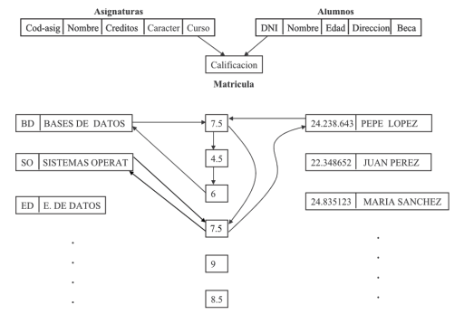

# Tema 1. Introducción y definiciones iniciales
## Concepto intuitivo de base de datos
**Concepto intuitivo**: fondo común de información almacenada en una computadora
para que cualquier persona o programa autorizado pueda acceder a ella,
independientemente del lugar de procedencia y del uso que se
haga.

**Operaciones**: insertar, obtener, modificar, borrar...

## Bases de datos y sistemas gestores de bases de datos

**Base de datos**: conjunto de datos comunes a un proyecto almacenados sin
redundancia para ser útiles a diferentes aplicaciones.

**Sistemas de gestión de base de datos (SGDB o DBMS)**: conjunto de elementos software con capacidad para definir, mantener y utilizar una base de datos. Un SGDB debe permitir definir estructuras de almacenamiento, acceder a datos de forma eficiente y segura, organizar la actualización de los datos y el acceso multiusuario...

**Elementos** de una base de datos:

- **Datos**: integrados (sin redundancia) y compartidos (útiles a varias
  aplicaciones).
- **Hardware**: base de datos normal o distribuida.
- **Software**: SGBD, y programas para definir las estructuras y gestionar los datos de la base de datos.
- **Usuarios**: usuario final, programador de aplicaciones,
  administrador.

**Dato operativo**: pieza de información que necesita una organización
para su funcionamiento.

- **Ítem básico**: elemento acerca del que se puede pedir información (sustantivo).
- **Atributo**: características de los ítems básicos (adjetivos).
- **Relaciones**: conexiones lógicas entre ítems.

Cuando se determinan y clasifican de esta forma todos los datos
operativos, se obtiene el **esquema lógico** de la base de datos.

**Objetivos** de un SGBD:

- **Independencia** de los datos.
- **Diseño y utilización** orientada al usuario: los datos y aplicaciones deben ser accesibles a los usuarios de la manera más amigable posible (soportar un modelo de datos teórico, soportar facilidades de definición y soportar lenguajes de acceso y modificación).
- **Centralización**: los datos deben gestionarse de forma centralizada e independiente de las aplicaciones (figura del ABD, utilidades de gestión...).
- **No redundancia**: los datos no deben estar duplicados (gestión de accesos concurrentes).
- **Consistencia**: los datos deben ser consistentes, sin fallos
  lógicos (mecanismos de mantenimiento de integridad).
- **Fiabilidad**: los datos deben estar protegidos contra fallos
  catastróficos (mecanismos de mantenimiento de recuperación y
  relanzamiento de transacciones).
- **Seguridad**: no todos los datos deben ser accesibles a todos los
  usuarios (mecanismos de gestión de usuarios y privilegios,
  mecanismos de protección de información).

## Ventajas de utilizar un SGBD

Para el **usuario**:

- **Usuario final**: puede acceder a los datos.
- **Programador de aplicaciones**: eliminar problemas de diseño lógico y físico, depuración de errores y mantenimiento general.
- **Administrador de BD**: no existiría.

Para el **sistema**:

- Control centralizado (fiabilidad, consistencia, seguridad...)
- Criterios de uniformación
- Generación de nuevas aplicaciones
- Equilibrio entre requerimientos conflictivos.

## Concepto de independencia

**Independencia**: los datos se organizan independientemente de las aplicaciones que los vayan a usar y de los ficheros en los que vayan a almacenarse.

**Independencia física**: el diseño lógico de la BD, a todos los niveles,
debe ser independiente del almacenamiento físico de los datos. Esto
permite realizar libremente cambios en la estructura física y
descargar a las aplicaciones de problemas físicos.

**Independencia lógica**: existen dos tipos de estructura lógica: esquema
lógico general (vista global) y vistas de usuario (datos a los que se
deja acceso a un usuario). Cada aplicación debe poder
organizar los datos según sus propios esquemas y acceder a los datos
que le son necesarios y le conciernen. La independencia lógica persigue que los cambios en el esquema lógico general no afecten a las vistas de usuario de manera que las aplicaciones no necesiten ser modificadas. No siempre se puede conseguir.

- Aumento de la seguridad y fiabilidad
- Menos problemas para las aplicaciones
- Posibilidad de cambios en los esquemas por parte de las aplicaciones
  y por parte de los administradores.

\newpage

# Tema 2. Arquitectura de un sistema gestor de bases de datos

## Una arquitectura con tres niveles

**¿Por qué organizar en niveles?**

Los usuarios pueden acceder a los mismos datos desde distintas
perspectivas. Si un usuario cambia la forma de ver los datos no
influye al resto.

La organización global de los datos puede cambiarse sin afectar a los
usuarios.

Los usuarios no tienen por qué gestionar aspectos relativos a la
representación física de los datos. El administrador de la base de
datos puede cambiar la forma de representar los datos sin influir en
los usuarios.

### Arquitectura ANSI/SPARC

La percepción de los datos en un SGBD puede hacerse siguiendo tres
niveles de abstracción:

- **Nivel interno**: constituye la representación de la BD más cercana a la
estructura de almacenamiento físico. Por tanto, es la capa donde se
establece la forma en que se implantan las estructuras de datos que
organizan los niveles superiores.
- **Nivel conceptual**: supone una abstracción global de la BD que integra y
aglutina todas las percepciones que los usuarios tienen de ella. Tiene
una visión global de los datos pero ningún detalle de almacenamiento.
- **Nivel externo**: a este nivel se definen todas las percepciones
particulares de la BD por parte de los usuarios. Cada usuario puede
tener su propia visión de la BD.

<p>

</p>

## Correspondencia entre niveles

**Transformación o correspondencia entre niveles**: conjunto de normas que
establece cómo se definen los datos de un nivel en términos de
otro. Mecanismo fundamental para el establecimiento de la
independencia física y lógica.

**Transformación interna/conceptual**: cómo se organizan las entidades lógicas del nivel conceptual en términos de registros y campos almacenados en el nivel interno. Independencia física:

- Varía el nivel interno
- Cambia la correspondencia
- No varía el nivel conceptual

**Transformación externa/conceptual**: describe un esquema externo en términos del esquema conceptual subyacente. Independencia lógica:

- Varía el nivel conceptual
- Cambia la Correspondencia
- No varía el nivel externo
Esta transformación no siempre es posible

**Transformación externa/externa**: algunos SGBD permiten describir esquemas externos en términos de otros esquemas externos. Independencia lógica:

- Varía el esquema externo subyacente
- Cambia la correspondencia
- No varía el esquema externo dependiente

En el siguiente dibujo, si quisiéramos hacer una correspondencia externa/externa pondríamos un esquema que sale del esquema N.

<p>

</p>

## Lenguajes de una BD

**Recomendación ANSI/SPARC**: disponer de un lenguaje específico orientado a los datos (definición, control, manipulación). Sublenguaje de datos (DSL) implementado en el propio SGBD. Tiene distintas partes:

- **DDL**: Data Definition Language. Sublenguaje de definición de
  datos. Subconjunto del DSL destinado a la definición de estructuras
  de datos y esquemas en la BD.
- **DML**: Data Manipulation Lanquage. Sublenguaje de manipulación de
  datos. Subconjunto del DSL mediante el que podemos introducir datos
  en los esquemas, modificarlos, eliminarlos y consultarlos. También
  debe permitir consultar la estructura de los esquemas definidos en
  la BD.
- **DCL**: Sublenguaje de control de datos, que permite gestionar los
  requisitos de acceso a los datos y otras tareas administrativas
  sobre la BD.

ANSI/SPARC recomienda disponer de un DDL, un DML y un DCL para cada nivel de la arquitectura.

En la práctica todos estos sublenguajes se presentan bajo una
implementación única. Cada sentencia trabaja sobre uno o varios
niveles. Un sistema de privilegios discrimina quién puede ejecutar
qué.

La industria ha seguido un camino diferente: lenguajes de datos estándares.

El ejemplo más destacado es SQL: SQL89, SQL92 y SQL3.


**Lenguaje anfitrión o de aplicación**: desarrollo de aplicaciones en el SO que trabajen sobre la BD. El propósito general es C/C++, Java, C#. Las herramientas de desarrollo específicas son Developer de Oracle, Oracle Application Express (Oracle APEX), Sybase PowerBuilder, IBM Rational Application Developer... Además, proporciona procesamiento avanzado de datos y gestión de la interfaz de usuario.

Hay que establecer un mecanismo para traducir: estructuras de datos y operaciones. Acoplamiento:

- **Débilmente acoplados** (si se pueden distinguir):
    - Lenguajes de propósito general
    - El programador puede distinguir:
        - Sentencias propias del lenguaje anfitrión
        - Sentencias dispuestas para acceder a la BD a través del DSL
- **Fuertemente acoplados** (si no se pueden distinguir):
    - Lenguajes y herramientas de propósito específico
    - Se parte del DSL como elemento central y se le incorporan características procedimentales para facilitar el desarrollo de aplicaciones.

Alternativas para implementar el **acoplamiento débil**:

- **APIs de acceso a BD**:
    - ODBC – Open Database Connectivity
    - JDBC – Java Database Connectivity
- **DSL inmerso en el código fuente del lenguaje anfitrión**: el programador escribe un código híbrido. Mezcla sentencias del lenguaje anfitrión con sentencias DSL. Hay un preprocesador que luego lo transforma.

Alternativas para implementar el **acoplamiento fuerte**: diversas propuestas (la mayoría propietarias): PL/SQL de Oracle (Extensión Procedural para SQL). Por ejemplo: ejecución de Java sobre una máquina virtual implantada en el propio SGBD.

También han aparecido numerosos entornos de desarrollo específicos
para el desarrollo de aplicaciones de gestión: Diseñadores de informes, diseñadores de formularios...

## Nivel externo

Parte de la BD que es relevante para cada usuario. Sólo aquellas entidades, relaciones y atributos que le son de interés. Representadas de la forma que le interesa al usuario, por ejemplo: nombre completo o nombre y apellidos; fecha o día, mes y año... También hay datos calculados a partir de los que hay: edad, ventas totales...

## Nivel conceptual

Visión global de los datos. Estructura lógica de los datos: qué datos están almacenados y qué relaciones hay entre ellos. Este nivel representa:

- Todas las entidades, atributos y relaciones.
- Las restricciones que afectan a los datos.
- Información semántica sobre los datos.
- Información de seguridad y de integridad.

Además, da soporte a cada vista externa y no debe contener ningún detalle de almacenamiento.

## Nivel interno

Representación física de la BD en el ordenador, es decir, cómo están almacenados los datos. El objetivo es buscar el rendimiento óptimo del sistema. Representa:

- Estructuras de datos.
- Organizaciones en ficheros.
- Comunicación con el SO para gestionar el uso de unidades de almacenamiento.
- Compresión de datos, encriptación...

Parte de las responsabilidades de este nivel las realiza el SO, se le suele llamar nivel físico. No existe una división clara, depende de cada SGBD y de cada SO.

## Ejemplo

Ejemplo de Gestión Docente Universitaria:

- Item básico PROFESOR
- Identificado por:  Número de registro personal (NRP).
- Caracterizado por: nombre y apellidos, sueldo y departamento al que pertenece
- **Visión conceptual**:

```txt
Profesor = registro de
    NRP
    campo alfanumérico de 10 caracteres,
    Apellidos campo alfanumérico de 30 caracteres,
    Nombre
    campo alfanumérico de 20 caracteres,
    Sueldo
    campo decimal de 8+2 dígitos,
    Departamento
    campo alfanumérico de 30 caracteres
fin Profesor.
```

- **Visión externa 1**:
    - Gestión de personal.
    - Lenguaje A.

    ```txt
    TYPE Profesor IS RECORD (
        NRP VARCHAR2(10),
        Apellidos VARCHAR2(30),
        Nombre VARCHAR2(20),
        Sueldo NUMBER(8,2)
    );
    ```

- **Visión externa 2**:
    - Ordenación académica.
    - Lenguaje B.

    ```txt
    TYPE Profesor = RECORD
        NRP : STRING[10];
        Apellidos : STRING[30];
        Nombre : STRING[20];
        Departamento : STRING[30];
    END;
    ```

- **Visión interna**:

```txt
Profesor_interno BYTES=74
    NRP TYPE=BYTES(10),OFFSET=0
    Apellidos TYPE=BYTES(30),OFFSET=10
    Nombre TYPE=BYTES(20),OFFSET=40
    Sueldo TYPE=WORD(2),OFFSET=60
    Departamento TYPE=BYTES(10),OFFSET=64
```

>SQL: dcl, dml, ddl?


## El administrador de la BD

El DBA es una figura de primordial relevancia en el contexto de los
SGBD. Algunas de sus funciones son:

- **Elaboración del esquema conceptual**. Análisis de las necesidades de
  información de la empresa, identificación de los datos operativos,
  elaboración del esquema lógico, implantación del esquema
  conceptual.
- **Decidir la estructura del almacenamiento en nivel interno**. Esquema
  interno. Correspondencia conceptual/interna asociada.
- **Conexión con usuarios**. Análisis de requerimientos, diseño lógico,
  codificación del esquema externo, correspondencias
  externo/conceptual.
- **Definir restricciones de integridad**. Establecer reglas genéricas ye específicas. Si es posible, incluir integridad en el esquema conceptual.
- **Definir e implantar política de seguridad**. Gestión de usuarios,
  gestión de privilegios.
- **Definir e implantar la estrategia de recuperación frente a fallos**. Los SOs y los SGBDs suelen incorporar facilidades para afrontar los fallos: SGBDs redundantes y RAID (Redundant Array of Inexpensive Disks). El DBA puede y debe realizar copias de seguridad de la BD. También gestiona la política de gestión de transacciones (operaciones lógicas que ocurren en la BD).
- **Optimización del rendimiento**. Liberar espacio no utilizado,
  reorganizar las operaciones para que se ejecuten de forma más
  rápida, determinar la necesidad de nuevos recursos hardware,
  establecer prioridades en el uso de los recursos.
- **Monitorizar el SGBD**. Seguimiento continuo de la actividad del
  sistema. Auditar el acceso a los usuarios a los diversos recursos de
  la BD. Comprobar los niveles de uso de los sistemas de
  almacenamiento. Evaluar la eficiencia con que se realizan las
  operaciones.

## Tipos de arquitecturas de implantación

El concepto de SBD ha evolucionado paralelamente al desarrollo del
informática en la forma de gestionar la información, de ejecutar los
programas y de interactuar con el usuario.

Inicialmente se utilizaba un sistema **centralizado** donde toda la carga
de gestión y procesamiento de información recaía en servidores
centrales. El usuario accedía mediante terminales. En el ordenador
principal se encontraban el SGBD y los programas de
aplicación.

La **arquitectura centralizada** es la siguiente.

<p>

</p>

El principal problema de este sistema es el elevado coste
de los ordenadores principales con la aparición del PC. La solución fue desplazar la ejecución de los programas de usuario y las interacciones hasta los PCs (reducción de costes en hardware). Surge la primera aproximación
**cliente/servidor**. El servidor alojaba la base de datos y un servicio
de escucha de peticiones, mientras que el cliente, los PCs conectados
al servidor, tenían los programas de aplicación y el servicio de
enlace cliente que interactúa con el servicio de escucha instalado en el
servidor. Con el desarrollo de las comunicaciones este enfoque deriva
en un enfoque distribuido.

La **arquitectura distribuida y cliente/servidor** es la siguiente.

<p>

</p>

El principal problema es el alto coste del mantenimiento de los PCs (instalación, configuración y actualización), que se soluciona separando en las aplicaciones: la parte que interactúa con el usuario (interfaz) de la parte de ejecución lógica del programa.

Actualmente se utiliza una arquitectura articulada entre niveles de
procesamiento.

- **Nivel de servidor de datos**. Posiblemente distribuido. El SGBD
  permite organizar la información de la empresa como una BD
  global. Las peticiones de datos formuladas desde una sede se
  traducen de forma transparente a peticiones en las sedes donde se
  encuentran esos datos.
- **Nivel de servidor de aplicaciones**. Son evoluciones del servidor web que proporcionan programas de aplicación a clientes ligeros, que disponen de entornos de ejecución de aplicaciones: usando estándares, protocolos de red TCP/IP, protocolo HTTP, despliegue de Applets Java a ejecutar en navegadores con soporte de máquina virtual Java, Servlets, JSP, ASP...
- **Nivel de cliente**. PCs ligeros dotados de configuraciones basadas en
  estándares abiertos. Basados en el carácter portátil con que se
  distribuyen las aplicaciones desde los servidores de
  aplicaciones. Menos dependencia del hardware y SO a la hora de
  abordar la ejecución de las aplicaciones.

BD distribuida y programas de aplicación en arquitectura de 3 capas:

<p>

</p>

**Ventajas**: reducción significativa en cuanto al mantenimiento de los clientes: instalación,
configuración y actualización de las aplicaciones realizada en el servidor, no en
cada cliente. Mayor facilidad y flexibilidad para el usuario. Puede acceder desde casi cualquier
puesto y desde distintos dispositivos: móviles, tablets, portátil, pc, etc.

**Inconvenientes**: mayor complejidad en la configuración y administración
de los servidores de aplicaciones. El desarrollo de las aplicaciones
conforme a este modelo distribuido es más costoso.

Ejemplo:

Usuario del PC invoca desde el navegador la ejecución de una aplicación a través de una URL. La parte de interfaz de usuario de la aplicación se puede distribuir como:

- Un applet Java que se ejecuta en la máquina virtual del navegador
- Una serie de paginas HTML generadas desde el servidor de aplicaciones:
    - Servlets
    - JSP
    - ASP

La interacción del usuario a través de esta interfaz determina la interacción con la parte
lógica de la aplicación que se ejecuta en el servidor de aplicaciones:

- Peticiones de procesamiento
- Acceso a datos de la BD
- Generación de nuevas páginas o evolución del applet que ofrecen la respuesta al usuario a través de la interfaz de usuario.

\newpage

# Tema 3. Modelos de datos

## Definición de modelo de datos

Un **modelo de datos** es el mecanismo formal para representar y manipular
información de manera general y sistemática. Debe constar de:

1. Notación para describir datos.
2. Notación para describir operaciones.
3. Notación para describir reglas de integridad.

Modelo lógico: trasladamos a un esquema lógico en función de una estructura implementable.

<p>

</p>

Hay necesidad de modelo de datos, ya que cada esquema se describe utilizando un lenguaje de definición de datos. Este lenguaje es de muy bajo nivel, está muy ligado al SGBD. Hacen falta otros mecanismos de más alto nivel que permitan describir datos de una forma no ambigua y entendible por los usuarios en cada paso del proceso de implantación.

El **objetivo** es describir modelos que representen los datos y los describan de una forma entendible y manipulable. En relación con la arquitectura **ANSI/SPARC**:

- **Nivel externo**: modelo de datos externo.
- **Nivel conceptual**: modelo de datos conceptual.
- **Nivel interno**: modelo de datos interno.

La **clasificación** es la siguiente:

- **Basados en registros**: se usan para el nivel externo y conceptual.
- **Basados en objetos**: se usan para el nivel externo y conceptual.
- **Físicos**: se usan para el nivel interno.

Los **modelos de datos basados en registros** son:

- Modelo de datos **jerárquico**
- Modelo de datos en **red**
- Modelo de datos **relacional**


## Modelo de datos relacional

### Estructura de datos

El **modelo de datos** relacional organiza y representa los datos en forma
de tablas o relaciones.

Una **base de datos relacional** es una colección de tablas cada una de las cuales tiene un nombre único.

Un **esquema de una base de datos relacional** es una colección de esquemas de relaciones junto con restricciones de integridad.

Una **instancia o estado de una base de datos** es una colección de instancias de relaciones que verifican las restricciones de integridad.

Una **base de datos relacional** es una instancia de una base de datos junto con su esquema.

El modelo de datos relacional abarca tres ámbitos distintos:

- **Las estructuras para almacenarlos**: el usuario recibe la información
  de la base de datos estructurada en tablas.
- **La integridad**: las tablas deben satisfacer ciertas condiciones que
  preservan la integridad y la coherencia de la información que
  contienen.
- **Consulta y manipulación**: los operadores empleados por el modelo se
  aplican sobre tablas y devuelven tablas.

Algunas definiciones:

- **Tabla** es la estructura lógica de un sistema relacional. A nivel
físico, el sistema es libre de almacenar los datos en el formato más
adecuado (archivo secuencial, archivo indexado, lista con
apuntadores...).

- **Atributo**: cualquier elemento de información susceptible de tomar
valores. Notación: $A_i$, $i = 1, 2...$

- **Dominio**: rango de valores donde toma sus datos un atributo. Se considera finito. Notación: $D_i$, $i = 1, 2...$

- **Relación**: dados los atributos $A_i$, $i = 1, 2, ..., n$, con dominios
$Di$, $i = 1, 2, ..., n$ no necesariamente distintos, definimos la
relación asociada a $A_1, ..., A_n$, y lo notaremos como $R(A_1, ...,
A_n)$ a cualquier subconjunto de productos cartesianos $D_1 x ... x
D_n$.

- **Tupla**: cada una de las filas de la relación.

- **Cardinalidad de una relación**: número de tuplas que contiene. Es
variable en el tiempo.

- **Grado de una relación**: número de atributos de su esquema. Invariable
en el tiempo (hasta que lo cambiamos nosotros).

- **Esquema de una relación R**: Atributos $A_1: D_1,..., A_n:D_n$

- **Instancia de una relación**: conjunto de tuplas {($x_1, ..., x_n$)} $\subset D_1 x ... x D_n$ que la componen en cada momento.


Las **propiedades** de la estructura de datos relacional son:

- **Condición de normalización**: todos los valores de los atributos de una
relación son atómicos. El valor atómico es un valor no
estructurado. Cuando una relación cumple la primera condición de
normalización se dice que está en **Primera Forma Normal**.

- **Consecuencias**: no hay valores tipo conjunto, tipo registro ni tipo tabla.

- **Problema**: todas las representaciones son extensivas, no se puede representar directamente información del tipo "el valor del atributo asignaturas de un alumno es: (FBD, ALG, LD)".

Las **consecuencias de la definición** son:

- No hay tuplas duplicadas, por la definición conjuntista de relación (no hay tuplas con el mismo valor).

- No hay orden en las filas ni en los atributos, al no estar ordenados ni los atributos ni las filas (conjuntos) el acceso es por Nombre de Atributo y Valor.
- Varias instancias representan la misma relación.


| Representación física | Representación intuitiva | Modelo matemático |
|---|---|---|
| Archivo secuencial | Tabla | Relación |
| Registros | Filas | Tuplas |
| Campos | Columnas | Valores atributos |


- **Esquema de una base de datos relacional**: colección de esquemas de
relaciones junto con restricciones de integridad.

- **Instancia o estado de una base de datos**: colección de instancias de
relaciones que verifican las restricciones de integridad.

- **Base de datos relacional**: instancia de una base de datos junto con su
esquema.

La notación que vamos a usar es:

- Relación: $R,S, T...$
- Atributos: $A,B,...$
- Esquema de relación: $R[A_1 ,...,A_n ]$
- Instancia de relación $R: r...$
- Tuplas de una instancia: $x_1, x_2... \in r$
- Valor de un atributo $A_i$ en una tupla $x_j : x_j [A_i ]$ ó $A_{ij}$

Algunas veces no se conoce el valor de un atributo de determinada
tupla. En esos casos a ese atributo de esa tupla se le asigna un **valor
nulo**. Un valor nulo puede ser un valor desconocido o un atributo no
aplicable. En cualquier caso, ese valor es un valor común a todos los
dominios de la base de datos.


### Restricciones de integridad

Restricciones o reglas de integridad son condiciones para preservar la semántica de una base de datos. Específicas del problema: 0 $\leq$ edad $\leq$ 100, créditos >0, carácter $\in$ ('troncal', 'obligatoria', 'optativa'...).

Propias del papel de los atributos en el esquema:

- imparte.NRP $\in$ profesor.NRP (un profesor inexistente no puede impartir una asignatura).
- cod_asig != nulo (siempre debe conocerse el código de una asignatura).

Una **superclave** es cualquier conjunto de atributos que identifica unívocamente a cada tupla de una relación. En una relación puede haber más de un conjunto de atributos que puedan
ser elegidos como clave. Estos conjuntos se llaman claves
candidatas. Una **clave candidata** (superclave minimal) es un atributo o conjunto de atributos que identifican a cada tupla en la relación y que, además,
no existe un subconjunto de ellos que también identifiquen a la tupla
en la relación. Es decir, sea R[$A_1,...,A_n$], PK $\cup${$A_1,...,$A_n$} se denomina clave candidata sii:

- Unicidad: $\forall$r instancia de R y $\forall t_1, t_2 \in r \; t_1 \neq t_2 \rightarrow t_1[PK] \neq t_2[PK]$.
- Minimalidad: no existe PK' $\cup$ PK que verifique la unicidad.


Ejemplo:

- Relación Trabajadores
    - {id_trabajador, nombre} - superclave.
    - No es minimal: no es clave de la relación.
- Por ejemplo, en la relación Asignaturas, el conjunto de atributos {Cod_Asig, Nombre} identifica unívocamente cada tupla. Sin embargo, no es minimal y no puede considerarse como una clave. Cod_Asig por sí solo, es una clave.


Una **clave primaria** es una clave candidata elegida por
el diseñador (criterio de selección: tamaño, significado, capacidad para recordarla, fusión con otras tablas...). Si PK verifica la unicidad pero no la minimalidad se denomina **superclave**.

**Condiciones de integridad**: normas que mantienen la corrección
semántica de una base de datos. Nos centramos en la Integridad Genérica (depende del papel que juegue un atributo en el diseño de la tabla). Son metarreglas (generan reglas de
integridad aplicadas a una base de datos concreta). Existen la
integridad de entidad y la referencial.

**Integridad de entidad**: no se debe permitir que una entidad sea
representada en la base de datos si no se tienen una información
completa de los atributos que son claves de la entidad. La clave primaria
o parte de ella no puede ser valor nulo.

Un atributo que forma parte de la clave primaria de una tupla en
una relación no puede tener un valor nulo.

**Clave externa**: un conjunto de atributos en una relación que es una
clave en otra (o en la misma) relación. Podemos ver una clave externa
como un conjunto de atributos de una relación cuyos valores en las
tuplas deben coincidir con los valores de la clave primaria de las
tuplas de otra relación. Es decir, sean R[$A_1,...,A_n$] y PK $\cup${$A_1,...,$A_n$} su clave primaria, sea S[B1,...,Bn] y FK $\cup${B1,...,Bn} de manera que card(PK)=card(FK). FK es clave externa de S con respecto a R si se verifica:

$\forall$ r instancia de R y $\forall$ s instancia de S, $\forall$ x $\in x \Rightarrow \exists y \in r : x[FK]=y[PK]$

Es decir, que el dominio activo de FK debe estar incluido en el dominio activo de PK para cualquier instancia de la base de datos.

<p>

</p>

**Integridad referencial**: una base de datos en la que todos los valores
no nulos de una clave externa referencian valores reales de la clave
referenciada en la otra relación cumple la regla de integridad
referencial. Si una relación incluye una clave externa conectada a una
clave primaria, el valor de la clave externa debe ser, bien igual a un
valor ya existente en el dominio activo de la clave primaria o bien
completamente nulo (si la semántica lo permite). La integridad
referencial mantiene las conexiones entre las bases de datos
relacionales. Puede haber más de una clave externa en una relación, y
más de una clave externa a la clave primaria de la propia relación. Ejemplo:

<p>

</p>

El **SGBD** debe encargarse de mantener las siguientes restricciones:

- **La unicidad de la clave primaria y las claves candidatas**: frente a operaciones de Inserción y Actualización, el SGBD debe rechazar los valores
introducidos que sean iguales a los presentes en la BD para los atributos que el diseñador ha definido como clave primaria y como claves candidatas.
- **La restricción de integridad de identidad**: frente a operaciones de Inserción y Actualización, el SGBD debe rechazar las modificaciones
que vulneren la unicidad en la clave primaria y/o que asignen un valor NULO a algún atributo de la clave primaria.
- **La integridad referencial**:
    - En **inserción**: rechazar tuplas insertadas si el valor de la clave
    externa no concuerda en la relación referenciada para alguna tupla
    en el valor de su clave primaria. Si el valor para la clave
    externa es nulo y el diseño no lo permite habrá que rechazar
    también esa inserción.
    - En **actualización**: si se actualiza la clave externa, rechazar la
    modificación si se producen alguna de las circunstancias descritas
    en el punto anterior. Si se actualiza la clave primaria de la
    relación referenciada se deben actualizar en cadena las claves
    externas que la referencian.
    - En **borrado**: si se borran la clave primara de la relación
    referenciada, se debe borrar en cadena todas las tuplas que la
    referencian o poner valor nulo en la clave externa de todas esas
    tuplas.


## Otros modelos de datos

### Modelo jerárquico

Fue el primero en implementarse físicamente. En el nivel externo hay aplicaciones Cobol. No había interactividad ya que carecía de un lenguaje de consulta.

La estructura de datos era básica usando un árbol con registros maestros y secundarios.

La BD es una colección de instancias de árboles.

<p>

</p>

Esta estructura plasma de forma muy directa relaciones muchos a uno y relaciones uno a uno.

En las relaciones muchos a muchos hay que duplicar toda la información sobre las entidades involucradas.

<p>

</p>

Inconvenientes:

- Almacenar árboles en ficheros es complejo: hay varios tipos de registro y hay que mantener los punteros.
- DML difícil de implementar y usar.
- Dependencia existencial obligatoria de los registros de tipo secundario con respecto a los de tipo raíz: no se podrá insertar un registro de tipo secundario mientras  no exista uno de tipo raíz con el que enlazarlo.
- Redundancia necesaria para plasmar relaciones muchos a muchos: la integridad de los datos es costosa de mantener.

### Modelo en Red

Estructura de datos:

- Grafos cuya topología depende de las conexiones existentes entre las entidades. Tiene:
    - Nodos: registros.
    - Arcos: enlaces entre registros (punteros).
    - Relaciones entre conjuntos de entidades:
        - Conectores: registros especiales (atributos propios de la relación).
        - Cada ocurrencia de un conector representa una asociación distinta.
    - Cualquier registro puede relacionarse con cualquier registro
- Base de datos: colección de instancias de grafos
- La estructura es muy genérica:
    - Permite plasmar todo tipo de relaciones
    - Implementa directamente las relaciones muchos a muchos

<p>

</p>


Ventajas:

- Estructura algo más homogénea.
- Permite insertar nuevas entidades en un conjunto de forma independiente.

Problemas:

- La existencia de enlaces entre los registros hace que las operaciones del DDL y el DML sigan siendo complejas de implementar y utilizar.

### Comparativa

- Con respecto a la representación:
    - **Relacional**.
        - Un solo elemento para la representación (esencialidad).
        - Conexiones lógicas.
        - Representación relaciones n:m simétrica.
        - Identidad por valor.
    - **Basado en grafos**.
        - Dos elementos para la representación.
        - Conexiones en el modelo físico subyacente.
        - Representación conexiones n:m, imposible en modelos jerárquicos y difícil en modelos en red.
        - Identidad por posición.
- Con respecto a la consulta:
    - **Relacional**.
        - Consultas simétricas en jerarquías.
        - Obtención de la consulta como resultado global.
        - Lenguajes declarativos.
    - **Basados en grafos**.
        - Consultad no simétricas en jerarquías.
        - Mecanismo de navegación por punteros.
        - Lenguajes procedimentales.

### Orientación a objetos

**Debilidades** de los SGDB relacionales:

- **Pobre representación** de las entidades del mundo real.
- **Sobrecarga semántica** de la estructura básica: la relación.
- La estructura relacional es muy **estricta**:
    - Todas las **tuplas** (filas) han de tener los mismos atributos.
    - Los **valores** de un atributo (columna) pertenecen al mismo dominio.
    - **Atributos** han de tener un valor atómico.
- SQL permite un conjunto de **operaciones limitado**. No permite modelar el comportamiento de muchos objetos del mundo real.
- Object-relational impedance mismatch.

La filosofía del modelado orientado a objetos es abstraer un modelo de la realidad en forma de conjunto de objetos que interaccionan entre sí por medio de mensajes.

Conceptos:

- Estado / comportamiento.
- Propiedades / métodos.
- Encapsulamiento.
- Herencia.
- Polimorfismo.

<p>

</p>

En el mundo de las Bases de datos, primero se hace **orientación a objetos** (gran capacidad de modelado y dificultades de implementación del SGBD). Después, se hace **objeto-relacional** (solidez de SGBD relacionales y capacidad de modelado de la orientación a objetos).


### Cubos de datos - sistemas multidimensionales

Hay dos modelos de BD en la empresa:

- **Bases de datos operacionales**:
    - Modelos relacional o de objetos.
    - OLTP.
- **Bases de datos analíticas**:
    - Modelo multidimensional.
    - OLAP.

<p>

</p>

**Modelado Dimensional**:

- Técnica para visualizar los datos como un conjunto de medidas que están descritas por aspectos comunes del negocio.
- Es muy adecuada para resumir y reordenar datos que van a ser utilizados para el
análisis.
- Está enfocado para trabajar sobre datos numéricos: valores, conteos, pesos, ratios
y ocurrencias.

<p>

</p>

\newpage

# Tema 4. Nivel Interno

## Introducción

## Importancia de la organización de los datos

Sabemos que una **BD** sirve para almacenar de forma permanente grandes cantidades de datos con el propósito principal de gestionar los datos y su almacenamiento de forma eficiente. Esto afecta a su **organización lógica** de los datos y a su **organización física**.

### Nivel interno

El **nivel interno** expresa en última instancia, las operaciones sobre los datos (creación, alteración y recuperación) en términos de actuación sobre unidades mínimas de almacenamiento denominadas **páginas o bloques** de base de datos. Está implementado en el **SGBD** y provee al administrador mecanismos para optimizar el acceso y almacenamiento de datos.

### Nivel físico

El **nivel físico** está implementado en el SO y proporciona al SGBD una capa de abstracción sobre el hardware. Este nivel accede a los medios de almacenamiento mediante llamadas a los servicios del sistema de archivos proporcionado por el SO.

### Jerarquía de memoria

<p>

</p>

<p>

</p>

### Dispositivos de almacenamiento

Existen diferentes dispositivos de almacenamiento con diferentes características. En orden creciente de coste, capacidad y tiempo de acceso los más importantes son: Registros, Caché, Memoria Principal, Discos Magnéticos, Discos ópticos.

### Memoria principal

La **memoria principal** es el dispositivo de almacenamiento primario de los ordenadores. Hace trabajos de caché de la porción de la BD que ha sido usada más recientemente. Es el elemento de almacenamiento intermedio que ubica de forma temporal los datos afectados por las operaciones.

El **nivel interno** debe optimizar su uso:

- Es **rápida**: acelera el procesamiento.
- Es **cara**: hay que optimizar su uso.

Es **volátil**, su información se pierde cuando se apaga el sistema (o se cae). El nivel interno debe garantizar que la información contenida tenga un respaldo en almacenamiento secundario para que no se pierda.

Se utilizan distintos niveles de caché para acelerar el acceso a los datos.

### Disco duro

El **disco duro** es el dispositivo de almacenamiento más usado en BD. Son conjuntos de discos magnéticos de dos caras donde cada cara tiene un conjunto de pistas concéntricas (cilindro: la misma pista de todas las caras) que se dividen en sectores con la misma capacidad de almacenamiento (bloque). Un bloque se puede localizar en un cilindro, la superficie de disco o un sector. Los parámetros son: capacidad, tiempo medio de acceso, RPM y velocidad sostenida de lectura/escritura.

Con respecto a las medidas de rendimiento, cada dispositivo tiene:

- **Tiempo medio de acceso ($ta$)**: tiempo medio transcurrido entre una instrucción y la obtención de la información.
- **Tiempo medio de búsqueda ($tb$)**: tiempo medio de posicionamiento en pista.
- **Tiempo de latencia rotacional ($tl$)**: tiempo medio de posicionamiento en sector.
$$ta = tb + tl$$
- **Tiempo medio entre fallos ($MTBF$)**.

## Método de acceso a la BD almacenada

<p>

</p>

Vamos a ver cómo se transforma un registro almacenado en una representación física en el almacenamiento secundario. Si tenemos un bloque de la BD en disco, para obtenerlo se siguen una serie de pasos:

1. El SGBD solicita la página almacenada al gestor de archivos.

2. El gestor de archivos solicita los bloques de SO al gestor de disco.

3. El gestor de disco hace una operación de E/S al disco de la base de datos almacenada.

4. El disco devuelve de la base de datos almacenada los sectores solicitados al gestor de disco.

5. El gestor de disco devuelve los bloques solicitados al gestor de archivos.

6. El gestor de archivos manda la página almacenada solicitada al SGBD.

<p>

</p>

En este proceso, para que el gestor de almacenamiento pueda localizar la página de BD adecuada, se utiliza el *Record IDentifier* (RID).

<p>

</p>

Cada registro almacenado tiene:

- **Cabecera**: número y tipo de columnas que lo integran.
- **Datos**: contenido de las columnas.

Las **páginas o bloques** de la BD deben tener un tamaño múltiplo de las páginas del SO (mínima unidad de E/S), de forma que para recuperar un registro almacenado hay que determinar en qué página de la BD está y entonces recuperar los bloques de disco que la integran. Así, hay que **organizar** la estructura de almacenamiento y los métodos de acceso, de forma que se optimice la interacción con los dispositivos de almacenamiento secundario. Además, deben **minimizarse** las operaciones de E/S al almacenamiento secundario.

### El gestor de disco del SO

Normalmente, el SGBD interactúa con la BD almacenada mediante el **gestor de disco** del SO. El gestor de disco organiza los datos en conjuntos de bloques o archivos de SO y gestiona el espacio libre en disco. Una BD puede valerse de uno o varios de estos archivos para almacenar su contenido.

Sus **funciones** fundamentales son:

- Crear un nuevo archivo de SO.
- Eliminar archivos de SO existentes.
- Añadir un bloque nuevo al conjunto de bloques c.
- Eliminar el bloque b del conjunto de bloques c.
- Devolver el bloque b del conjunto de bloques c.
- Reemplazar el bloque b dentro d el conjunto de bloques c.

### El gestor de archivos del SGBD

El **gestor de archivos del SGBD** es un componente del SGBD que se encarga de:

- Hacer la **transformación** entre:
    - Campos, registros y archivos almacenados
    - y
    - bloques y conjuntos de bloques (que pueda entender el gestor de disco).
- **Organizar** los datos de manera que se minimice el tiempo de recuperación y las E/S a disco.

Las **funciones** básicas son:

- Crear un nuevo archivo almacenado: asociar al archivo un conjunto de páginas o bloques de la BD.
- Eliminar un archivo almacenado.
- Recuperar el registro almacenado `r` del archivo almacenado `a`. Normalmente, el SGBD proporciona el RID. Sólo hay que obtener en memoria la página que contiene el registro para extraerlo.
- Añadir un nuevo registro almacenado al archivo almacenado `a`. Hay que localizar la página de BD más apropiada de las pertenecientes al archivo almacenado. Si no se pudiera, se solicita una nueva página. Se devuelve al SGBD el RID nuevo.
- Eliminar el registro `r` del archivo almacenado `a`.  Hay que recuperar la página de BD que contiene dicho registro y marcar el espacio ocupado por el registro en dicha página como disponible.
- Actualizar el registro r en el archivo almacenado `a`. Recupera la página de la BD que contiene el registro que se desea actualizar. Trata de sustituir la información. Si no puede, se intenta ubicar en otra página.

## Representación de la BD en el nivel interno

La BD se representa de formas diferentes en los distintos niveles de arquitectura del SGBD. Esta representación en el nivel interno no tiene por qué coincidir con la representación en el nivel conceptual, y un conjunto de registros del mismo tipo no tiene por qué ser un fichero.

El nivel interno debe traducir las estructuras del nivel conceptual a otras estructuras intermedias cercanas al almacenamiento real de los datos (nivel físico).

Si la BD en el nivel interno tiene al conjunto de páginas en las que se ubican los registros, tenemos:

- **Agrupamiento Intra-Archivo**: se ubican en la misma página registros del mismo tipo. Es el más frecuente.
- **Agrupamiento Inter-Archivo**: se ubican en la misma página registros de distinto tipo. Debe existir relación entre ellos (por ejemplo, entidades fuerte-débil).

*Ejemplo.*

- Se inserta una nueva asignatura con código A6.
    - Se localiza la primera página libre (la 24).
    - Se inserta el registro correspondiente.
    - Se añade esta página al conjunto de páginas de asignaturas.

    <p>
    
    </p>

- Se borra la asignatura con código A2.
    - La página que contiene a esta asignatura pasa al conjunto de páginas libres.
    - Se reorganiza la lista correspondiente a Asignaturas.

    <p>
    
    </p>

- Se introduce un nuevo profesor con código P7.
    - Se ubica en la primera página libre disponible (la segunda).
    - Se ajustan las cadenas de punteros.

    <p>
    
    </p>

- Se borra A4.
    - Su página pasa al conjunto de páginas libres.
    - Se reorganiza la cadena de punteros de las Asignaturas.

    <p>
    
    </p>

    Punteros para el recorrido secuencial lógico:

    <p>
    
    </p>


    <p>
    
    </p>

    <p>
    
    </p>

    En realidad, las páginas contienen más de un registro


La organización descrita es un ejemplo general. Cada
SGBD comercial utiliza su variante concreta, aunque la idea subyacente es la misma.

No existe una relación directa fichero-almacenado/fichero-físico, ya que todos los conjuntos de páginas irán almacenados, con toda probabilidad, en uno o varios ficheros físicos.

## Organización y métodos de acceso

> ¿Son los índices mejores que los hash? Ninguna de las organizaciones presentadas es mejor en términos absolutos.

Cuando queremos **acceder** a los datos de una BD, nuestro objetivo es minimizar el número de acceso a disco. Por ello, necesitamos minimizar la cantidad da páginas de una BD involucradas en una operación de BD.

Ninguna de las organizaciones presentadas es mejor en términos absolutos. Existen varias organizaciones usadas para las BD.

\newpage

Los criterios básicos para medir la **calidad** de una organización son:

- **Tiempo de acceso** a los datos requeridos.
- **Porcentaje de memoria ocupada** por los datos requeridos con respecto a las páginas de BD que los contienen.

Trabajaremos a **dos niveles**:

- **Organización** de registros de datos a nivel de almacenamiento
- **Adición** de estructuras complementarias para acelerar el acceso a dichos registros.

## Organización secuencial

Existe un **fichero de acceso secuencial** donde los registros están almacenados consecutivamente y ordenados por una clave (**clave física**). Para acceder a un registro debemos pasar por los registros que le preceden.

<p>

</p>

*Ejemplo. Mostrar la relación completa de departamentos. La consulta se resolvería rápidamente si los departamentos están almacenados conjuntamente en bloques contiguos de un fichero. Sin embargo, ¿qué pasa si queremos plantear consultas por valor de clave o por rango de valores?*

El primer caso implica:

- Recorrer uno tras otro cada uno de los registros.
- En el caso peor (no encontrarse dicho departamento o ser el último de la lista) supone recorrer de forma completa el fichero.
- Búsqueda es $O(N)$.

El segundo caso tiene un tratamiento muy parecido:

- Se realiza la búsqueda por valor de clave de la cota inferior del intervalo.
- Se continúa hasta alcanzar la cota superior. Si están ordenados por el valor de la clave.

Si queremos:

* **Insertar un registro**: implica buscar el bloque que le corresponde, insertarlo si hay sitio y si no o se crea un nuevo bloque o se crea uno se crea un bloque de desbordamiento. Es recomendable dejar espacio vacío entre bloques para evitar problemas de reorganización.

* **Borrar un registro**: implica buscar el registro y borrarlo. Además, puede implicar una reorganización local de los registros de un bloque.

En resumen, las dos operaciones suponen:

- Escritura del bloque del registro que se inserta o borra.
- Creación o liberación de bloques de datos en el fichero secuencial.
- Creación o liberación de bloques de desbordamiento.
- Reorganización de registros entre bloques contiguos, lo que implica la escritura de los bloques implicados en el desplazamiento.


Es por ello que esta forma tiene grandes inconvenientes que son subsanables, al menos en parte, mediante el uso de estructuras adicionales que nos permitan acelerar la localización de los datos y disminuir el número de bloques de disco transferidos. Las técnicas más populares son la **indexación** (índices) y el **acceso directo**.

## Indexación

Pretende disminuir el tiempo de acceso a los datos utilizando una **clave de búsqueda**. Es similar a la idea de un índice en un libro. Existen muchas formas de llevar a cabo esta idea.

## Fichero indexados

Partiendo de un fichero secuencial sobre el que disponemos una estructura adicional (fichero índice), cuyos resgistros tienen una clave de búsqueda (campo clave) y un campo de referencia con los RIDs de los registros. Son registros más pequeños que los del fichero de datos, aunque hay el mismo número de registros en ambos.

<p>

</p>

* **Índice primario**: la clave de búsqueda es el mismo campo clave (clave física) por el que se ordena el fichero secuencial de datos.

* **Índices secundarios**: se construyen sobre otros campos que no sean la clave física del fichero de datos.

<p>

</p>

Para **consultar** un valor, podemos consultar:

- **Por valor de la clave**: sobre el índice localizamos la clave (recorrido secuencial), obtenemos el RID del registro y vamos a disco para recuperar el bloque donde está el registro señalado por el RID. La búsqueda en el índice es más rápida.
- **Por rango de valores**: se busca en el índice por valor de la clave de la cota inferior y se recorren las entradas del índice que están en el intervalo, recuperando los registros correspondientes gracias a su RID.

Para **insertar un nuevo registro** se hace lo mismo que en el fichero secuencial, y hay que actualizar el índice (inserción en un fichero secuencial).

Para **borrar un registro** se borra un registro en el fichero de datos y se borra una entrada en el índice.

*Ejemplo. Borrado del registro de clave 13.*

<p>

</p>

Se puede montar un índice sobre más de un campo de un registro. La clave es la concatenación de los campos indicados.

Hay que tener cuidado: si hay un índice sobre nombre-alumno y DNI. Es útil para consultas que involucran: Nombre; Nombre y DNI. No es útil para consultas sobre el DNI.

Como conclusión, estos índices aceleran el acceso a los datos pero ralentizan las otras operaciones, por lo que  hay que mantener estos índices.

Por tanto, hay que considerar la conveniencia de crear cada índice: frecuencia de las consultas y frecuencia de las operaciones de mantenimiento de los datos.

## Índices no densos

Lo ideal es mantener el índice en memoria principal. Pero en realidad, los índices suelen ser muy grandes porque contienen todos los registros del fichero que indexan. Son densos.

Por tanto, para reducir el tamaño aparecen los **índices no densos**, que son registros que se componen por la clave de búsqueda y la dirección de comienzo del bloque donde puede estar el registro deseado. El número de registros se reduce al número de bloques del fichero de datos. El acceso secuencial al índice no denso se acelera.

<p>

</p>

La búsqueda ahora es diferente, pues una vez se encuentra el bloque donde podría estar el registro hay que cargarlo en memoria y hacer búsqueda secuencial en ese bloque. No tiene costes en términos de acceso a disco. Además, no se garantiza encontrar el registro hasta consultar el bloque de datos leído.

Los índices no densos sólo se pueden definir sobre la clave física. El mantenimiento de un índice no denso es menos costoso: la inserción y borrado son menos frecuentes pues solo ocurren cuando la operación afecta al valor que representa al bloque completo.

<p>

</p>

## Índices jerárquicos

Estos índices quieren disminuir el tiempo necesario para recorrer el índice en busca de un registro. Para ello, crearán **índices multinivel**, formados por índices construidos sobre índices, luego hay varios niveles en el acceso a los datos. Un índice multinivel está formado por:

- Un **índice de primer nivel** sobre el fichero de datos, puede ser denso o no dependiendo de la clave.
- **Otros índices**, no densos, construidos sucesivamente unos sobre otros.

El **tamaño de bloque** se establece para optimizar las operaciones de acceso al disco físico. Así se reduce el número de accesos a disco para encontrar un registro pero es más difícil mantener los índices. En el peor caso, el número de accesos pueden ser tantos como niveles.

<p>

</p>

## Árboles B+

Fueron propuestos en 1972 por Bayer y McCreight. Los **Árboles B+** son una generalización de los árboles binarios balanceados en la que los nodos pueden tener más de 2 hijos. Los valores de la clave se encuentran almacenados en los nodos hoja.

Un árbol B+ de orden $M$ (máximo número de hijos que puede tener cada nodo) es un árbol con la siguiente estructura:

- Nodo de nivel superior: raíz del árbol
- Nodos del nivel inferior: hojas.
- Cada nodo distinto de las hojas tiene como máximo $M$ hijos y como mínimo $(M+1)/2$ hijos.
- Todos los nodos hoja aparecen al mismo nivel.
- Las claves contenidas en cada nodo nos guiarán hasta el siguiente nodo del nivel
inmediatamente inferior.
- Un nodo no hoja con $n$ hijos contiene:
    - $n-1$ valores de clave almacenados.
    - $n$ punteros $P_i$ que apuntan a un nodo hijo.

<p>

</p>

Se pone como restricción que los valores de clave $C_i$ están ordenados dentro del nodo y que los valores $x$ del subárbol apuntado por $P_i$ cumplen:

$$ C_{i-1} \leq x < C_i$$

Excepto para $i = 1$ (donde $x < C_1$ ) e $i = n$ (donde $x \geq C_{n-1}$).

<p>

</p>

Los **nodos hoja** tienen una estructura diferente:

- Parejas clave - RID.
- Punteros al siguiente nodo hoja.
- Algunas variantes también tienen punteros al nodo hoja anterior.

La **lista concatenada de nodos hoja** (conjunto secuencia) es útil para hacer consultas por intervalos.

<p>

</p>

Las **claves** aparecerán ordenadas en cada nodo y todas deben ser menores que las del siguiente nodo en el conjunto secuencia.

Los **nodos hoja** se encuentran en el mismo nivel: árbol equilibrado y todos los caminos desde la raíz a un ondo hoja tienen la misma longitud.

> Los nodos deberán estar rellenos como mínimo hasta la mitad. ???

| **Nodo** | **Restricción** | **Min** | **Max** | **Ejemplo $M=5$** |
|---|---|---|---|---|
| Raíz (cuando no es nodo único) | Número de hijos | 2 | M | 2-5 |
| Interno | Número de hijos | $\lceil M/2 \rceil$ | M | 3-5|
| Hoja | Número de claves | $\lfloor M/2 \rfloor$ | M-1 | 2-4 |

* **Consulta**: para **localizar** un registro, navegamos desde la raíz, bajando niveles y buscando el registro en el nodo hoja y recuperando el registro del fichero de datos gracias al RID.

    Para **consultar** en un rango se localiza el nodo hoja con el valor inferior y se recorren los demás nodos hoja hasta encontrar el superior, recuperando los registros pertinentes del fichero de datos.

* **Inserción y borrado**: los algoritmos utilizados deben garantizar que el árbol siga siendo equilibrado.

<p>

</p>

## Árboles B

Los **árboles-B** (B-Tree) son una variante de B+Tree en la que no se almacenan todos los valores de la clave en los nodos hoja, sino que algunos valores se van almacenando en los nodos intermedios conforme se crea el árbol.


## Árboles B+ en BD

Los **árboles B+ en BD** son variaciones del árbol B+ de orden elevado en la que se procura que cada nodo tenga casi el mismo almacenamiento que un bloque de datos. Esto reduce los acceso a disco que suelen ser los que determinan el rendimiento de las búsquedas en BD.

En los nodos **intermedios** solo están los rangos de valores de la clave y los punteros a los nodos hijo correspondientes.

En los nodos **hoja**, que están enlazados, están los valores de clave ordenados junto con los RIDs (*rowid*) que apuntan a las tuplas que contienen ese valor de clave. Los nodos hoja, que forman el conjunto secuencia, se encuentran enlazados para poder recuperar por búsquedas secuenciales, a veces se encuentran doblemente enlazados, para facilitar búsquedas ascendentes y descendentes por el valor de la clave.

<p>

</p>

También existen las **Tablas Organizadas por Índice** (*IOT*). En este caso, las hojas contienen las tuplas en lugar del RID. Así, una IOT solo puede estar organizada de esta forma mediante una clave, aunque se pueden definir índices adicionales basados en otras claves.

<p>

</p>

<p>

</p>

| **Tabla normal** | **IOT** |
|:-------------------------------------------------------------------:|:--------------------------------------------------------:|
| Identificador único ROWID (RID) | Identificado por clave primaria |
| ROWID implícito Soporta varios índices | No ROWID Sólo un índice IOT, varios B-tree |
| Una recuperación completa devuelve las tuplas desordenadas | Una recuperación completa devuelve las tuplas ordenadas según CP |


## Índices por clave invertida

Los **índices por clave invertida** (*reverse index*) invierten los datos del valor de la clave. Es adecuado para búsquedas basadas en predicados = y mejora el rendimiento de la inserción de tuplas si se insertan de forma ascendente para valores de la clave. También mejora accesos concurrentes.

Para el empleado 7698 almacena 8967.

Con este índice se reducen los embotellamientos (retención de bloques de BD) en el índice cuando se están introduciendo los datos de forma ascendente para los valores de la clave, puesto que todos irían a la misma entrada de índice.

<p>

</p>

## Índices BITMAP

En los **índices BITMAP** (*índices de mapa de bit*), para cada valor que toma la clave almacena una secuencia de bits (tantos como tuplas contenga la tabla), en los que hay un 1 si el valor está presente en la tupla y un 0 si no lo está.


| **B-tree** | **BITMAP** |
|:----------------------------------------------------------------------:|:---------------------------------------------------------------------------:|
| Adecuado para columnas que tomen muchos valores | Adecuado para columnas que tomen pocos valores |
| Actualización de claves | Actualización de claves |
| poco costosa | muy costosa |
| Ineficiente para consultas usando predicados OR | Eficiente para consultas usando predicados OR  |

<p>

</p>

En la anterior imagen, el índice tiene 4 entradas, una por cada color. Nos dice qué tuplas tiene cada color. Si queremos ver las tuplas del color verde o azul, haremos el OR entre los mapa de bits correspondientes.

Una **ventaja** es acelerar consultas tipo OR, las del tipo AND no porque no hay.

Un **inconveniente** es cuando hay muchos valores porque hay que montar un mapa de bits.

\newpage

# Tema 5. El nivel interno. Métodos de organización y acceso a los datos

## Acceso directo

El **acceso directo** es una forma de acceder a un registro almacenado. En este caso, no tenemos estructura adicional sino que usamos un algoritmo o función sobre un campo determinado del mismo para identificar la posición del registro deseado. Para ello, debemos tener un campo que identifique unívocamente al registro.

Con respecto al **funcionamiento**, lo usual es que no se pueda establecer una **clave física** totalmente correlativa y única para cada registro, por lo que nuestro algoritmo tiene que transformar los valores de un cierto campo en una dirección. Además, deberá tener una entrada de un **campo clave** y proporcionará una salida que será un valor entero positivo transformable en **RID**. 

<p>

</p>

Estos algoritmos de direccionamiento no suelen mantener el orden de la clave. Los registros no están almacenados según el orden de su clave física. Es por ello por lo que tendremos problemas a la hora de recuperar intervalos de datos.

Los **algoritmos** usados son variados:

- **Dependen del tipo de clave**: si la clave es alfanumérica, se transforma a un valor numérico.

\newpage

- Suelen estar basados en un mecanismo de **generación de números pseudoaleatorios**:
    - **Cuadrados centrales**: se eleva la clave al cuadrado y se eligen tantos digitos centrales como sea enecesario.
    - **Congruencias**: se divide la clave por $M$ y se toma el resto ($M$ suele ser primo).
    - **Desplazamiento**: se superponen adecuadamente los digitos binarios de la clave y luego se suman
    - **Conversión de base**: se cambia la base de numeración y se suprimen algunos dígitos resultantes.

Estos algoritmos tienen varios **problemas**:

* Salvo que el campo clave se diseñe para ello, es prácticamente imposible encontrar una transformación que dé un valor entero positivo en un rango de valores limitado tal que dos claves diferentes den siempre valores distintos. Se producen **colisiones**.

* Producen **huecos**, zonas vacías del rango de salida, no asignadas por el algoritmo, que generan huecos en el fichero de datos.

Para **gestionar colisiones y huecos** tenemos que combinar acceso directo con una gestión mediante **listas de colisión**, que mantienen los registros con claves que producen colisión en dichas lista. Si estas listas crecen el acceso directo no resulta adecuado pues hay que mantener las listas y la zona de desbordamiento es casi como el fichero original. Puede haber colisión:

- El **registro problemático** se almacena en la zona de desbordamiento.
- Los **sinónimos** (registros con claves que producen colisión) se conectan mediante una lista.

<p>

</p>

Si crecen las listas de sinónimos, el acceso directo puro no resulta adecuado. Hay que mantener listas y la zona de desbordamiento es casi como el fichero original.

Han aparecido técnicas más sofisticadas: **hashing**.

## Hashing básico

Aparece para solucionar el problema del acceso directo. Ya que los valores de las claves no estaban uniformemente distribuidos en el intervalo [$0,M$], sino que se acumulan en una parte de él. La solución es asignar más espacio a esa parte del intervalo.

La técnica consiste en dividir el fichero en **buckets** (cubos) y el algoritmo de direccionamiento asignará cubos, no direcciones concretas. En cada *bucket* habrá más de un registro y ciertos rangos de valores tendrán asignados más buckets que otros. Complementamos esto con el uso de **cubos de desbordamiento**.

\newpage

Tendremos como **parámetros**:

* **Número** de cubos.
* **Tamaño** de los cubos (relación con bloques físicos): *slots*.
* La **transformada** clave/dirección, que tiene en cuenta la distribución de la clave según rangos para que los cubos queden equitativamente rellenos.


Para **insertar** un registro, transformamos la clave, localizamos su cubo, se inserta si hay sitio y si no se sitúa en el cubo de desbordamiento conectándolo con el cubo a donde realmente le corresponde el registro mediante punteros.

Para **buscar** un registro, transformamos la clave, localizamos su cubo y dentro del cubo buscamos secuencialmente: si hemos encontrado el registro, el proceso termina; en caso contrario, se impone un barrido por punteros a través de los cubos de desbordamiento.

## Hashing dinámico

El hashing básico tiene el problema de que hay que conocer la distribución previa de las claves para asignar adecuadamente los buckets, de lo contrario sigue habiendo huecos y colisiones. Además, al aumentar el número de registros, aumentan los registros en las páginas de desbordamiento y a veces hay que reorganizar los datos.

La solución es trabajar de forma dinámica. El **Hashing dinámico** trabaja partiendo de una configuración uniforme y de pocos cubos y los restantes, se van generando cuando los necesite, asignando a los rangos conforme la afluencia de registros lo pide. Es un hashing dinámico o extensible.

La **técnica** es la siguiente:

El valor transformado del campo clave da una entrada de una tabla índice que está en memoria. Allí está la dirección del cubo donde están los registros que tienen asociado este valor transformado (puede que varias entradas de la tabla lleven al mismo cubo). Inicialmente, todas las entradas apuntan al mismo cubo. Cuando se insertan más registros, se generan nuevos cubos y cambian las salidas de la tabla índice.

En el **algoritmo de Hashing Dinámico**, partimos de:

* $k$ una clave física para direccionar.
* $k' = h(k)$ un entero entre $0$ y $M$
* $n$ un número de bits que tiene $k'$ en binario.
* $d \leq n$, los primeros $d$ dígitos de $k'$, que seleccionan el cubo donde está el registro(pseudoclave).
* $b < d <= n$, inicialmente el archivo tiene $2^b$ cubos
  distintos y como máximo tendrá $2^d$. Si son necesarios más, hay que aumentar $d$.

Entonces, si tenemos una tabla índice con $2^d$ filas, en la primera columna de esta tabla (valores de campo clave) se sitúan las posibles soluciones de $d$ dígitos binarios ($d$ es la profundidad global de la tabla). En principio, las entradas cuyos $b$ primeros dígitos son iguales apuntan al mismo cubo. Allí se almacenan los registros cuyo valor de $k'$ tiene esos $b$ primeros dígitos. Todos los cubos suelen tener profundidad local igual a $b$. Por último, al llenar un cubo se divide en 2, poniendo en uno los registros con el dígito $b+1$ de $k'$ a $0$ y en otro los que lo tienen igual a 1. Aumenta entonces la profundidad local de estos cubos en uno.

<p>

</p>

De este modo, solventamos los problemas del acceso directo, aunque tenemos inconvenientes pues tenemos que usar una tabla índice adicional (y por tanto acceder más a disco si no cabe en memoria), y el tamaño de la tabla depende de $d$.

\newpage