# Tema 1. Introducción a la ingeniería del software

## El producto software

### Naturaleza del software

La **naturaleza del software** es el producto y el vehículo para distribuir un producto.

Como **producto**, proporciona potencial de cómputo y es un transformador de información.

Como **vehículo para la distribución de un producto**, puede actuar como:

- Base para el control de la computadora (sistemas operativos).
- Base para la comunicación de información (redes).
- Base para la creación y control de otros programas (herramientas y ambientes de software).

El software distribuye el producto más importante de nuestro tiempo: la **información**.

### Problemas del software

- ¿Por qué se requiere tanto tiempo para terminar el software?
- ¿Por qué son tan altos los costes de desarrollo?
- ¿Por qué no se detectan todos los errores antes de entregar el software?
- ¿Por qué se dedica tanto tiempo y esfuerzo a mantener programas existentes?
- ¿Por qué es tan difícil medir el avance mientras se desarrolla y mantiene el software?

La solución es la práctica de la **ingeniería del software**.

### Definición de software

El **software** es:

1. Instrucciones (programas) que cuando se ejecutan proporcionan las funciones y características buscadas.
2. Estructuras de datos que permiten a los programas manipular la información adecuadamente.
3. Información en papel o en forma virtual (documentación) que describe la operación y uso de los programas.

### Características del software

- El software no se fabrica en el sentido clásico. Es intangible.
- El software no se desgasta, pero se deteriora.
- La mayoría del software se construye para uso individualizado.

### Tipos y dominios de aplicación del software

- **Software genérico**: sistema autónomo producido por una organización de desarrollo y vendido en el mercado abierto a cualquier cliente que quiera comprarlo.

- **Software a medida**: sistema desarrollado por una empresa especialmente para un cliente en particular.

Los **dominios de aplicación** del software son:

- **Software de sistemas**: conjunto de programas que proporcionan servicios a otros programas.
- **Software de aplicación**: programas que resuelven una necesidad específica de negocios.
- **Software de ingeniería y ciencia**: implementa algoritmos devoradores de números.
- **Software empotrado**: reside dentro de un producto o sistema que implementa y controla características y funciones para el usuario final y para el sistema en sí.
- **Software de gestión**: proporciona una capacidad específica para uso de muchos consumidores diferentes.
- **Aplicaciones Web**: software centrado en redes que agrupa una amplia gama de aplicaciones.
- **Software de inteligencia artificial**: implementa algoritmos no numéricos para resolver problemas complejos difíciles de tratar computacionalmente o con análisis directo.

### Proceso de producción

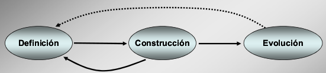

- ¿Qué se construye?. Tareas a realizar:
    - Ingeniería de sistemas.
    - Ingeniería de requisitos.
    - Planificación de proyectos.
- ¿Cómo se construye?. Tareas a realizar:
    - Diseño del software.
    - Generación del código.
    - Prueba del software.
- ¿Qué cambios?. Tareas a realizar:
    - Correción.
    - Adaptación.
    - Mejora.
    - Prevención.

### Esfuerzo requerido por etapas

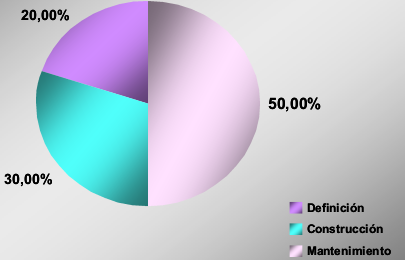

### Mantenimiento

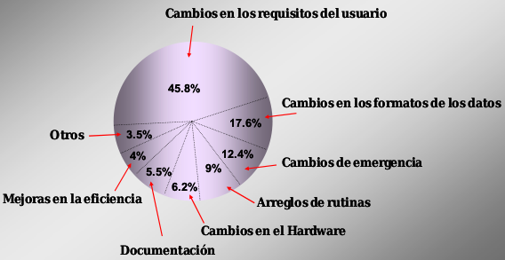

### Problemas

- Comunicación entre personas: clientes <-> desarrolladores.
- Incumplimiento de la planificación.
- Incorporar cambios en etapas avanzadas del proceso.

## El concepto de ingeniería del software

La **ingeniería del software** se propuso en 1968 para discutir la crisis del software como consecuencia del nuevo hardware. El software era muy complejo, grandes proyectos con años de retraso, coste del software mucho más de lo previsto, software poco fiable, difícil de mantener y de pobre ejecución. Se concluye en que se debe entender el problema antes de desarrollar una aplicación, el diseño es una actividad crucial, el software debe tener alta calidad y ser fácil de mantener. Por lo que debe hacerse ingeniería del software.

La **ingeniería del software** es el establecimiento y uso de principios fundamentales de ingeniería con objeto de desarrollar en forma económica software que sea fiable y trabaje con eficiencia en máquinas reales.

Otra definición es, la **ingeniería del software** es la aplicación práctica del conocimiento científico en el diseño y construcción de programas de computadora y la documentación asociada y requerida para el desarrollo, operación y mantenimiento de los programas.

Otra definición es, la **ingeniería del software** es la aplicación de un enfoque sistemático, disciplinado y cuantificable al desarrollo, operación y mantenimiento del software; es decir, aplicación de la ingeniería al software.

### Terminología usada en ingeniería del software

- **Sistema**: conjunto de elementos relacionados entre sí y con el medio, que forma una unidad o un todo organizativo.
- **Sistema basado en computadora**: conjunto o disposición de elementos organizados para cumplir una meta predefinida al procesar información.
- **Sistema software**: conjunto de piezas o elementos software relacionados entre si y organizados en subsistemas.
- **Modelos**: representación de un sistema en un determinado lenguaje.
- **Principios**: elementos adquiridos mediante el conocimiento, que definen las características que debe poseer un modelo para ser una representación adecuada del sistema.
- **Herramientas**: instrumentos que permiten la representación de modelos.
- **Técnicas**: modo de utilización de las herramientas.
- **Heurística**: conjunto de reglas empíricas, que al ser aplicadas producen modelos que se adecuan a los principios.
- **Métodos**: secuencia de actividades para la obtención de producto (modelo), que describen cómo usar las herramientas y las heurísticas.

## El proceso de desarrollo del software

El **proceso de desarrollo o ciclo de vida del software** es la estrategia que define la división y ubicación temporal de las **etapas** (o actividades) que se realizan durante el desarrollo del software.

Las **etapas** se caracterizan por las tareas que se realizan y por el producto (documento, artefacto...) que se obtiene.

Los **modelos (o paradigmas) de ciclo de vida del software** son representaciones abstractas (simplificadas) del proceso de desarrollo del software.

Existen diversos modelos según las etapas que se consideren, posición relativa de las mismas y las tareas a realizar en ellas.

Las **etapas principales** son:

- **Especificación de requisitos**: análisis del problema a resolver. Documento en el que se indica la funcionalidad del software y las restricciones sobre su operación.
- **Diseño**: búsqueda de una solución. Descripción de los componentes, sus relaciones y funciones.
- **Implementación**: traducción del diseño a un lenguaje de programación entendible por una máquina. El código.
- **Validación**: revisiones de todo lo que se ha obtenido junto con la prueba del código.
- **Mantenimiento y evolución**: reparación de fallos y adaptación a nuevos entornos.
- **Planificación**: estimación del tiempo y de los costes del desarrollo.

Los **modelos de ciclo de vida del software** son:

- **Modelo en cascada (o ciclo de vida clásico)**: considera las actividades de especificación, desarrollo, validación y evolución, y las representa como fases separadas del proceso. Características:
    - El resultado de cada fase es uno o más documentos aprobados.
    - Una fase no comienza hasta que finaliza la anterior.
    - No es un modelo lineal: existe retroalimentación de una fase a otra.
    - Iteraciones costosas y con rediseño significativo.
    - Es normal congelar partes del desarrollo. El sistema no hará lo que el usuario quiere. Sistemas mal estructurados.

    La **ventaja** es la producción de documentación en cada fase.
    
    El **problema** es que la división del proyecto en varias etapas es inflexible.
    
    Debe usarse cuando los requisitos sean bien comprendidos y sea poco probable que cambien durante el desarrollo del sistema.

    

    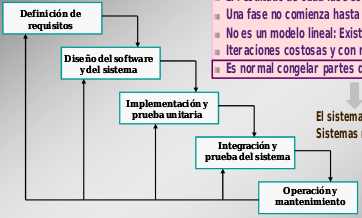
    

- **Desarrollo incremental**: intercala actividades de especificación, desarrollo y validación. El sistema se desarrolla como una serie de versiones (incrementos) y cada versión añade funcionalidad a la anterior. Admite feedback del cliente desde una fase temprana. Se genera poca documentación (el proceso no es visible), lo que dificulta el mantenimiento. Degradación de la estructura del sistema. Es preferible al modelo en cascada para proyectos pequeños. Las características son:
    - Se desarrolla una implementación inicial y se refina por medio de muchas versiones.
    - La especificación, es desarrollo y la validación están intercaladas con rápida retroalimentación.
    - Rara vez se trabaja por adelantado una solución completa: se avanza hacia ella y se retrocede si hay errores.
    - Resulta más barato y fácil realizar cambios en el software conforme se diseña.
    - Cada incremento incorpora alguna de las funciones que necesita el cliente. El cliente puede evaluar el desarrollo del sistema en una etapa relativamente temprana. Si el incremento actual no cumple lo requerido, solo se cambia dicho incremento.

    Las **ventajas** son:
      - Se reduce el costo de adaptar los requisitos cambiantes del cliente.
      - Es más sencillo obtener retroalimentación del cliente sobre el trabajo de desarrollo que se realizó.
      - Es más rápida la entrega e implementación de software útil al cliente.
    
    Los **problemas** son:
      - El proceso no es visible.
      - La estructura del sistema se degrada conforme se tienen nuevos incrementos.
    
    Los problemas son particularmente agudos para sistemas grandes, complejos y de larga duración, donde diversos equipos desarrollan diferentes partes del sistema. Es mejor que el modelo en cascada para la mayoría de los sistemas empresariales, de comercio electrónico y personales.

    

    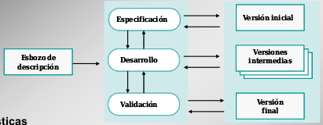
    

- **Ingeniería del software orientada a la reutilización**: se basa en la existencia de componentes reusables. El proceso de desarrollo se centra en integrar esos componentes en vez de desarrollarlos desde el principio. Dada una especificación de requisitos, se buscan los componentes más adecuados que implementen esa especificación. Se analizan los requisitos usando la información de los componentes encontrados y se realiza un diseño a partir de estos. Disminuye los costes y el tiempo de desarrollo. La principal desventaja es la pérdida de control sobre la evolución del sistema cuando las versiones de los componentes no están bajo el control de la organización que los usa. Las características son:
    - Análisis de componentes: dada la especificación de requisitos, se buscan los componentes que implementan esa especificación.
    - Modificación de requisitos: se analizan los requisitos usando la información de los componentes encontrados.
    - Diseño del sistema con reutilización: se diseña el marco conceptual del sistema o se reutiliza un marco existente.
    - Desarrollo e integración: se desarrolla el software que no se haya podido adquirir y se integran los componentes para crear el nuevo sistema.

    Las **ventajas** son:
      - Disminuye la cantidad de software que hay que desarrollar.
      - Disminuye los costes y los riesgos.
      - Conduce a entregas más rápidas.
    
    Los **problemas** son:
      - Se pierde control sobre la evolución del sistema cuando las versiones de los componentes no están bajo el control de la organización que los usa.
      - Los compromisos de requisitos son inevitables. Puede conducir a un sistema que no cubra las necesidades reales de los usuarios.

### Modelos orientados al cambio

Para evitar los costes del rehacer:

- **Evitar el cambio**: en el proceso de desarrollo se incluyen actividades que anticipan los posibles cambios antes de que se requieran.
- **Tolerancia al cambio**: el proceso de desarrollo se diseña de manera que lso cambios se ajusten con un coste relativamente bajo.

Formas de enfrentar el cambio:

- **Prototipo del sistema o desechable**: se desarrolla rápidamente una versión del sistema, o una parte, para comprobar los requisitos del cliente y la factibilidad de algunas decisiones de diseño. Es decir, es la versión inicial del software que se utiliza para demostrar los conceptos, probar las opciones de diseño y, de forma general, comprender mejor el problema y sus posibles soluciones. Se usa para contribuir a anticipar cambios en:
    - El proceso de ingeniería de requisitos: ayuda a la selección y validación de requisitos del sistema.
    - El proceso de diseño de sistemas: ayuda a buscar soluciones específicas y al diseño de interfaces de usuario.

    Modelo para el desarrollo de prototipos:

    

    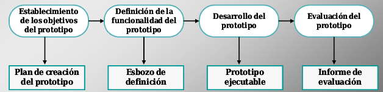
    

    Las **ventajas** son:
      - Obtener nuevas ideas para requisitos y describir fortalezas y debilidades del software.
      - Comprobar la factibilidad del diseño propuesto.
      - Participación del usuario final en el desarrollo de interfaces gráficas.
    
    Los **problemas** son:
      - Que el prototipo no se utilice de la misma forma que el sistema final.
      - Que el tiempo de capacitación durante la evaluación del prototipo sea insuficiente.
      - La entrega de un prototipo como versión final del software. No es aconsejable:
        - Puede ser imposible corregir el prototipo para cubrir requisitos no funcionales.
        - El cambio rápido significa que el prototipo no está documentado.
        - Es posible que los cambios degraden la estructura del sistema.
        - Se hacen más flexibles los estándares de calidad de la organización.

- **Entrega incremental o prototipo evolutivo**: los incrementos del sistema se entregan al cliente para su comentario y experimentación, lo que apoya tanto el hecho de evitar el cambio como de tolerarlo.

    Las **ventajas** son:
    - Los clientes pueden usar los primeros incrementos para adquirir experiencia que informe sobre sus requisitos para posteriores incrementos del sistema.
    - Los clientes deben esperar hasta la entrega completa del sistema, antes de ganar valor del mismo.
    - Debe ser relativamente sencillo incorporar cambios al sistema.
    - Los servicios más importantes del sistema reciben mayores pruebas.

    Los **problemas** son:
    - La mayoría de los sistemas requieren de una serie de recursos que se usan para diferentes partes del sistema.
    - El desarrollo iterativo resulta complicado cuando se diseña un sistema de reemplazo.
    - En los procesos iterativos la especificación se desarrolla en conjunto con el software.

    No es el mejor enfoque para algunos tipos de sistemas.
    - Sistemas muy grandes que son desarrollados por equipos que trabajan en diferentes ubicaciones.
    - Sistemas embebidos en los que el software depende del desarrollo del hardware.
    - Sistemas críticos en los que se analizan todos los requisitos para comprobar las interacciones que comprometen la seguridad y protección del sistema.

    

    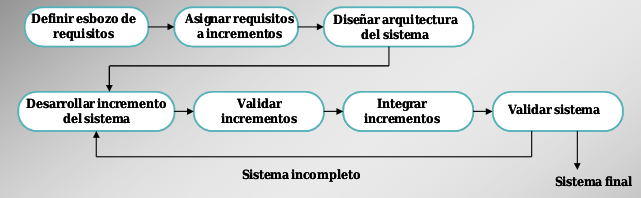
    

- **Proceso unificado**: es un modelo híbrido que apoya la creación de prototipos y la entrega incremental. Identifica cuatro fases en el proceso de desarrollo software:
    - **Concepción**: establecer un caso empresarial para el sistema. Se identifican las entidades externas que interactuarán con el sistema y se valora la aportación del sistema hacia la empresa.
    - **Elaboración** (modelo de requisitos para el sistema): desarrollar la comprensión del problema, establecer un marco conceptual arquitectónico para el sistema y diseñar el plan del proyecto e identificar los riesgos clave.
    - **Construcción** (sistema software funcionando y la documentación relacionada): incluye diseño, programación, integración de las partes del sistema que se han desarrollado en paralelo y pruebas del sistema.
    - **Transición** (sistema software documentado que funcione en un entorno operacional): se interesa por el cambio del sistema desde los desarrolladores al usuario y por poner el sistema a funcionar en una ambiente real.

    La iteración se apoya en dos formas

    

    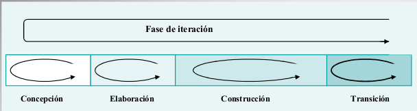
    

    Cada fase puede ser iterativa, con los resultados desarrollados incrementalmente. Todo el conjunto de fases puede expresarse de manera incremental. Se describe desde tres perspectivas:

    - **Dinámica**: muestra las fases del modelo a través del tiempo.
    - **Estática**: se enfoca en las actividades (flujos de trabajo) que tienen lugar durante el proceso de desarrollo.
        - **Flujos de trabajo de proceso**: modelado del sistema, requisitos, análisis y diseño, implementación, pruebas y despliegue.
        - **Flujos de trabajo de apoyo**: administración de la configuración y del cambio, administración del proyecto y entorno.
    - **Práctica**: describe las buenas prácticas de ingeniería del software en el desarrollo de sistemas. Las prácticas que se recomiendan son desarrollo de software de manera iterativa, gestión de requisitos, uso de arquitecturas basadas en componentes, modelado visual del software, verificar la calidad del software y controlar los cambios.

- **Métodos ágiles**: conjunto de métodos que enfatizan el enfoque iterativo, la adaptabilidad del proceso y la colaboración, reduciendo al mínimo la documentación y los procedimientos. Las características son:
    - La medida del progreso es el software desarrollado y funcional.
    - La documentación es la del código junto con el diseño de dicho código.
    - No hay una estructura organizativa rígida en el equipo de desarrollo.
    - El proceso debe ser capaz de cambiar para adaptarse a las necesidades o requisitos nuevos que aparezcan en las iteraciones.

    Funcionan bien para equipos pequeños y son útiles cuando se necesita que el proceso se adapte rápidamente.

    Surgieron debido a que los expertos se preguntaron ¿por qué tantos proyectos de desarrollo de software no se terminan a tiempo, cuestan más de lo presupuestado originalmente, tienen problemas serios de calidad y generan menor valor del esperado? Como respuesta, elaboraron el **manifiesto ágil**.

\newpage 

# Tema 2. Ingeniería de requisitos

## Introducción al modelado de requisitos

La **ingeniería de requisitos** son todas las actividades relacionadas con:

- Identificar y documentar las necesidades del cliente.
- Analizar la viabilidad de las necesidades.
- Negociar una solución razonable.
- Crear un documento que describa un software que satisfaga las necesidades.
- Analizar y validar el documento.
- Controlar la evolución de las necesidades.

La **ingeniería de requisitos** es el proceso de construcción de una especificación de requisitos en el que partiendo de especificaciones iniciales se llega a especificaciones finales completas, documentadas y validadas.

Hay que tener en cuenta los siguientes factores:

- La complejidad del problema a resolver.
- La forma de identificar los requisitos por parte del cliente.
- Dificultades de comunicación entre desarrolladores y usuario.
- Dificultades de comunicación entre los miembros del equipo de desarrolladores.
- Requisitos que no se pueden obtener del cliente y los usuarios.
- Naturaliza cambiante de los requisitos.

Ninguna otra parte del desarrollo afecta tanto al sistema resultante si se lleva a cabo de manera incorrecta. Ninguna, de hecho, es más difícil de modificar a posteriori si se hizo mal en un principio.

Un **requisito** es una propiedad que un software desarrollado o adaptado debe tener para resolver un problema concreto, además, es la capacidad que debe alcanzar o poseer un sistema, o componente de un sistema, para satisfacer un contrato, estándar, especificación u otro documento formal. El **atributo de un requisito** es cualquier información complementaria que se utiliza para su gestión y que se incluye en su especificación: descripción general del requisito, tipo de requisito, fuente del requisito e historia de cambios.

### Actividades de los requisitos

Dividimos las actividades de requisitos en 4 fases.

- **Estudio de viabilidad** (etapa previa): ¿es conveniente realizar el desarrollo del sistema/software?, ¿soluciona el software los problemas existentes en el sistema?, ¿se puede desarrollar con la tecnología actual?, ¿se puede desarrollar con las restricciones de costo y tiempo?, ¿puede integrarse con otros sistemas de la organización?

    

    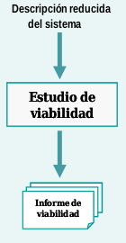
    

- **Obtención de requisitos**: capturar el propósito y funcionalidades del sistema desde la perspectiva del usuario para delimitar las fronteras del sistema y elaborar un glosario de términos. Es un proceso difícil apoyado por entrevistas, casos de uso, prototipado y análisis etnográfico. Genera los documentos de las entrevistas, una lista estructurada de requisitos, diagramas de casos de uso, plantillas y diagramas de actividad.
  
    

    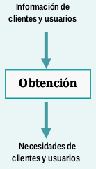
    

- **Análisis de requisitos**: proceso de estudiar las necesidades del usuario para obtener una definición detallada de los requisitos. Esto incluye detectar conflictos entre requisitos, clasificar los requisitos, negociación, creación del modelo conceptual y establecimiento de las bases del diseño. Esto conlleva al estudio de soluciones. Es la actividad más importante de todas.

    

    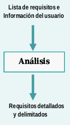
    

- **Especificación de requisitos**: proceso de documentar el comportamiento requerido de un sistema software, a menudo utilizando una notación de modelado u toro lenguaje de especificación. Incluye detallar los requisitos, modelo formal, casos de uso y prototipo. Genera el modelo arquitectónico (subsistemas) para el diagrama de paquetes, el modelo estático (conceptual) para el diagrama de clases y el modelo dinámico (funcional) para el diagrama de secuencia y contratos.

    

    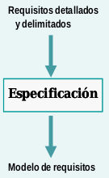
    

- **Validación de requisitos**: examinar los requisitos para asegurarse de que definen el sistema que el cliente y los usuarios desean. Para facilitar este proceso se pueden crear prototipos o simulaciones, hacer revisión automática (técnicas formales) o usar herramientas. Lo es lo mismo validación que verificación. En la **verificación** se comprueba el correcto funcionamiento de un requisito en el sistema desarrollado.

    

    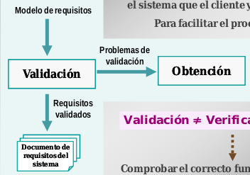
    

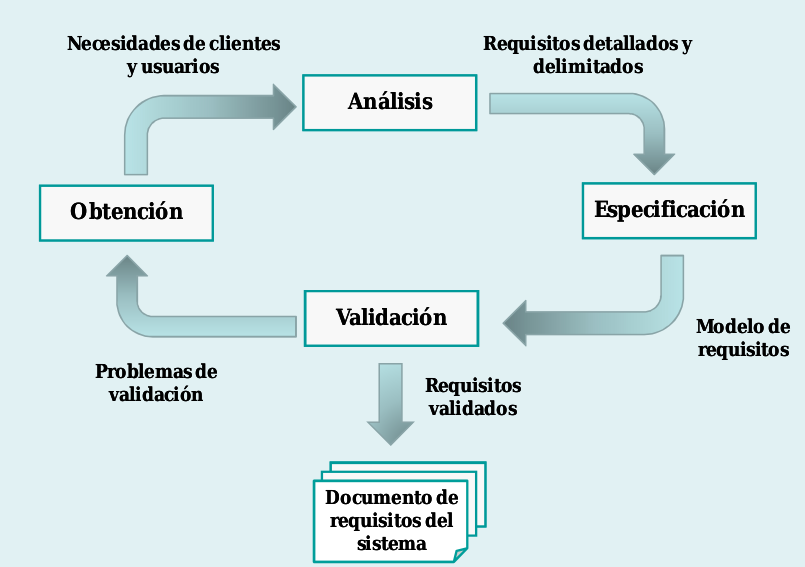

### Actores

Un **actor** es cada uno de los diferentes roles que pueden desempeñar la misma o distintas personas según el punto de desarrollo en el que se encuentre el sistema software.

Los **usuarios** son un grupo heterogéneo que comprende a todos aquellos que operan con el software.

Los **clientes** son aquellos que tienen interés en adquirir el software o representan al mercado potencial.

Los **analistas de mercado** son personas especializadas en recabar las posibles necesidades del mercado y que obtienen requisitos a través de clientes potenciales.

Los **reguladores** son autoridades específicas encargadas de hacer cumplir normativas estrictas o requisitos legales.

Los **ingenieros de software** son personas que se encargan de plantear y desarrollar soluciones de compromiso que satisfagan todos los involucrados en un proyecto software.

### Propiedades de los requisitos

Para que sean de calidad tienen que ser:

- **Completos**: todos los aspectos del sistema están representados en el modelo de requisitos.
- **Consistentes**: los requisitos no se contradicen entre sí.
- **No ambiguos**: no es posible interpretar los requisitos de dos o más formas diferentes.
- **Correctos**: representan exactamente el sistema que el cliente necesita y que el desarrollador construirá.
- **Realistas**: los requisitos se pueden implementar con la tecnología y presupuesto disponible.
- **Verificables**: se pueden diseñar pruebas para comprobar que el sistema satisface los requisitos.
- **Trazables**: debe ser posible hacer un seguimiento de cada requisito que permita conocer su estado (especificado, verificado, analizado...) en cada momento del desarrollo.
- **Identificables**: cada requisito debe tener un identificador único que lo distinga y que permita hacer referencia a él en cualquier punto del ciclo de vida del software sin ambigüedad.
- **Cuantificables**: es deseable que se pueda medir el grado de cumplimiento de un requisito en términos precisos.

### Tipos de requisitos

- **Funcionales**: especifican las funciones que un sistema, o componente de un sistema, debe ser capaz de llevar a cabo.
- **No funcionales**: especifican los aspectos técnicos que debe incluir un sistema. Pueden clasificarse en:
    - **Restricciones**: limitaciones a las que se enfrentan los desarrolladores del sistema.
    - **Cualidades**: características de un sistema que importan a los clientes y usuarios del mismo.

    Otra clasificación más amplia identifica tres categorías:

    - **Requisitos del producto**: detallan limitaciones o comportamientos exigidos al producto resultante del desarrollo. Por ejemplo: cantidad de memoria requerida o velocidad de respuesta en operaciones interactivas.
    - **Requisitos de la organización**: relacionadas con normativas de funcionamiento de la organización que lleva a cabo el desarrollo, sus procedimientos y políticas. Por ejemplo: estándares de desarrollo, documentación a entregar, plazos de entrega...
    - **Requisitos externos**: cubren aspectos externos al sistema y a su proceso de desarrollo. Por ejemplo: interoperabilidad con otros sistemas, requisitos legales...

    La clasificación FURPS+ es:

    - **Facilidad de uso (usability)**: factores humanos, ayuda, documentación.
    - **Fiabilidad (reliability)**: frecuencia de fallos, disponibilidad, capacidad de recuperación de un fallo y grado de previsión.
    - **Rendimiento (performance)**: tiempos de respuesta, productividad, precisión, velocidad, uso de los recursos.
    - **Soporte (supportability)**: adaptabilidad, facilidad de mantenimiento, internacionalización, configurabilidad.
    - **+**: restricciones físicas, de diseño, de implementación y de interfaz.
- **De información**: describen necesidades de almacenamiento de información del sistema.

Ejemplos de requisitos:

- Imprimir los contratos de alquiler
- Realizar un seguimiento, por cliente, del estado de los pagos
- El software se tiene que desarrollar de manera que se pueda ejecutar sobre diferentes plataformas
- Guardar información de ventas y clientes
- El sistema debe estar disponible al menos el 95% de cada período de 24 horas
- Almacenar información relativa a los contratos de alquiles en vigor
- Gestionar el inventario de productos en venta y en alquiler
- El registro de datos personales debe cumplir la Ley Orgánica española 15/1999 de Protección de Datos de Carácter Personal

## Obtención de requisitos

Determinar cuáles son los requisitos del sistema a desarrollar para llegar aun conocimiento suficiente del problema a resolver.

Determina **fuentes de información**:

- **Objetivos generales o de alto nivel del software**: constituyen el motivo fundamental por el que el desarrollo se lleva a cabo.
- **Dominio del problema**: del cual, el ingeniero software puede tener un conocimiento limitado, pero otros actores pueden poseer información valiosa.
- **Actores del proceso**: puntos de vista diferentes tanto de la organización como del software a desarrollar.
- **Entorno de operación**: permitirá establecer las restricciones del proyecto y los costes que comportarán.
- **Entorno de organización**: al que debe adaptarse el software.

Establece **técnicas de obtención de requisitos**:

- **Entrevistas**: visitas al cliente o a los usuarios, cuestionarios, encuestas, entrevistas estructuradas formales o informales que pueden ser cerradas.
- **Escenarios**: herramienta para contextualizar los requisitos (casos de uso de UML).
- **Prototipos**: pueden servir para clarificar requisitos confusos u obtener algunos que se hayan pasado por alto.
- **Reuniones de grupo**: Permiten aunar esfuerzos y conseguir entre varios lo que es difícil de alcanzar individualmente.
- **Observación**: permite aprender cómo se llevan a cabo las tareas de usuario.
- **Otras**: estudio de documentos y formularios actualmente en uso, visitas a otras instalaciones similares, presentaciones comerciales, estudio de productos...

*Ejemplo. En un plan de estudios de una titulación universitaria, hay una asignatura denominada “proyectos”. Para aprobar dicha asignatura el alumno tiene que realizar un trabajo práctico, en el que resuelve un determinado problema aplicando los conocimientos adquiridos durante su formación.*

*Durante la realización del proyecto (trabajo) el alumno recibe la dirección tutelada de un profesor. Para ello, los profesores definen una serie de proyectos a realizar, los alumnos indican sus preferencias y finalmente se les adjudica un proyecto determinado, de entre sus elegidos, en función de un determinado baremo.*

*El proceso sería el siguiente:*

1. *Los alumnos se matriculan de la asignatura “proyectos informáticos”*
2. *Los profesores definen los contenidos de sus proyectos, dando el título del proyecto, las asignaturas recomendadas, el número de alumnos requerido para su realización y una descripción general del mismo*
3. *A continuación, cada alumno elige entre 1 y 10 proyectos de los ofertados. A cada una de sus elecciones le asigna una prioridad*
4. *Una vez terminada la elección se asigna un proyecto a cada uno de los alumnos, teniendo en cuenta el siguiente baremo: suma de la nota media del expediente y la nota media de las asignaturas recomendadas en el proyecto (que hayan sido cursadas por el alumno)*

*Restricciones a tener en cuenta:*

- *Un proyecto puede ser asignado como máximo a tres alumnos*
- *No puede quedar ningún alumno sin proyecto*
- *Puede haber proyectos sin alumnos*
- *Un profesor puede definir más de un proyecto*
- *Un alumno sólo puede ser asignado a un proyecto*

*Los objetivos son: *

- *Llevar la gestión de los proyectos ofertados en la asignatura de proyectos informáticos*
- *Realizar una asignación automática de los proyectos a los alumnos según la prioridad con la que fueron seleccionados*
- *Gestionar toda la información asociada a los proyectos*

*Los requisitos funcionales son:*
 
- *Dar de alta un proyecto*
- *Asignar proyectos a los alumnos*
- *Dar de alta el expediente de un alumno*
- *Seleccionar proyectos para un alumno*
- *Requisitos no funcionales*
- *Implantar un método de asignación “justo”*
- *Mantener el acceso a la información del alumno controlado*
- *Permitir la entrada de información de los proyectos vía Web*

El **proceso de obtención de los requisitos** es el siguiente:

1. Obtener información sobre el dominio del problema y el sistema actual.
    - Conocer el vocabulario propio.
    - Conocer las características principales del dominio.
    - Recopilar información sobre el dominio.
    - Facilitar la comprensión de las necesidades del sistema.
    - Favorecer la confianza del cliente.

    Se genera la **introducción al sistema y glosario de términos**.
2. Preparar las reuniones de elicitación y negociación.
    - Identificar a los implicados.
    - Conocer las necesidades de clientes y usuarios.
    - Resolver posibles conflictos.

    Se genera la **documentación obtenida**.

    *Ejemplo. Videoclub: descripción de implicados*

    

    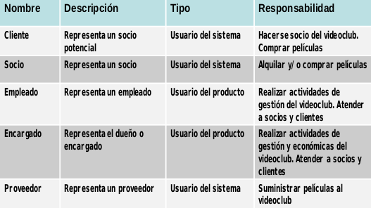
    

    

    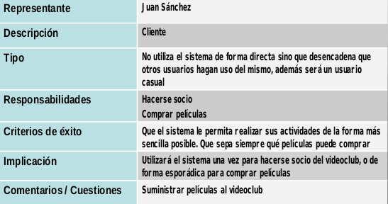
    

    

    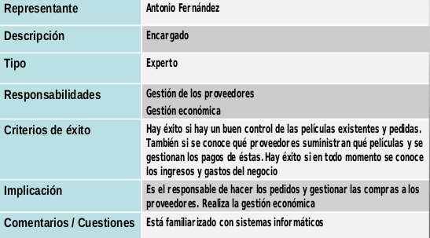
    

    *Necesidades principales de implicados*

    

    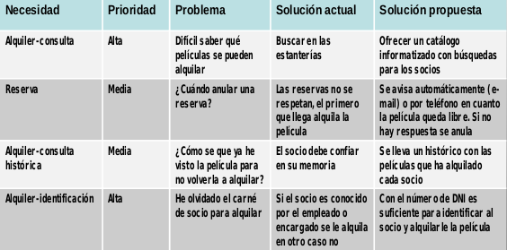
    

3. Identificar y revisar los **objetivos del sistema**.
    - Objetivos que se desean alcanzar una vez que el software esté en explotación.
    - Si el sistema es suficientemente complejo se puede realizar una jerarquía de objetivos.
    - De cada objetivo se puede describir su:
        - **importancia** (vital, importante o quedaría bien).
        - **urgencia** (inmediata, hay presión o puede esperar).
        - **estado** durante el desarrollo (en construcción, pendiente de solución, pendiente de negociación, validado).
        - **estabilidad** (alta, media baja).

    *Ejemplo. Videoclub: objetivos del sistema*
      
      - *OBJ -1: el sistema deberá almacenar y gestionar la información relativa a las películas existentes en el video club tanto para alquilar como para vender.*
      - *OBJ -2: el sistema automatizará todas las actividades relacionadas con los socios del videoclub.*
      - *OBJ -3: se podrá utilizar el sistema durante las actividades de alquiler y devolución de películas.*
      
4. Identificar y revisar los **requisitos de información**. Información relevante para el cliente que debe gestionar y almacenar el sistema software. De cada requisito se puede describir:
    - Objetivos y requisitos asociados.
    - Descripción del objetivo.
    - Contenido.
    - Tiempo de vida (medio y máximo).
    - Ocurrencias simultáneas.
    - Importancia, urgencia, estado y estabilidad.

    *Ejemplo. Videoclub: requisitos de información*

    - *RI-1*
        - *Películas en alquiler: descripción de cada una de las cintas disponibles en el videoclub para alquilar.*
        - *Contenido: título de la película, número de copias existentes, número de copias disponibles, tipo de película, duración, información sobre la película (director, actores, productor, año, descripción), reservada.*
        - *Requisitos asociados: RF-1.1, 1.3, 1.4, 3.3, 3.4*
    - *RI-2*
        - *Películas en venta: información sobre cintas que ya se han alquilado un número suficiente de veces como para poder ponerlas en venta.*
        - *Contenido: igual que el de películas en alquiler, pero se le añade para cada copia el precio.*
        - *Requisitos asociados: RF-1.4*
    - *RI-3*
        - *Pedidos: pedidos que se han realizado y que todavía no han llegado*
    - *RI-4*
        - *Socios: información sobre los socios que actualmente forman parte del videoclub*
        - *Contenido: número de socio, DNI, datos personales, fecha de alta como socio, lista de películas alquiladas en cada momento* 
        - *Requisitos asociados: RF-2.1, 2.2.1, 2.2.2, 2.3, 2.4*
    - *RI-5*
        - *Cuentas de socios: almacenamos información sobre las distintas transacciones que cada uno de los socios ha hecho con el videoclub desde que se hizo socio*
        - *Contenido: saldo en la cuenta, ingresos que ha realizado (cantidad y fecha), pagos que tiene pendientes*
        - *Requisitos asociados: RF-2.5.1, 2.5.2, 2.5.3, RNF-3*
    - *RI-6*
        - *Proveedores: información sobre los distintos proveedores que pueden usarse para pedir nuevas películas*
5. Identificar y revisar los **requisitos funcionales** (RF). De cada requisito se puede describir:
    - Objetivo y requisitos asociados.
    - Secuencia de acciones.
    - Frecuencia de uso (número de veces / unidad de tiempo).
    - Rendimiento (cotas de tiempo).
    - Importancia, urgencia, estado y estabilidad.

    *Ejemplo. Videoclub: requisitos funcionales*

    

    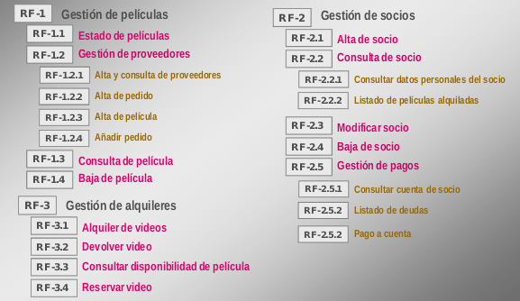
    

6. Identificar y revisar los **requisitos no funcionales**. Restricciones de las funciones descritas en la actividad anterior. De cada requisito se puede describir:
    - Objetivos y requisitos asociados.
    - Su importancia, urgencia, estado y estabilidad.
    
    Algunos requisitos no funcionales importantes son:
    
    - Relacionados con facilidad de uso
    - Relacionados con fiabilidad (solidez y fiabilidad)
    - Relacionados con rendimiento
    - Relacionados con el soporte (facilidad de mantenimiento y portabilidad)
    - Relacionados con la implementación
    - Relacionados con la interfaz
    - Relacionados con la operación (quién gestiona el sistema)
    - Relacionados con el empaquetado (instalación del sistema)
    - Requisitos legales

    *Ejemplo. Videoclub: requisitos no funcionales*

    - *RNF-1: necesitamos que toda la información que se almacena sobre el videoclub se mantenga segura, realizando copias de seguridad periódicas.*
    - *RNF-2: debido al tamaño del videoclub y a la disponibilidad de dos encargados, sería conveniente poder disponer de dos terminales para, al menos, poder realizar el proceso de alquilar y vender películas*
    - *RNF-3: es necesario controlar qué personas pueden acceder a las funciones de gestión de las cuentas de los socios*

Se genera una **lista estructurada de requisitos**.

### Técnicas de entrevista

Las **técnicas de entrevista** son técnicas encaminadas a obtener información sobre el sistema mediante el diálogo con los expertos en el dominio del problema.

Las **fases** de una entrevista son:

- **Planificación**: clarificar cuáles son los datos que se desean obtener, determinado qué personas deben entrevistar, cuándo y en qué lugar.
- **Preparación**: preparar las preguntas e informarse sobre las funciones, personalidad y cargo de la persona que se va a entrevistar, se fija el día, hora y lugar de la entrevista...
- **Inicio**: exposición general de cómo se desarrollará la entrevista, sus objetivos, duración estimada, utilidad. Se solicita colaboración y autorización para tomar notas.
- **Desarrollo**: fase central de la entrevista que consiste en la realización de preguntas por parte del entrevistador y la contestación de las mismas por parte del entrevistado.
- **Cierre**: fase en la que se resume la información anotada y se comprueba que contamos con toda la información solicitada.
- **Conclusiones**: elaboración de un resumen formal de la entrevista.

Los **tipos de preguntas** son:

- Sobre detalles específicos
- Sobre la visión de futuro que el entrevistado tiene sobre algo
- Sobre ideas alternativas
- Sobre una solución mínimamente aceptable
- Acerca de otras fuentes de información

Las **limitaciones** son:

- Técnica que requiere mucho tiempo
- La información a obtener depende de las preguntas realizadas
- Las contradicciones en la información aportada por diferentes entrevistados son difíciles de resolver
- Lo que los usuarios dicen que hacen no siempre es lo hacen
- Timidez (relación cara a cara)

Los **beneficios** son:

- Proporcionan información de primera mano
- Se puede solicitar al entrevistado tanto nivel de detalle como sea necesario
- Permite localizar áreas en las que profundizar
- Los clientes se sienten involucrados
- Los clientes formulan problemas y pueden aportar soluciones

### Técnicas etnográficas

Las **técnicas etnográficas** son técnicas de observación que se usan para entender los procesos operacionales y ayudar a derivar requisitos sociales y de organización, de apoyo a dichos procesos.  Son efectivas para dos tipos de requisitos:

- Requisitos que se derivan de la forma en que realmente trabaja la gente.
- Requisitos derivados de la cooperación y el conocimiento de las actividades de otras personas.

No es un enfoque completo, tiene que apoyarse en otras técnicas (entrevistas, prototipos, casos de uso, ...).

## Modelado de casos de uso

El **modelado de casos de uso** es la técnica de ingeniería de requisitos que permite delimitar el sistema a estudiar, determinar el contexto de uso del sistema y describir el punto de vista de los usuarios del sistema. Se usa durante las distintas fases del desarrollo para

- Obtención y análisis de requisitos.
- Especificación de requisitos.
- Utilizarlo como base en el proceso de diseño y su validación.
- Guiar el diseño de la interfaz de usuario y facilitar la construcción de prototipos.
- Probar el software y asegurar la calidad durante el proceso de desarrollo.
- Considerarlo como punto de inicio de las ayudas en línea y el manual del usuario.

Elementos que componen el modelo de casos de uso:
- Actores
- Casos de uso
- Relaciones entre actores, actores y casos de uso y casos de uso.

Para la representación y descripción de estos elementos se utilizan **diagramas de casos de uso** de UML y **plantillas** estructuradas para los actores y casos de uso.

### Diagrama de casos de uso

El **diagrama de casos de uso** es un diagrama UML que representa gráficamente todos los elementos que forman parte del modelo de casos de uso junto con la frontera del sistema.

### Actores

Un **actor** es una abstracción de entidades externas al sistema que interactúan directamente con él. Especifican roles que adoptan esas entidades externas cuando interactúan con el sistema. Una entidad puede desempeñar varios roles simultáneamente a lo largo del tiempo. Un rol puede ser desemepeñado por varias entidades. La notación para un actor es `<<actor>> Nombre`. El nombre del rol debe ser breve y tener sentido desde la perspectiva del negocio.

Existen varios **tipos** de actores:

- **Principales**: además de interactuar con el caso de uso, lo activan.
- **Secundarios**: interactúan con el caso de uso pero no lo activan.

Los **actores** pueden ser

- **Personas**: con el rol de usuario en el sistema.
- **Dispositivos de entrada/salida**: sensores, medidores... siempre que sean independientes de la acción de un usuario.
- **Sistemas de información externos**: con los que el sistema se tiene que comunicar.
- **Temporizador o reloj**: cuando se hace algo como respuesta a un evento de tiempo de tipo periódico o en un momento determinado, sin que haya un actor que lo active

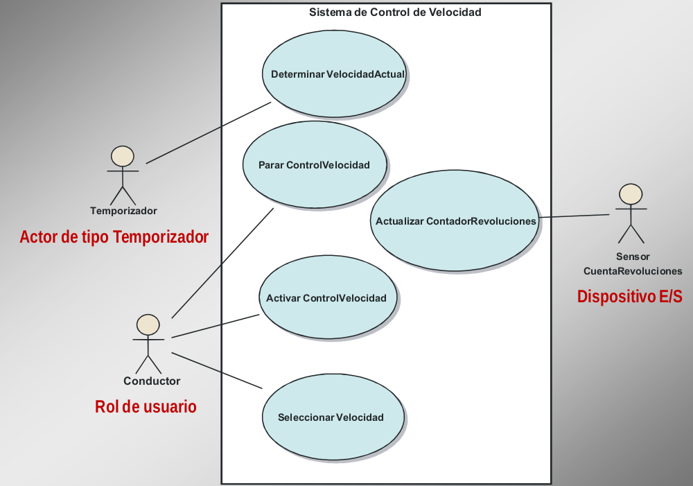

Identificación de actores: responder a las preguntas

- ¿Quién y qué utiliza el sistema?
- ¿Qué roles desempeñan en la interacción?
- ¿Quién instala el sistema?
- ¿Quién o qué inicia y cierra el sistema?
- ¿Quién mantiene el sistema?
- ¿Qué otros sistemas interactúan con el sistema?
- ¿Quién o qué proporciona información al sistema?

La **relación entre actores**, en general, expresa un comportamiento común entre actores, es decir, se relacionan de la misma forma con los mismos casos de uso.

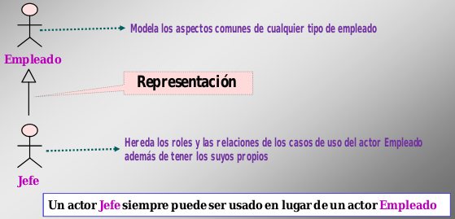

### Casos de uso

Un **caso de uso** especifica la secuencia de acciones, incluidas secuencias variantes y de error, que un sistema o subsistema puede realizar al interactuar con actores externos. La **notación** es la siguiente:

El nombre debe ser una frase verbal descriptiva y breve.

Dependiendo de su importancia pueden ser:

- **Primarios**: procedimientos comunes más importantes (procesos de negocio).
- **Secundarios**: procesos de error o poco comunes (procesos internos).
- **Opcionales**: puede que no se implementen.

Las características son:

- Son iniciados por un actor que, junto con otros actores, intercambian datos o control con el sistema a través de él.
- Son descritos desde un punto de vista de los actores que interactúan con él.
- Describen el proceso de alcance de un objetivo de uno o varios actores.
- Tienen que tener una utilidad concreta para algún actor.
- Acotan una funcionalidad del sistema.
- Describen un fragmento de la funcionalidad del sistema de principio a fin, y tienen que acabar y proporcionar un resultado.
- Se documentan con texto informal.

*Ejemplo de caso de uso. Elegir proyecto.*

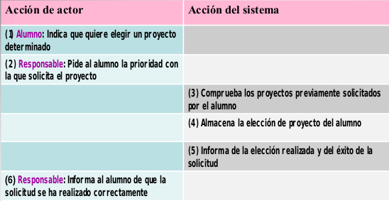

Identificación de casos de uso: responder a las preguntas.

- ¿Qué objetivos o necesidades tendrá un actor específico del sistema?
- ¿El sistema almacena y recupera información?
Si es así, ¿qué actores activan este comportamiento?
- ¿Qué sucede cuando el sistema cambia de estado (p. e., al iniciar o detener el sistema)? ¿Se notifica a algún actor?
- ¿Afecta algún evento externo al sistema?
- ¿Qué notificará sobre estos eventos?
- ¿Interactúa el sistema con algún sistema externo?
- ¿Genera el sistema algún informe?

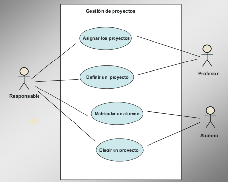

### Descripción de actores

La plantilla es la siguiente:

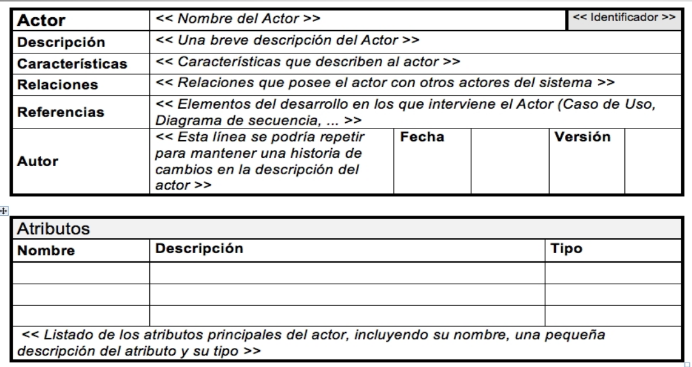

*Ejemplo. Actor Profesor*

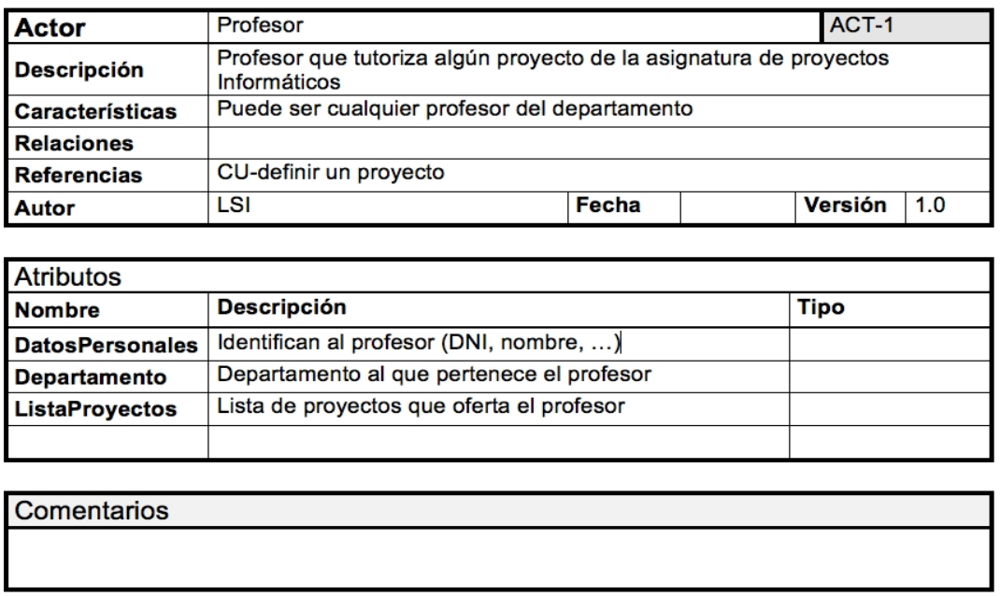

### Descripción de casos de uso

El **contenido** es el siguiente:

- **El inicio**: cuándo y qué actor lo produce.
- **El fin**: cuándo se produce y qué se obtiene.
- **La interacción**: qué mensajes intercambian los actores y el sistema.
- **El objetivo**: para qué se usa o qué intenta el caso de uso.
- **Cronología y origen de las interacciones**.
- **Repeticiones de comportamiento**: qué acciones se repiten.
- **Situaciones opcionales o de error**: qué situaciones alternativas se presentan en el caso de uso.

Hay varios **tipos** de descripciones:

- **Dependiendo de procesamiento**.
    - **Básico**: descripción general del procesamiento.
    - **Extendido**: descripción de la secuencia completa de acciones entre actores y sistema.
- **Dependiendo de su nivel de abstracción**.
    - **Esencial**: expresado de forma abstracta.
    - **Real**: expresado en base al diseño actual, en el que aparecen relaciones con la interfaz de usuario.

*Ejemplo. Plantilla: descripción básica*

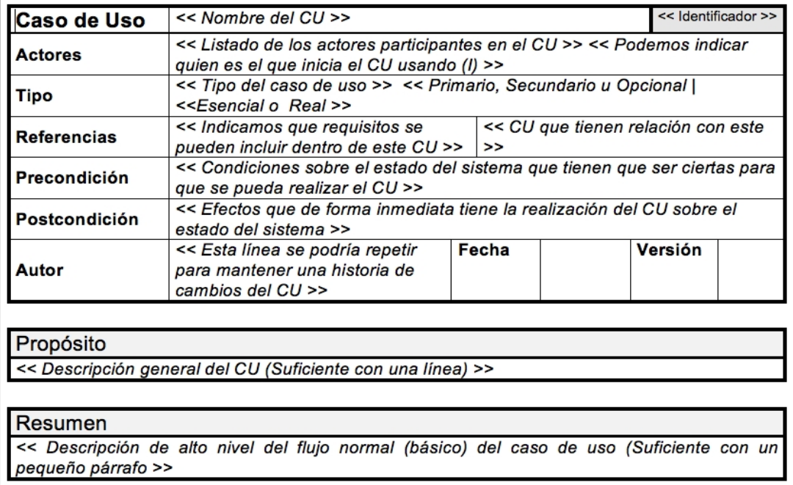

- *Caso de uso: elegir un proyecto.*
- *Actores: Alumno (iniciador), Responsable.*
- *Tipo: Primario, Esencial.*
- *Precondición: el alumno está matriculado en la asignatura de proyectos informáticos.*
- *Propósito: el alumno selecciona un posible proyecto de los ofertados en la asignatura.*
- *Resumen: el alumno informa que quiere seleccionar un proyecto, indica la prioridad con la que realiza la selección y se almacena su interés por el proyecto.*

Un **escenario** es una secuencia específica y concreta de acciones e interacciones entre los actores y el sistema objeto de estudio (historia particular). Tipos de escenarios:

- **Básico**: se corresponde con la funcionalidad básica y normal del caso de uso.
- **Secundarios**: se corresponde con funcionalidades alternativas y situaciones de error.

*Ejemplo. Plantilla: descripción extendida.*

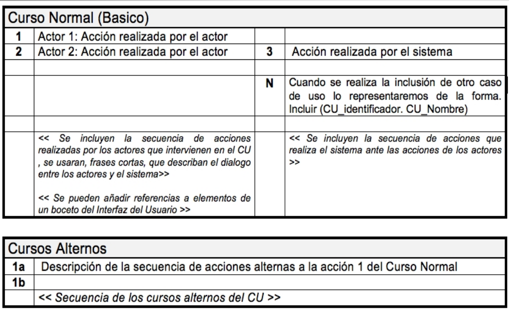

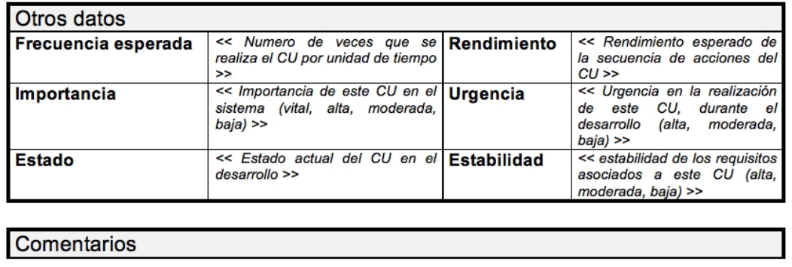

*Ejemplo de descripción extendida. Elegir proyecto*

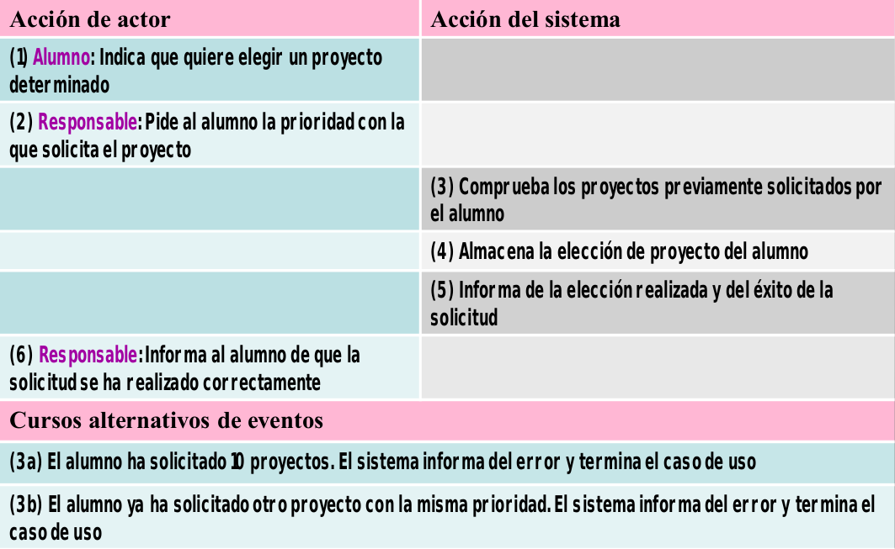

### Relaciones en el modelo de casos de uso

Los tipos de relaciones son:

- **Asociación**: comunicación entre un actor y un caso de uso en el que participa.

    

    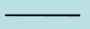
    

- **Inclusión**: inserción de comportamiento adicional dentro del caso de uso base que explícitamente hace referencia al caso de uso de inclusión.

    

    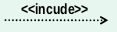
    

- **Extensión**: inserción de fragmentos de comportamiento adicional sin que el caso de uso base sepa de los casos de uso de extensión.

    

    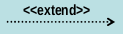
    

- **Generalización**: relación entre un caso de uso general y otro más específico, que hereda y añade características al caso de uso general.

    

    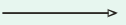
    

Las características de la relación de **inclusión** son:

- Relación de dependencia que permite **incluir el comportamiento** de un caso de uso en el flujo de otro caso de uso.
- El caso de uso que incluye se denomina **caso de uso base** y al incluido, **caso de uso de inclusión**.
- El caso de uso base se ejecuta hasta que alcanza el punto en el que encuentra la referencia al caso de uso de inclusión, momento en el que se pasa la ejecución a dicho caso. Cuando este se termina, en control regresa al caso de uso base.
- El caso de uso de inclusión es **utilizado completamente** por el caso de uso base.
- El caso de uso base **no está completo** sin todos sus casos de uso de inclusión.
- El caso de uso de inclusión puede ser **compartido** por varios casos de uso base.
- El caso de uso de inclusión **no es opcional** y es necesario para que tenga sentido el caso de uso base.

Usar relaciones de inclusión para comportamientos que se comparten entre dos o más casos de uso, o bien para separar un caso de uso en subunidades.

*Ejemplo. Relación de inclusión*

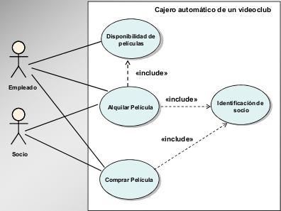

*Ejemplo. Plantilla: alquiler película*

Las características de la relación de **extensión**:

- Relación de dependencia que especifica que el comportamiento de un caso de uso base puede ser **extendido** por otro caso de uso bajo determinadas **condiciones**.
- El caso de uso base declara uno o más **puntos de extensión** que son como enganches en los que se pueden añadir nuevos comportamientos.
- El caso de uso de extensión define segmentos de inserción los cuales se pueden insertar en esos puntos de enganche cuando se cumpla una determinada condición.
- El caso de uso base no sabe nada de los casos de uso de extensión y está **completo** sin sus extensiones; de hecho, los puntos de extensión no tiene numeración en el flujo de eventos del caso de uso base.
- El caso de uso de extensión no tiene sentido de forma **separada** de un caso de uso base.

Usar relaciones de extensión para comportamientos excepcionales, opcionales o que rara vez ocurren.

La notación de extensión es:

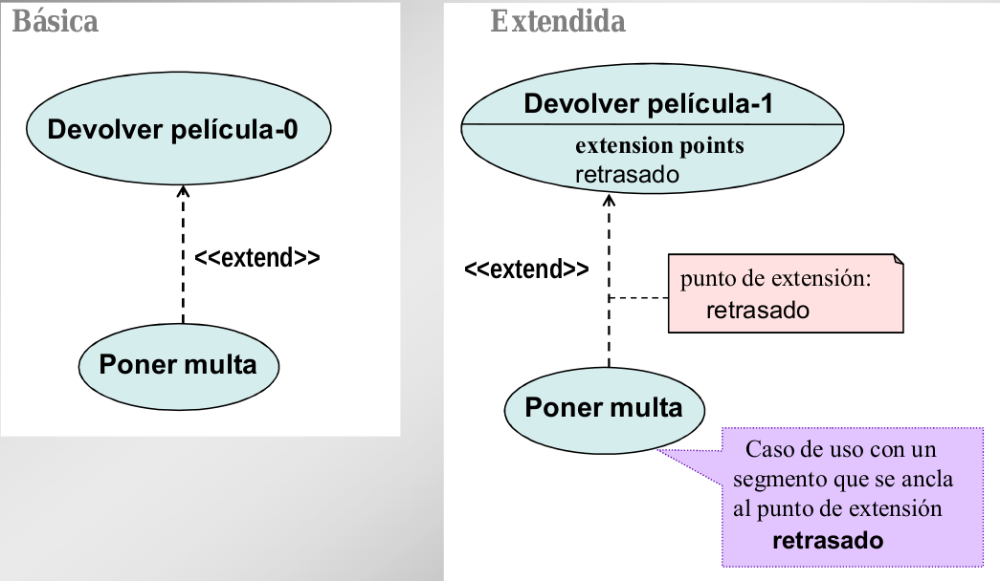

*Ejemplo. Plantilla*

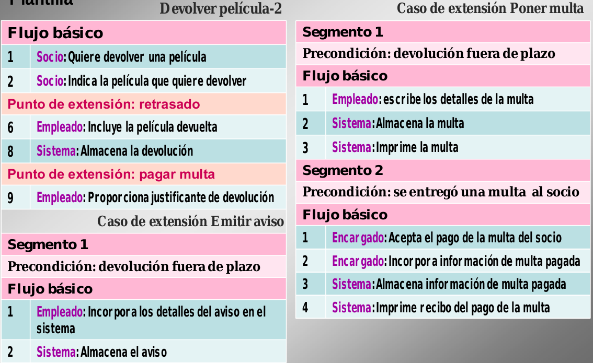

Características de la relación de **generalización**:

- Es una relación entre un caso de uso general (caso de uso padre) y otros más especializados (casos de uso hijo).
- Los casos de uso hijos heredan todas las características del caso de uso general, pueden añadir nuevas características y anular características del caso de uso general, salvo relaciones, puntos de extensión y precondiciones.

La notación de generalización es:

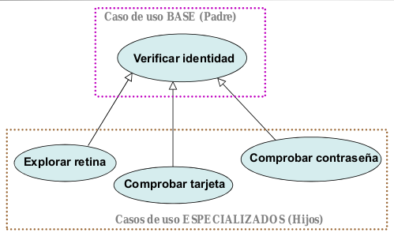

*Ejemplo. Generalización*

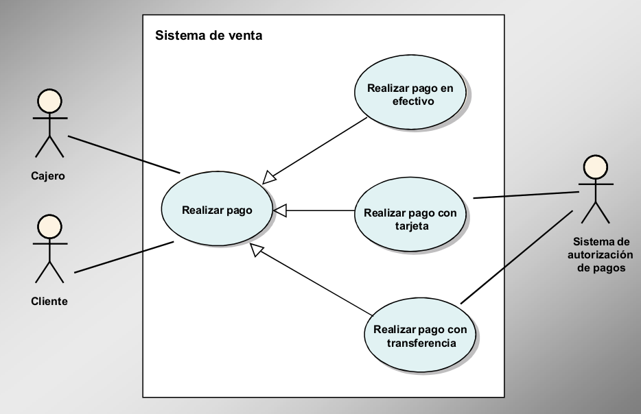

Recomendaciones de uso de las relaciones:

- Usar las relaciones entre casos de uso cuando simplifiquen el modelo.
- Un **uso sencillo de modelo de casos** de uso es preferible a uno con demasiadas relaciones, ya que son más fáciles de entender.
- El uso de muchos `<<include>>` hace que se tenga que ver más de un caso de uso para tener una idea completa.
- Las relaciones `<<extend>>` son complejas y difíciles de entender para la comunidad de usuarios/clientes.
- La **generalización** de casos de uso debería **evitarse** a menos que se utilicen casos de uso padres abstractos.

### Proceso de construcción de casos de uso

1. Identificación de los actores.
2. Identificación de los principales casos de uso de cada actor.
    - ¿Cuáles son las tareas principales que realiza cada actor?
    - ¿Qué información del sistema debe adquirir, producir o cambiar?
    - ¿Tiene que informar el actor sobre cambios producidos en el exterior del sistema ?
    - ¿Qué información desea adquirir el actor del sistema?
    - ¿Desea el actor ser informado de los cambios producidos en el sistema?
3. Identificación de nuevos caso de uso a partir de los existentes. Hay cuatro situaciones posibles
    - Variaciones significativas de los casos de uso: actor que lo realiza / objeto sobre el que se aplica.
    - Casos de uso opuestos: funciones opuestas y negación de la acción principal.
    - Caso de uso que precede a uno existente. ¿Qué tiene que ocurrir para poder hacer esta acción? 
    - Caso de uso que sucede a uno existente. ¿Qué ocurre después de este caso de uso?
4. Creación del diagrama de casos de uso.
5. Creación de las plantillas de los casos de uso básicos.
6. Definición de prioridades y selección de casos de uso primarios.
    - Requisitos imprescindibles
    - Requisitos importantes
    - Requisitos deseables
    
    Categorizar los requisitos ----> Evaluar costos y complejidad
7. Escribir los casos de uso extendidos y crear prototipos de la interfaz de usuario.

#### Estructura del diagrama de casos de uso

- **Diagrama de paquetes**: es un diagrama de UML usado para describir la estructuración de un sistema en base a agrupaciones lógicas. También muestra las dependencias entre agrupaciones. Se pueden usar para agrupar de forma lógica los casos de uso en diferentes diagramas de casos de uso.

    

    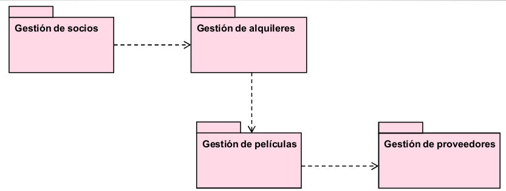
    

- **Diagramas de actividad**: es un diagrama de UML para la descripción del comportamiento que tiene un conjunto de tareas o procesos. Se pueden usar para representar los procesos de negocio de una empresa y para representar los flujos de un caso de uso de forma gráfica.

    

    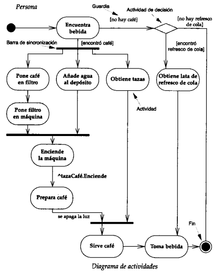
    

## Análisis y especificación de requisitos

El **análisis de requisitos** es la fase de la ingeniería de requisitos en la que se examinan los requisitos (de los casos de uso) para delimitarlos y definir exactamente cada uno de ellos. Se trata fundamentalmente de:

- Detectar y resolver conflictos entre los requisitos.
- Delimitar el software y establecer con qué elementos externos interacciona.
- Elaborar los requisitos del sistema para obtener, a partir de ellos, los requisitos del software a desarrollar.

El objetivo principal del análisis de requisitos es refinar, estructurar y describir los requisitos para una compresión más precisa y fácil de mantener que ayude a estructurar el sistema completo (modelos del análisis).

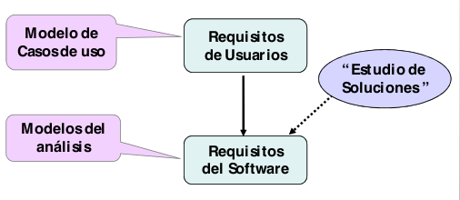

*Ejemplo. Estudio de soluciones*

*Problema: llevar un control de los productos que se tienen en un almacén y realizar pedidos cuando sea necesario*

*S1: incluir en el sistema una función que permita obtener un listado de las existencias en el almacén para cada producto y el almacenista pedirá los productos de los que haya pocas existencias*

*S2: incluir información sobre los mínimos necesarios para cada producto y una función que permita obtener un listado de los productos que están bajo mínimos*

*S3: incluir información sobre los proveedores de los productos y permitir que el sistema, cada cierto tiempo, evalúe los mínimos y genere un listado con los pedidos*

*S4: generar pedido por FAX de forma automática en base a la información de los proveedores y a los mínimos del almacén*

Las **actividades** durante el análisis son:

- **Clasificación de los requisitos**: establecer un conjunto de categorías y situar cada requisito en ellas
- **Priorización de los requisitos**: determinar la importancia relativa de cada requisito en relación con los demás
- **Modelado conceptual**: representar los requisitos con un lenguaje o notación que “comprendan” quienes van a tratar con ellos
- **Situación de los requisitos en la arquitectura del sistema**: establecer qué elementos del sistema software van a satisfacer los distintos requisitos. Permite descubrir nuevos requisitos.
- **Negociación de los requisitos**: detectar y resolver problemas, definir de manera precisa los límites del sistema y cómo éste debe interaccionar con su entorno.

La **especificación de requisitos** es la completa descripción de los requisitos del sistema a desarrollar. Se genera un documento con la especificación de requisitos del software. Una especificación debe ser completa, verificable, consistente, modificable, susceptible de permitir seguimientos, utilizable durante las fases de operación y mantenimiento y no debe contener antigüedades.

### Análisis orientado a objetos

El **análisis orientado a objetos** examina y representa los requisitos desde la perspectiva de los objetos que se encuentran en el dominio del problema. Los métodos de análisis orientado a objetos se centran en obtener dos tipos de modelos:

- **Estático o de estructura**.
- **Dinámico o de comportamiento**.

El lenguaje más usado para representar esos modelos es UML.

Se usa el análisis orientado a objetos porque:

- Los términos usados en los modelos están cercanos a los del mundo real: facilita y mejora la obtención de requisitos y acerca el espacio del problema al espacio de la solución.
- Se modelan tanto elementos y propiedades estáticas como dinámicas del ámbito del problema.
- Se manejan conceptos comunes durante el análisis, diseño e implementación del software: mejor transición entre fases, facilita el desarrollo iterativo y difumina la barrera entre el "qué" y el "cómo".

El **modelo de análisis** es la tarea principal es comprender, identificar y representar mediante modelos los requisitos del software a desarrollar.

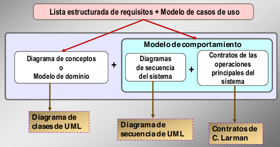

### Obteción del modelo estático

El proceso general consiste en:

- Identificar los principales conceptos y sus relaciones y documentarlos.
- Partir del modelo de casos de usos, de la lista de requisitos y del glosario de términos.
- Representarlos con un diagrama de clases de UML en el que podrá haber conceptos o clases conceptuales, asociaciones entre conceptos, generalizaciones de conceptos y atributos de los conceptos.

Los pasos que hay que seguir son:

1. **Identificar e incorporar conceptos**
    1. Identificar los conceptos
    2. Seleccionar los conceptos relevantes para el problema
    3. Representarlos, como clases, en el diagrama de conceptos

    Estrategias para identificar conceptos:
    
    - Establecer una **lista de categorías de conceptos** y rellenarla a partir de la información que se dispone.
    - Encontrar los términos que se correspondan con **sustantivos o frases nominales**; éstos van a ser los candidatos a conceptos.

    *Ejemplo. Lista de categorías de conceptos*

    

    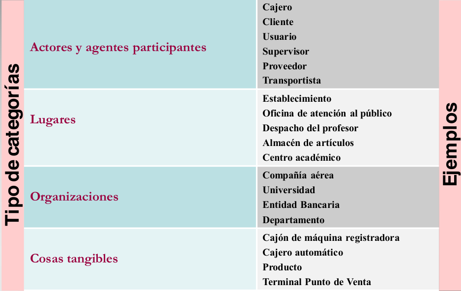
    

    

    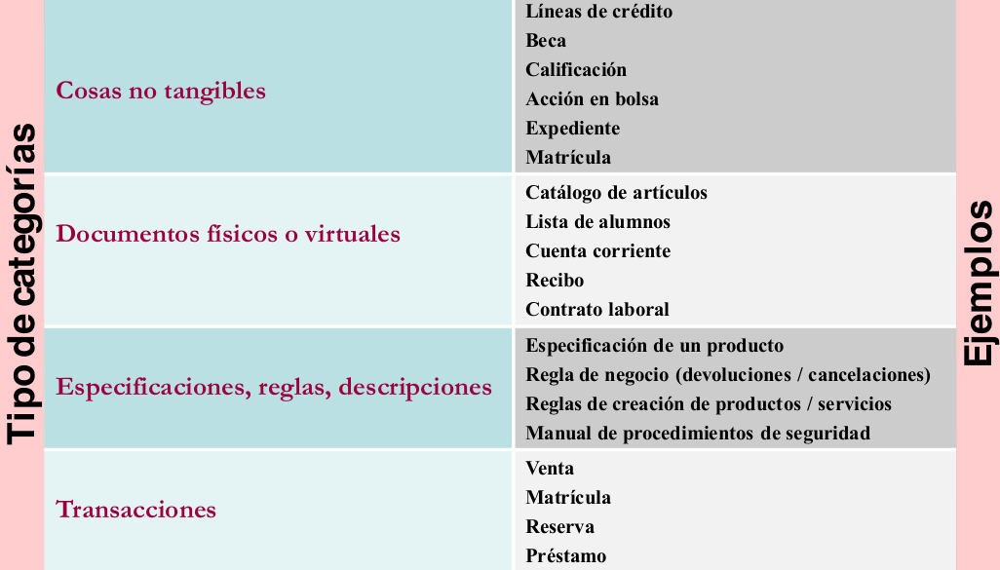
    

    

    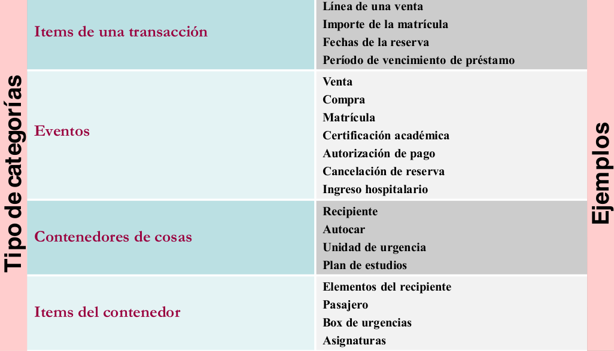
    

    

    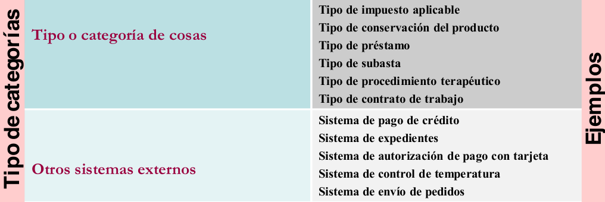
    

    La **selección de sustantivos** no se puede hacer de forma mecánica y existen problemas con la ambigüedad del lenguaje natural.

    *Ejemplo. Este ejemplo comienza cuando un `cliente` llega a una `caja de TPDV` con `productos` que desea comprar. El `cajero` registra el `código universal de producto (CUP)` en cada `producto`. Si el `producto` se repite, el `cajero` también puede introducir la `cantidad`*

    *En un `plan de estudios` de una `titulación universitaria`, hay una `asignatura` denominada "`proyectos`". Para aprobar dicha asignatura el `alumno` tiene que realizar un `trabajo práctico`, en el que resuelve un determinado `problema` aplicando los `conocimientos adquiridos` durante su formación.*

    *Durante la realización del `proyecto (trabajo)` el alumno recibe la `dirección tutelada` de un `profesor`. Para ello, los profesores definen una serie de `proyectos a realizar`, los alumnos indican sus preferencias y finalmente se les adjudica un proyecto determinado, de entre sus elegidos, en función de un determinado `baremo`*

    *El proceso a seguir sería el siguiente:*

    1. *Los `alumnos` se matriculan de la `asignatura` “`proyectos informáticos`"*
    2. *Los `profesores` definen los contenidos de sus `proyectos`, dando el `título del proyecto`, las `asignaturas recomendadas`, el `número de alumnos` requerido para su realización y una `descripción general` del mismo*
    3. *A continuación, cada `alumno` elige entre 1 y 10 `proyectos` de los ofertados. A cada una de sus elecciones le asigna una `prioridad`*
    4. *Una vez terminada la elección se asigna un proyecto a cada uno de los alumnos, teniendo en cuenta el siguiente `baremo`: suma de la `nota media` del `expediente` y la `nota media` de las `asignaturas` recomendadas en el proyecto (que hayan sido cursadas por el alumno)*

    *Lista preliminar de conceptos: Baremo, Alumno, Profesor, Dirección Tutelada, Plan de Estudios, Asignatura, Nota Media, Titulación Universitaria, Expediente, Proyecto, Trabajo Práctico, Título del Proyecto, Descripción, Problema, Asignaturas Recomendadas, Conocimiento Adquirido, Proyecto a Realizar, Número de Alumnos, Prioridad*

    *Estudio de la lista:*

    - *Términos sinónimos: plan de estudios - titulación universitaria, proyecto - trabajo - problema - trabajo práctico.*
    - *Relaciones: dirección tutelada, asignaturas recomendadas, proyecto a realizar*
    - *Atributos de conceptos o de relaciones: baremo, nota media, título, descripción, número de alumnos, prioridad*.
    - *Fuera del ámbito del problema: conocimiento adquirido*.

    *Lista definitiva de conceptos y su representación en un diagrama de conceptos:*

    

    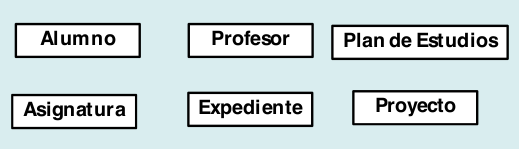
    

2. **Identificar e incorporar asociaciones**. Una asociación es una conexión significativa y relevante entre conceptos. Los pasos a seguir son:

    1. Identificar las posibles asociaciones
    2. Representarlas en el diagrama y seleccionar las que sean válidas
    3. Asignarles nombre
    4. Identificar la multiplicidad

    *Ejemplo. Siguiendo una lista de categorías de relaciones entre conceptos*

    

    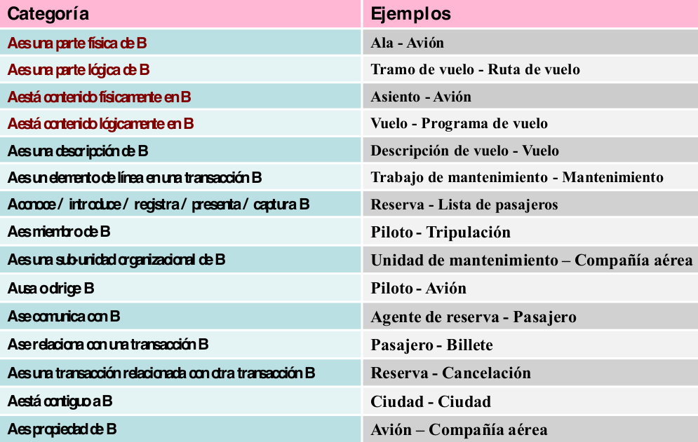
    

    *Ejemplo. Identificando conceptos relacionados*

    1. *En un plan de estudios de una titulación universitaria, hay una asignatura denominada “proyectos”: Plan de estudios ---- Asignatura*
    2. *Para aprobar dicha asignatura el alumno tiene que desarrollar un trabajo práctico, en el que resuelva un determinado problema aplicando los conocimientos adquiridos durante su formación: Alumno ---- Proyecto*
    3. *El alumno recibe la dirección tutelada de un profesor: Alumno ---- Profesor*
    4. *Los profesores definen una serie de proyectos: Profesor ---- Proyecto*
    5. *Los alumnos indican su preferencia (proyectos): Alumno ---- Proyecto*
    6. *Se les (alumno) adjudica un proyecto determinado, de entre sus elegidos: Alumno ---- Proyecto*
    7. *Los alumnos se matriculan de dicha asignatura “proyecto”: Alumno ---- Asignatura*
    8. *Nota media del expediente del alumno: Expediente ---- Alumno*
    9. *Asignaturas recomendadas en el proyecto: Proyecto -------- Asignatura*
    10. *Del enunciado del problema (punto 4o del proceso a seguir) se deduce que: El expediente está formado por asignaturas y sus notas Expediente -------- Asignatura*

    *Representar asociaciones en el diagrama*
    
    

    
    

    *Nombrar las asociaciones*

    

    
    

    *Asignarles multilpicidad*
    
    

    
    

3. **Incorporar generalizaciones**
    1. Identificar posibles generalizaciones. A partir de las descripción del problema y de las clases conceptuales identificadas, encontrar clases conceptuales con elementos comunes. Definir las relaciones de superclase y subclase.
    2. Validar las estructuras encontradas. Una subclase potencial debería estar de acuerdo con la regla del 100% (conformidad con la  definición de la superclase) y regla es-un (conformidad con la pertenencia al conjunto que define la superclase).
    3. Representarlas en el modelo conceptual.

    Directrices para la obtención de generalizaciones:

    - Para crear subclases conceptuales a partir de superclases
        - La subclase tiene atributos adicionales de interés
        - La subclase tiene asociaciones adicionales de interés
        - La subclase funciona, reacciona o se manipula de manera diferente a la superclase
        o a alguna subclase
    - Para crear superclases conceptuales a partir de subclases potenciales
        - Cuando las subclases presentan variaciones de un concepto similar
        - Las subclases cumplen con las reglas del “100%” y “es-un”
        - Todas las subclases tienen el mismo atributo que se puede factorizar en la superclase
        - Todas las subclases tienen la misma asociación que se puede factorizar en la superclase

4. **Agregar atributos**
    1. Identificar atributos desde casos de uso y lista de requisitos, así como otras fuentes de información.
    2. Representarlos en el diagrama, en los conceptos o en las relaciones que correspondan.

    Tipos de atributos válidos:
    
    - **Primitivos o valores puros de datos** (entero, real, carácter, booleano, cadena...)
    - **No primitivos** (nombre de persona, número de teléfono, hora, fecha, dirección...)

    Directrices sobre los atributos:

    - Relacionar conceptos con asociaciones y no con atributos.

        

        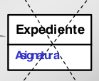
        

    
    - No usar atributos de un concepto como clave de acceso desde otro concepto.
        
        

        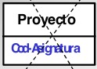
        

    - No incluir, si no es necesario, los conceptos asociados a los atributos no primitivos.

        

        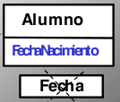
        

    *Ejemplo. Agregar atributos: identificar atributos*

    *Atributos extraídos de los casos de uso y la lista de requisitos*

    - *Nombre de la Asignatura (de Asignatura)*
    - *Título del Proyecto (de Proyecto)*
    - *Número de alumnos (de Proyecto)*
    - *Descripción del Proyecto (de Proyecto)*
    - *Nota media del Expediente (de Expediente)*
    - *Baremo (de la asociación eligen)*
    - *Prioridad (de la asociación eligen)*
    - *Nota de un Alumno en una Asignatura (de la asociación formado por)*
    
    *Atributos extraídos de otras fuentes*
    
    - *Nombre y DNI (del Profesor y del Alumno)*
    - *Código y Créditos (de la Asignatura)*

    *Representar atributos*

    

    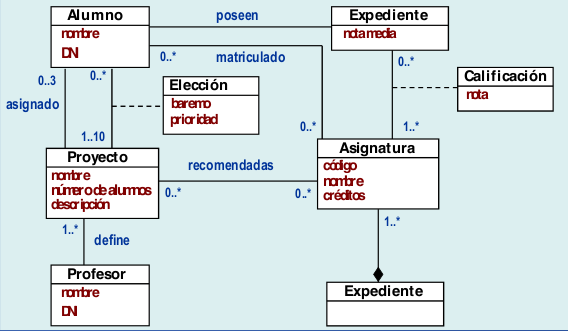
    

5. **Estructurar el modelo**. Mediante **diagramas de paquetes**. Un **paquete** es una división del modelo agrupando conceptos que tienen una fuerte relación entre sí (facilita el modelado y la posterior representación mediante diagramas).

    Para estructurar el diagrama de conceptos o modelo de dominio:

    - Elementos que están en el mismo área de interés (relacionados por conceptos)
    - Están juntos en una jerarquía de clases
    - Participan en los mismos casos de uso
    - Están fuertemente asociados

    *Ejemplo.*

    

    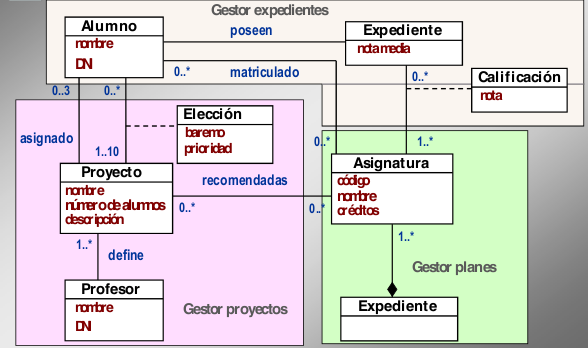
    

    

    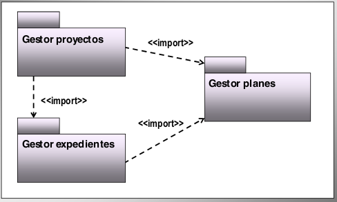
    

### Obtención del modelo de comportamiento

La **obtención del modelo de comportamiento** es el estudio adicional del dominio del problema en el que se añaden los requisitos funcionales al modelo del análisis (qué hace el sistema sin explicar cómo lo hace).

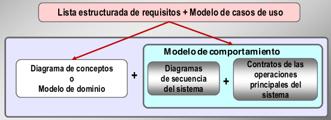

El **diagrama de secuencia del sistema** es un diagrama de UML en el que se muestran cómo los eventos generados por los actores provocan la ejecución de una operación por el sistema, siendo visto este como una caja negra.

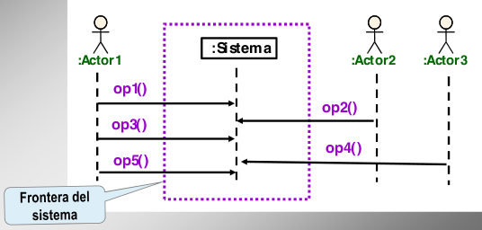

Pasos a seguir, para todos los casos de uso:

1. Identificar los actores que inician las operaciones.
2. Asignar un nombre a todo el sistema.
3. Identificar y nombrar las operaciones principales del sistema a partir de las descripciones de los casos de uso.
4. Determinar los parámetros de las operaciones.
5. Incluir las operaciones en la clase que identifica a todo el sistema.
6. Hacer una descripción informal de la funcionalidad de cada operación.

*Ejemplo.*

*Pasos 1 y 2*

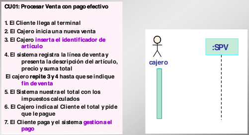

*Paso 3*

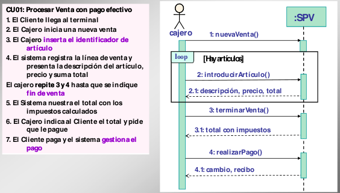

*Pasos 4 y 5*

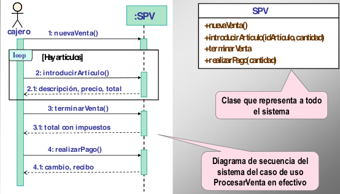

*Ejemplo de diagrama de secuencia del sistema*

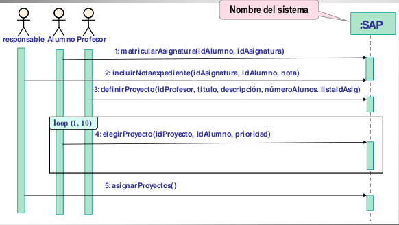

Un **contrato** es un documento que describe lo que una operación se propone lograr, sin decir cómo se conseguirá. Define la especificación de una operación sin entrar en su implementación. Suele redactarse con un estilo declarativo.

Contenido del contrato:

- **Nombre**: nombre de la operación y sus parámetros
- **Responsabilidad**: descripción informal de las responsabilidades que debe cumplir la operación
- **Tipo**: concepto, clase o interfaz responsable de la operación
- **Notas**: notas de diseño, algoritmos...
- **Excepciones**: casos excepcionales
- **Salida**: mensajes o datos que proporciona
- **Precondiciones**: suposición acerca del estado del sistema o de los objetos del modelo conceptual antes de ejecutar la operación
- **Poscondiciones**: estado del sistema  o de los objetos del modelo conceptual después de la ejecución de la operación

Directrices para la elaboración de un contrato:

- El nombre de la operación viene del diagrama de secuencia del sistema correspondiente
- Comenzar con las responsabilidades, describiendo informalmente el propósito de la operación, continuar con las poscondiciones y finalizar con las demás secciones, especialmente con las precondiciones y excepciones.
- Las poscondiciones deben describir los cambios de estado de un sistema, no sus acciones, estos son: creación y destrucción de objetos, creación y destrucción de enlaces, modificación de atributos. Los objetos y enlaces que se pueden crear y destruir son los que están en el modelo conceptual.
- Las poscondiciones deben expresarse mediante una frase verbal en pretérito.

*Ejemplo. Elaboración de un contrato*

*Contrato de la operación: matricularAsignatura (idAlumno, idAsignatura)*

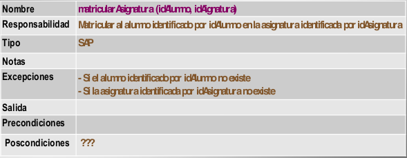

Para especificar las **poscondiciones** hay que identificar en el diagrama de conceptos los objetos que intervienen en la operación.

*Ejemplo. En la operación matricularAsignatura*

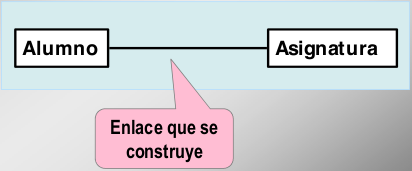

*Ejemplo de contrato. Operación `definirProyecto(idProfesor, titulo, descripción, numeroAlumnos, listIdAsig)`*

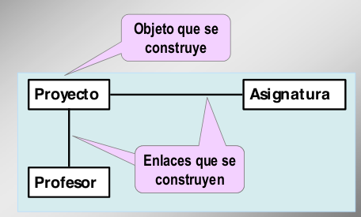

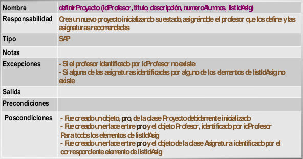

*Ejemplo de contrato. Operación `incluirNotaExpediente(idAsignatura, idAlumno, nota)`*

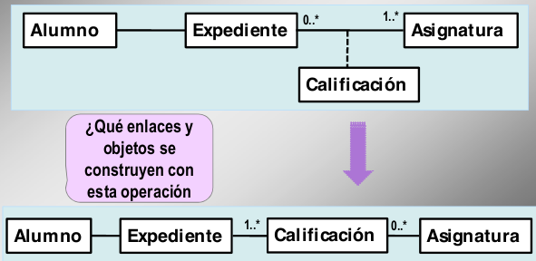

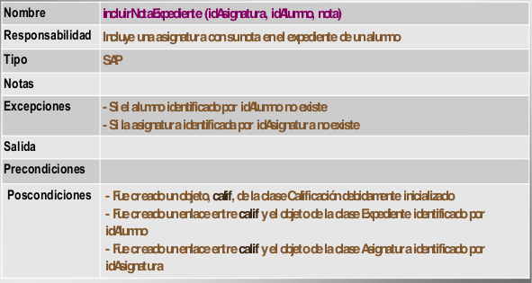

\newpage

# Tema 3. Diseño e implementación

## Fundamentos del diseño software

El **diseño** es el proceso de aplicar distintas técnicas y principios con el principio de definir un dispositivo, proceso o sistema con los suficientes detalles como para permitir su realización física.

El **diseño software** es el proceso de aplicar distintas técnicas y principios del diseño con el propósito de traducir el modelo de análisis a una representación del software (modelo de diseño) que pueda codificarse.

El **diseño** se puede definir como:

1. El proceso para definir la arquitectura, los componentes, las interfaces y otras características de un sistema o un componente. Un **componente** es la parte funcional de un sistema que oculta su implementación proporcionando su realización a través de un conjunto de interfaces. Una **interfaz** describe la frontera de comunicación entre dos entidades software, definiendo explícitamente el modo en que un componente interacciona con otros. 
2. El resultado de este proceso

El diseño se descompone en dos subprocesos:

1. **Diseño arquitectónico**: se describe cómo descomponer el sistema y organizarlo en los diferentes componentes (arquitectura del software).
2. **Diseño detallado**: se describe el comportamiento específico de cada uno de los componentes del software.

Las **características** son:

- El diseño implica una propuesta de solución al problema especificado en el análisis.
- Es una actividad creativa que se apoya en la experiencia del diseñador.
- Está apoyado por principios, técnicas, herramientas...
- Es un proceso clave para la calidad del producto software.
- Es la base para el resto de etapas del desarrollo.
- Es un proceso de refinamiento.
- El diseño va a garantizar que un programa funcione correctamente.

### Principios del diseño

Los principios del diseño ayudan a responder las siguientes preguntas:

- ¿Qué criterios se usan para dividir el software en sus componentes individuales?
- ¿Cómo se extraen los detalles de una función o estructura de datos a partir de la representación conceptual del software?
- ¿Cuáles son los criterios que definen la calidad técnica de un diseño software?

Los **principios** son:

- Abstracción
- División de problemas y modularidad
- Ocultamiento de información
- Independencia funcional

La **abstracción** es el mecanismo que permite determinar qué es relevante y qué no lo es en un nivel de detalle determinado, ayudando a obtener la modularidad adecuada para ese nivel de detalle.

**Tipos** de abstracciones:

- **Abstracción de datos**: define un objeto compuesto por un conjunto de datos. Ejemplo: la abstracción cliente, incluirá los datos de un cliente tal y como se entiende en la aplicación.
- **Abstracción de control**: define el sistema de control sin describir la información sobre su funcionamiento interno. Ejemplo: un semáforo para describir la coordinación en el funcionamiento de un SO.
- **Abstracción procedimental**: se refiere a la secuencia de pasos que conforman un proceso determinado. Ejemplo: un algoritmo de ordenación.

La **división de problemas** sugiere que cualquier problema complejo puede manejarse con más facilidad si se subdivide en elementos susceptibles de resolverse u optimizarse de manera independiente.

Matemáticamente, esto se explica:

$C(x)$ función que define la complejidad de un problema $x$.

$E(x)$ función que define el esfuerzo de desarrollo de un problema $x$.

Si para dos problemas $p_1$ y $p_2$ tales que $C(p_1) > C(p_2)$ se deduce que $E(p_1) > E(p_2)$.

Además se cumple $C(p_1 +p_2) > C(p_1) + C(p_2)$ y que $E(p_1+p_2) > E(p_1) + E(p_2)$.

La **modularidad** es la manifestación más común de la división de problemas.

El software se divide en componentes con nombres distintos y abordables por separado, denominados **módulos**, que se integran para satisfacer los requisitos del problema.

Las **ventajas** de la modularidad son:

- Son más fáciles de entender y documentar que todo el subsistema o sistema.
- Facilitan los cambios.
- Reducen la complejidad.
- Proporcionan implementaciones más sencillas.
- Posibilitan el desarrollo en paralelo.
- Permiten la prueba independiente (prueba de unidad).
- Facilitan el encapsulamiento.

Veamos el grado adecuado de modularidad:

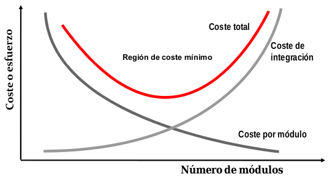

Ahora hablaremos del **ocultamiento de información**. ¿Cómo descomponer una solución software para obtener el mejor conjunto de módulos?

Los **módulos** deben especificarse y diseñarse de forma que la información (algoritmos y datos) contenida en un módulo sea inaccesible para los que no necesiten de ella.

Las **ventajas** del ocultamiento de información son:

- Reduce la probabilidad de efectos colaterales.
- Limita el impacto global de las decisiones de diseño locales.
- Enfatiza la comunicación a través de interfaces controladas.
- Disminuye el uso de datos globales.
- Potencia la modularidad.
- Produce software de calidad.

En la **implementación funcional**, el software debe diseñarse de manera que cada módulo resuelva un subconjunto específico de requisitos y tenga una interfaz sencilla cuando se vea desde otras partes de la estructura del programa.

La **independencia** se evalúa con dos criterios:

- **Cohesión**: un módulo cohesivo ejecuta una sola tarea, por lo que requiere interactuar poco con otros componentes en otras partes del programa. Idealmente se hace una sola cosa. La alta cohesión proporciona módulos fáciles de entender, reutilizar y mantener.
- **Acoplamiento**: indica la interconexión entre módulos en una estructura de software y depende, básicamente, de la complejidad de la interfaz entre módulos. El bajo acoplamiento proporciona módulos fáciles de entender y con menos efectos colaterales.

Máxima cohesión y mínimo acoplamiento.

### Herramientas de diseño

Las **herramientas de diseño** son instrumentos que ayuda a representar los modelos de diseño software. 

Algunas de las más usuales son:

- Diagramas UML: clase, interacción, paquetes, despliegue...
- Cartas/Diagramas de estructura
- Tablas de decisión/transiciones
- Diagramas de flujo de control u organigramas estructurados
- Diagramas de Nassi-Shneiderman/NS/Chaplin
- Lenguajes de diseño de programas (LPD o pseudocódigo)

### Métodos de diseño

Los **métodos de diseño** proporcionan las herramientas, técnicas y pasos a seguir para obtener diseños de forma sistemática.

Sus **características** son:

- Principios en los que se basa
- Mecanismos de traducción del modelo de análisis al modelo de diseño
- Herramientas que permiten representar los componentes funcionales y estructurales
- Heurísticas que permiten refinar el diseño
- Criterios para evaluar la calidad del diseño

Principales métodos de diseño:

- Diseño estructurado de sistemas (SSD)
- Desarrollo de sistemas Jackson (JSD)
- Entidad-relación-atributo (ERA)
- Técnicas de modelado de objetos (OMT)
- Método Boock (diseño orientado a objetos)
- Métodos orientados a objetos. La gran mayoría usan como herramienta de modelado UML y como proceso de desarrollo el PU.

### Modelo de diseño

- **Contenido del modelo**. A nivel general, está formado por varios subsistemas de diseño junto con las interfaces que requieren o proporcionan estos subsistemas.

    

    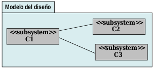
    

    Cada subsistema de diseño puede contener diferentes tipos de elementos de modelado de diseño, principalmente realización de casos de uso-diseño y clases de diseño

    

    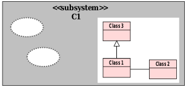
    

- **Relación con el modelo de análisis**. Se puede pensar en el modelo de diseño como una elaboración del modelo de análisis con detalles añadidos y soluciones técnicas específicas.

    

    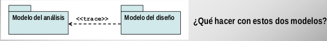
    

    | Estrategia | Consecuencias |
    | :-----------------------------------------------: | :-----------------------------------------------: |
    | (1) Convertir el modelo de análisis en un modelo de diseño | Se tiene un modelo de diseño pero se pierde la vista de análisis |
    | (2) Convertir el modelo de análisis en un modelo de diseño y usar una herramienta para recuperar una “vista de análisis” | Se tiene un modelo de diseño pero la vista recuperada del modelo de análisis puede no ser satisfactoria|
    | (3) Congelar el modelo de análisis y hacer una copia en un modelo de diseño | Se tienen dos modelos pero no van al mismo ritmo |
    | (4) Mantener los dos modelos separados | Se tienen dos modelos, van al mismo ritmo, pero existe una carga de mantenimiento |

    Trazabilidad entre los distintos elementos del análisis y del diseño:

    

    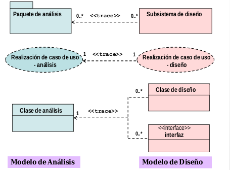
    

### Tareas del diseño

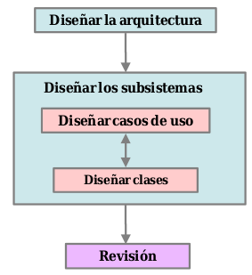

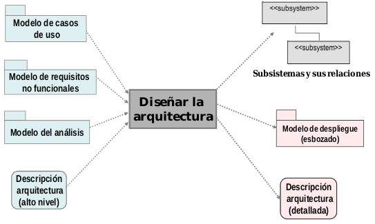

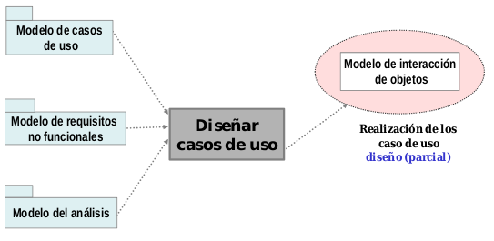

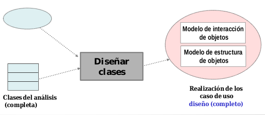

## Diseño de la arquitectura

El **diseño de la arquitectura** es un proceso creativo que se interesa por entender cómo se debe organizar un sistema y cómo se tiene que diseñar la estructura global del sistema. 

Sus **características** son:

- Es la primera etapa en el proceso de diseño del software.
- Es el enlace entre el diseño y la ingeniería de requisitos.
- Proporciona un modelo arquitectónico que describe cómo se organiza el sistema en un conjunto de componentes (subsistemas) de comunicación.
- Es la influencia dominante para los requisitos no funcionales.

Importancia de la arquitectura:

- Facilita la comprensión de la estructura global del sistema.
- Permite trabajar en los componentes de forma independiente.
- Facilita las posibles extensiones del sistema.
- Facilita la reutilización de los distintos componentes.

Decisiones estructurales:

- Cómo se va a dividir el sistema en componentes
- Cómo deben interactuar los componentes
- Cuál va a ser la interfaz de cada componente.
- Qué estilo arquitectónico se va a utilizar.

El estilo arquitectónico depende de los requisitos no funcionales:

- **Rendimiento**: la arquitectura se diseña para localizar las operaciones críticas dentro de un pequeño número de componentes desplegados en la misma computadora.
- **Seguridad**: la arquitectura se diseña con una estructura, en capas, con los activos más críticos en las capas más internas, y con un alto nivel de validación de seguridad para esas capas.
- **Protección**: la arquitectura se diseña para que las operaciones relacionadas con la protección se ubiquen en un componente individual o en un pequeño número de componentes.
- **Disponibilidad**: la arquitectura se diseña para incluir componentes redundantes.
- **Facilidad de mantenimiento**: la arquitectura se diseña usando componentes auto contenidos de grano fino que pueda cambiar con facilidad.

### Herramientas de representación

- **Diagrama de paquetes**: describe el sistema en torno a agrupaciones lógicas y proporciona una primera estructura del sistema.
- **Diagrama de componentes**: representa una estructuración concreta del sistema a partir de los componentes software (sistemas) y su interrelación (interfaces). Un **componente** es una unidad software que ofrece una serie de servicios a través de una o varias interfaces. La notación es la siguiente.

    

    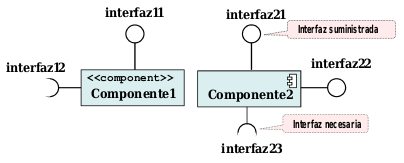
    

    Los **estereotipos** estándar de componentes son:

    - `<<buildcomponent>>`: componente que define un conjunto de elementos para fines organizativos
    - `<<antity>>`: componente de información persistente que representa un concepto de negocio
    - `<<implementation>>`: componente que no tiene especificación
    - `<<specification>>`: componente que especifica un dominio de objetos sin definir su implementación
    - `<<process>>`: componente basado en transacción
    - `<<service>>`: componente funcional sin estado que computa un valor
    - `<<subsystem>>`: unidad de descomposición jerárquica para grandes sistemas

    Representación alternativa de las interfaces:

    

    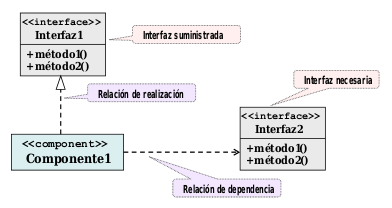
    

- **Diagrama de despliegue**: especifica el hardware físico sobre el que se ejecutará el sistema software y cómo cada subsistema se despliega en ese hardware. Elementos que lo forman:
    - **Nodos**: representan tipos de recursos computacionales sobre los que se pueden desplegar los artefactos para su ejecución. Los nodos se pueden anidar en nodos. Una instancia de nodo representa un recurso computacional específico. Los **estereotipos** son:
        - `<<device>>`: tipo de dispositivo físico como un PC o un servidor.
        - `<<execution enviroment>>`: tipo de entorno de ejecución para software.

        La notación gráfica es:

        

        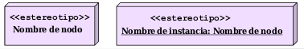
        

    - **Asociaciones entre nodos**: representan canales de comunicación a través de los cuales se puede pasar información.
    - **Artefactos**: representan especificaciones de elementos concretos del mundo real. Los artefactos se despliegan en nodos. Por ejemplo: archivos fuente, archivos ejecutables, tablas de base de datos... Una instancia de artefacto representa una instancia específica de un artefacto determinado. Los **estereotipos** son:
        
        - `<<file>>`: archivo físico.
        - `<<deployment spec>>`: especificación de detalles de despliegue.
        - `<<document>>`: archivo genérico que contiene cierta información.
        - `<<executable>>`: archivo de programa ejecutable.
        - `<<library>>`: biblioteca estática o dinámica.
        - `<<script>>`: script que se puede ejecutar por un intérprete.
        - `<<source>>`: archivo fuente que se puede compilar en un archivo ejecutable.

        La notación gráfica es:

        

        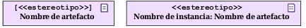
        

    - **Relaciones de dependencia**.
        - `<<manifest>>`: representa la relación entre un artefacto y el elemento/s del modelo que implementa.

        

        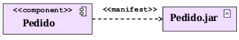
        

        
        - `<<deploy>>`: representa el despliegue de un artefacto o instancia de artefacto sobre un nodo o instancia de nodo.

        

        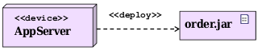
        

### Estilos arquitectónicos

Los **estilos arquitectónicos** proporcionan un conjunto de subsistemas predefinidos, especificando sus responsabilidades e incluyendo reglas y guías para organizar las relaciones entre ellos. No proporcionan la arquitectura del sistema, sino una guía de como obtenerla.

Los estilos arquitectónicos más generalizados son:

- **Arquitectura Modelo-Vista-Controlador (MVC)**.
- **Arquitectura en capas**.
- **Arquitectura de repositorio**.
- **Arquitectura cliente-servidor**.

La **arquitectura Modelo-Vista-Controlador** separa la presentación e interacción de los datos del sistema. El sistema se estructura en tres componentes lógicos que interactúan entre sí:

- **Modelo**: maneja los datos del sistema y las operaciones asociadas a esos datos.
- **Vista**: define y gestiona cómo se representan los datos al usuario.
- **Controlador**: dirige la interacción del usuario y pasa estas interacciones a vista y modelo.

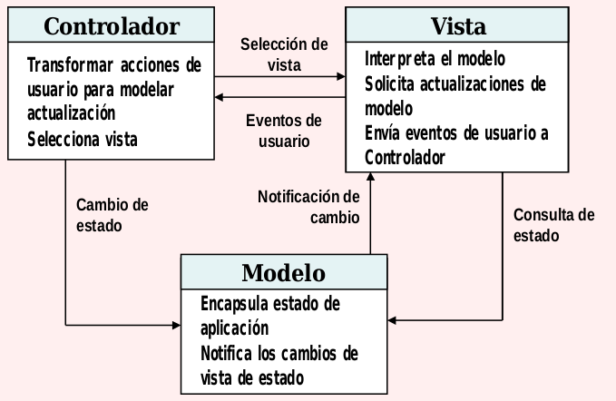

**Principio de diseño**:

- Cada sistema puede diseñarse **independientemente**.
- Se aumenta la **cohesión** de los subsistemas si la vista y el controlador se unen en una capa llamada interfaz de usuario.
- Se reduce el **acoplamiento** puesto que la comunicación entre los subsistemas es mínima.

Cuándo se **usa**:

- Cuando existen múltiples formas de interactuar con los datos.
- Cuando se desconocen los requisitos futuros para la interacción y la presentación.

**Ventajas**:

- Permite que los datos cambien de manera independiente de su representación (y viceversa).
- Soporta diferentes representaciones de los mismos datos.
- Los cambios en una representación se muestran en todos ellos.

**Desventajas**:

- Código adicional y complejidad de código cuando el modelo de datos y las interacciones son simples.

*Ejemplo. Arquitectura de aplicación Web con el estilo MVC*

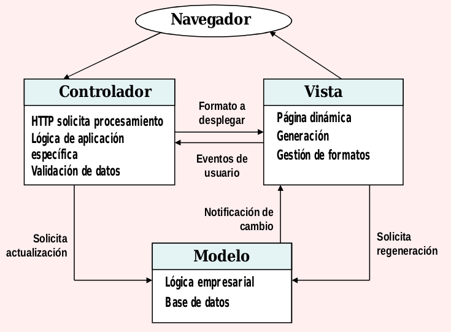

La **arquitectura en capas** organiza el sistema en capas con funcionalidad relacionada con cada capa. Una capa da servicios a la capa de encima y las capas de nivel inferior representan servicios núcleo que es probable que se utilicen a lo largo de todo el sistema.

**Principios de diseño**:

- Las capas se pueden diseñar, construir y probar **independientemente**.
- Una capa bien diseñada presenta **alta cohesión**.
- Una capa bien diseñada no tiene conocimiento de las capas superiores (**ocultamiento de información**).
- Las capas deben estar **desacopladas**. Todas las dependencias en un sentido. Todas las dependencias en las interfaces.
- Las capas inferiores se deben diseñar para representar servicios de bajo nivel (**bajo acoplamiento**).

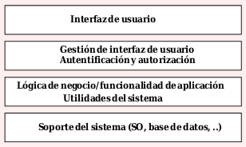

Cuándo se **usa**:

- Al construir nuevas facilidades encima de los sistemas existentes.
- Cuando el desarrollo se dispersa a través de varios equipos de trabajo.
- Cuando existe un requisito de seguridad multinivel.

**Ventajas**:

- Permite la sustitución de capas completas siempre que se conserve la interfaz.
- En cada capa se pueden incluir facilidades redundantes.

**Desventajas**:

- Es difícil ofrecer una separación limpia entre capas.
- El rendimiento es un problema debido a los múltiples niveles de interpretación.

*Ejemplo. Sistema para compartir documentos con derechos de autor*

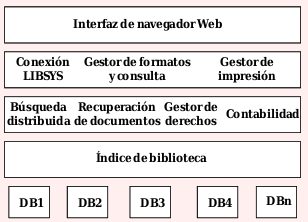

En la **arquitectura de repositorio** todos los datos en un sistema se gestionan en un repositorio central, accesible a todos los componentes. Los componentes no interactúan directamente, sino solo a través del repositorio.

*Ejemplo. Herramienta CASE*

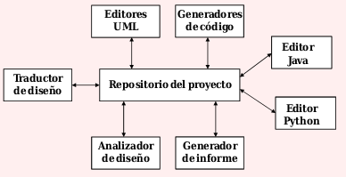

**Principios de diseño**:

- Se pueden diseñar **sistemas independientes**, aunque deben conocer el esquema de repositorio.
- Cada subsistema tiene definida una funcionalidad específica (**alta cohesión**).
- El **acoplamiento** de los subsistemas con el respositorio es alto.

Cuándo se **usa**:

- Cuando se tiene un sistema donde los grande volúmenes de información generados se deben almacenar durante mucho tiempo.
- En sistemas en los que la inclusión de datos en el repositorio active una acción o herramienta.

**Ventajas**:

- Los componentes pueden ser independientes, no necesitan conocer la existencia de otros.
- Los cambios en un componente se pueden propagar hacia todos los componentes.
- La totalidad de datos se puede gestionar de manera consistente.

**Desventajas**:

- Los problemas en el repositorio afectan a todo el sistema.
- Existencia de ineficiencias al organizar toda la comunicación a través del repositorio.
- Quizás sea difícil distribuir el repositorio en varias computadoras.

En la **arquitectura cliente-servidor**, la funcionalidad del sistema se organiza en servicios, y cada servicio lo entrega un servidor diferente. Los clientes son usuarios de dichos servicios y para usarlos ingresan a los servidores.

*Ejemplo. Filmoteca y videoteca*

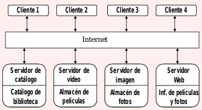

**Principios de diseño**:

- Permite diseñar, implementar y probar servidores y clientes **independientemente**.
- Mejora la **cohesión** de los susbsistemas al proporcionar servicios específicos a los clientes.
- Reduce el **acoplamiento** al establecer un canal de comunicación para el intercambio de mensajes.
- Aumenta la **abstracción** al tener subsistemas distribuidos en nodos separados.

Cuándo se **usa**:

- Cuando desde varias ubicaciones se tiene que acceder a una base de datos compartida.
- Cuando la carga de un sistema es variable.

**Ventajas**:

- Los servidores se pueden distribuir a través de una red.
- Se pueden añadir fácilmente servidores o clientes extra.
- Se pueden escribir clientes para nuevas plataformas sin modificar a los servidores.

**Desventajas**:

- Es susceptible de fallos del servidor.
- El rendimiento es impredecible porque depende de la red.
- Problemas administrativos cuando los servidores sean propiedad de distintas organizaciones.

### Actividades del diseño arquitectónico

Las **actividades del diseño arquitectónico** son:

- Identificar los objetivos del diseño
- Determinar la arquitectura software, y los correspondientes subsistemas
- Modelar la arquitectura software
- Refinar la descomposición en subsistemas

**Identificar los objetivos del sistema:**

- Identificar las cualidades deseables del sistema.
- Obtener a partir de los requisitos no funcionales.
- Seleccionar un pequeño conjunto de objetivos del diseño que el sistema debe satisfacer necesariamente.
- Adquirir compromisos, puesto que muchos objetivos de diseño son contrapuestos.

**Determinar la arquitectura software:**

- Seleccionar el estilo arquitectónico que mejor se adapte.
- Identificar subsistemas en el dominio del problema.
- Añadir subsistemas predefinidos de acuerdo al estilo arquitectónico seleccionado.

**Modelar la arquitectura software:**

- Diseñar la arquitectura en un diagrama de paquetes. Los diagramas de paquetes permite modelar una primera estructuración del sistema en base a uno o más paquetes.
    - Cada paquete agrupa a un conjunto de clases relacionadas semánticamente.
    - Los paquetes peuden guiar en la identificaićon de los subsistemas y/o componentes reutilizables.

    Al identificar los paquetes hay que tener en cuenta lo siguientes aspectos:
    
    - Identificar paquetes cohesivos y con poca interacción con otros paquetes de acuerdo con la arquitectura planteada.
    - Diseñar paquetes que se puedan reutlilzar en otros proyectos.
    - Integrar subsistemas de proyectos anteriores.
    - Evitar las dependencias cíclicas entre paquetes.
- Elaborar el diagrama de componentes de la arquitectura. Los diagramas de componentes permiten estructurar el sistema de subsistemas en base a componentes que pueden reemplazarse. A partir del diagrama de paquetes determinar qué partes pueden definir componentes. Para ello habrá que:
    - Definir interfaces sumistradas de cada componentes para determinar las operaciones que pueden ser usadas por otros componentes.
    - Especificar las interfaces necesarias para cada componentes para poder desarrollar su funcionalidad.
    - Construir el componente de forma que su contenido interno sea independiente del exterior, salvo a través de las interfaces suministradas y necesarias.
- Realizar el diagrama de despliegue.

**Refinar la descomposición en subsistemas**

- Refinar los subsistemas hasta satisfacer los objetivos de diseño.
- Establecer los siguientes aspectos genéricos:
    - Correspondencia hardware-software
    - Administración de datos persistentes
    - Especificación de una política de control de accesos
    - Diseño del flujo de control
    - Diseño de la concurrencia y sincronización
    - Definición de las condiciones del entorno

## Diseño e implementación de los casos de uso

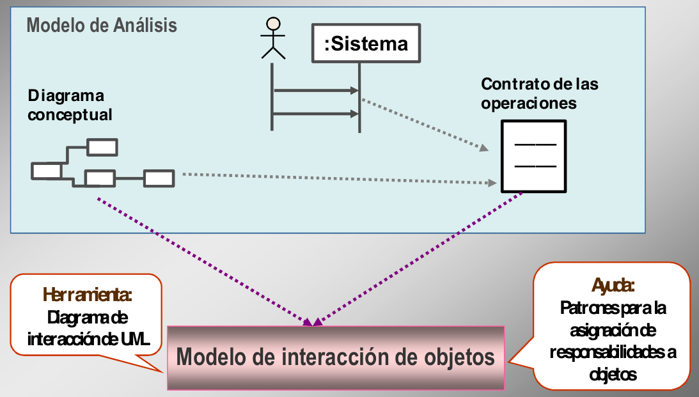

### Patrones de diseño para asignar responsabilidades

- **Responsabilidad**: es un contrato u obligación que debe tener un objeto en su comportamiento:
    - Hacer
    - Hacer algo en uno mismo
    - Iniciar una acción en otros objetos
    - Controlar y coordinar actividades en otros objetos
    - Conocer
    - Estar enterado de los datos privados encapsulados
    - Estar enterado de la existencia de objetos conexos
    - Estar enterado de las cosas que se pueden derivar o calcular

    No es lo mismo la responsabilidad que el método. La **responsabilidad** se implementa usando métodos que operan solos o en colaboración con otros métodos. Un **método** cumple las responsabilidades.
- **Patrón de diseño**: es una descripción de un problema con su solución en un determinado contexto. Son una forma de reutilizar el conocimiento y la experiencia de otros diseñadores. Las partes esenciales de un patrón son:

    - **Nombre**: que sea una referencia significativa al patrón.
    - **Problema**: una descripción del problema que enuncie cuándo se puede aplicar el patrón.
    - **Solución**: una descripción de la solución de diseño, sus relaciones y responsabilidades. Es una plantilla para que unas oslución se instale en diferentes formas.
    - **Consecuencias**: los resultados (buenos y malos) y las negociaciones de aplicar el patrón. Ayudan a entender si es factible usar el patrón en una situación particular.

### Patrones GRAPS (General Responsability Assignment Software Patterns)

Los **patrones GRAPS** describen los principios fundamentales del diseño de objetos y la asignación de responsabilidades, expresados como patrones.

Sus **características** son:

- No expresan nuevos principios de la ingeniería del software.
- Codifican conocimiento, expresiones y principios ya existentes.
- Son un ejemplo de la fuerza de abstracción porque dan nombre a una idea compleja. Apoyan la incorporación de conceptos a nuestro sistema congnitivo y memoria. Facilitan la comunicación.

Patrones GRAPS:

- Experto en Información: polimorfismo.
- Creador: fabricación pura.
- Bajo acoplamiento: indirección.
- Alta cohesión: no hables con extraños.
- Controlador.

**Experto en información:**

Problema: ¿Cuál es el princpio general para asignar responsabilidades a objetos?

Solución: asignar responsabilidad a la clase que contiene la información necesaria para llevarla a cabo.

Consecuencias:

- Malas: en ocasiones va en contra de los principios de acoplamiento o cohesión.
- Buenas: mantiene el oculpamiento de información y distribuye el comportamiento.

*Ejemplo.*

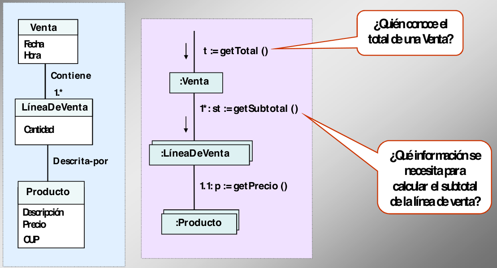

**Creador**:

Problema: ¿Quién debería ser el responsable de la creación de una instancia de alguna clase?

Solución: asignar a la clase B la responsabilidad de crear la instancia A cuando:

- B agrega objetos de A
- B contiene objetos de A
- B registra objetos de A
- B utiliza objetos de A
- B tiene los datos de inicialización de A

Consecuencias:

- Malas: no es conveniente su uso cuando se construye a partir de instancias existentes.
- Buenas: produce bajo acoplamiento.

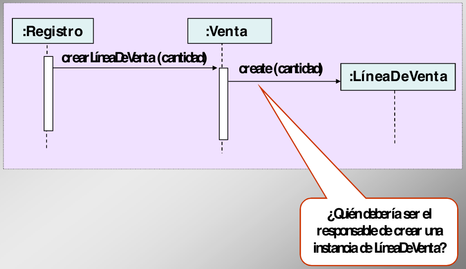

**Bajo acoplamiento**:

Problema: ¿Cómo soportar bajas dependencias, bajo impacto del cambio e incremento de la reutilización?

Solución: asignar una responsabilidad de manera que el acoplamiento permanezca bajo.

Consecuencias:

- Malas: llevado a extremo puede ocasionar diseños pobres; en un conjunto de clases debe haber un nivel de acoplamiento moderado y adecuado.
- Buenas: no afectan los cambios en otros componentes. Fáciles de entender de manera aislada. Conveniente para reutilización.

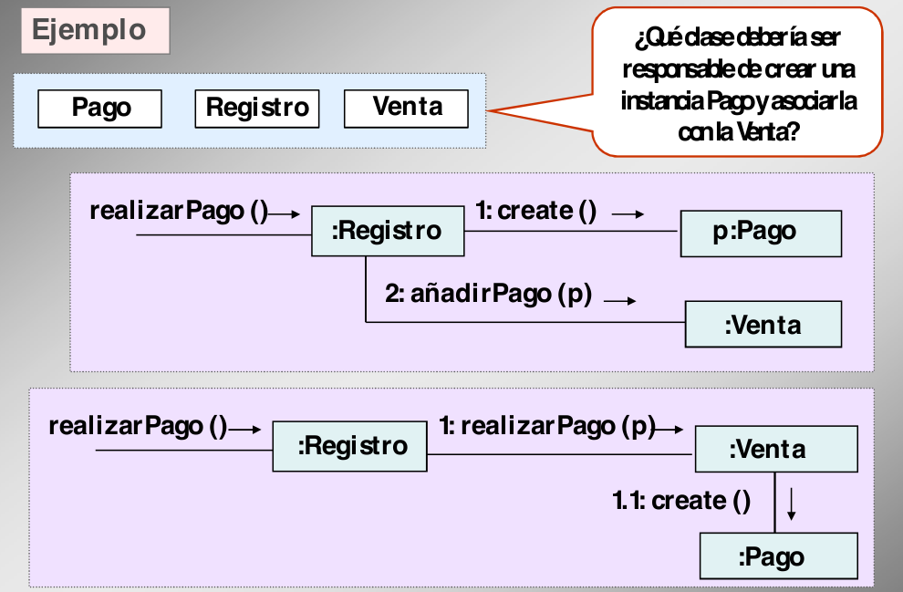

¿Qué diseño soporta bajo acoplamiento?

Formas comunes de acoplamiento:

- El tipo X tiene un atributo que referencia a una isntancia del tipo Y o al propio tipo Y.
- El objeto de Tipo X invoca a los servicios de un objeto de Tipo Y.
- El tipo X tiene un método que referencia a una instancia de Tipo Y, o al propio Tipo Y, de algún modo.
- El tipo X es una subclase, directa o indirecta, del tipo Y.
- El tipo Y es una interfaz y el tipo X implementa esa interfaz.

**Alta cohesión**:

Problema: ¿Cómo mantener la complejidad manejable?

Solución: asignar una responsabilidad de manera que la cohesión permanezca alta.

Consecuencias:

- Malas: ninguna, renunciar a la alta cohesión solo cuando esté muy justificado.
- Buenas: claridad y facilidad de entendimiento del diseño. Simplificación del mantenimiento y de las mejoras. A menudo soporta bajo acoplamiento. Incremento de la reutilización.

*Ejemplo.*

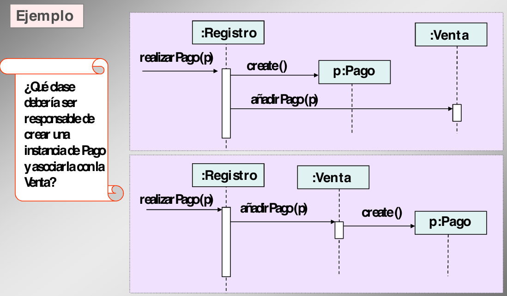

¿Qué diseño soporta alta cohesión?

Grados de cohesión funcional:

- **Muy baja cohesión**: una única clase es responsable de muchas cosas en áreas funcionales diferentes.
- **Baja cohesión**: una única clase tiene la responsabilidad de una tarea compleja en un área funcional.
- **Alta cohesión**: una única clase tiene una responsabilidad moderada en un área funcional y colabora con otras clases para llevar a cabo las tareas.
- **Moderada cohesión**: una única clase tiene responsabilidades ligeras y únicas en unas pocas áreas diferentes que están lógicamente relacionadas con el concepto de la clase, pero no entre ellas.

**Controlador**:

Un **evento** es generado por un actor externo y se asocia con operaciones del sistema.

Problema: ¿Quién debe ser responsable de gestionar un evento de entrada al sistema?

Solución: Asignar la responsabilidad de recibir o manejar un mensaje de evento del sistema a una clase que represente:

- El sistema global, dispositivos o subsistemas (controlador de fachada).
- El escenario de caso de uso en el que tiene lugar el evento del sistema (controlador de caso de uso).

Consecuencias:

- Malas: controladores saturados.
- Buenas: se asegura que la lógica de la aplicación no se maneje en la interfaz. Aumento de la reutilización y bajo nivel de acoplamiento. Posibilidad de razonar sobre el estado de los casos de uso.

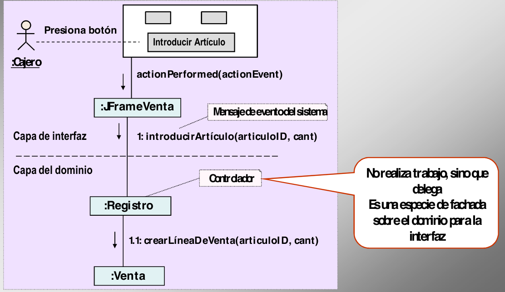

### Elaboración del modelo de interacción de objetos

Directrices generales:

- Las bases principales para obtener los diagramas de interacción son los **contratos** y el **modelo conceptual**.
- El modelo conceptual sirve de guía para saber qué objetos pueden interaccionar en una operación.
- Todo lo especificado en el contrato, especialmente las poscondiciones, excepciones y salidas, tienen que satisfacerse en el correspondiente diagrama de comunicación.
- Para la elaboración de cada diagrama de comunicación se aplican los **patrones de diseño**.

Pasos a seguir:

1. Elaborar los diagramas de interacción. Para cada operación especificada en los diagramas de secuencia.
  - Tener presente el diagrama de conceptos y el contrato de la operación.
  - Representar las relaciones del controlador con los objetos que intervienen en la interacción.
  - Asignar responsabilidades a objetos.
  - Establecer tipos de enlaces entre objetos.
2. Inicialización del sistema.
3. Establecer relaciones entre el modelo y la interfaz de usuario.

**1.1 Considerar el diagrama de conceptos y el contrato de la operación**

Básico: El contrato de la operación

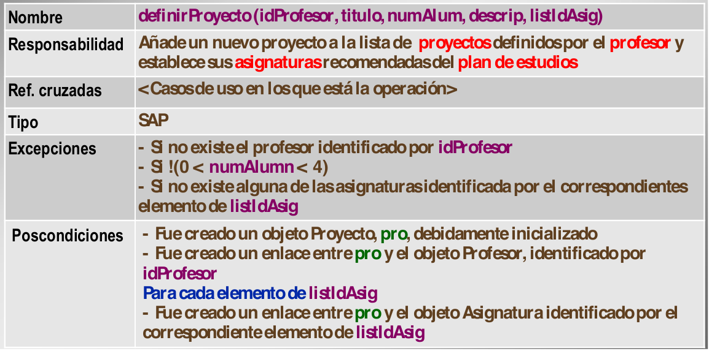

Complementario: Parte del Diagrama de Conceptos en el que aparecen los conceptos relacionados con los objetos que intervienen en la interacción

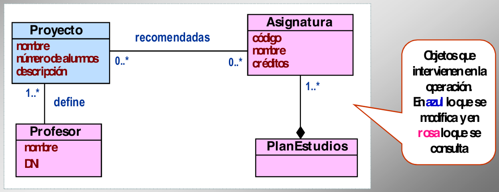

**1.2 Representar las relaciones del controlador con los objetos que intervienen en la interacción**

¿Qué objetos necesita conocer directamente el controlador?

Necesita conocer a todos los profesores, a todos los proyectos y al plan de estudios

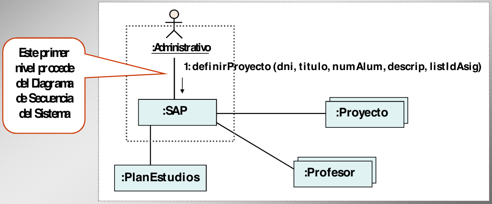

**1.3 Asignar responsabilidades a objetos**

Según el nivel en el que se encuentre la elaboración del diagrama, para cada objeto se debe formular la siguiente pregunta: De todo lo que se dice en el contrato, ¿de qué es responsable?

La respuesta es aplicar los patrones de diseño, fundamentalmente el experto en información y el
creador. Se comienza por el controlador: en el ejemplo SAP es responsable de

- Cumplir con las excepciones (experto en información)
- Cumplir con la primera poscondición(el creador)

Simplificación: las excepciones en las búsquedas de objetos no se van representar en los Diagramas de Comunicación, se dejarán internas a la operación de búsqueda.

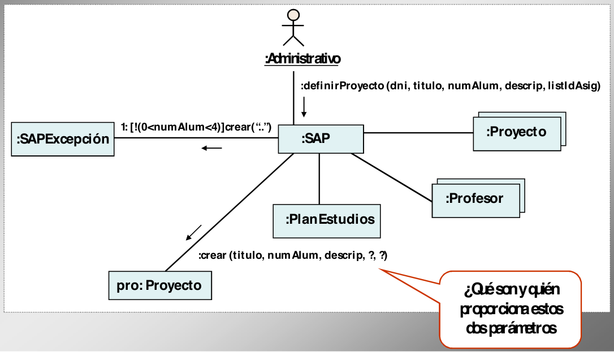

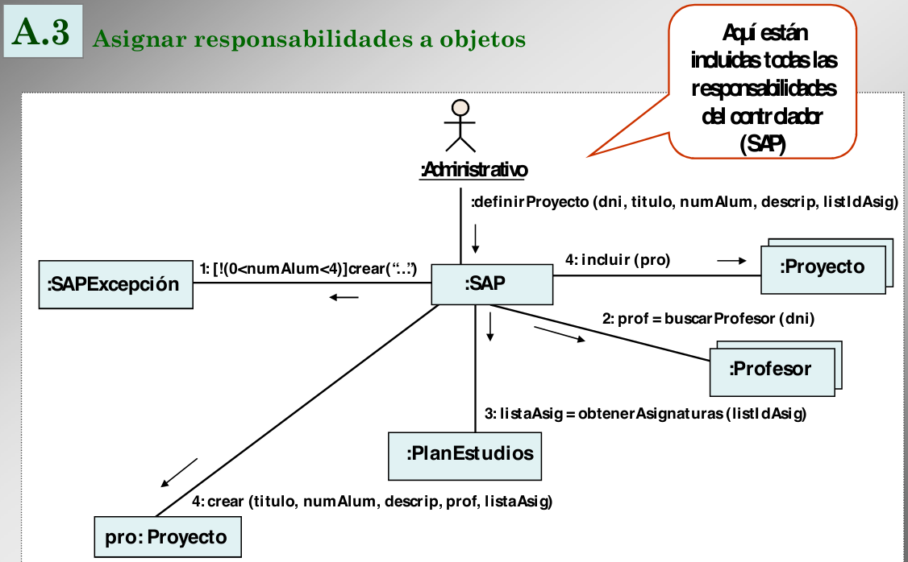

Seguir asignando responsabilidades a los objetos que van apareciendo.

En el ejemplo, el nuevo proyecto creado es responsable de cumplir con la dos últimas poscondiciones, es decir, construir los enlaces correspondiente (experto en información).

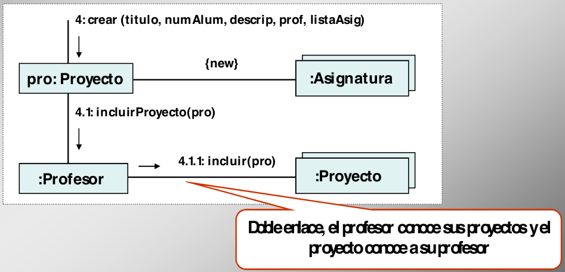

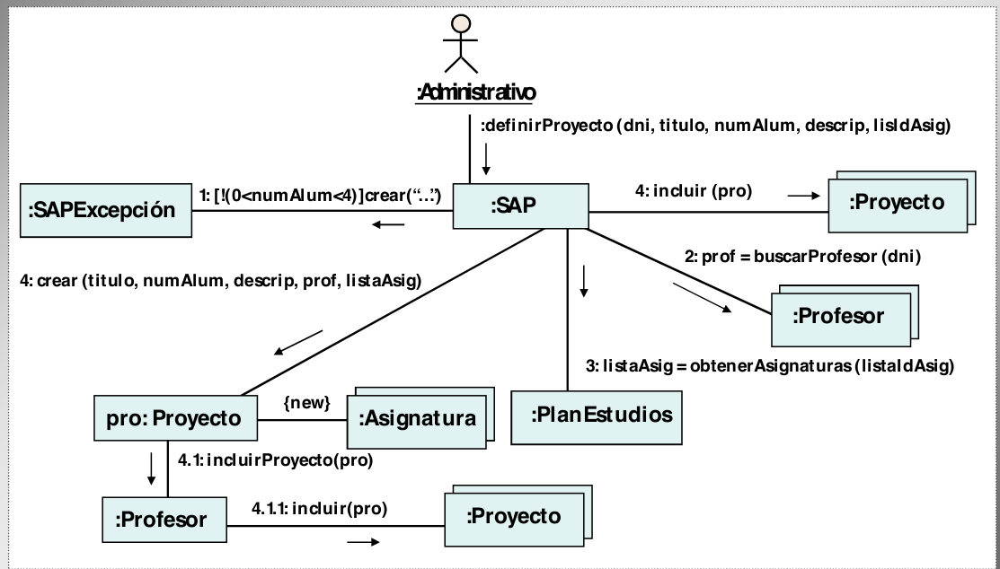

**1.4 Establecer tipos de enlaces entre objetos: Estereotipo de visibilidad**

**Visibilidad** es la capacidad de un objeto de “ver” o tener una referencia a otro objeto.

- **Visibilidad de atributo**: desde $A$ a $B$ cuando $B$ es un atributo de $A$. Relativamente permanente porque persiste mientras existan $A$ y $B$. Notación: `<<A>>`
- **Visibilidad de parámetro**: desde $A$ a $B$ cuando $B$ es un parámetro de un método de $A$. Relativamente temporal porque persiste sólo en el alcance de un método. Notación: `<
>`
- **Visibilidad local**: $B$ es un objeto local en un método $A$. Relativamente temporal porque persiste sólo en el alcance de un método. Notación: `<<L>>`
- **Visibilidad global**: $B$ es de algún modo visible globalmente. Relativamente persistente porque persiste mientras existan $A$ y $B$. Notación: `<<G>>`

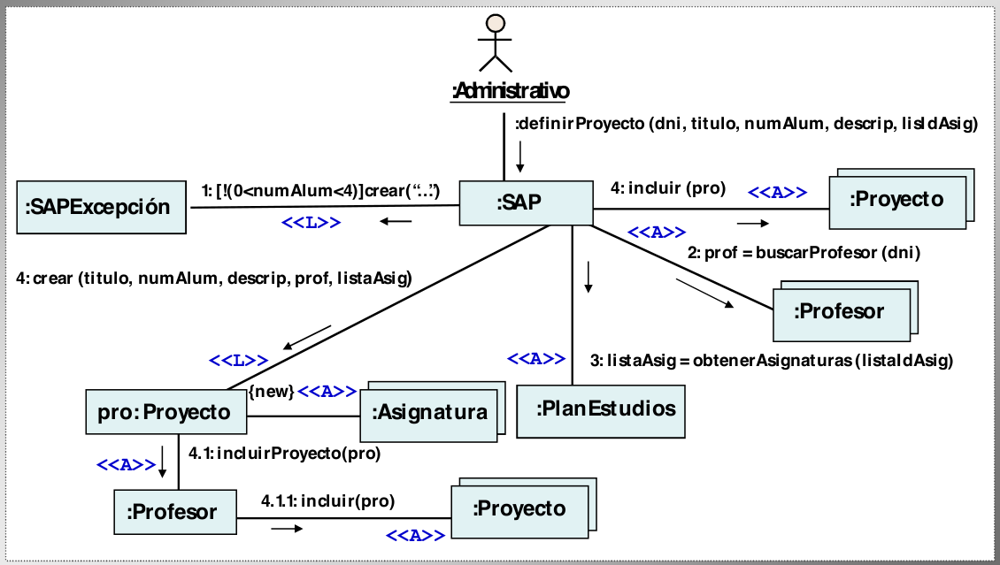

**2. Inicialización del sistema**

- Identificar objetos que se han usado pero no se han creado.
- Elaborar un contrato para cada operación que inicialice a esos objetos.
- Desarrollar el diagrama de comunicación correspondiente.

*Operaciones de las que habría que hacer el contrato y el diagrama de comunicación:*

*`IncluirPlanEstudios()`: para todos los profesores que imparten proyectos `IncluirProfesor(dni, nombre, departamento)`. Para todas las asignaturas de PlanEstudios `IncluirAsignatura(código, nombre, créditos)`.*

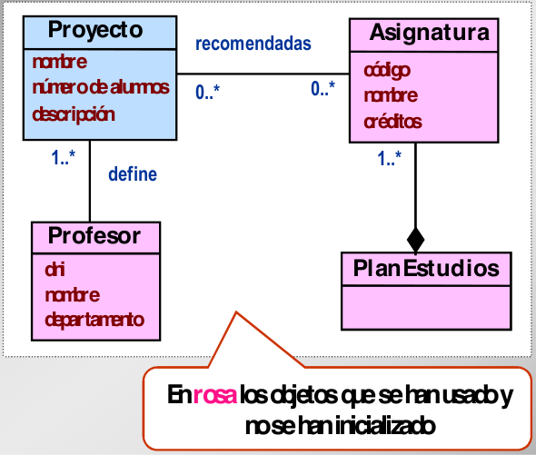

**3. Establecer relaciones entre el modelo y la Interfaz de Usuario**

- Diseñar la Interfaz de Usuario
- Para cada elemento de la interfaz, establecer la comunicación con el modelo

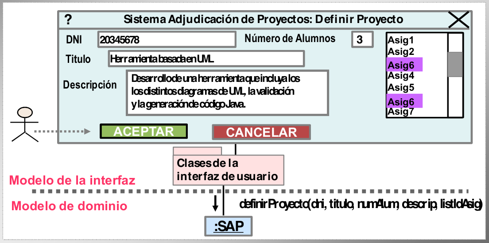

## Diseño de la estructura de objetos

### Modelado de la estructura de objetos

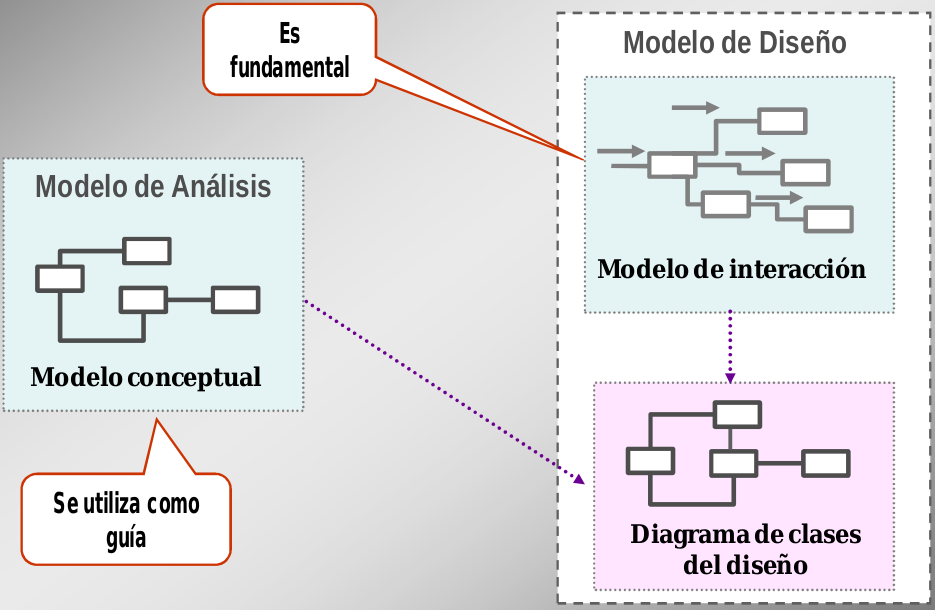

El **diagrama de clases del diseño** describe gráficamente las especificaciones de las clases e interfaces software, y las relaciones entre estas, en una aplicación. Representa la solución a un problema. Puede contener los siguientes elementos:

- Clases con sus atributos y operaciones
- Interfaces con sus operaciones y constantes
- Relaciones entre clases, entre interfaces o entre clases e interfaces
- Información sobre el tipo de los atributos y parámetros
- Navegabilidad de las asociaciones
- Cualquier elemento que forme parte de la solución

Herramienta para su representación: diagrama de clases UML.

### Elaboración del diagrama de clases de diseño

Pasos a seguir:

1. Identificar y representar las clases
2. Identificar y añadir las operaciones
3. Añadir tipos de atributos y parámetros
4. Identificar y representar las asociaciones y su navegabilidad
5. Identificar y representar las relaciones de dependencia
6. Incluir relaciones de generalización

**Identificar y representar las clases:**

Todos los objetos en los diagramas de interacción tendrán su correspondiente clase en el diagrama de clases del diseño. Las clases identificadas tomarán sus atributos del modelo conceptual y de los diagramas de interacción.

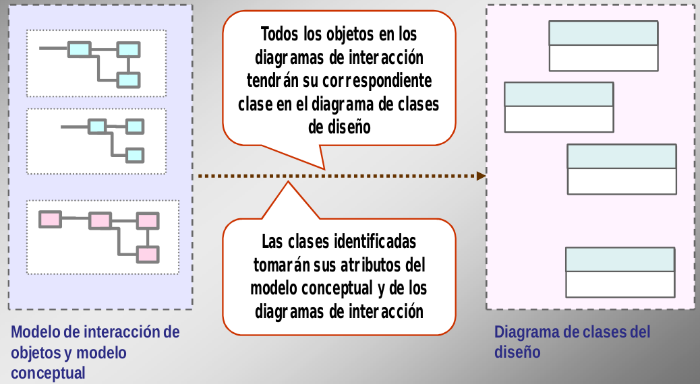

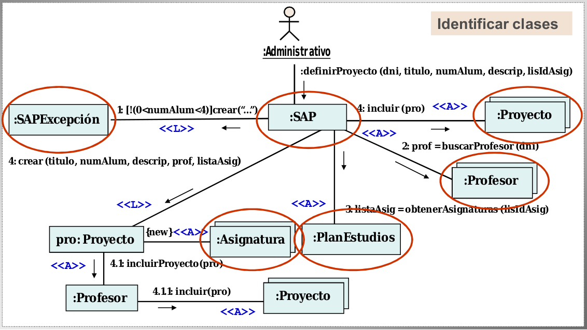

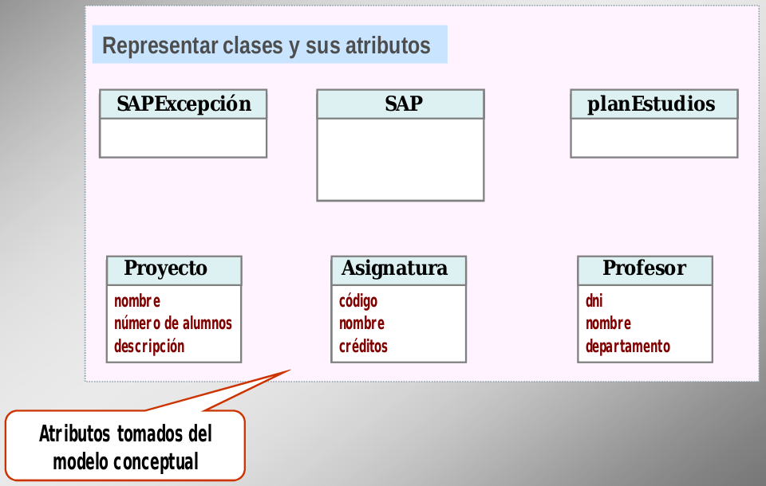

**Identificar y añadir las opciones**:

Todos los envíos de mensajes deben tener su operación en la clase correspondiente

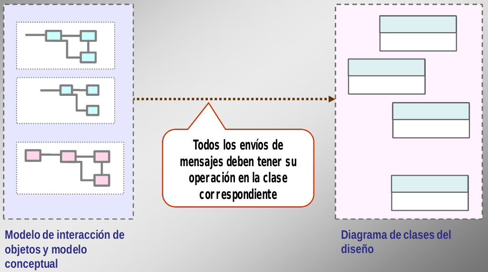

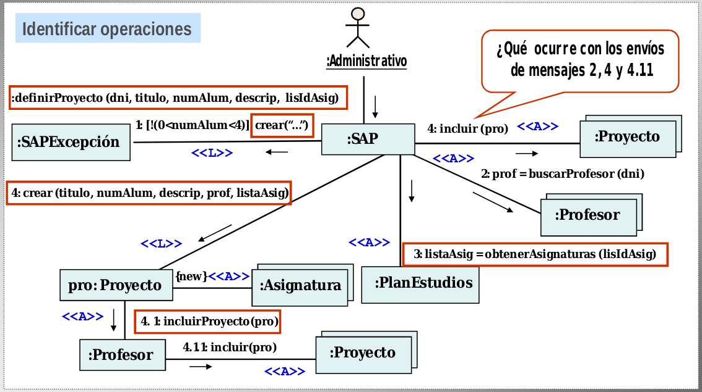

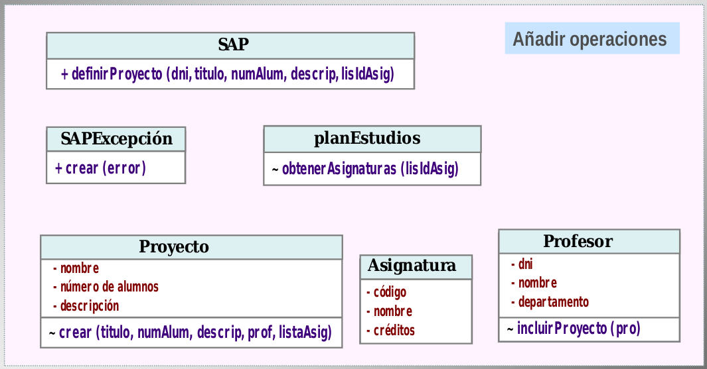

**Añadir tipos de atributos y parámetros**:

**Identificar y representar las asociaciones y su navegabilidad**:

Todos los enlaces estereotipados con `<<A>>` deben tener su correspondiente asociación. La navegabilidad la da la dirección del envío de mensaje y la multiplicidad la existencia de multiobjetos. Todos los enlaces estereotipados con `<<L>>`, `<
>` o `<<G>>` estarán en el diagrama de clases de diseño como una dependencia.

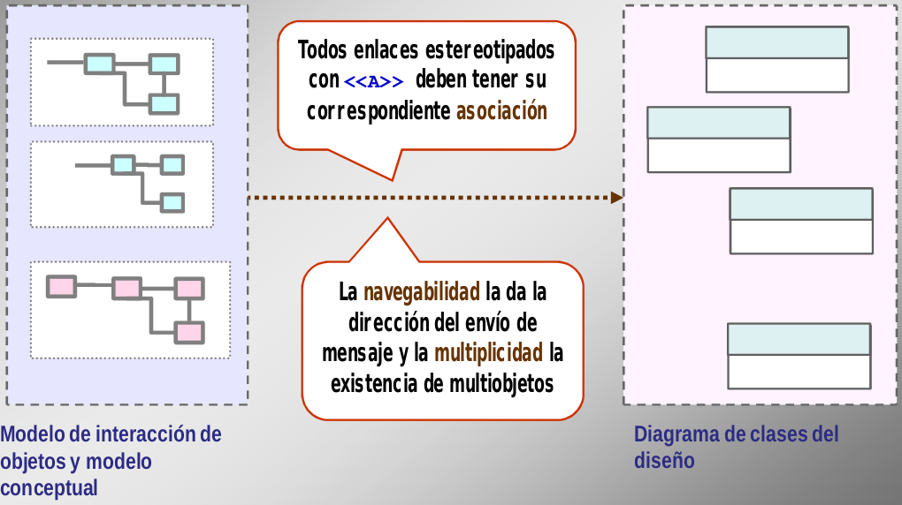

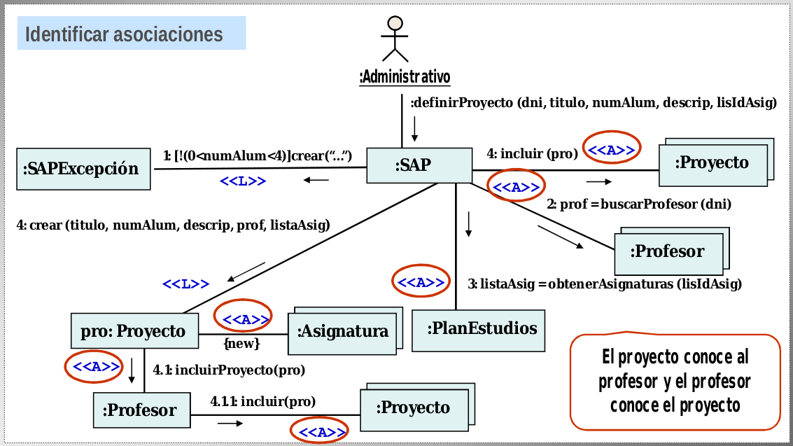

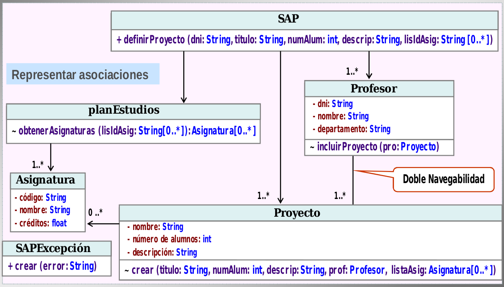

**Identificar y representar las relaciones de dependencia**:

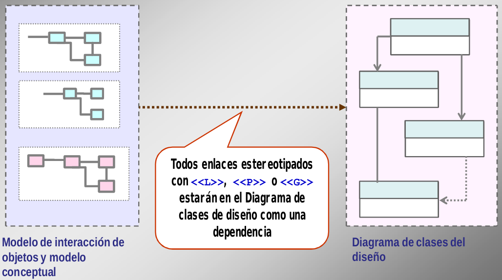

**Incluir relaciones de generalización**:

Las **generalizaciones** que hay en el modelo conceptual también pueden aparecer en el diagrama de clases del diseño. Hay que proceder de la siguiente forma:

- En el diagrama de clases del diseño obtenido hasta ahora, observar:
    - Clases con nombres que identifiquen las distintas clasificaciones de un conjunto de objetos.
    - Clases con los mismos atributos.
    - Clases con la misma asociación con una clase.
    - Clases con operaciones con el mismo nombre o parecido. Para asegurar que se corresponde con igual o parecida semántica, mirar la similitud de estructura de los diagramas de comunicación correspondientes.
- Si se da alguna o varias de estas situaciones establecer una generalización entre las clases, llevando a la superclase los atributos, operaciones y asociaciones comunes.

\newpage